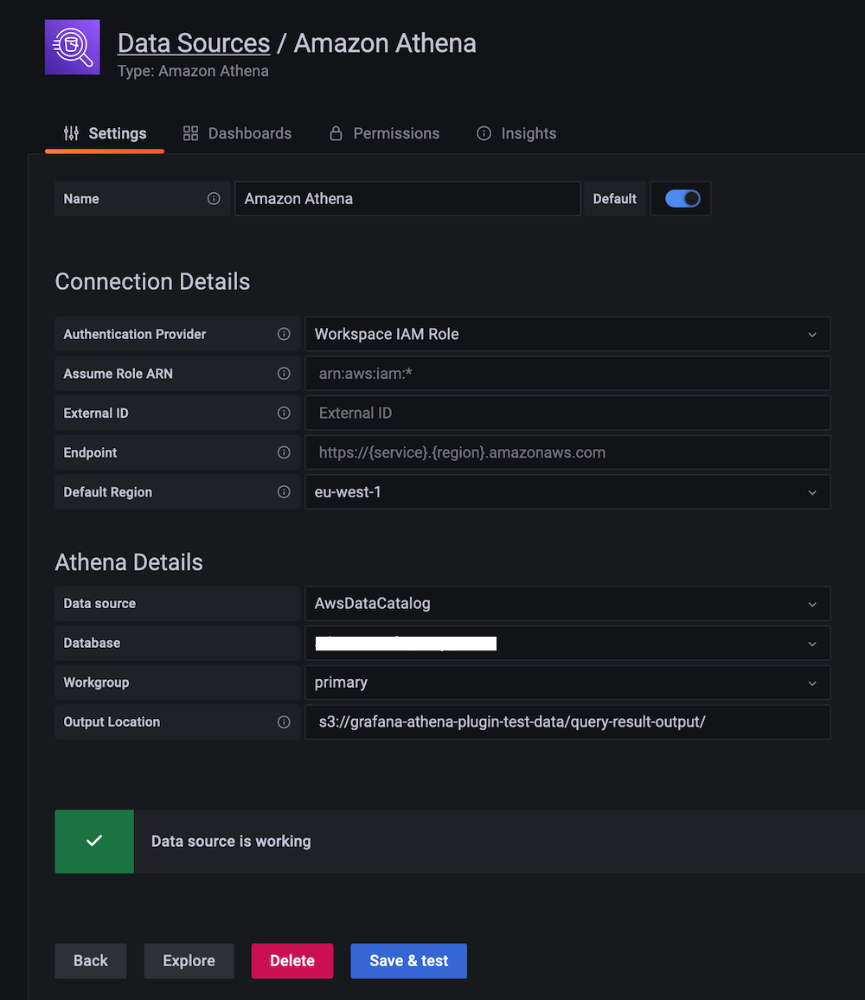
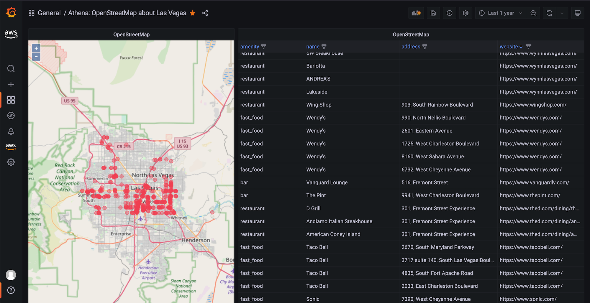
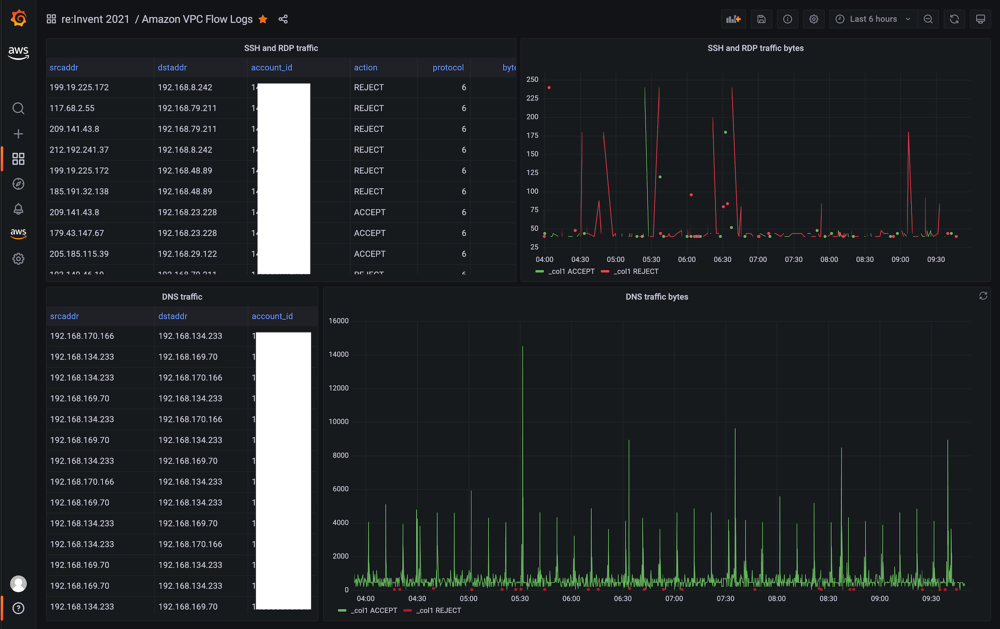
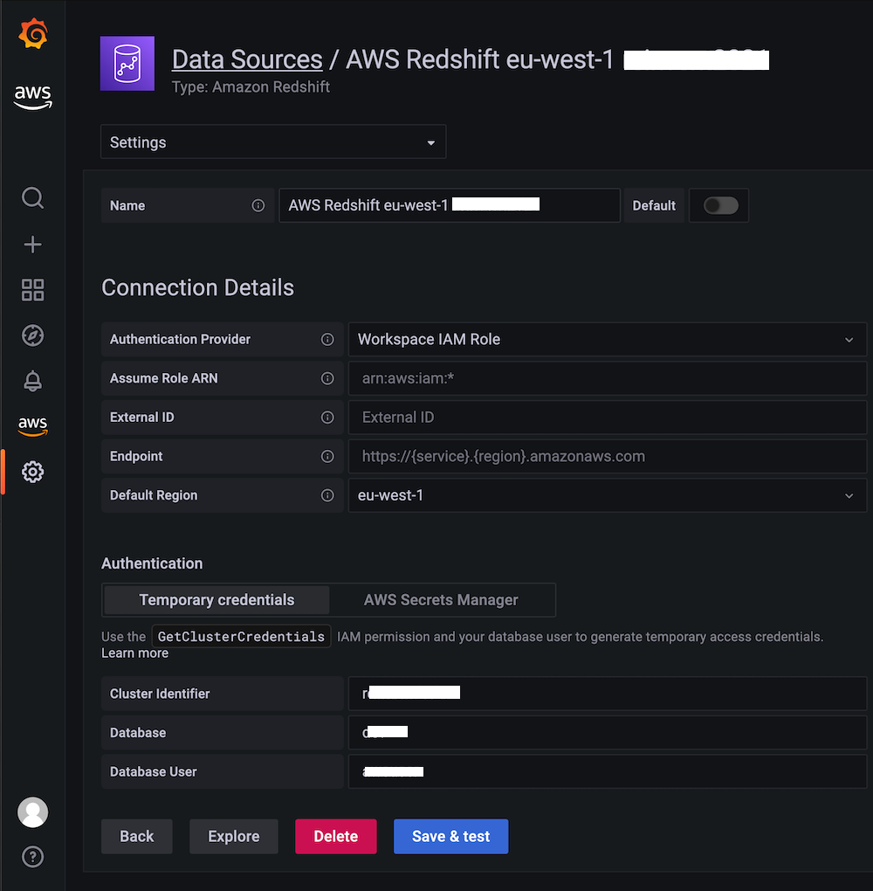
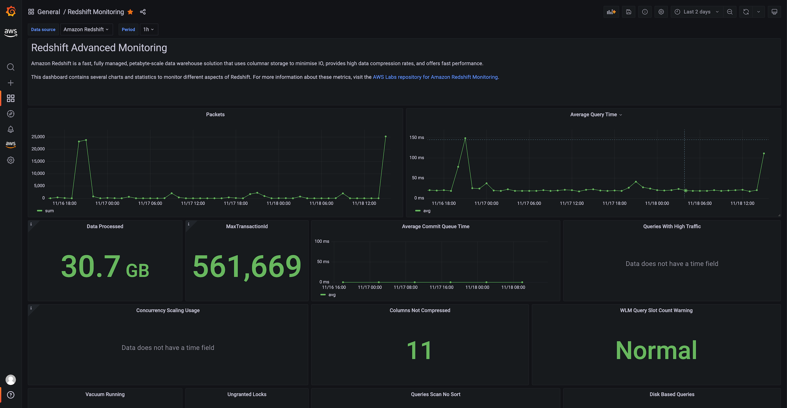
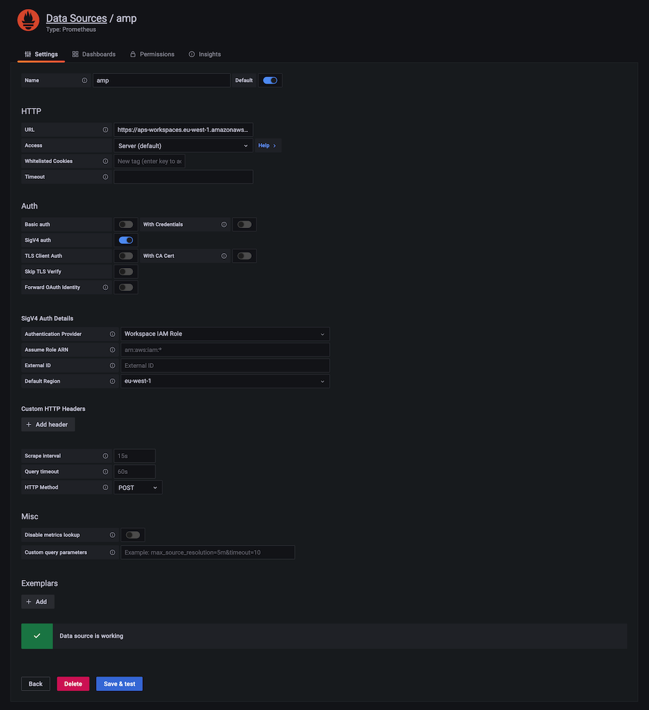

# Amazon Managed Grafana Setup

## Overview

[Amazon Managed Grafana](https://aws.amazon.com/grafana/) (AMG) is a fully managed service for Grafana that lets you visualize and analyze operational data from multiple sources without managing the underlying infrastructure. This solution covers five common configuration tasks for getting started with AMG:

- **Athena data source** — query S3-based datasets (geographic data, VPC flow logs) using SQL and visualize with Geomap
- **Redshift data source** — connect to Amazon Redshift clusters for warehouse analytics and monitoring dashboards
- **Google Workspace SAML authentication** — configure SSO using Google as a SAML 2.0 identity provider
- **Terraform automation** — automate data source and dashboard creation using the Grafana Terraform provider
- **Subnet free-IP monitoring** — example CDK stack that publishes VPC metrics to CloudWatch and visualizes them in Grafana

For the complete Amazon Managed Grafana user guide, see the [official documentation](https://docs.aws.amazon.com/grafana/latest/userguide/what-is-Amazon-Managed-Service-Grafana.html).

## Prerequisites

- AWS account with permissions to create AMG workspaces
- AWS CLI installed and configured
- An Amazon Managed Grafana workspace (see [Getting Started](https://aws.amazon.com/blogs/mt/amazon-managed-grafana-getting-started/))
- For Athena: access to Amazon Athena and an S3 bucket for query results (prefixed `grafana-athena-query-results-`)
- For Redshift: a Redshift cluster tagged with `GrafanaDataSource: true`
- For SAML: a paid Google Workspace account with Super Admin access
- For Terraform: Terraform CLI >= 1.0 installed locally
- For subnet monitoring: AWS CDK with TypeScript, Node.js installed

## Architecture

```
┌─────────────────────────────────────────────────────────────────────────┐
│                        Data Sources & Identity                           │
│                                                                         │
│  ┌──────────┐  ┌──────────┐  ┌───────────────┐  ┌─────────────────┐   │
│  │  Athena  │  │ Redshift │  │  CloudWatch   │  │ Google Workspace│   │
│  │  (S3)    │  │          │  │  Metrics      │  │ (SAML IdP)     │   │
│  └─────┬────┘  └─────┬────┘  └───────┬───────┘  └────────┬────────┘   │
│        │              │               │                    │            │
└────────┼──────────────┼───────────────┼────────────────────┼────────────┘
         │              │               │                    │
         ▼              ▼               ▼                    ▼
┌─────────────────────────────────────────────────────────────────────────┐
│                   Amazon Managed Grafana Workspace                       │
│                                                                         │
│  ┌────────────────┐  ┌────────────────┐  ┌─────────────────────────┐   │
│  │  Dashboards    │  │  Data Sources  │  │   SAML Authentication   │   │
│  │  (managed via  │  │  (managed via  │  │   (assertion mapping)   │   │
│  │   Terraform)   │  │   Terraform)   │  │                         │   │
│  └────────────────┘  └────────────────┘  └─────────────────────────┘   │
└─────────────────────────────────────────────────────────────────────────┘
```

## Deploy

### Athena data source plugin

The Athena plugin is pre-installed in Amazon Managed Grafana. It allows you to run SQL queries against data in S3 via Athena and visualize results using any Grafana panel type.

**Configure the data source:**

1. In the AMG console, enable service-managed IAM roles for Athena
2. Tag your Athena workgroup with key `GrafanaDataSource` and value `true`
3. In Grafana, navigate to **Configuration → Data Sources → Add data source**
4. Search for "Athena" and select it
5. Choose your region, database, and workgroup
6. Set the output location to an S3 bucket prefixed with `grafana-athena-query-results-`
7. Click **Save & test**


*Athena data source configured with workspace IAM role authentication*

:::warning
The service-managed IAM policy only grants access to query result buckets starting with `grafana-athena-query-results-`. For the underlying data source S3 buckets, manually add `s3:Get*` and `s3:List*` permissions.
:::

**Example: Geographic data with Geomap**

Query OpenStreetMap data in Athena to plot locations on a map:

```sql
SELECT
  tags['amenity'] AS amenity,
  tags['name'] AS name,
  lat, lon
FROM planet
WHERE type = 'node'
  AND tags['amenity'] IN ('bar', 'pub', 'fast_food', 'restaurant')
  AND lon BETWEEN -115.5 AND -114.5
  AND lat BETWEEN 36.1 AND 36.3
LIMIT 500;
```


*Geomap visualization of food amenities queried from Athena*

**Example: VPC Flow Logs analysis**

Detect SSH and RDP traffic patterns:

```sql
SELECT
  from_unixtime(start), sum(bytes), action
FROM vpclogs
WHERE srcport IN (22, 3389) OR dstport IN (22, 3389)
GROUP BY start, action
ORDER BY start ASC;
```


*Time series view of accepted and rejected SSH/RDP bytes*

### Redshift data source plugin

The Redshift plugin connects AMG to your Amazon Redshift clusters for data warehouse visualization.

**Prerequisites:**

- Tag your Redshift cluster with `GrafanaDataSource: true`
- Create a database user named `redshift_data_api_user` (for temporary credentials), or tag a Secrets Manager secret with `RedshiftQueryOwner: true`

**Configure the data source:**

1. In AMG, enable service-managed IAM roles for Redshift
2. Navigate to **Configuration → Data Sources → Add data source**
3. Search for "Redshift" and provide Cluster Identifier, Database, and Database User
4. Click **Save & test**


*Redshift data source connected with workspace IAM role*

Import the built-in Redshift monitoring dashboard for immediate visibility into cluster performance:


*Pre-built Redshift Advanced Monitoring dashboard*

### Google Workspace SAML authentication

Configure Google Workspace as a SAML 2.0 identity provider for AMG.

**Step 1: Create AMG workspace with SAML**

When creating your workspace, select **Security Assertion Markup Language (SAML)** as the authentication method.

**Step 2: Create custom SAML app in Google Workspace**

1. Log in to Google Workspace Admin Console with Super Admin permissions
2. Navigate to **Apps → Web and mobile apps → Add App → Add custom SAML app**
3. Name the app (e.g., "Amazon Managed Grafana")
4. Click **DOWNLOAD METADATA** to save the IdP metadata XML file
5. In Service Provider Details:
   - **ACS URL**: copy from the AMG console SAML configuration
   - **Entity ID**: copy from the AMG console
   - **Name ID format**: EMAIL
   - **Name ID**: Basic Information → Primary email
6. In Attribute Mapping, map `Department` to a Google Directory attribute

**Step 3: Upload metadata to AMG**

1. In the AMG console, click **Upload or copy/paste** and upload the metadata XML
2. Under **Assertion mapping**:
   - **Assertion attribute role**: `Department`
   - **Admin role values**: `monitoring` (or your chosen department value)
3. Click **Save SAML configuration**

Users assigned the configured department value receive Admin privileges in Grafana.

### Terraform automation

Automate AMG configuration (data sources, dashboards, folders) using the [Grafana Terraform provider](https://registry.terraform.io/providers/grafana/grafana/latest/docs).

**Step 1: Create an API key**

In Grafana, navigate to **Configuration → API keys**, create a key with `Admin` role (valid up to 30 days).

**Step 2: Create the Terraform manifest**

Create `main.tf`:

```hcl
terraform {
  required_providers {
    grafana = {
      source  = "grafana/grafana"
      version = ">= 1.13.3"
    }
  }
}

provider "grafana" {
  url  = "https://g-XXXXXXXXXX.grafana-workspace.us-east-1.amazonaws.com"
  auth = "YOUR_API_KEY"
}

resource "grafana_data_source" "prometheus" {
  type       = "prometheus"
  name       = "amp"
  is_default = true
  url        = "https://aps-workspaces.us-east-1.amazonaws.com/workspaces/ws-XXXXXXXXX/"

  json_data {
    http_method     = "POST"
    sigv4_auth      = true
    sigv4_auth_type = "workspace-iam-role"
    sigv4_region    = "us-east-1"
  }
}

resource "grafana_folder" "team" {
  title = "devops"
}

resource "grafana_dashboard" "example" {
  folder      = grafana_folder.team.id
  config_json = file("dashboard.json")
}
```

**Step 3: Apply**

```bash
terraform init
terraform plan
terraform apply
```


*Prometheus (AMP) data source provisioned via Terraform*

:::note
Terraform state is managed locally by default. For team collaboration, configure a [remote backend](https://www.terraform.io/docs/language/state/remote.html) such as S3.
:::

### Subnet free-IP monitoring

Deploy a CDK stack that monitors available IPs across VPC subnets, publishes metrics to CloudWatch, and creates alarms.

**Step 1: Clone and install**

```bash
cd sandbox/grafana_subnet_ip_monitoring
npm install
```

**Step 2: Configure**

Edit `lib/vpc_monitoring_stack.ts` and set:

```typescript
const subnet_monitoring_stack = new SubnetMonitoringStack(this, 'SubnetIpMonitoringStack', {
  env: {
    account: process.env.CDK_DEFAULT_ACCOUNT,
    region: process.env.CDK_DEFAULT_REGION
  },
  subnetIds: [
    'subnet-03e46f16d7dc01c0a',
    'subnet-0713ae10e4a8da850'
  ],
  ipThreshold: 50,
  alarmEmail: 'team@example.com',
  monitoringFrequencyMinutes: 5,
  evaluationPeriods: 2
});
```

**Step 3: Deploy**

```bash
cdk bootstrap
cdk deploy --all
```

The stack creates:
- A Lambda function that calls EC2 APIs to collect subnet IP availability
- CloudWatch custom metrics for free IP count per subnet
- CloudWatch alarms that trigger when free IPs drop below the threshold
- An SNS topic for alarm notifications

Add the CloudWatch data source in your AMG workspace to visualize the subnet metrics.

**Cleanup:**

```bash
cdk destroy
```

## Validate

1. **Athena data source:** In Grafana, open the Athena data source and click **Save & test** — confirm "Data source is working"
2. **Redshift data source:** Click **Save & test** on the Redshift data source — confirm successful connection
3. **SAML authentication:** Log out of Grafana and log back in — verify redirect to Google sign-in page and successful return
4. **Terraform provisioning:** Run `terraform plan` — confirm no drift between state and workspace configuration
5. **Subnet monitoring:** In CloudWatch, navigate to **Metrics → Custom Namespaces** and verify the subnet IP metrics appear

## Troubleshoot

| Symptom | Likely Cause | Fix |
|---------|-------------|-----|
| Athena query returns "Access Denied" | S3 bucket not prefixed with `grafana-athena-query-results-` or missing `s3:Get*`/`s3:List*` permissions on the source data bucket | Rename the results bucket or add IAM permissions manually to the workspace role |
| Redshift "Unable to connect" error | Database user `redshift_data_api_user` does not exist or cluster not tagged with `GrafanaDataSource: true` | Create the database user and verify the cluster tag |
| SAML login fails with "Invalid assertion" | ACS URL or Entity ID mismatch between Google Workspace and AMG | Compare values in Google SAML app settings with AMG console SAML configuration; they must match exactly |
| Terraform apply returns 401 Unauthorized | API key expired (max 30-day validity in AMG) | Generate a new API key in Grafana and update the provider `auth` value |
| Subnet monitoring Lambda returns no data | Lambda missing `ec2:DescribeSubnets` permission or incorrect subnet IDs | Verify the Lambda execution role includes EC2 read permissions and subnet IDs exist in the target region |

## Related Solutions

- [EKS Infrastructure Monitoring](../eks-infrastructure/)
- [Observability Cost Management](../observability-cost-management/)
