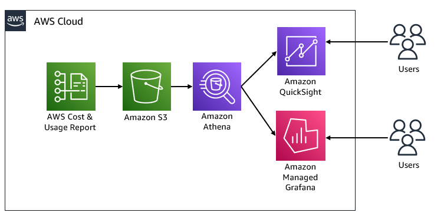
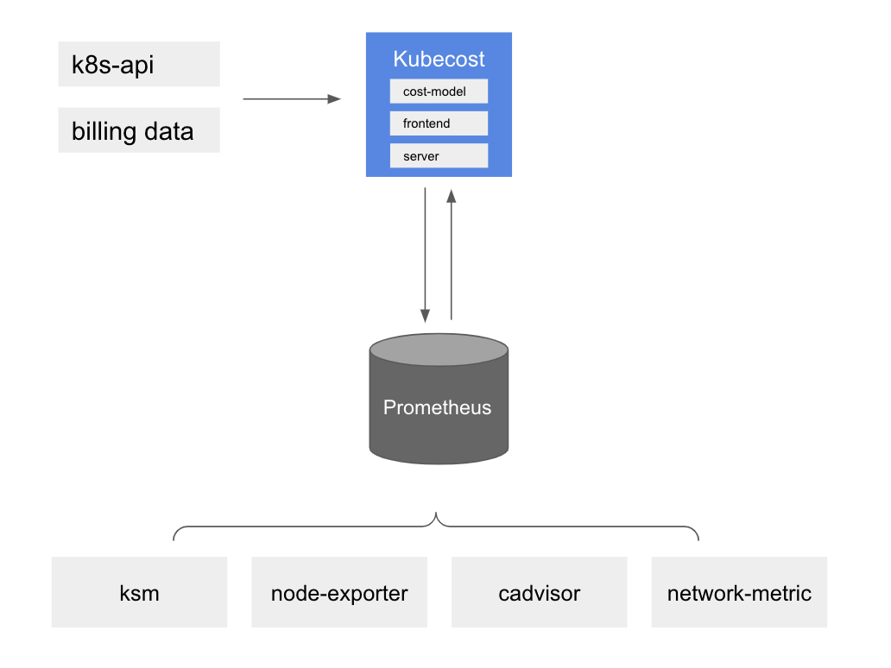
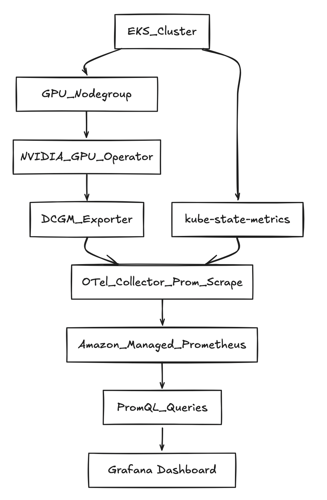
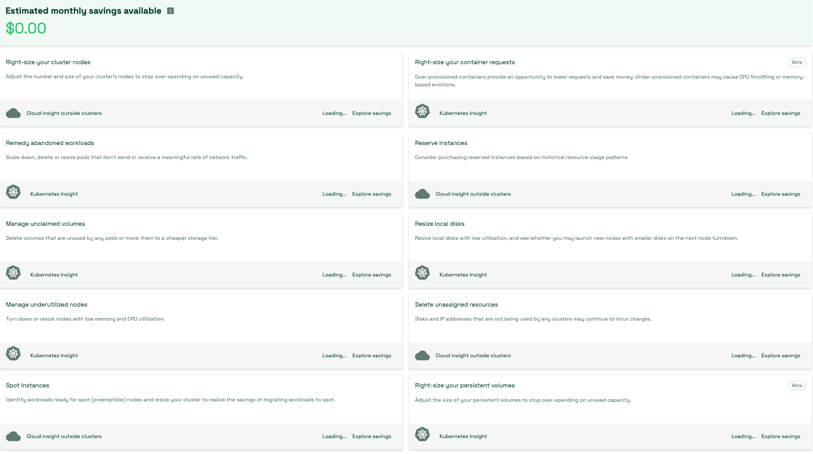

import RelatedEvents from '@site/src/components/RelatedEvents';

# Observability Cost Management

## Related Events

<RelatedEvents topics={["cloudwatch", "metrics"]} />

## Overview

As observability stacks grow, monitoring the cost of observability products themselves becomes critical. This solution consolidates guidance for tracking spend across Amazon CloudWatch, Amazon Managed Service for Prometheus (AMP), Amazon Managed Grafana (AMG), and AWS X-Ray. It also covers reducing CloudWatch costs — typically the largest observability line item — and using Kubecost for Kubernetes cost attribution including GPU workloads on EKS.

The approach uses AWS Cost and Usage Reports (CUR) as the data foundation, with Athena views per service and dashboards in QuickSight or Grafana for visualization. For Kubernetes environments, Kubecost provides pod-level cost allocation backed by AMP for scalable metric storage.

## Prerequisites

- AWS Organizations with [Cost and Usage Report (CUR)](https://docs.aws.amazon.com/cur/latest/userguide/what-is-cur.html) enabled and delivering to S3
- Amazon Athena configured with the CUR CloudFormation template deployed
- Amazon Managed Grafana workspace (for Grafana-based dashboards) or Amazon QuickSight (for QuickSight dashboards)
- For Kubecost: an Amazon EKS cluster with Helm installed
- For GPU cost attribution: EKS cluster with NVIDIA GPU Operator and MIG-capable instances (e.g., p4d.24xlarge)
- IAM permissions for Athena, S3 (CUR bucket), CloudWatch, and optionally AMP remote-write/query

## Architecture



The architecture flows CUR data from S3 through Athena views (one per observability service) into dashboards. For Kubernetes cost attribution, Kubecost scrapes cluster metrics via Prometheus and writes allocation data to AMP.



## Deploy

### CloudWatch cost visibility

1. Ensure CUR is delivering to S3 and the [Athena integration CloudFormation template](https://docs.aws.amazon.com/cur/latest/userguide/use-athena-cf.html) is deployed.

2. Create an Athena view for CloudWatch costs:

```sql
CREATE OR REPLACE VIEW "cloudwatch_cost" AS
SELECT
  line_item_usage_type,
  line_item_resource_id,
  line_item_operation,
  line_item_usage_account_id,
  month,
  year,
  sum(line_item_usage_amount) "Usage",
  sum(line_item_unblended_cost) cost
FROM database.tablename
WHERE line_item_product_code = 'AmazonCloudWatch'
GROUP BY 1, 2, 3, 4, 5, 6
```

3. Build a QuickSight or Grafana dashboard using this Athena view as a data source. Filter by `line_item_operation` to see costs for GetMetricData, PutLogEvents, MetricStorage, and other operations.

### Amazon Managed Service for Prometheus cost visibility

1. Create an Athena view:

```sql
CREATE OR REPLACE VIEW "prometheus_cost" AS
SELECT
  line_item_usage_type,
  line_item_resource_id,
  line_item_operation,
  line_item_usage_account_id,
  month,
  year,
  sum(line_item_usage_amount) "Usage",
  sum(line_item_unblended_cost) cost
FROM database.tablename
WHERE line_item_product_code = 'AmazonPrometheus'
GROUP BY 1, 2, 3, 4, 5, 6
```

2. Visualize in Grafana with Athena as data source. See operations like RemoteWrite, Query, and HourlyStorageMetering per workspace.


3. For real-time ingestion-rate monitoring, use AMP vended metrics in CloudWatch (`AWS/Prometheus` namespace) as a CloudWatch data source in Grafana:


### Amazon Managed Grafana cost visibility

Create an Athena view:

```sql
CREATE OR REPLACE VIEW "grafana_cost" AS
SELECT
  line_item_usage_type,
  line_item_resource_id,
  line_item_operation,
  line_item_usage_account_id,
  month,
  year,
  sum(line_item_usage_amount) "Usage",
  sum(line_item_unblended_cost) cost
FROM database.tablename
WHERE line_item_product_code = 'AmazonGrafana'
GROUP BY 1, 2, 3, 4, 5, 6
```

### AWS X-Ray cost visibility

Create an Athena view:

```sql
CREATE OR REPLACE VIEW "xray_cost" AS
SELECT
  line_item_usage_type,
  line_item_resource_id,
  line_item_usage_account_id,
  month,
  year,
  sum(line_item_usage_amount) "Usage",
  sum(line_item_net_unblended_cost) cost
FROM database.tablename
WHERE line_item_product_code = 'AWSXRay'
GROUP BY 1, 2, 3, 4, 5
```

### Reducing CloudWatch costs

Apply these high-impact optimizations:

1. **Set log retention on every log group** — default "Never Expire" silently accrues storage cost. Set 30/90/365 days as appropriate.
2. **Enable CloudWatch Logs Intelligent Tiering** — automatically moves data across Standard → Infrequent Access → Archive Instant Access tiers based on access patterns.
3. **Lower third-party metric polling** — shift from 1-minute to 5-minute intervals to cut `GetMetricData` costs by ~80%.
4. **Move VPC Flow Logs and CloudTrail to S3** where CloudWatch Logs ingestion is not required.
5. **Prune high-cardinality custom metrics** — audit for per-request or per-pod dimensions that inflate metric count.
6. **Consolidate alarms** — use composite alarms and Metrics Insights SQL alarms instead of one-alarm-per-resource.

### Kubecost for EKS cost attribution

1. Create IAM service accounts for Kubecost:

```bash
eksctl create iamserviceaccount \
  --name kubecost-cost-analyzer \
  --namespace kubecost \
  --cluster <CLUSTER_NAME> --region <REGION> \
  --attach-policy-arn arn:aws:iam::aws:policy/AmazonPrometheusQueryAccess \
  --attach-policy-arn arn:aws:iam::aws:policy/AmazonPrometheusRemoteWriteAccess \
  --override-existing-serviceaccounts --approve
```

2. Install Kubecost with AMP integration:

```bash
helm upgrade -i kubecost \
  oci://public.ecr.aws/kubecost/cost-analyzer --version <VERSION> \
  --namespace kubecost --create-namespace \
  -f https://tinyurl.com/kubecost-amazon-eks \
  -f https://tinyurl.com/kubecost-amp \
  --set global.amp.prometheusServerEndpoint=${QUERYURL} \
  --set global.amp.remoteWriteService=${REMOTEWRITEURL}
```

3. Access Kubecost UI via port-forward or ALB to view cost allocation by namespace, label, or service.


### EKS GPU cost attribution

For GPU workloads using MIG slices, deploy DCGM metrics and kube-state-metrics to AMP, then query allocation and waste:

```promql
# Allocated $/hr per namespace (example: $12/GPU-hour, 7 MIG slices)
sum by (namespace) (
  kube_pod_container_resource_requests{resource=~"nvidia.*(gpu|mig).*",unit="integer"}
) * (12/7)
```



## Validate

1. **CUR dashboards**: In QuickSight or Grafana, confirm cost data populates for each service. Filter by a known account ID and verify amounts align with the Billing Console.
2. **CloudWatch cost reduction**: After applying retention policies, check `IncomingBytes` and storage metrics in the `AWS/Logs` namespace to confirm volume decrease.
3. **Kubecost**: Open the Kubecost UI → Cost Allocation → verify namespaces show non-zero cost and efficiency scores.



## Troubleshoot

| Symptom | Likely Cause | Fix |
|---------|-------------|-----|
| Athena view returns zero rows | CUR has not delivered yet (up to 24h initial delay) or wrong database/table name in query | Wait for first CUR delivery; verify table name in Athena console |
| Grafana shows "no data" for AMP costs | Athena data source not configured or IAM permissions missing | Grant Grafana workspace role access to Athena and the CUR S3 bucket |
| Kubecost shows $0 for all namespaces | IRSA not configured or AMP remote-write URL incorrect | Verify service account annotations and AMP endpoint; check `kubecost-cost-analyzer` pod logs |
| CloudWatch costs not decreasing after retention change | Retention only affects future storage; existing data ages out over the retention period | Wait for the retention window to pass; focus on ingestion reduction for immediate savings |

## Related Solutions

- [EKS Infrastructure](../eks-infrastructure/)
- [RDS Aurora Monitoring](../rds-aurora-monitoring/)
