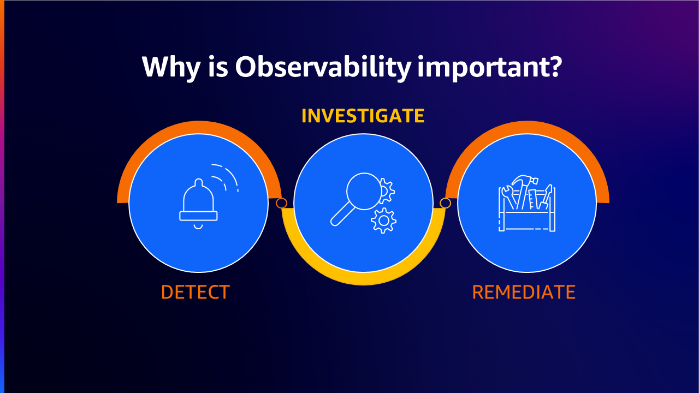
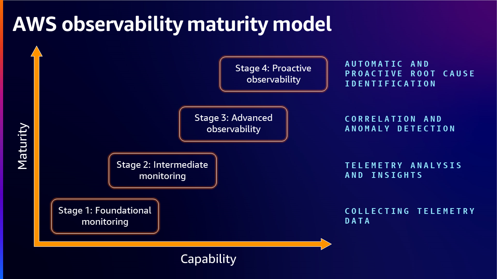
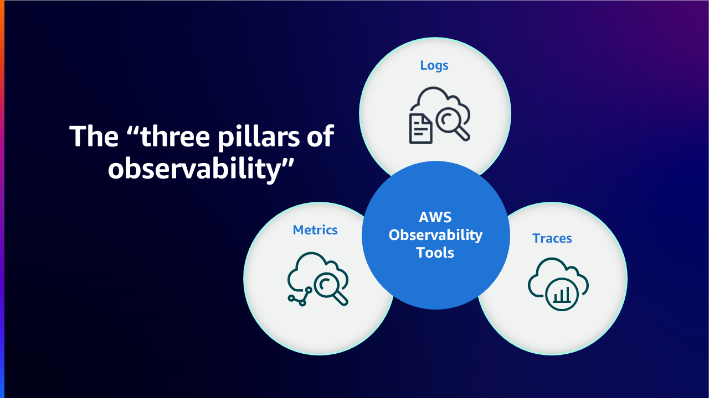
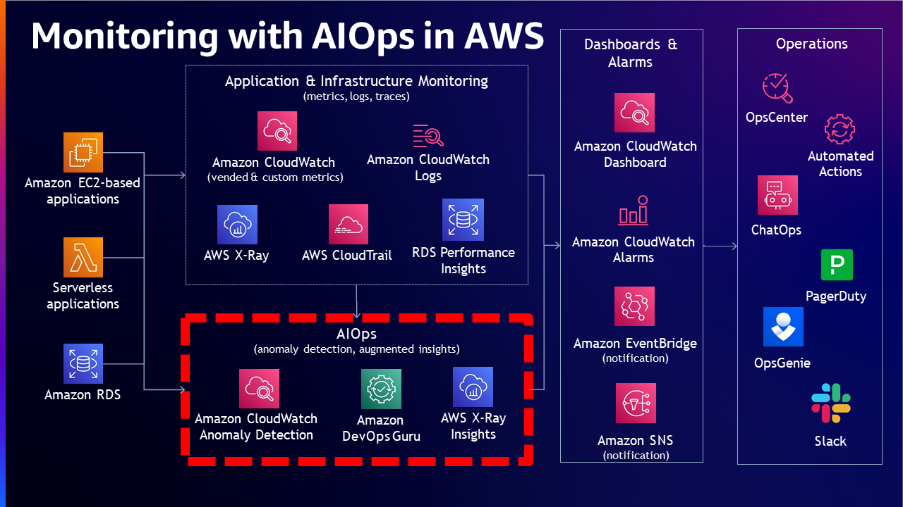
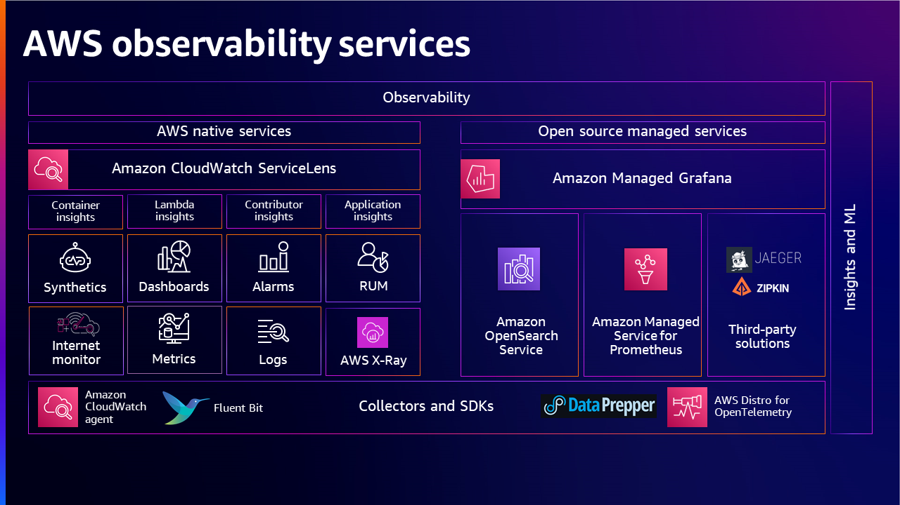
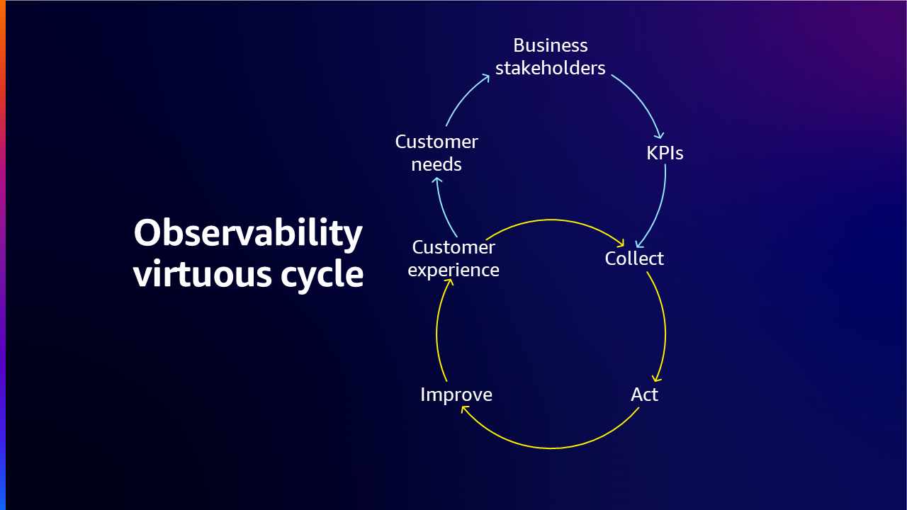

# Observability Maturity Model

## Overview

The AWS Observability Maturity Model provides a framework for organizations to assess their current observability capabilities, identify areas for improvement, and strategically invest in tools and processes to achieve optimal observability. This model outlines four stages of maturity, from foundational monitoring through proactive, AI-driven observability.

In the era of cloud computing, microservices, ephemeral and distributed systems, observability has become a critical factor in ensuring reliability and performance of digital services. The difference between monitoring and observability is that monitoring tells you *whether* a system is working, while observability tells you *why* it isn't working. Monitoring is usually reactive whereas the goal of observability is to improve your KPIs proactively.

## When to use this

- You need to assess your organization's current observability capabilities against a structured framework
- You are building a business case for observability investment and need to articulate current gaps
- You want to define a roadmap for progressing from reactive monitoring to proactive observability
- Your teams use fragmented tooling and you need a vision for unification
- You are preparing for an AWS Well-Architected review focused on operational excellence
- You want to benchmark observability maturity across multiple teams or business units

## Guidance

### Stages of the maturity model

The observability maturity model defines four progressive stages. Organizations may exhibit characteristics of multiple stages simultaneously across different teams or systems.

### Stage 1: Foundational Monitoring — Collecting Telemetry Data

At this stage, basic monitoring is adopted as a bare minimum, often in silos. There is no defined strategy for what is required to monitor the totality of systems or workloads. Different teams (application owners, NOC, CloudOps, DevOps) use different tools for their monitoring needs, providing little value for debugging across systems or optimization.

**Key characteristics:**

- Disparate solutions for monitoring workloads across teams
- Teams gather the same data in different ways with no or limited partnership
- Data obtained from one team may be in a dissimilar format, preventing reuse
- No unified observability strategy

**Actions to progress:**

- Create a plan to identify critical workloads
- Aim for a unified solution for observability
- Define which metrics and logs are essential
- Design workloads to capture essential [telemetry](https://docs.aws.amazon.com/wellarchitected/latest/operational-excellence-pillar/implement-observability.html)
- Instrument workloads through collection of metrics, logs, and traces

### Stage 2: Intermediate Monitoring — Telemetry Analysis and Insights

Organizations at this stage have clearer signal collection from various environments (on-premises and cloud). They have devised mechanisms to collect metrics, logs, and traces, created visualizations, defined alerting strategies, and can prioritize issues based on well-defined criteria.

**Key characteristics:**

- Teams have workflows that invoke required actions for analysis and troubleshooting
- Alerting strategies are defined with the ability to prioritize issues
- Visualizations and dashboards are in place
- Historical knowledge is used for troubleshooting

**Common challenges at this stage:**

- MTTR is not consistent or meaningfully improved over time
- Higher than expected cognitive effort to debug issues
- Data overload overwhelms operations
- Most enterprises get caught at this stage without realizing where to go next

**Actions to progress:**

1. Review architecture designs at regular intervals and deploy policies to reduce impact and downtime
2. Prevent alert fatigue by defining actionable KPIs, adding valuable context to findings, categorizing by severity/urgency, and routing to appropriate teams
3. Analyze alerts regularly and automate remediation for common repeated alerts
4. Develop a knowledge graph that helps correlate different entities and understand dependencies between system parts

### Stage 3: Advanced Observability — Correlation and Anomaly Detection

Organizations at this stage can clearly understand root cause without spending significant time troubleshooting. When issues arise, alerts provide enough contextual information to relevant teams. The monitoring team can look at an alert and immediately determine root cause through correlation of metrics, logs, and traces.

**Key characteristics:**

- 360° view of situations through correlated signals
- Very small MTTR
- Service Level Objectives (SLOs) are green with tolerable error budget burn rate
- Anomaly detectors monitor outliers that don't match usual patterns
- Near real-time alerting mechanisms

**Actions to progress:**

- Understand repeated issues and create a knowledge base
- Model against scenarios to predict future issues
- Identify new tools, skills, and techniques for data storage and usage
- Leverage Artificial Intelligence for IT Operations (AIOps) to automatically correlate signals, identify root cause, and create resolution plans

### Stage 4: Proactive Observability — Automatic and Proactive Root Cause Identification

At this stage, observability data is used in real-time *before* an issue occurs, not just after. Well-trained models identify issues proactively and resolutions are accomplished more easily. The monitoring system provides insights automatically and lays out resolution options.

**Key characteristics:**

- Predictive issue identification using trained models
- Automatic dynamic dashboards containing only relevant information
- Generative AI capabilities accelerating proactive monitoring
- Continuous improvement through data-driven insights feeding back into engineering

### Self-assessment questions

Use these questions to gauge your current maturity level:

| Area | Assessment Questions |
|------|---------------------|
| **Logs** | How do you collect logs? How do you use them? How do you access them? What is your retention policy? Do you use ML/AI capabilities? |
| **Metrics** | What type of metrics do you collect? How do you use and access them? |
| **Traces** | How do you collect traces? How do you use them? |
| **Dashboards & Alerting** | How do you use alarms? How do you use dashboards? |
| **Organization** | Do you have an enterprise observability strategy? How do you use SLOs? |

### Building the observability strategy

Once your organization has identified its current stage, build the strategy by addressing three main aspects:

1. **What needs to be collected** — Define observability goals aligned with business objectives, then identify key metrics (KPIs) like latency, error rates, resource utilization, and transaction volumes
2. **What systems and workloads need to be observed** — Choose tools based on alignment with goals, integration with existing systems, cost optimization, and scalability
3. **How to react and remediate** — Define mechanisms for response and resolution

Organizations should also foster a culture that values observability — training team members, encouraging proactive monitoring, and building a continuous improvement mindset.

### AWS Well-Architected and Cloud Adoption Framework

Organizations can leverage [AWS Well-Architected](https://aws.amazon.com/architecture/well-architected/) and [Cloud Adoption Framework](https://docs.aws.amazon.com/whitepapers/latest/aws-caf-operations-perspective/observability.html) to enhance observability capabilities. The Well-Architected pillars (operational excellence, security, reliability, performance efficiency, cost optimization, and sustainability) provide a holistic approach, while the Cloud Adoption Framework provides structured guidance focusing on business, people, governance, and platform.

Use the [AWS Well-Architected Tool](https://aws.amazon.com/well-architected-tool/) to document and measure workloads against best practices, assisting with recommendations for improvement.

## Related

- [Observability Strategy](../observability-strategy/) — Strategic framing for leaders on tying observability to business outcomes
- [Observability Adoption Guide](../observability-adoption-guide/) — Staged adoption framework for growing organizations
- [Building an effective observability strategy](https://youtu.be/7PQv9eYCJW8?si=gsn0qPyIMhrxU6sy) — AWS re:Invent 2023
- [How to develop an Observability strategy?](https://aws.amazon.com/blogs/mt/how-to-develop-an-observability-strategy/)
