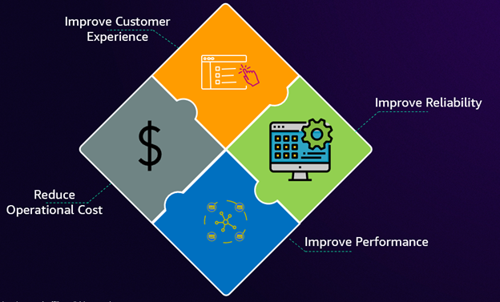
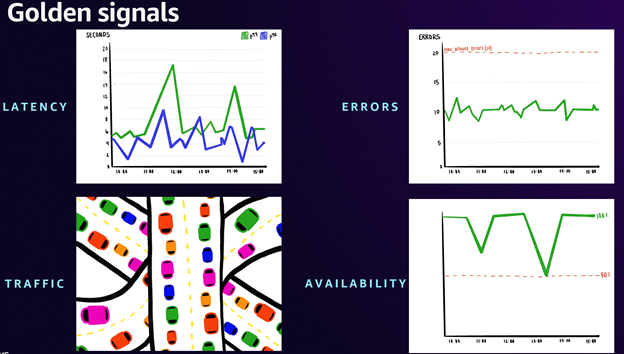
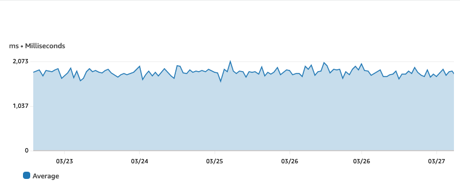
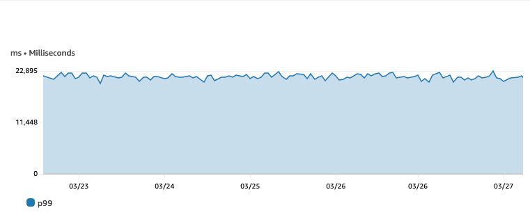
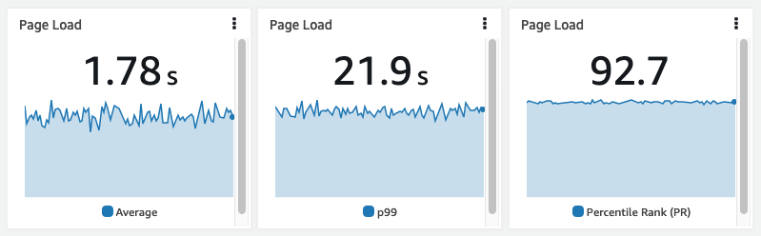

# Observability Strategy

## Overview

This guide provides strategic guidance for IT leaders and engineering managers on building an observability strategy that directly supports business outcomes. It covers how to tie telemetry signals to commercial KPIs, frame observability investments in terms of ROI, select metrics that matter to stakeholders, and measure service reliability using percentiles rather than averages.

In today's digital-first economy, the boundary between business performance and technical operations has dissolved. Digital services directly impact revenue streams, customers expect unprecedented reliability, and competitive advantage hinges on technical resilience. This convergence requires IT leaders to demonstrate both operational excellence and tangible business value creation through effective observability strategies.

The age-old management principle rings true: "If you cannot measure it, you cannot manage it." Your observability strategy should be tightly coupled with your organization's core business goals and priorities, ensuring that insights generated directly support improving key performance indicators (KPIs).

## When to use this

- You are defining or refining an observability strategy for your organization
- You need to justify observability investment to executive stakeholders
- You want to align technical telemetry with business outcomes and customer experience
- You are selecting KPIs and SLOs for service reliability measurement
- You need to communicate the value of observability in terms of ROI and cost reduction
- You are transitioning from reactive monitoring to proactive, outcome-driven observability

## Guidance

### Monitor what matters

The most important consideration with observability is not your servers, network, applications, or customers — it is what matters to *your business*, your project, or your users.

Start with your success criteria. For example, if you run an e-commerce application, your measures of success may be number of purchases made per hour. A payment processor may watch transaction processing time, whereas a SaaS platform would measure user engagement and retention.

:::tip
Success metrics are different for everyone. Regardless of your application, the advice remains the same: know what *good* looks like and measure for it.
:::

Having identified your important top-level KPIs, your next job is to have an automated way to track and measure them — critically, in the same system that watches your workload's operations. For an e-commerce workload this may mean:

- Publishing sales data into a [time series](https://en.wikipedia.org/wiki/Time_series)
- Tracking user registrations in the same system
- Measuring how long customers stay on web pages and pushing this data to a time series

Every key metric must be maintained as a time series so you can correlate it with other observability signals (metrics, logs, traces).

### Tie telemetry to business outcomes

Everything in IT should align to your organization's mission. Every project, deployment, security measure, or optimization should work towards a business outcome. As ITIL states: "Every change should deliver business value."

Observability delivers business value through:

- Better availability and reliability
- Understanding of application health and performance
- Proactive detection of issues
- Increased customer satisfaction
- Reduced time to market
- Reduced operational costs
- Automation

All of these deliver business value either directly to the customer or indirectly to the organization. When thinking about observability, everything should come back to whether or not your application is delivering business value.

**Work backwards from customer needs.** You cannot be expected to know everything that customers care about. Talk to stakeholders in your organization — this is vital to ensuring you measure what's important. For example, according to research, 43% of visitors navigate immediately to the search box and searches are 2-3 times more likely to convert compared to non-searchers. Monitoring search quality has a direct, measurable impact on conversion.

As an added benefit, collecting metrics important to customers and stakeholders enables near real-time dashboards that eliminate the need for manual reporting. Executives should be able to self-serve information like "how long is it taking to load the landing page?" or "how much is it costing to run the website?"

### KPI framing for leaders

Translating observability into tangible business outcomes means focusing on three critical areas:

**Measuring customer experience** — Implement Service Level Objectives (SLOs) as your primary measurement framework. SLOs provide agreed-upon targets for service availability based on critical end-user journeys rather than just system metrics. Key terminology:

- **SLI** (Service Level Indicator): A quantitative measure of some aspect of service level
- **SLO** (Service Level Objective): A target value or range for a service level measured by an SLI
- **SLA** (Service Level Agreement): An agreement with your customer outlining the level of service promised

With [Amazon CloudWatch Application Signals](https://docs.aws.amazon.com/AmazonCloudWatch/latest/monitoring/CloudWatch-Application-Monitoring-Sections.html) you can create and monitor SLOs natively in AWS. For further learning, refer to [Improve application reliability with effective SLOs](https://aws.amazon.com/blogs/mt/improve-application-reliability-with-effective-slos).

**Improving application performance and reliability** — Monitor the golden signals of your critical applications: Availability, Latency, Errors, and Traffic. When combined with SLOs, these create a powerful framework for maintaining high reliability while optimizing operational costs.

**Optimizing cost** — Many organizations fall into the trap of monitoring everything (the "fear of missing out" syndrome), leading to complex, resource-intensive systems that generate more noise than insight. The key is identifying KPIs that directly correlate with business service success. Your observability strategy should demonstrably accelerate Root Cause Analysis (RCA), reduce Mean Time to Restore (MTTR), and lower operational costs while maintaining focus on core metrics.

### Quantifiable outcomes and business impact

A well-implemented observability strategy delivers both quantifiable financial returns and qualitative benefits:

**Cost savings** — Operational improvements measured through reduced MTTR and preventive measures generate immediate cost savings. Even a modest improvement in customer retention translates to substantial revenue protection when viewed through customer lifetime value.

**Operational efficiency** — Resource optimization often yields more than 40% cost reductions in infrastructure spending. Automation of routine tasks eliminates manual effort, with savings calculated by multiplying manual hours saved by labor costs.

**Cultural transformation** — Automated alert correlation and contextual troubleshooting drive immediate efficiency gains. Self-service capabilities empower independent problem-solving, while comprehensive visibility enables proactive risk management.

### Why percentiles beat averages for SLAs

Averages can hide important information such as outliers or variations that significantly impact performance and user experience. Percentiles reveal these hidden details and give a better understanding of data distribution.

In [Amazon CloudWatch](https://aws.amazon.com/cloudwatch/), percentiles can be used to monitor response times, latency, and error rates. By setting up alarms on percentiles, you get alerted when specific percentile values exceed thresholds, allowing action before they impact more customers.

To use [percentiles in CloudWatch](https://docs.aws.amazon.com/AmazonCloudWatch/latest/monitoring/cloudwatch_concepts.html#Percentiles), choose your metric and set the **statistic** to **p99** (or any percentile you need). You can then view percentile graphs, add them to [CloudWatch dashboards](https://docs.aws.amazon.com/AmazonCloudWatch/latest/monitoring/CloudWatch_Dashboards.html), and set alarms.

Consider this example: a histogram of page load times shows clear outliers that are hidden when using averages.

The same data shown with an average value indicates pages take under two seconds to load — but most pages actually take less than a second, with significant outliers:

Using p99 reveals the truth — 99 percent of page loads take less than 23 seconds, showing there is a real performance issue:

Comparing the average to percentile rank (PR) using the statistic **PR(:2000)** shows that 92.7% of page loads happen within the 2000ms target:

Using percentiles helps you detect issues early and improve customer experience by identifying outliers that would otherwise be hidden by averages.

### What to observe

Once you know what matters to your customers, identify Key Performance Indicators (KPIs). These are your high-level metrics that tell you if business outcomes are at risk. Work backwards from what will impact business outcomes to things that may impact business outcomes.

Issues that impact customers are easy to identify when measuring high-level business metrics. These metrics are the **what** is happening. Other metrics, tracing, and logs are the **why** — which leads to what you can do to fix or improve it.

### Collect telemetry from all tiers

Your applications do not exist in isolation. Interactions with network infrastructure, cloud providers, ISPs, SaaS partners, and other components can all impact outcomes. You need a holistic view of your entire workload.

**Focus on integrations** — Every time one component or service calls another, measure:

1. The duration of the request and response
2. The status of the response

Include a single unique identifier for the entire request chain in all collected signals.

**Don't forget end-user experience** — If your workloads interact directly with end users (web sites, mobile apps), then [Real User Monitoring](https://docs.aws.amazon.com/AmazonCloudWatch/latest/monitoring/CloudWatch-RUM.html) monitors not just delivery to the user, but how they actually experience your application.

### Include observability from day one

Like security, observability should not be an afterthought. Put observability early in your planning to reduce opaque corners of your application. Proper logging, metric, and trace collection enables faster application development, fosters good practices, and lays the foundation for rapid problem solving.

## Related

- [Observability Maturity Model](../observability-maturity-model/) — Assess your current stage and identify improvements
- [Observability Adoption Guide](../observability-adoption-guide/) — Staged adoption framework with anti-patterns to avoid
- [Frontend SLO Monitoring](../frontend-slo-monitoring/) — Implement SLOs for frontend performance
- [AWS CAF Operations Perspective: Observability](https://docs.aws.amazon.com/whitepapers/latest/aws-caf-operations-perspective/observability.html)
