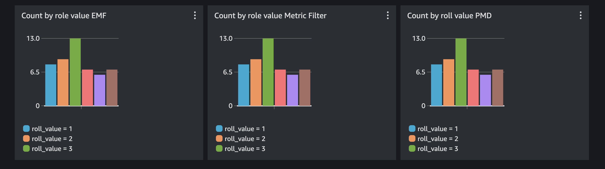

import RelatedEvents from '@site/src/components/RelatedEvents';

# Rust Custom Metrics

## Related Events

<RelatedEvents topics={["metrics"]} />

## Overview

Publish custom CloudWatch metrics from Rust applications using the AWS SDK for Rust. This solution demonstrates three approaches: direct `PutMetricData` API calls, `PutLogEvents` with metric filters, and `PutLogEvents` with CloudWatch Embedded Metric Format (EMF). Each approach has different trade-offs for cardinality, setup complexity, and cost.

## Prerequisites

- Rust toolchain installed:
  ```
  curl --proto '=https' --tlsv1.2 -sSf https://sh.rustup.rs | sh
  ```
- AWS CLI configured with credentials (`aws configure`)
- IAM permissions for `cloudwatch:PutMetricData` and `logs:PutLogEvents`
- A CloudWatch log group and log stream:
  ```
  aws logs create-log-group --log-group-name rust_custom
  aws logs create-log-stream --log-group-name rust_custom --log-stream-name diceroll_log_stream
  ```

## Architecture

```
┌──────────────────┐     PutMetricData      ┌──────────────────┐
│  Rust Application│────────────────────────▶│ CloudWatch       │
│                  │     PutLogEvents (EMF)  │ Metrics          │
│                  │────────────────────────▶│                  │
│                  │     PutLogEvents        │ CloudWatch Logs  │
│                  │────────────────────────▶│ + Metric Filter  │
└──────────────────┘                         └──────────────────┘
```

## Deploy

### PutMetricData

The most direct approach — write time-series values straight to CloudWatch Metrics.

```rust
async fn put_metric_data(roll_value: i32) -> Result<(), cloudwatch::Error> {
    //Create a reusable aws config that we can pass to our clients
    let config = aws_config::load_defaults(BehaviorVersion::v2023_11_09()).await;

    //Create a cloudwatch client
    let client = cloudwatch::Client::new(&config);

    //Use fluent builders to build the required input for pmd call, starting with dimensions.
    let dimensions = Dimension::builder()
        .name("roll_value_pmd_dimension")
        .value(roll_value.to_string())
        .build();

    let put_metric_data_input = MetricDatum::builder()
        .metric_name("roll_value_pmd")
        .dimensions(dimensions)
        .value(f64::from(roll_value))
        .build();

    let response = client
        .put_metric_data()
        .namespace("rust_custom_metrics")
        .metric_data(put_metric_data_input)
        .send()
        .await?;
    println!("Metric Submitted: {:?}", response);
    Ok(())
}
```

### PutLogEvent with Metric Filter

Write values to CloudWatch Logs, then extract metrics using a metric filter.

```rust
//Make a simple struct for the log message. We could also just create a json string manually.
#[derive(Serialize)]
struct DicerollValue {
    welcome_message: String,
    roll_value: i32,
}
```

```rust
//Create a reusable aws config that we can pass to our clients
let config = aws_config::load_defaults(BehaviorVersion::v2023_11_09()).await;

//Create a cloudwatch logs client
let client = cloudwatchlogs::Client::new(&config);

//Let's get the time in ms from unix epoch, this is required for CWlogs
let time_now = SystemTime::now()
    .duration_since(UNIX_EPOCH)
    .unwrap()
    .as_millis() as i64;

let log_json = json!(DicerollValue {
    welcome_message: String::from("Hello from rust!"),
    roll_value
});

let log_event = InputLogEvent::builder()
    .timestamp(time_now)
    .message(log_json.to_string())
    .build();

let response = client
    .put_log_events()
    .log_group_name("rust_custom")
    .log_stream_name("diceroll_log_stream")
    .log_events(log_event.unwrap())
    .send()
    .await?;

println!("Log event submitted: {:?}", response);
Ok(())
```

After submitting log events, create a metric filter on the `rust_custom` log group in the CloudWatch console:
- Filter pattern: `{$.roll_value = *}`
- Metric value: `$.roll_value`

### PutLogEvent with Embedded Metric Format

Embed metric definitions directly in log events — CloudWatch extracts them automatically without metric filters.

```rust
//Create a reusable aws config that we can pass to our clients
let config = aws_config::load_defaults(BehaviorVersion::v2023_11_09()).await;

//Create a cloudwatch logs client
let client = cloudwatchlogs::Client::new(&config);

//get the time in unix epoch ms
let time_now = SystemTime::now()
    .duration_since(UNIX_EPOCH)
    .unwrap()
    .as_millis() as i64;

//Create a json string in embedded metric format with our diceroll value.
let json_emf = json!(
    {
        "_aws": {
        "Timestamp": time_now,
        "CloudWatchMetrics": [
            {
            "Namespace": "rust_custom_metrics",
            "Dimensions": [["roll_value_emf_dimension"]],
            "Metrics": [
                {
                "Name": "roll_value_emf"
                }
            ]
            }
        ]
        },
        "roll_value_emf_dimension": roll_value.to_string(),
        "roll_value_emf": roll_value
    }
);

let log_event = InputLogEvent::builder()
    .timestamp(time_now)
    .message(json_emf.to_string())
    .build();

let response = client
    .put_log_events()
    .log_group_name("rust_custom")
    .log_stream_name("diceroll_log_stream_emf")
    .log_events(log_event.unwrap())
    .send()
    .await?;

println!("EMF Log event submitted: {:?}", response);
Ok(())
```

### Running the Application

Build and run to generate test data:

```
cargo build
for run in {1..50}; do ./target/debug/custom-metrics; sleep 2; done
```

Query the metrics with Metric Insights:

```
SELECT COUNT(roll_value_emf) FROM rust_custom_metrics GROUP BY roll_value_emf_dimension
```



## Validate

1. Open the CloudWatch console and navigate to **Metrics > All metrics**.
2. Find the `rust_custom_metrics` namespace.
3. Confirm metrics `roll_value_pmd`, `roll_value_emf`, and the metric-filter-extracted metric are all publishing data points.
4. Create a dashboard with the Metric Insights query above and verify the GroupBy chart shows counts per roll value.

## Troubleshoot

| Symptom | Likely Cause | Fix |
|---------|-------------|-----|
| `DispatchFailure` or credential errors | AWS credentials not configured or expired | Run `aws configure` or refresh temporary credentials |
| Metrics not appearing in namespace | Wrong namespace string or IAM policy missing `cloudwatch:PutMetricData` | Verify namespace matches code; check IAM policy |
| EMF metrics not extracted from logs | Malformed `_aws` JSON block or wrong log group | Validate JSON against [EMF specification](https://docs.aws.amazon.com/AmazonCloudWatch/latest/monitoring/CloudWatch_Embedded_Metric_Format_Specification.html); check log group exists |
| Metric filter not producing metrics | Filter pattern mismatch | Test the pattern in the CloudWatch Logs console filter tester |

## Cleanup

Delete the log group when finished:

```
aws logs delete-log-group --log-group-name rust_custom
```

## Related Solutions

- [.NET Application Monitoring](../dotnet-application-monitoring/)
- [Lambda Monitoring](../lambda-monitoring/)
