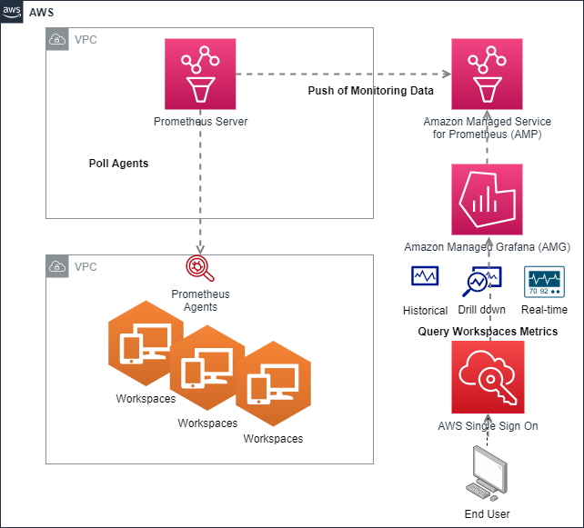

import RelatedEvents from '@site/src/components/RelatedEvents';

# Amazon WorkSpaces Monitoring

## Related Events

<RelatedEvents topics={["metrics"]} />

## Overview

Monitor Amazon WorkSpaces virtual desktops using Prometheus agents deployed on each WorkSpace instance, a Prometheus server on EC2 for scraping and remote-writing to Amazon Managed Service for Prometheus (AMP), and Amazon Managed Grafana (AMG) for visualization.

This enables service desk staff to quickly identify CPU, memory, network, and disk issues on WorkSpaces without guesswork, and to investigate historical data for post-event analysis.

## Prerequisites

- Amazon WorkSpaces environment deployed and accessible
- An Amazon Managed Service for Prometheus workspace
- An Amazon Managed Grafana workspace with AMP as a data source
- An EC2 instance for the Prometheus server with network connectivity to WorkSpaces
- Active Directory Group Policy Objects (GPO) access for automated agent deployment

## Architecture



The Prometheus server on EC2 scrapes metrics from Prometheus agents running on each Amazon WorkSpace. Metrics are remote-written to AMP for durable storage and queried by AMG for dashboards.

## Deploy

1. Create an AMP workspace:
   ```bash
   aws amp create-workspace --alias workspaces-monitoring
   ```

2. Deploy a Prometheus server on an EC2 instance. Configure `prometheus.yml` with the remote write endpoint for your AMP workspace and scrape targets for your WorkSpaces.

3. Deploy Prometheus agents (e.g., `windows_exporter` or `node_exporter`) on each Amazon WorkSpace. Use Active Directory GPO to automate deployment to new WorkSpaces.

4. Configure AMG to use the AMP workspace as a data source. Import or build dashboards for CPU, memory, network, and disk metrics.

## Validate

1. Confirm the Prometheus server targets page shows WorkSpaces endpoints as UP.
2. In AMG, query `up{job="workspaces"}` and confirm targets are returning data.
3. Verify dashboard panels populate with CPU, memory, and disk metrics from WorkSpaces instances.

## Troubleshoot

| Symptom | Likely Cause | Fix |
|---------|-------------|-----|
| Prometheus target shows DOWN | Agent not installed or firewall blocking scrape port | Verify agent is running on WorkSpace; check security group allows inbound on metrics port |
| No data in AMG dashboards | AMP data source misconfigured or IAM permissions missing | Verify AMG data source URL and SigV4 auth; check `aps:QueryMetrics` permission |
| Remote write errors in Prometheus logs | Incorrect AMP endpoint or missing IAM role on EC2 | Verify remote write URL matches AMP workspace; attach IAM role with `aps:RemoteWrite` |

## Related Solutions

- [Hybrid Monitoring](../hybrid-monitoring/)
- [Managed Grafana Setup](../managed-grafana-setup/)
