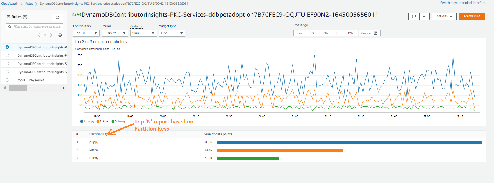

# CloudWatch Contributor Insights

## Overview
Amazon CloudWatch Contributor Insights helps you analyze log data to identify top contributors influencing your metrics. It enables you to understand which entities are impacting your system's behavior and performance by creating real-time rankings and statistics.

## Features
- Real-time analysis of log data
- Built-in rules for common AWS services
- Custom rule creation capabilities
- Automatic data processing and ranking
- Integration with CloudWatch dashboards and alarms

## Implementation

### Built-in Rules
CloudWatch Contributor Insights provides pre-built rules for common AWS services:
- VPC Flow Logs analysis
- Application Load Balancer logs
- Amazon API Gateway logs
- AWS Lambda logs

### Custom Rules
Create custom rules by defining:
1. Log group your source documents. Contributor fields to analyze
3. Metrics and aggregations
4. Time windows and sampling rates

Example custom rule:
```yaml
{
	"AggregateOn": "Count",
	"Contribution": {
		"Filters": [],
		"Keys": [
			"$.pettype"
		]
	},c
	"LogFormat": "JSON",
	"Schema": {
		"Name": "CloudWatchLogRule",
		"Version": 1
	},
	"LogGroupARNs": [
		"arn:aws:logs:[region]:[account]:log-group:[API Gateway Log Group Name]"
	]
}
```



## Best Practices

### Rule Configuration
- Use descriptive rule names
- Start with built-in rules when possible
- Implement targeted log filtering
- Configure appropriate time windows

### Performance Optimization
- Limit active rules count
- Set optimal sampling rates
- Use appropriate aggregation periods
- Enable rules only for needed log groups

### Cost Management
- Monitor rule usage regularly
- Delete unused rules
- Implement log filtering
- Review sampling rates periodically

### Security
- Follow least privilege principle
- Encrypt sensitive data
- Regular rule audits
- Monitor pattern changes

## Common Issues and Solutions

### Rule Not Matching Logs
**Issue**: Rules not processing expected logs
**Solution**:
- Verify log format matches rule configuration
- Check field names are correct
- Validate JSON structure

### Missing Data
**Issue**: Gaps in contributor data
**Solution**:
- Check sampling rate configuration
- Verify log delivery
- Review time window settings

### Performance Issues
**Issue**: Slow rule processing
**Solution**:
- Optimize number of active rules
- Adjust sampling rates
- Review contribution thresholds

## Integration

### CloudWatch Dashboards
Create visualizations of top contributors:
```yaml
{
  "widgets": [
    {
      "type": "metric",
      "properties": {
        "view": "bar",
        "region": "us-east-1",
        "title": "Top Contributors",
        "period": 300
      }
    }
  ]
}
```

### CloudWatch Alarms
Set up alerts for contributor patterns:
```yaml
{
  "AlarmName": "HighContributorCount",
  "MetricName": "UniqueContributors",
  "Threshold": 100,
  "Period": 300,
  "EvaluationPeriods": 2
}
```

## Tools and Resources

### AWS CLI Commands
```bash
# Create a rule
aws cloudwatch put-insight-rule --rule-name MyRule --rule-definition file://rule.json

# Delete a rule
aws cloudwatch delete-insight-rule --rule-name MyRule
```

### Related Services
- Amazon CloudWatch
- CloudWatch Logs
- CloudWatch Alarms
- Amazon EventBridge

### Additional Resources
- [Official Documentation](https://docs.aws.amazon.com/AmazonCloudWatch/latest/monitoring/ContributorInsights.html)
- [Rule Syntax Reference](https://docs.aws.amazon.com/AmazonCloudWatch/latest/monitoring/ContributorInsights-RuleSyntax.html)
- [AWS CLI Reference](https://docs.aws.amazon.com/cli/latest/reference/cloudwatch/put-insight-rule.html)
