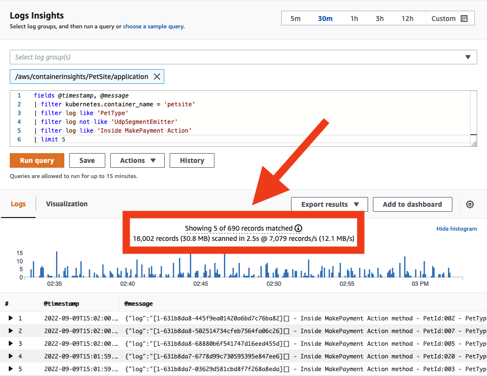
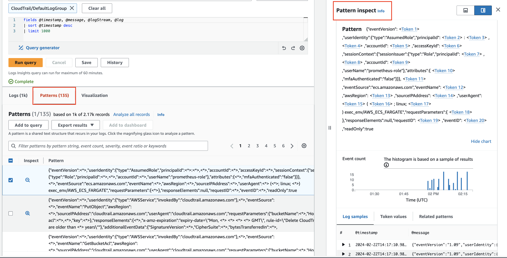

# Logging

The selection of logging tools is tied to your requirements for data transmission, filtering, retention, capture, and integration with the applications that generate your data. When using Amazon Web Services for observability (regardless whether you host on-premises or in another cloud environment), you can leverage the [CloudWatch agent](https://docs.aws.amazon.com/AmazonCloudWatch/latest/monitoring/Install-CloudWatch-Agent.html) or another tool such as [Fluentd](https://www.fluentd.org/) to emit logging data for analysis.

Here we will expand on the best practices for implementing the CloudWatch agent for logging, and the use of CloudWatch Logs within the AWS console or APIs.

:::info
	The CloudWatch agent can also be used for delivery of [metric data](../../signals/metrics/) to CloudWatch. See the [metrics](../../tools/metrics/) page for implementation details. It can also be used to collect [traces](../../signals/traces.md) from OpenTelemetry or X-Ray client SDKs, and send them to [AWS X-Ray](../../tools/xray.md).
:::
## Collecting logs with the CloudWatch agent

### Forwarding

When taking a [cloud first approach](../../faq#what-is-a-cloud-first-approach) to observability, as a rule, if you need to log into a machine to get its logs, you then have an anti-pattern. Your workloads should emit their logging data outside of their confines in near real time to a log analysis system, and latency between that transmission and the original event represents a potential loss of point-in-time information should a disaster befall your workload.

As an architect you will have to determine what your acceptable loss for logging data is and adjust the CloudWatch agent's [`force_flush_interval`](https://docs.aws.amazon.com/AmazonCloudWatch/latest/monitoring/CloudWatch-Agent-Configuration-File-Details.html#CloudWatch-Agent-Configuration-File-Logssection) to accommodate this.

The `force_flush_interval` instructs the agent to send logging data to the data plane at a regular cadence, unless the buffer size is reached, in which case it will send all buffered logs immediately.

:::tip
	Edge devices may have very different requirements from low-latency, in-AWS workloads, and may need to have much longer `force_flush_interval` settings. For example, an IoT device on a low-bandwidth Internet connection may only need to flush logs every 15 minutes.
:::
:::info
	Containerized or stateless workloads may be especially sensitive to log flush requirements. Consider a stateless Kubernetes application or EC2 fleet that can be scaled-in at any moment. Loss of logs may take place when these resources are suddenly terminated, leaving no way to extract logs from them in the future. The standard `force_flush_interval` is usually appropriate for these scenarios, but can be lowered if required.
:::
### Log groups

Within CloudWatch Logs, each collection of logs that logically applies to an application should be delivered to a single [log group](https://docs.aws.amazon.com/AmazonCloudWatch/latest/logs/CloudWatchLogsConcepts.html). Within that log group you want to have *commonality* among the source systems that create the log streams within.

Consider a LAMP stack: the logs from Apache, MySQL, your PHP application, and hosting Linux operating system would each belong to a separate log group.

This grouping is vital as it allows you to treat groups with the same retention period, encryption key, metric filters, subscription filters, and Contributor Insights rules.

:::info
	There is no limitation on the number of log streams in a log group, and you can search through the entire compliment of logs for your application in a single CloudWatch Logs Insights query. Having a separate log stream for each pod in a Kubernetes service, or for every EC2 instance in your fleet, is a standard pattern.
:::
:::info
	The default retention period for a log group is *indefinite*. The best practice is to set the retention period at the time of creating the log group.

	While you can set this in the CloudWatch console at any time, the best practice is to do so either in-tandem with the log group creation using infrastructure as code (CloudFormation, Cloud Development Kit, etc.) or using the `retention_in_days` setting inside of the CloudWatch agent configuration.

	Either approach lets you set the log retention period proactively, and aligned with your project's data retention requirements.
:::

:::info
	Log group data is always encrypted in CloudWatch Logs. By default, CloudWatch Logs uses `server-side` encryption for the log data at rest. As an alternative, you can use AWS Key Management Service for this encryption. [Encryption using AWS KMS](https://docs.aws.amazon.com/AmazonCloudWatch/latest/logs/encrypt-log-data-kms.html) is enabled at the log group level, by associating a KMS key with a log group, either when you create the log group or after it exists. This can be configured using infrastructure as code (CloudFormation, Cloud Development Kit, etc.).

	Using AWS Key Management Service to manage keys for CloudWatch Logs requires additional configuration and granting permissions to the keys for your users.[^1]
:::
### Log formatting

CloudWatch Logs has the capability to automatically discover log fields and index JSON data upon ingestion. This feature facilitates ad hoc queries and filtering, enhancing the usability of log data. However, it's important to note that automatic indexing is only applicable to structured data. Unstructured logging data won't be automatically indexed but can still be delivered to CloudWatch Logs.

Unstructured logs can still be searched or queried using a regular expression with `parse` command.

:::info
	The two best practices for log formats when using CloudWatch Logs:

	1. Use a structured log formatter such as [Log4j](https://logging.apache.org/log4j/2.x/), [`python-json-logger`](https://pypi.org/project/python-json-logger/), or your framework's native JSON emitter.
	2. Send a single line of logging per event to your log destination.

	Note that when sending multiple lines of JSON logging, each line will be interpreted as a single event.
:::
### Handling `stdout`

As discussed in our [log signals](../../signals/logs/#log-to-stdout) page, the best practice is to decouple logging systems from their generating applications. However to send data from `stdout` to a file is a common pattern for many (if not most) platforms. Container orchestration systems such as Kubernetes or [Amazon Elastic Container Service](https://aws.amazon.com/ecs/) manage this delivery of `stdout` to a log file automatically, allowing for collection of each log from a collector. The CloudWatch agent then reads this file in real time and forwards the data to a log group on your behalf.

:::info
	Use the pattern of simplified application logging to `stdout`, with collection by an agent, as much as possible.
:::
### Filtering logs

There are many reasons to filter your logs such as preventing the persistent storage of personal data, or only capturing data that is of a particular log level. In any event, the best practice is to perform this filtering as close to the originating system as possible. In the case of CloudWatch, this will mean *before* data is delivered into CloudWatch Logs for analysis. The CloudWatch agent can perform this filtering for you.

:::info
	Use the [`filters`](https://docs.aws.amazon.com/AmazonCloudWatch/latest/monitoring/CloudWatch-Agent-Configuration-File-Details.html#CloudWatch-Agent-Configuration-File-Logssection) feature to `include` log levels that you want and `exclude` patterns that are known not to be desirable, e.g. credit card numbers, phone numbers, etc.
:::
:::tip
	Filtering out certain forms of known data that can potentially leak into your logs can be time-consuming and error prone. However, for workloads that handle specific types of known undesirable data (e.g. credit card numbers, Social Security numbers), having a filter for these records can prevent a potentially damaging compliance issue in the future. For example, dropping all records that contain a Social Security number can be as simple as this configuration:

	```
	"filters": [
      {
        "type": "exclude",
        "expression": "\b(?!000|666|9\d{2})([0-8]\d{2}|7([0-6]\d))([-]?|\s{1})(?!00)\d\d\2(?!0000)\d{4}\b"
      }
    ]
    ```
:::

### Multi-line logging

The best practice for all logging is to use [structured logging](../../signals/logs/#structured-logging-is-key-to-success) with a single line emitted for every discrete log event. However, there are many legacy and ISV-supported applications that do not have this option. For these workloads, CloudWatch Logs will interpret each line as a unique event unless they are emitted using a multi-line-aware protocol. The CloudWatch agent can perform this with the [`multi_line_start_pattern`](https://docs.aws.amazon.com/AmazonCloudWatch/latest/monitoring/CloudWatch-Agent-Configuration-File-Details.html#CloudWatch-Agent-Configuration-File-Logssection) directive.

:::info
	Use the `multi_line_start_pattern` directive to ease the burden of ingesting muli-line logging into CloudWatch Logs.
:::
### Configuring logging class

CloudWatch Logs offers two [classes](https://docs.aws.amazon.com/AmazonCloudWatch/latest/logs/CloudWatch_Logs_Log_Classes.html) of log groups:

- The CloudWatch Logs Standard log class is a full-featured option for logs that require real-time monitoring or logs that you access frequently.

- The CloudWatch Logs Infrequent Access log class is a new log class that you can use to cost-effectively consolidate your logs. This log class offers a subset of CloudWatch Logs capabilities including managed ingestion, storage, cross-account log analytics, and encryption with a lower ingestion price per GB. The Infrequent Access log class is ideal for ad-hoc querying and after-the-fact forensic analysis on infrequently accessed logs.

:::info
	Use the `log_group_class` directive to specify which log group class to use for the new log group. Valid values are **STANDARD** and **INFREQUENT_ACCESS**. If you omit this field, the default of **STANDARD** is used by the agent.
:::

#### Auditing existing logs for proper class designation

CloudWatch logs Infrequent Access tier log class utilizes a subset of CloudWatch logging capabilities. It is recommended to audit existing log groups to check if any standard log groups could be re-created as Infrequent Access log groups. A good way to do this is running the [log-ia-checker](https://github.com/aws-observability/log-ia-checker) cli tool. This tool will analyze all the log groups in a given region and provide an output of logs that can be transitioned to Infrequent Access.

## Search with CloudWatch Logs

### Manage costs with query scoping

With data delivered into CloudWatch Logs, you can now search through it as required. Be aware that CloudWatch Logs charges per gigabyte of data scanned. There are strategies for keeping your query scope under control, which will result in reduced data scanned.

:::info
	When searching your logs ensure that your time and date range is appropriate. CloudWatch Logs allows you to set relative or absolute time ranges for scans. *If you are only looking for entries from the day before, then there is no need to include scans of logs from today!*
:::

:::info
	You can search multiple log groups in a single query, but doing so will cause more data to be scanned. When you have identified the log group(s) you need to target, reduce your query scope to match.
:::

:::tip
	You can see how much data each query actually scans directly from the CloudWatch console. This approach can help you create queries that are efficient.

	
:::

### Share Successful Queries with Others

While the [CloudWatch Logs query syntax](https://docs.aws.amazon.com/AmazonCloudWatch/latest/logs/CWL_QuerySyntax.html) is not complex, writing certain queries from scratch can still be time-consuming. Sharing well-written queries with other users within the same AWS account can streamline the investigation of application logs. This can be achieved directly from the [AWS Management Console](https://docs.aws.amazon.com/AmazonCloudWatch/latest/logs/CWL_Insights-Saving-Queries.html) or programmatically using [CloudFormation](https://docs.aws.amazon.com/AWSCloudFormation/latest/UserGuide/aws-resource-logs-querydefinition.html) or [AWS CDK](https://docs.aws.amazon.com/cdk/api/v2/docs/aws-cdk-lib.aws_logs.CfnQueryDefinition.html). Doing so reduces the amount of rework required for others who need to analyze log data.

:::info
	Save queries that are often repeated into CloudWatch Logs so they can be prepopulated for your users.

	
:::

### Pattern analysis

CloudWatch Logs Insights uses machine learning algorithms to find patterns when you query your logs. A pattern is a shared text structure that recurs among your log fields. Patterns are useful for analyzing large log sets because a large number of log events can often be compressed into a few patterns.[^2]

:::info
	Use pattern to automatically cluster your log data into patterns.

	
:::

### Compare (diff) with previous time ranges

CloudWatch Logs Insights enables comparison of log event changes over time, aiding in error detection and trend identification. Comparison queries reveal patterns, facilitating quick trend analysis, with the ability to examine sample raw log events for deeper investigation. Queries are analyzed against two time periods: the selected period and an equal-length comparison period.[^3]

:::info
	Compare changes in your log events over time using `diff` command.

	
:::

[^1]: See [How to search through your AWS Systems Manager Session Manager console logs – Part 1](https://aws.amazon.com/blogs/mt/how-to-search-through-your-aws-systems-manager-session-manager-console-logs-part-1/) for a practical example of CloudWatch Logs log group encryption with access privileges.

[^2]: See [CloudWatch Logs Insights Pattern Analysis](https://docs.aws.amazon.com/AmazonCloudWatch/latest/logs/CWL_AnalyzeLogData_Patterns.html) for more detailed insights.

[^3]: See [CloudWatch Logs Insigts Compare(diff) with previous ranges](https://docs.aws.amazon.com/AmazonCloudWatch/latest/logs/CWL_AnalyzeLogData_Compare.html) for more information.
