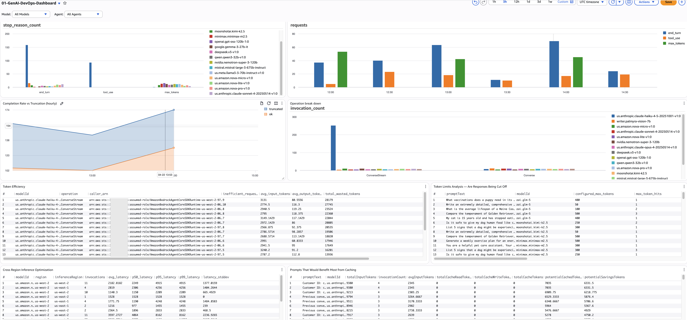

# Création de tableaux de bord personnalisés pour la télémétrie GenAI

## Pourquoi des tableaux de bord personnalisés ?

Lorsque vous activez la journalisation des invocations de modèles Bedrock et déployez l'agent d'auto-instrumentation ADOT, AWS vous offre une longueur d'avance avec des tableaux de bord prêts à l'emploi. Bedrock fournit automatiquement le nombre d'invocations, la latence, les comptages de tokens et les métriques de limitation. Application Signals génère automatiquement des cartes de services et des vues SLO. C'est une base solide — mais ce n'est pas le tableau complet.

Les tableaux de bord prêts à l'emploi répondent à « mon IA est-elle en bonne santé en ce moment ? » Ils ne répondent pas aux questions que vos équipes DevOps, FinOps et sécurité posent réellement :

- Quel appelant consomme 80 % de notre budget Bedrock ?
- Pourquoi le taux de complétion a-t-il chuté après le déploiement de 15h ?
- L'inférence inter-régions aide-t-elle réellement, ou ajoute-t-elle de la latence ?
- Quels prompts bénéficieraient le plus de la mise en cache ?
- Qui a fait cet appel de modèle qui a retourné des données personnelles, et qu'a-t-il demandé ?
- Mon agent échoue-t-il au niveau de la couche d'outils ou de la couche de modèle ?

Répondre à ces questions nécessite des requêtes personnalisées qui joignent des groupes de logs, calculent les coûts à partir des tokens, segmentent par rôle IAM et explorent les arbres de spans. La télémétrie brute circule déjà — la valeur vient de la façon dont vous la découpez.

### Un pipeline, différentes audiences

Votre télémétrie GenAI arrive dans trois groupes de logs : `bedrock-model-invocation-logging`, `aws/spans` et `/aws/bedrock-agentcore/runtimes/<agent>`. Les données ne changent pas, mais la façon dont vous les présentez, oui. Les mêmes données d'invocation deviennent :

- **Un tableau de bord DevOps** montrant le taux de complétion, la latence par composant et l'exploration détaillée des erreurs d'agent — axé sur « le système fonctionne-t-il ? »
- **Un tableau de bord FinOps** montrant le coût par modèle, les principaux dépenseurs et les opportunités de mise en cache — axé sur « dépensons-nous efficacement ? »

Ce guide vous donne les requêtes pour construire les deux. Choisissez les sections pertinentes pour votre audience. Chaque requête indique son groupe de logs source, le type de visualisation, le langage de requête et la question à laquelle elle répond.

Pour une vue d'ensemble des pipelines de données sous-jacents et quand activer chacun, consultez [Observability GenAI sur AWS](../genai-observability-on-aws).

---

## Tableau de bord persona DevOps

Les équipes DevOps doivent répondre à : *ma charge de travail GenAI est-elle saine, et où sont les goulots d'étranglement ?* Ces requêtes se concentrent sur la santé des invocations, la fiabilité des flux de travail d'agent et les goulots d'étranglement de performance.



### Santé des invocations de modèles

#### 1. Répartition des raisons d'arrêt par modèle

- **Objectif :** Montre la distribution de TOUTES les raisons d'arrêt à travers les modèles. Chaque invocation Bedrock se termine avec une raison d'arrêt — `end_turn` (complétion naturelle), `tool_use` (appel d'un outil), `max_tokens` (tronqué), `stop_sequence` (a atteint une limite) ou une erreur. Exemple : vous pourriez découvrir que 15 % des appels de votre modèle de résumé se terminent par `max_tokens` — ce qui signifie que les utilisateurs obtiennent des réponses coupées — tandis que votre modèle de classification est à 100 % `end_turn`.
- **Source :** `bedrock-model-invocation-logging`
- **Visualisation :** Diagramme à barres
- **Langage de requête :** CloudWatch Logs Insights
- **Requête :**

```sql
fields @timestamp, modelId, operation, requestId,
       output.outputBodyJson.stopReason as stop_reason
| filter schemaType = "ModelInvocationLog"
| filter ispresent(output.outputBodyJson.stopReason)
        or ispresent(output.outputBodyJson.error)
| stats count() as stop_reason_count by stop_reason, modelId
```

- **Alarme :** Toute raison d'arrêt non saine (pas `end_turn`, `tool_use` ou `stop_sequence`) dépassant 10 % des invocations totales d'un modèle.

#### 2. Taux de complétion vs troncation (horaire)

- **Objectif :** Suit le ratio horaire de complétions réussies (`end_turn` + `tool_use`) vs réponses tronquées (`max_tokens`). C'est votre métrique SLA — cible 95 %+ de taux de complétion. Exemple : si le taux de complétion passe de 97 % à 88 % entre 15h et 16h, quelque chose a changé — un nouveau modèle de prompt, une mise à jour de modèle ou un changement de configuration cause plus de troncation.
- **Source :** `bedrock-model-invocation-logging`
- **Visualisation :** Série temporelle (empilée)
- **Langage de requête :** CloudWatch Logs Insights
- **Requête :**

```sql
fields @timestamp, modelId,
       output.outputBodyJson.stopReason as stop_reason
| filter schemaType = "ModelInvocationLog"
| filter ispresent(output.outputBodyJson.stopReason)
| stats sum(stop_reason = "end_turn" or stop_reason = "tool_use") as ok,
        sum(stop_reason = "max_tokens") as truncated
  by bin(@timestamp, 1h) as hour
| sort hour desc
```

- **Alarme :** `ok / (ok + truncated)` inférieur à 95 % pendant 2 heures consécutives.

#### 3. Efficacité des tokens — Trouver les tokens gaspillés

- **Objectif :** Trouve les appelants envoyant un nombre élevé de tokens d'entrée (plus de 2000) mais recevant une sortie faible (moins de 200) — un signe de gaspillage de tokens. Exemple : un pipeline de classification envoyant des catalogues de produits entiers (8000 tokens) pour obtenir une étiquette d'un mot (3 tokens). La colonne `caller_arn` vous dit exactement quel service ou rôle est responsable, afin que vous puissiez avoir une conversation ciblée sur la restructuration de leurs prompts.
- **Source :** `bedrock-model-invocation-logging`
- **Visualisation :** Tableau
- **Langage de requête :** CloudWatch Logs Insights
- **Requête :**

```sql
fields @timestamp, modelId, operation,
       input.inputTokenCount as input_tokens,
       output.outputTokenCount as output_tokens,
       identity.arn as caller_arn
| filter schemaType = "ModelInvocationLog"
| filter input_tokens > 2000 and output_tokens < 200
| stats count() as inefficient_requests,
        avg(input_tokens) as avg_input_tokens,
        avg(output_tokens) as avg_output_tokens,
        sum(input_tokens) as total_wasted_tokens
  by modelId, operation, caller_arn
| sort total_wasted_tokens desc
```

- **Alarme :** Tout appelant avec `total_wasted_tokens` supérieur à 100K en 24h.

#### 4. Latence d'inférence inter-régions

- **Objectif :** Compare les percentiles de latence à travers les régions d'inférence pour chaque modèle. Si vous avez activé l'inférence inter-régions, certaines requêtes sont routées vers des régions distantes avec une latence plus élevée. Exemple : le P95 de votre modèle de résumé est de 12s en us-west-2 mais de 4s en us-east-1 — configurer votre profil d'inférence pour préférer us-east-1 peut réduire le P95 de 40 %.
- **Source :** `bedrock-model-invocation-logging`
- **Visualisation :** Tableau
- **Langage de requête :** CloudWatch Logs Insights
- **Requête :**

```sql
fields @timestamp, modelId, region, inferenceRegion,
       output.outputBodyJson.metrics.latencyMs as latency
| filter schemaType = "ModelInvocationLog"
| filter ispresent(inferenceRegion)
| filter latency > 0
| stats count() as invocations,
        avg(latency) as avg_latency,
        pct(latency, 50) as p50_latency,
        pct(latency, 95) as p95_latency,
        pct(latency, 99) as p99_latency,
        stddev(latency) as latency_stddev
  by modelId, region, inferenceRegion
| sort modelId asc, avg_latency asc
```

- **Alarme :** Tout modèle avec P95 supérieur à 10 secondes dans une région spécifique.

#### 5. Opportunités de mise en cache des prompts

- **Objectif :** Trouve les prompts appelés de manière répétée mais avec zéro ou peu de cache hits — les plus grandes opportunités de ROI de mise en cache. Exemple : un prompt système utilisé 500 fois avec zéro lectures de cache signifie que vous payez le prix fort à chaque fois — activer la mise en cache pourrait économiser 90 % sur ces tokens d'entrée.
- **Source :** `bedrock-model-invocation-logging`
- **Visualisation :** Tableau
- **Langage de requête :** CloudWatch Logs Insights
- **Requête :**

```sql
fields @timestamp,
       input.inputBodyJson.messages.0.content.0.text as promptText,
       input.inputTokenCount as inputTokens,
       input.cacheReadInputTokenCount as cacheReadTokens,
       input.cacheWriteInputTokenCount as cacheWriteTokens,
       modelId
| filter input.inputTokenCount > 0
| stats sum(input.inputTokenCount) as totalInputTokens,
        count(*) as invocationCount,
        avg(input.inputTokenCount) as avgInputTokens,
        sum(input.cacheReadInputTokenCount) as totalCacheReadTokens,
        sum(input.cacheWriteInputTokenCount) as totalCacheWriteTokens
  by promptText, modelId
| filter invocationCount > 1
| sort totalInputTokens desc
```

- **Alarme :** Aucune (revue d'optimisation, exécuter hebdomadairement).

### Santé des flux de travail d'agent

#### 6. Traces d'agent vs erreurs (horaire)

- **Objectif :** Comptage horaire du total des traces d'agent aux côtés des spans d'erreur — votre métrique de fiabilité au niveau de l'agent. Exemple : si total_traces est de 500/heure mais que error_spans passe de 5 à 80 à 15h, quelque chose s'est cassé dans le flux de travail de l'agent. Cela détecte des problèmes que les métriques au niveau du modèle manquent — le modèle peut réussir tandis que l'agent échoue à cause de délais d'expiration d'outils ou de rejets de guardrails.
- **Source :** `aws/spans`
- **Visualisation :** Série temporelle
- **Langage de requête :** CloudWatch Logs Insights
- **Requête :**

```sql
fields attributes.session.id as sessionId, traceId,
       status.code as statusCode, durationNano/1000000 as durationMs
| filter ispresent(sessionId)
| stats count_distinct(traceId) as total_traces,
        sum(statusCode = "ERROR") as error_spans
  by bin(@timestamp, 1h) as hour
| sort hour desc
```

- **Alarme :** `error_spans / total_traces` supérieur à 10 % pendant 15 minutes.

#### 7. Exploration détaillée des erreurs de span

- **Objectif :** Quand vous savez qu'il y a des erreurs d'agent, cela vous dit exactement QUEL composant échoue — récupération de base de connaissances, vérification de guardrail, exécution d'outil ou invocation de modèle. Exemple : 70 % des erreurs sont dans le span de récupération KB avec HTTP 503 — votre cluster OpenSearch est throttlé sous la charge, ce n'est pas un problème de modèle.
- **Source :** `aws/spans`
- **Visualisation :** Tableau
- **Langage de requête :** CloudWatch Logs Insights
- **Requête :**

```sql
fields name as spanName,
       resource.attributes.service.name as serviceName,
       status.code as statusCode,
       status.message as statusMessage,
       attributes.http.response.status_code as httpStatus,
       durationNano/1000000 as durationMs,
       traceId, spanId, parentSpanId
| filter resource.attributes.aws.service.type = "gen_ai_agent"
| filter status.code = "ERROR"
        or attributes.http.response.status_code >= 400
| stats count() as error_count,
        count_distinct(traceId) as affected_traces,
        avg(durationMs) as avg_error_duration_ms,
        earliest(statusMessage) as error_message
  by spanName, serviceName, httpStatus
| sort error_count desc
```

- **Alarme :** Tout composant avec plus de 10 erreurs en 15 minutes.

#### 8. Répartition des performances par composant (horaire)

- **Objectif :** Performance horaire par composant d'agent avec distributions complètes de percentiles (P50, P95, P99). Montre où le temps de l'agent est passé et quel composant est le goulot d'étranglement. Exemple : la vérification de guardrail moyenne 2.8s (P95 : 4.1s) tandis que l'appel de modèle moyenne 1.2s (P95 : 2.0s) — optimisez le guardrail en premier, il a plus d'impact que toute optimisation de modèle.
- **Source :** `aws/spans`
- **Visualisation :** Tableau
- **Langage de requête :** CloudWatch Logs Insights
- **Requête :**

```sql
fields name as spanName,
       resource.attributes.service.name as serviceName,
       durationNano/1000000 as durationMs,
       traceId
| filter resource.attributes.aws.service.type = "gen_ai_agent"
| filter ispresent(spanName)
| stats count() as invocations,
        avg(durationMs) as avg_duration_ms,
        pct(durationMs, 50) as p50_duration_ms,
        pct(durationMs, 95) as p95_duration_ms,
        pct(durationMs, 99) as p99_duration_ms,
        sum(durationMs) as total_time_ms
  by bin(1h), spanName, serviceName
| sort total_time_ms desc
```

- **Alarme :** Tout composant avec P95 supérieur à 5000ms.

---

## Tableau de bord persona FinOps

Les équipes FinOps doivent répondre à : *où va notre dépense GenAI, et comment l'optimiser ?* Ces requêtes calculent les coûts à partir de l'utilisation des tokens, attribuent les dépenses aux équipes et rôles, et font ressortir les opportunités d'optimisation comme la mise en cache des prompts.


Toutes les requêtes FinOps utilisent un modèle de calcul de coûts basé sur la tarification par token. Le modèle de multiplication `strcontains` mappe chaque modèle à son tarif par token. Mettez à jour les valeurs de prix lorsque la tarification Bedrock change.

### Résumé exécutif

#### 9. Dépense totale estimée

- **Objectif :** Widget à valeur unique montrant la dépense totale GenAI à travers tous les modèles pour la plage de temps sélectionnée. C'est votre KPI principal — le chiffre qui intéresse le directeur financier.
- **Source :** `bedrock-model-invocation-logging`
- **Visualisation :** Valeur unique
- **Langage de requête :** CloudWatch Logs Insights
- **Requête :**

```sql
fields coalesce(output.outputBodyJson.usage.inputTokens,
    output.outputBodyJson.usage.prompt_tokens,
    output.outputBodyJson.usage.input_tokens,
    input.inputTokenCount) as inputTokens,
  coalesce(output.outputBodyJson.usage.outputTokens,
    output.outputBodyJson.usage.completion_tokens,
    output.outputBodyJson.usage.output_tokens,
    output.outputTokenCount) as outputTokens
| fields (inputTokens *
    ((strcontains(modelId, "nova-micro") * 0.000000035) +
    (strcontains(modelId, "nova-lite") * 0.00000006) +
    (strcontains(modelId, "nova-pro") * 0.0000008) +
    (strcontains(modelId, "claude-sonnet-4-6") * 0.000003) +
    (strcontains(modelId, "claude-sonnet-4-5") * 0.000003) +
    (strcontains(modelId, "claude-haiku") * 0.000001) +
    (strcontains(modelId, "llama4-maverick") * 0.0000002) +
    (strcontains(modelId, "llama4-scout") * 0.00000015) +
    (strcontains(modelId, "command-r-plus") * 0.0000025) +
    (strcontains(modelId, "command-r-v") * 0.00000015) +
    (strcontains(modelId, "gpt-oss-120b") * 0.00000009) +
    (strcontains(modelId, "gpt-oss-20b") * 0.00000004))) +
  (outputTokens *
    ((strcontains(modelId, "nova-micro") * 0.00000014) +
    (strcontains(modelId, "nova-lite") * 0.00000024) +
    (strcontains(modelId, "nova-pro") * 0.0000032) +
    (strcontains(modelId, "claude-sonnet-4-6") * 0.000015) +
    (strcontains(modelId, "claude-sonnet-4-5") * 0.000015) +
    (strcontains(modelId, "claude-haiku") * 0.000005) +
    (strcontains(modelId, "llama4-maverick") * 0.0000002) +
    (strcontains(modelId, "llama4-scout") * 0.00000015) +
    (strcontains(modelId, "command-r-plus") * 0.00001) +
    (strcontains(modelId, "command-r-v") * 0.0000006) +
    (strcontains(modelId, "gpt-oss-120b") * 0.00000045) +
    (strcontains(modelId, "gpt-oss-20b") * 0.0000002))) as totalCostUSD
| stats sum(totalCostUSD) as TotalSpendUSD
```

- **Alarme :** La dépense quotidienne dépasse 150 % de la moyenne sur 7 jours.

### Analyse des coûts

#### 10. Distribution des coûts par modèle

- **Objectif :** Diagramme circulaire montrant quels modèles représentent votre dépense. Exemple : vous découvrez que Claude Sonnet 4.6 représente 70 % de votre facture tandis que Nova Lite est à 5 % — une opportunité de migration de prompts si certains cas d'utilisation pouvaient passer à Nova.
- **Source :** `bedrock-model-invocation-logging`
- **Visualisation :** Circulaire
- **Langage de requête :** CloudWatch Logs Insights
- **Requête (à ajouter au modèle de calcul de coûts de la requête 9) :**

```sql
| stats sum(totalCostUSD) as costUSD by modelName
| sort costUSD desc
```

- **Alarme :** Aucune (informationnelle).

#### 11. Top 10 des dépenseurs par rôle/utilisateur

- **Objectif :** Identifie quels rôles ou utilisateurs IAM sont à l'origine des dépenses. Combiné avec le nombre d'invocations et le coût par appel, vous pouvez voir si une équipe dépense plus à cause du volume ou parce que ses appels sont plus chers. Exemple : le rôle `data-science-exploration` a 100K invocations à 0,002 $ chacune tandis que `prod-chatbot` a 10K à 0,05 $ chacune — des chemins d'optimisation très différents.
- **Source :** `bedrock-model-invocation-logging`
- **Visualisation :** Tableau
- **Langage de requête :** CloudWatch Logs Insights
- **Requête :**

```sql
fields replace(`identity.arn`, "arn:aws:sts::ACCOUNT_ID:assumed-role/", "") as userRole
| fields coalesce(output.outputBodyJson.usage.inputTokens,
    output.outputBodyJson.usage.prompt_tokens,
    output.outputBodyJson.usage.input_tokens,
    input.inputTokenCount) as inputTokens,
  coalesce(output.outputBodyJson.usage.outputTokens,
    output.outputBodyJson.usage.completion_tokens,
    output.outputBodyJson.usage.output_tokens,
    output.outputTokenCount) as outputTokens
| fields (inputTokens *
    ((strcontains(modelId, "nova-micro") * 0.000000035) +
    (strcontains(modelId, "nova-lite") * 0.00000006) +
    (strcontains(modelId, "nova-pro") * 0.0000008) +
    (strcontains(modelId, "claude-sonnet-4-6") * 0.000003) +
    (strcontains(modelId, "claude-sonnet-4-5") * 0.000003) +
    (strcontains(modelId, "claude-haiku") * 0.000001))) +
  (outputTokens *
    ((strcontains(modelId, "nova-micro") * 0.00000014) +
    (strcontains(modelId, "nova-lite") * 0.00000024) +
    (strcontains(modelId, "nova-pro") * 0.0000032) +
    (strcontains(modelId, "claude-sonnet-4-6") * 0.000015) +
    (strcontains(modelId, "claude-sonnet-4-5") * 0.000015) +
    (strcontains(modelId, "claude-haiku") * 0.000005))) as totalCostUSD
| stats sum(totalCostUSD) as spend,
        count(*) as invocations,
        (sum(totalCostUSD) / count(*)) as costPerCall
  by userRole
| sort spend desc
| limit 10
```

- **Alarme :** La dépense quotidienne de tout rôle dépassant 2x sa moyenne sur 7 jours.

#### 12. Répartition des coûts entrée vs sortie (horaire)

- **Objectif :** Montre si vous dépensez plus en tokens d'entrée (prompts) ou en tokens de sortie (complétions). Si le coût d'entrée domine, optimisez les prompts et activez la mise en cache. Si le coût de sortie domine, réduisez max_tokens ou passez à un modèle moins cher.
- **Source :** `bedrock-model-invocation-logging`
- **Visualisation :** Barres (empilées)
- **Langage de requête :** CloudWatch Logs Insights
- **Requête (à ajouter au modèle de calcul de coûts, en séparant entrée/sortie) :**

```sql
| stats sum(inputCostUSD) as InputCost, sum(outputCostUSD) as OutputCost
  by bin(1h) as hour
| sort hour asc
```

- **Alarme :** Aucune (widget d'analyse).

### Consommation de tokens

#### 13. Nombre d'invocations (fenêtres de 15 min)

- **Objectif :** Base de référence du volume de trafic par fenêtres de 15 minutes. Si les invocations sont normalement de 2-4 par fenêtre mais montent soudainement à 10, quelque chose a changé — un lancement de nouvelle fonctionnalité, un test de charge ou une boucle de retry incontrôlée. Comparez avec la tendance de coût horaire pour voir si les pics de coûts corrèlent avec les pics de volume ou avec des changements de choix de modèle.
- **Source :** `bedrock-model-invocation-logging`
- **Visualisation :** Série temporelle
- **Langage de requête :** CloudWatch Logs Insights
- **Requête :**

```sql
stats count(*) as invocations by bin(15m) as period
| sort period asc
```

- **Alarme :** Les invocations dépassant 3x la moyenne normale de 15 minutes pendant 2 périodes consécutives.

#### 14. Tokens d'entrée vs de sortie

- **Objectif :** Montre la consommation de tokens d'entrée vs de sortie par fenêtres de 5 minutes. Le ratio révèle votre profil de charge de travail. Exemple : si les tokens d'entrée sont systématiquement 10x les tokens de sortie, vous envoyez un contexte volumineux (RAG, prompts système) pour des réponses courtes — un candidat idéal pour la mise en cache des prompts. Si les tokens de sortie augmentent soudainement, une mise à jour de modèle ou un changement de prompt génère peut-être des réponses plus longues.
- **Source :** `bedrock-model-invocation-logging`
- **Visualisation :** Barres (empilées)
- **Langage de requête :** CloudWatch Logs Insights
- **Requête :**

```sql
fields
  coalesce(output.outputBodyJson.usage.inputTokens,
    output.outputBodyJson.usage.prompt_tokens,
    output.outputBodyJson.usage.input_tokens,
    input.inputTokenCount) as inputTokens,
  coalesce(output.outputBodyJson.usage.outputTokens,
    output.outputBodyJson.usage.completion_tokens,
    output.outputBodyJson.usage.output_tokens,
    output.outputTokenCount) as outputTokens
| stats sum(inputTokens) as totalInputTokens,
        sum(outputTokens) as totalOutputTokens
  by bin(5m) as period
| sort period asc
```

- **Alarme :** Ratio entrée/sortie dépassant 20:1 maintenu pendant 1 heure — investiguer l'optimisation des prompts.

#### 15. Comptage total de tokens

- **Objectif :** Consommation combinée (entrée + sortie) de tokens par fenêtres de 5 minutes. La vue la plus simple de votre utilisation. Exemple : si le total de tokens augmente semaine après semaine sans augmentation correspondante des invocations, les requêtes individuelles deviennent plus volumineuses (prompts plus longs ou réponses plus longues). Comparez avec le nombre d'invocations pour distinguer « plus de requêtes » de « requêtes plus volumineuses ».
- **Source :** `bedrock-model-invocation-logging`
- **Visualisation :** Barres
- **Langage de requête :** CloudWatch Logs Insights
- **Requête :**

```sql
fields
  coalesce(output.outputBodyJson.usage.inputTokens,
    output.outputBodyJson.usage.prompt_tokens,
    output.outputBodyJson.usage.input_tokens,
    input.inputTokenCount) as inputTokens,
  coalesce(output.outputBodyJson.usage.outputTokens,
    output.outputBodyJson.usage.completion_tokens,
    output.outputBodyJson.usage.output_tokens,
    output.outputTokenCount) as outputTokens
| stats sum(inputTokens) + sum(outputTokens) as totalTokens by bin(5m) as period
| sort period asc
```

- **Alarme :** Total de tokens dépassant 200 % de la moyenne sur 7 jours dans toute fenêtre de 5 minutes.

### Détail des invocations

#### 16. Tableau détaillé par invocation

- **Objectif :** Les 200 dernières invocations avec tous les détails — nom du modèle, temperature, configuration maxTokens, tokens d'entrée/sortie/total, tokens de lecture/écriture du cache et coût estimé par appel. C'est votre tableau d'exploration pour investiguer des appels spécifiques. Exemple : vous repérez une invocation avec 12 000 tokens d'entrée, 50 tokens de sortie, zéro lecture de cache et un coût de 0,04 $ — c'est une tâche de classification qui envoie un document entier.
- **Source :** `bedrock-model-invocation-logging`
- **Visualisation :** Tableau
- **Langage de requête :** CloudWatch Logs Insights
- **Requête :**

```sql
fields @timestamp, modelId,
  replace(replace(replace(modelId,
    "arn:aws:bedrock:us-east-1:ACCOUNT_ID:inference-profile/us.", ""),
    "arn:aws:bedrock:us-east-1:ACCOUNT_ID:inference-profile/", ""),
    "arn:aws:bedrock:us-east-1:ACCOUNT_ID:", "") as modelName,
  coalesce(input.inputBodyJson.inferenceConfig.temperature,
    input.inputBodyJson.temperature) as temperature,
  coalesce(input.inputBodyJson.inferenceConfig.maxTokens,
    input.inputBodyJson.max_completion_tokens,
    input.inputBodyJson.max_tokens) as maxTokens,
  coalesce(output.outputBodyJson.usage.inputTokens,
    output.outputBodyJson.usage.prompt_tokens,
    output.outputBodyJson.usage.input_tokens,
    input.inputTokenCount) as inputTokens,
  coalesce(output.outputBodyJson.usage.outputTokens,
    output.outputBodyJson.usage.completion_tokens,
    output.outputBodyJson.usage.output_tokens,
    output.outputTokenCount) as outputTokens,
  coalesce(output.outputBodyJson.usage.totalTokens,
    output.outputBodyJson.usage.total_tokens,
    floor(inputTokens + outputTokens)) as totalTokens,
  coalesce(output.outputBodyJson.usage.cache_read_input_tokens,
    output.outputBodyJson.usage.cacheReadInputTokenCount) as cacheReadTokens,
  coalesce(output.outputBodyJson.usage.cache_creation_input_tokens,
    output.outputBodyJson.usage.cacheWriteInputTokenCount) as cacheWriteTokens
| display @timestamp, modelName, temperature, maxTokens,
          inputTokens, outputTokens, totalTokens,
          cacheReadTokens, cacheWriteTokens
| sort @timestamp desc
| limit 200
```

- **Alarme :** Aucune (tableau d'exploration — utiliser pour investigation).

#### 17. Top 10 des prompts avec un nombre élevé de tokens

- **Objectif :** Les 10 invocations les plus consommatrices en tokens avec les corps complets de requête/réponse, le nom du modèle, les comptages de tokens et la latence. Ce sont vos appels individuels les plus chers. Exemple : le prompt le plus consommateur utilise 15 000 tokens avec 8 secondes de latence — la lecture du texte réel du prompt révèle qu'il injecte une base de connaissances entière dans le contexte au lieu d'utiliser la récupération. Nécessite « Log request and response body » activé dans les paramètres de journalisation des invocations de modèles Bedrock.
- **Source :** `bedrock-model-invocation-logging`
- **Visualisation :** Tableau
- **Langage de requête :** CloudWatch Logs Insights
- **Requête :**

```sql
filter !isPresent(errorCode)
| fields jsonParse(@message) as json_message,
    replace(replace(replace(modelId,
      "arn:aws:bedrock:us-east-1:ACCOUNT_ID:inference-profile/us.", ""),
      "arn:aws:bedrock:us-east-1:ACCOUNT_ID:inference-profile/", ""),
      "arn:aws:bedrock:us-east-1:ACCOUNT_ID:", "") as modelName
| unnest json_message.input into inputMessage
| unnest json_message.output into outputMessage
| display requestId, timestamp, modelName, inputMessage, outputMessage,
    coalesce(input.inputTokenCount, 0) as inputTokenCount,
    coalesce(output.outputTokenCount, 0) as outputTokenCount,
    coalesce(input.inputTokenCount, 0) + coalesce(output.outputTokenCount, 0) as totalTokenCount,
    (output.outputBodyJson.metrics.latencyMs / 1000) as latency
| sort totalTokenCount desc
| limit 10
```

- **Alarme :** Toute invocation unique dépassant 20 000 tokens totaux — revoir la conception du prompt.

---

## Référence de tarification des modèles

:::warning
Ces prix sont un instantané et **peuvent être obsolètes**. AWS met régulièrement à jour la tarification Bedrock et ajoute de nouveaux modèles. Vérifiez toujours les tarifs actuels sur la [page de tarification AWS Bedrock](https://aws.amazon.com/bedrock/pricing/) et mettez à jour les multiplicateurs `strcontains` dans vos requêtes en conséquence.
:::

Les prix sont par token (pas par 1K ou 1M de tokens). Pour mettre à jour : trouvez votre modèle sur la [page de tarification Bedrock](https://aws.amazon.com/bedrock/pricing/), convertissez le prix par 1M de tokens en prix par token (divisez par 1 000 000) et remplacez la valeur correspondante dans le bloc `strcontains` de chaque requête de coût.

| Modèle | Entrée ($/token) | Sortie ($/token) |
| --- | --- | --- |
| Nova Micro | 0.000000035 | 0.00000014 |
| Nova Lite | 0.00000006 | 0.00000024 |
| Nova Pro | 0.0000008 | 0.0000032 |
| Claude Sonnet 4.6 | 0.000003 | 0.000015 |
| Claude Sonnet 4.5 | 0.000003 | 0.000015 |
| Claude Sonnet 4 | 0.000003 | 0.000015 |
| Claude Haiku 4.5 | 0.000001 | 0.000005 |
| Llama 4 Maverick | 0.0000002 | 0.0000002 |
| Llama 4 Scout | 0.00000015 | 0.00000015 |
| Cohere Command R+ | 0.0000025 | 0.00001 |
| Cohere Command R | 0.00000015 | 0.0000006 |
| GPT OSS 120B | 0.00000009 | 0.00000045 |
| GPT OSS 20B | 0.00000004 | 0.0000002 |

---

## Recommandations d'alarmes

### Alarmes DevOps

| Alarme | Condition | Sévérité |
| --- | --- | --- |
| Chute du taux de complétion | `ok / (ok + truncated)` inférieur à 95 % pendant 2 heures | Avertissement |
| Gaspillage de tokens | Appelant au-dessus de 100K tokens gaspillés en 24h | Avertissement |
| Latence inter-régions | P95 du modèle au-dessus de 10s dans une région | Avertissement |
| Taux d'erreur d'agent | `error_spans / total_traces` au-dessus de 10 % pendant 15 min | Critique |
| Erreurs de composant | Composant au-dessus de 10 erreurs en 15 min | Critique |
| Latence de composant | P95 du composant au-dessus de 5000ms | Avertissement |

### Alarmes FinOps

| Alarme | Condition | Sévérité |
| --- | --- | --- |
| Pic de coût quotidien | Coût quotidien dépassant 150 % de la moyenne sur 7 jours | Avertissement |
| Anomalie de coût horaire | Coût horaire dépassant 3x la moyenne horaire | Avertissement |
| Concentration des coûts | Un seul modèle dépassant 60 % de la dépense totale | Avertissement |
| Pic de volume de tokens | Total des tokens dépassant 2x la ligne de base en 1 heure | Avertissement |
| Gaspillage de coût par erreurs | Taux d'erreur au-dessus de 5 % (payer pour des appels échoués) | Avertissement |
| Budget par rôle | La dépense quotidienne de tout rôle dépassant 2x sa moyenne sur 7 jours | Avertissement |
| Déséquilibre du ratio de tokens | Ratio entrée:sortie dépassant 20:1 maintenu pendant 1 heure | Avertissement |
| Invocation à tokens élevés | Tout appel unique dépassant 20 000 tokens | Avertissement |

---

## Ressources supplémentaires

- [Observability GenAI sur AWS](../genai-observability-on-aws) — Le guide complémentaire : stratégie, pipelines, activation, tableaux de bord
- [Model Invocations — CloudWatch](https://docs.aws.amazon.com/AmazonCloudWatch/latest/monitoring/model-invocations.html)
- [Getting Started with AgentCore Observability](https://docs.aws.amazon.com/AmazonCloudWatch/latest/monitoring/AgentCore-GettingStarted.html)
- [CloudWatch Logs Insights Query Syntax](https://docs.aws.amazon.com/AmazonCloudWatch/latest/logs/CWL_QuerySyntax.html)
- [OpenSearch SQL in CloudWatch Logs Insights](https://docs.aws.amazon.com/AmazonCloudWatch/latest/logs/CWL_AnalyzeLogData_SQL.html)
- [AWS Bedrock Pricing](https://aws.amazon.com/bedrock/pricing/)

---

**Contributeurs :** AWS Observability Team
**Dernière mise à jour :** 2026-04-21
