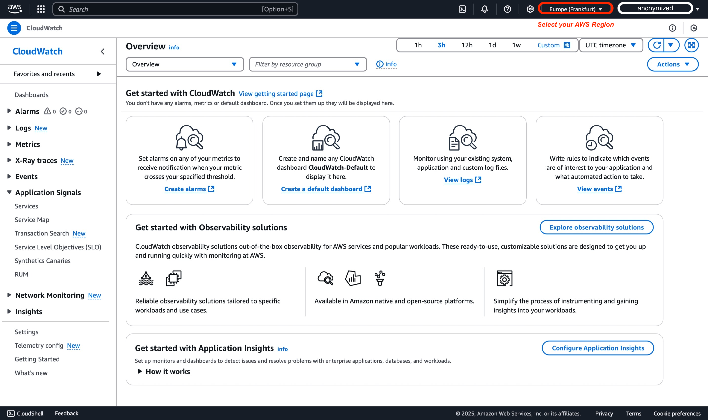
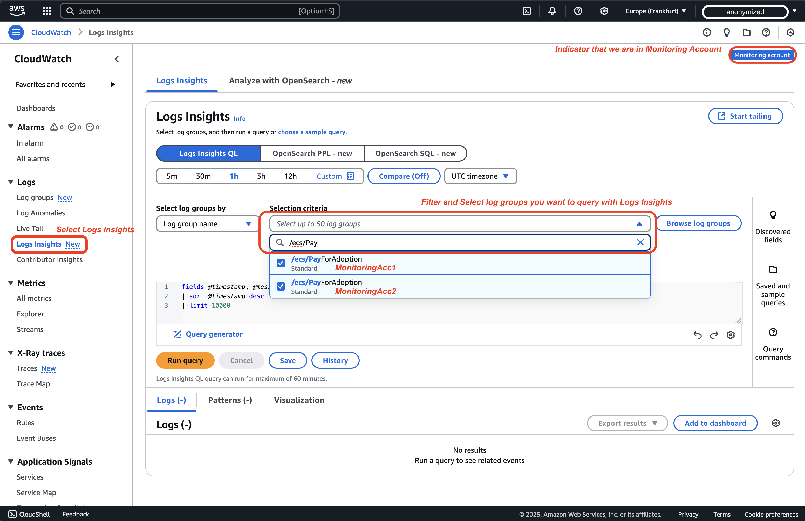
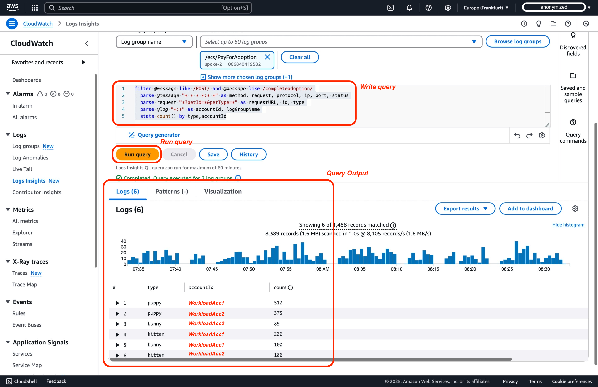
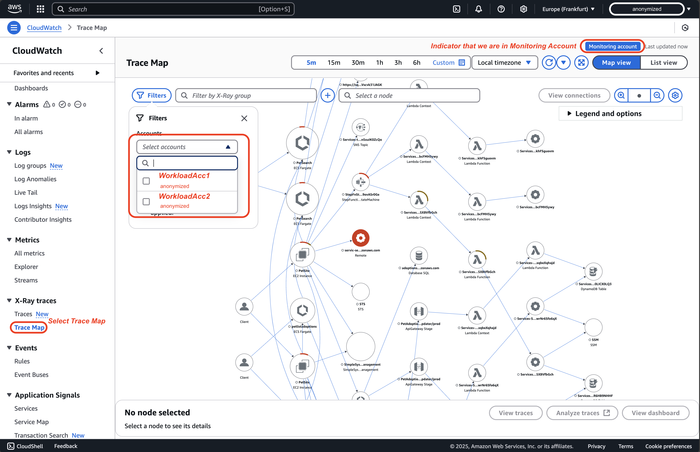
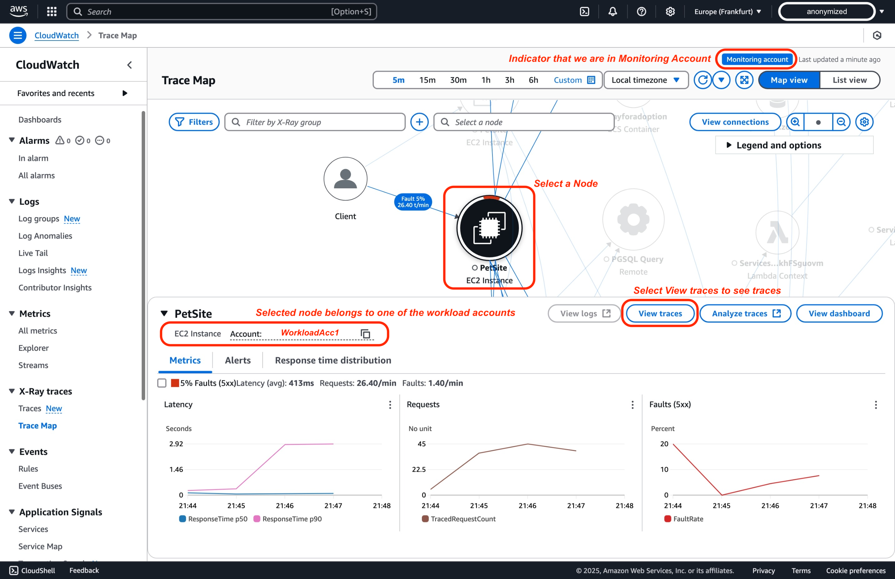

# CloudWatch Cross-Account Observability

La surveillance des applications déployées sur plusieurs comptes AWS au sein d'une même région AWS peut être complexe. [L'observabilité inter-comptes d'Amazon CloudWatch](https://aws.amazon.com/blogs/aws/new-amazon-cloudwatch-cross-account-observability/)[^1] simplifie ce processus en permettant une surveillance et un dépannage transparents des applications réparties sur plusieurs comptes au sein d'une [**région AWS**](https://docs.aws.amazon.com/AmazonCloudWatch/latest/monitoring/CloudWatch-Unified-Cross-Account.html)[^2]. Ce tutoriel fournit un guide étape par étape, accompagné de captures d'écran, sur la configuration de l'observabilité inter-comptes entre deux comptes AWS. De plus, il est important de noter que le déploiement peut également être réalisé via AWS Organizations pour une plus grande évolutivité.

## Terminologie

Pour une observabilité inter-comptes efficace avec Amazon CloudWatch, vous devez comprendre les termes clés suivants :

| **Terme** | **Description** |
|------|-------------|
| **Compte de surveillance** | Un compte AWS central qui peut visualiser et interagir avec les données d'observabilité générées par plusieurs comptes source |
| **Compte source** | Un compte AWS individuel qui génère des données d'observabilité pour les ressources qui y résident |
| **Sink** | Une ressource dans un compte de surveillance qui sert de point d'attache pour que les comptes source puissent se lier et partager leurs données d'observabilité. Chaque compte peut avoir un **Sink** par [région AWS](https://docs.aws.amazon.com/AmazonCloudWatch/latest/monitoring/CloudWatch-Unified-Cross-Account.html)[^2] |
| **Lien d'observabilité** | Une ressource qui représente la connexion établie entre un compte source et un compte de surveillance, facilitant le partage des données d'observabilité. Les liens sont gérés par le compte source. |

Comprenez ces définitions pour configurer et gérer avec succès l'observabilité inter-comptes dans Amazon CloudWatch.
## Points à considérer
1. Limites de compte : Vous pouvez lier jusqu'à 100 000 comptes source à un seul compte de surveillance, ce qui convient même aux configurations d'entreprise les plus importantes.
2. Inter-régions : La fonctionnalité inter-régions est intégrée automatiquement à cette fonctionnalité. Vous n'avez pas besoin de prendre de mesures supplémentaires pour pouvoir afficher des métriques de différentes régions dans un seul compte sur le même graphique ou le même tableau de bord.
3. Rétention des données : Toute la rétention des données est gérée au niveau du compte source. Le compte de surveillance ne stocke ni ne duplique les données. Le compte de surveillance a un accès en lecture seule aux données des comptes source. Il n'y a pas de transfert ou de synchronisation de données réels.
4. Implications financières : De manière surprenante, il n'y a pas de coûts supplémentaires associés à l'observabilité inter-comptes. Puisque les données restent dans les comptes source et ne sont que lues par le compte de surveillance, il n'y a pas de frais supplémentaires de transfert ou de stockage de données.
5. Lors de l'utilisation de l'observabilité inter-comptes pour partager des traces d'un compte source (X) avec un compte de surveillance (Y), les traces sont dupliquées et stockées dans le compte de surveillance (Y). Ce processus n'entraîne pas de coûts supplémentaires pour le compte source (X), garantissant que les capacités de surveillance peuvent être étendues entre les comptes sans impacter la facturation d'origine.
6. Selon les quotas de service CloudWatch, chaque tableau de bord peut contenir jusqu'à 500 widgets. Un widget unique peut contenir jusqu'à 500 métriques, et un tableau de bord unique peut contenir jusqu'à 2500 métriques sur l'ensemble des widgets. Ces quotas incluent toutes les métriques récupérées pour être utilisées dans des fonctions mathématiques de métriques, même si ces métriques ne sont pas affichées sur le graphique. Ces quotas sont des limites fixes et ne peuvent pas être modifiés.
7. Dans Amazon CloudWatch Logs Insights, vous pouvez interroger un maximum de 50 groupes de logs par requête si vous les spécifiez individuellement. Cette limite est fixe et ne peut pas être augmentée. Cependant, si vous utilisez des critères de groupe de logs — comme la sélection de groupes de logs basée sur des préfixes de noms ou l'option d'interroger « tous les groupes de logs » — vous pouvez inclure jusqu'à 10 000 groupes de logs dans une seule requête, permettant une analyse plus large des logs sur plusieurs groupes.
8. Lorsque vous travaillez avec les Logs et les Métriques dans CloudWatch Cross-Account Observability, vous pouvez choisir de partager les métriques de tous les espaces de noms avec le compte de surveillance, ou de filtrer un sous-ensemble d'espaces de noms.
9. Quelques considérations lors du travail avec les alarmes dans un scénario inter-comptes :
   1. CloudWatch Metrics Insights est un puissant moteur de requêtes SQL haute performance que vous pouvez utiliser pour interroger vos métriques à grande échelle, comme dans les scénarios d'observabilité inter-comptes où vous pourriez vouloir interroger des centaines de métriques provenant de plusieurs comptes.
    2. Lors de la configuration d'une alarme, elle doit provenir d'une requête qui retourne une seule série temporelle, ce qui peut être accompli par l'expression SELECT, cependant, vous ne pouvez utiliser que les statistiques SUM, MIN, MAX, COUNT et AVG.
    3. De plus, il est possible d'utiliser la clause « group by » pour regrouper les métriques en temps réel en séries temporelles distinctes par valeur de dimension spécifique. Il est également possible d'utiliser la capacité « order by » pour effectuer des requêtes de type « Top N ».
    4. Il est possible d'utiliser le langage naturel pour créer des requêtes. Pour ce faire, posez des questions ou décrivez les données que vous recherchez. Cette capacité assistée par l'IA génère une requête basée sur votre invite et fournit une explication ligne par ligne du fonctionnement de la requête.
    5. Vous ne pouvez pas créer une alarme basée sur l'expression SEARCH. C'est parce que les expressions de recherche retournent plusieurs séries temporelles, et une alarme basée sur une expression mathématique ne peut surveiller qu'une seule série temporelle. De plus, vous ne pouvez pas créer une alarme sur une expression mathématique (telle que « MAX ») contenant la fonction SEARCH. Ce scénario peut être accompli par les sources de données personnalisées CloudWatch.
    6. La fonctionnalité inter-régions n'est pas prise en charge pour les alarmes, vous ne pouvez donc pas créer une alarme dans une région qui surveille une métrique dans une région différente.

10. Politique de protection des données : Si la politique de protection des données est activée dans un compte source, le compte de surveillance ne pourra pas accéder aux données à moins que des autorisations explicites ne soient accordées.


## Tutoriel étape par étape via la console AWS

### Prérequis

1. Pour compléter ce tutoriel, vous avez besoin de trois comptes AWS : un compte de surveillance et deux comptes source.

2. Un utilisateur ou un rôle doit avoir au minimum les autorisations documentées dans le [guide de configuration inter-comptes AWS CloudWatch](https://docs.aws.amazon.com/AmazonCloudWatch/latest/monitoring/CloudWatch-Unified-Cross-Account-Setup.html#CloudWatch-Unified-Cross-Account-Setup-permissions)[^3] pour créer des liens inter-comptes entre un compte de surveillance et des comptes source.

<div style={{ textAlign: 'center' }}>

</div>

### Étape 1 : Configurer un compte de surveillance

#### Compte de surveillance

Pour configurer un compte de surveillance, suivez ces étapes :

1. Ouvrez la console CloudWatch à l'adresse [https://console.aws.amazon.com/cloudwatch](https://console.aws.amazon.com/cloudwatch) et sélectionnez la région AWS où vous allez configurer le compte de surveillance inter-comptes. Dans le cadre de cette démonstration, nous utiliserons la région Europe (Francfort) (eu-central-1).


2. Dans le volet de navigation, sélectionnez **Settings**.


3. Dans le cadre de cette démonstration, nous utiliserons les paramètres globaux du compte par défaut, puis sélectionnez **Configure** dans la section **Monitoring account configuration**.


4. Après avoir sélectionné les types de données à partager avec le compte de surveillance, collez les identifiants des comptes source dans la boîte « List source accounts ». Pour cette démonstration, les identifiants de WorkloadAcc1 et WorkloadAcc2 sont utilisés. Les métriques, les logs et les traces sont sélectionnés. Seuls les métriques et les logs permettent le filtrage ; tous les autres sont toujours entièrement partagés. Notez que pour ServiceLens et X-Ray, vous devez activer les métriques, les logs et les traces. Pour Application Insights, activez également les applications Application Insights. Pour Internet Monitor, activez les métriques, les logs et Internet Monitor – Monitors.


:::info
Lors de la configuration des types de télémétrie dans CloudWatch Cross-Account Observability, il est important de comprendre leurs dépendances. Alors que les métriques, les logs et les traces peuvent être configurés indépendamment, d'autres fonctionnalités CloudWatch ont des exigences spécifiques. La fonctionnalité ServiceLens et X-Ray nécessite les trois : métriques, logs et traces. Pour une surveillance plus avancée, Application Insights nécessite l'activation des métriques, des logs, des traces et des applications Application Insights. De même, Internet Monitor nécessite l'activation des métriques, des logs et d'Internet Monitor - Monitors. Le tableau suivant détaille ces dépendances :
:::
    | Type de télémétrie | Description | Dépendances pour CloudWatch Cross-Account Observability |
    |----------------|-------------|-----------------------------------------------------|
    | Métriques dans Amazon CloudWatch | Partager tous les espaces de noms de métriques ou filtrer un sous-ensemble | Aucune |
    | Groupes de logs dans Amazon CloudWatch Logs | Partager tous les groupes de logs ou filtrer un sous-ensemble | Aucune |
    | ServiceLens et X-Ray | Partager toutes les traces (pas de filtrage disponible) | Nécessite l'activation des métriques, des logs et des traces pour ServiceLens et X-Ray |
    | Applications dans Amazon CloudWatch Application Insights | Partager toutes les applications (pas de filtrage disponible) | Nécessite l'activation des métriques, des logs, des traces et des applications Application Insights |
    | Monitors dans CloudWatch Internet Monitor | Partager tous les monitors (pas de filtrage disponible) | Nécessite l'activation des métriques, des logs et d'Internet Monitor - Monitors |

5. Dans la console AWS de votre compte de surveillance, vous devriez voir l'illustration suivante, confirmant que le compte de surveillance a été configuré avec succès.


:::tip
	Après avoir configuré avec succès votre compte de surveillance, vous devez lier vos comptes source. Il existe deux méthodes principales pour lier les comptes source : utiliser AWS Organizations et lier des comptes individuels. À l'étape 2, nous passerons en revue le processus de configuration d'un compte individuel. Cependant, avant de vous connecter au compte source et d'effectuer des modifications, nous devons collecter des informations du compte de surveillance que nous venons de configurer, comme l'ARN du sink du compte de surveillance.
:::

6. Dans la console AWS où vous vous êtes arrêté précédemment dans le compte de surveillance, sélectionnez **Resources to link accounts**


7. Dans la console AWS, développez la section « Configuration details », c'est là que vous trouverez l'ARN du sink du compte de surveillance que vous devez copier et enregistrer quelque part. Cette information sera nécessaire à l'étape 2 lors de la liaison du compte source.


#### Résumé

Dans les étapes précédentes, nous avons configuré le sink du compte de surveillance pour être lié aux comptes source, qu'ils soient autonomes ou fassent partie d'une organisation. Essentiellement, les étapes ci-dessus ont créé une politique de configuration dans le sink du compte de surveillance qui permet aux comptes source de s'intégrer. Un exemple de politique générée via la configuration de la console AWS peut être trouvé ci-dessous :

```
{
    "Version": "2012-10-17",
    "Statement": [
        {
            "Effect": "Allow",
            "Principal": {
                "AWS": [
                    "${WorkloadAcc1}", // Workload Account
                    "${WorkloadAcc2}"  // Workload Account
                ]
            },
            "Action": [
                "oam:CreateLink",
                "oam:UpdateLink"
            ],
            "Resource": "*",
            "Condition": {
                "ForAllValues:StringEquals": {
                    "oam:ResourceTypes": [
                        "AWS::Logs::LogGroup",
                        "AWS::CloudWatch::Metric",
                        "AWS::XRay::Trace"
                    ]
                }
            }
        }
    ]
}
```

Si vous deviez configurer en utilisant AWS Organizations, vous obtiendriez une politique de configuration appliquée au sink du compte de surveillance qui ne nécessite pas de modifications supplémentaires, car vous feriez confiance à tous les comptes AWS au sein de votre organisation AWS pour créer ou mettre à jour des liens basés sur la condition PrincipalOrgID. Un exemple de telle politique peut être trouvé ci-dessous :

```
{
    "Version": "2012-10-17",
    "Statement": [
        {
            "Effect": "Allow",
            "Principal": "*",
            "Action": ["oam:CreateLink", "oam:UpdateLink"],
            "Resource": "*",
            "Condition": {
                "ForAllValues:StringEquals": {
                    "oam:ResourceTypes": [
                        "AWS::Logs::LogGroup",
                        "AWS::CloudWatch::Metric",
                        "AWS::XRay::Trace",
                        "AWS::ApplicationInsights::Application",
                        "AWS::InternetMonitor::Monitor"
                    ]
                },
                "ForAnyValue:StringEquals": {
                    "aws:PrincipalOrgID": "${OrganizationId}" // AWS Organization as Condition
                }
            }
        }
    ]
}
```


### Étape 2 : Lier les comptes source

#### Liaison de comptes individuels

Après avoir configuré le compte de surveillance à l'étape 1, nous allons maintenant configurer un compte source AWS individuel. Cette approche est particulièrement utile lorsque vous travaillez avec des comptes en dehors de votre organisation ou lorsque vous devez établir une surveillance pour des comptes autonomes spécifiques. Bien qu'AWS Organizations offre une solution évolutive pour la gestion de plusieurs comptes, la configuration de comptes individuels offre un contrôle et une flexibilité plus granulaires.

Avant de procéder à la configuration du compte source, assurez-vous d'avoir copié l'ARN du sink du compte de surveillance que nous avons obtenu à l'étape 1, car il sera nécessaire pour établir la connexion.

Pour lier des comptes source individuels, suivez ces étapes :

1. Ouvrez la console CloudWatch à l'adresse [https://console.aws.amazon.com/cloudwatch](https://console.aws.amazon.com/cloudwatch) et sélectionnez la région AWS où vous allez configurer le compte de surveillance inter-comptes. Dans le cadre de cette démonstration, nous utiliserons la région Europe (Francfort) (eu-central-1).


2. Dans le volet de navigation, sélectionnez **Settings**.


3. Dans le cadre de cette démonstration, nous resterons dans la configuration par défaut des paramètres globaux du compte, puis sélectionnez **Configure** dans la section **Source account configuration**.


4. Dans la console AWS, nous sélectionnerons les logs, les métriques et les traces comme types de données. Par défaut, tous seront partagés ; cependant, vous pouvez choisir d'être plus granulaire en filtrant les logs et les métriques que vous souhaitez partager avec le compte de surveillance. L'étape suivante avant la liaison consiste à entrer l'ARN du sink du compte de surveillance que nous avons copié précédemment, lors de la configuration du compte de surveillance.


5. La dernière étape avant de finaliser la configuration du compte source est de confirmer que les données du compte source seront partagées avec le compte de surveillance. Vous confirmerez cette action en tapant « Confirm » dans la boîte de dialogue.


6. Dans la console AWS, sous la section « Source account configuration », vous devriez voir un statut vert indiquant que le compte est « linked ».


:::tip
    Répétez l'étape 2 pour WorkloadAcc2, afin que la télémétrie d'observabilité des deux comptes de charge de travail soit partagée avec le compte de surveillance.
:::

### Étape 3 : Valider la configuration

:::tip
    Assurez-vous d'être connecté au compte de surveillance.
:::

1. Ouvrez la console CloudWatch à l'adresse [https://console.aws.amazon.com/cloudwatch](https://console.aws.amazon.com/cloudwatch) et sélectionnez la région AWS où vous avez configuré la surveillance inter-comptes à l'étape 1. Dans le cadre de cette démonstration, nous utilisons la région Europe (Francfort) (eu-central-1).


2. Dans le volet de navigation, sélectionnez **Settings**.


3. Sélectionnez **Manage monitoring account** dans la section **Monitoring account configuration**.


4. Dans le volet « Linked source accounts », au sein de la page des configurations du compte de surveillance, vous verrez deux comptes de charge de travail liés en tant que **comptes source**.


#### Alternative : Intégration avec AWS Organizations

L'observabilité inter-comptes AWS CloudWatch permet une surveillance et un dépannage centralisés des applications réparties sur plusieurs comptes AWS au sein d'une région. En intégrant AWS Organizations, vous pouvez rationaliser la configuration et automatiser les configurations sur tous les comptes. Cette approche gère efficacement la surveillance sur de nombreux comptes au sein de votre organisation.

##### Prérequis :

- AWS Organizations activé, avec les comptes membres correctement inclus[^4].
- Autorisations pour déployer des AWS CloudFormation StackSets[^5] dans les comptes enfants, y compris les rôles IAM avec les actions CloudFormation adéquates autorisées pour créer des liens[^3].
- Un compte de surveillance avec une configuration qui permet aux comptes source au sein de votre organisation (ou d'unités organisationnelles spécifiques) de créer et de mettre à jour des liens d'observabilité[^6].

AWS CloudFormation StackSets automatise le déploiement des rôles liés au service et des configurations d'observabilité nécessaires dans tous les comptes membres. Avec le déploiement automatique activé, les comptes AWS nouvellement créés héritent automatiquement des paramètres d'observabilité requis, réduisant la charge administrative tout en maintenant des pratiques de surveillance uniformes dans l'ensemble de votre environnement AWS.

Pour un guide d'implémentation étape par étape, incluant les autorisations IAM, les modèles StackSet d'exemple et les politiques de surveillance, consultez la documentation officielle AWS[^7].

## Tutoriel vidéo

Pour une présentation détaillée de la configuration de l'observabilité inter-comptes, vous pouvez également regarder le guide officiel YouTube d'AWS, « Enable Cross-Account Observability in Amazon CloudWatch | Amazon Web Services ». Ce tutoriel démontre visuellement comment configurer un compte de surveillance centralisé, lier plusieurs comptes source et explorer les données d'observabilité partagées dans la console CloudWatch.

<!-- blank line -->
<figure class="video_container">
  <iframe width="560" height="315" src="https://www.youtube.com/embed/lUaDO9dqISc?si=mPewnqzWBqBZKmyg" title="YouTube video player" frameborder="0" allow="accelerometer; autoplay; clipboard-write; encrypted-media; gyroscope; picture-in-picture; web-share" referrerpolicy="strict-origin-when-cross-origin" allowfullscreen></iframe>
</figure>
<!-- blank line -->

## Interrogation des données de télémétrie inter-comptes

:::tip
    Assurez-vous d'être connecté au compte de surveillance.
:::

:::info
    Nous réutilisons l'application Pet Adoption de l'[Observability One Workshop](https://catalog.workshops.aws/observability/en-US/architecture)[^8]. Pour cette démonstration, elle est déployée dans les deux comptes de charge de travail pour illustrer l'observabilité inter-comptes.
:::

### Métriques

Pour surveiller les métriques de plusieurs comptes dans un emplacement centralisé :

1. Dans la console CloudWatch de votre compte de surveillance, naviguez vers « All Metrics » dans le volet de navigation de gauche. Vous pouvez maintenant visualiser les métriques de tous les comptes source liés.


2. Vous pouvez utiliser le filtre Account Id `:aws.AccountId=` pour filtrer les métriques d'un compte spécifique, ou vous pouvez explorer en sélectionnant les espaces de noms et les dimensions. Dans le cadre de cette démonstration, suivons le guide de [View Metrics dans l'Observability One Workshop](https://catalog.workshops.aws/observability/en-US/aws-native/metrics/viewmetrics)[^8]. Nous allons maintenant choisir l'espace de noms ContainerInsights et sélectionner les dimensions ClusterName, Namespace et PodName. Ensuite, nous filtrerons par le nom de métrique pod_cpu_utilization. Comme vous pouvez le voir, vous avez des métriques des deux comptes de charge de travail que vous pouvez représenter graphiquement.


#### Alarmes

Les [alarmes inter-comptes Amazon CloudWatch](https://aws.amazon.com/about-aws/whats-new/2021/08/announcing-amazon-cloudwatch-cross-account-alarms/)[^9] vous permettent de surveiller les métriques sur plusieurs comptes AWS depuis un compte de surveillance central. Vous pouvez créer des alarmes de métriques, qui surveillent une seule métrique ou le résultat d'une expression mathématique, et des alarmes composites, qui évaluent les états de plusieurs alarmes (y compris d'autres alarmes composites). Par exemple, vous pourriez configurer une alarme pour se déclencher lorsque l'utilisation du CPU dépasse 80 % sur tous les comptes de production. Une fois déclenchée, l'alarme peut effectuer des actions telles que l'envoi de notifications Amazon SNS ou l'invocation de fonctions AWS Lambda, vous assurant de recevoir des alertes en temps opportun et de pouvoir réagir de manière proactive. En centralisant la création d'alarmes dans le compte de surveillance, vous rationalisez les alertes et obtenez une vue opérationnelle unifiée de vos charges de travail.

En continuant depuis l'étape précédente dans [Métriques](#métriques), vous pouvez créer une alarme pour une métrique spécifique en sélectionnant « Graphed metrics » puis en choisissant « Create Alarm ».


### Logs

Vous pouvez interroger et analyser les logs de plusieurs comptes dans une interface unique en utilisant Logs Insights, ou vous pouvez suivre les logs en temps réel (live tail). Voici comment interroger les logs en utilisant Logs Insights sur plusieurs comptes :

1. Dans la console CloudWatch, allez dans « Logs Insights » et sélectionnez les groupes de logs de différents comptes en utilisant le sélecteur de groupes de logs.


2. L'étape suivante consiste à écrire votre requête CloudWatch Logs Insights. Dans le cadre de cette démonstration, nous prendrons et modifierons légèrement la requête du [One Observability Workshop](https://catalog.workshops.aws/observability/en-US/aws-native/logs/logsinsights/fields#step-4:-aggregate-on-our-chosen-fields)[^8], de la section AWS native Observability, sous-section Logs insight. Nous voulons voir au cours des dernières heures combien de différents animaux ont été adoptés et combien par compte de charge de travail.

    ```
    filter @message like /POST/ and @message like /completeadoption/
    | parse @message "* * * *:* *" as method, request, protocol, ip, port, status
    | parse request "*?petId=*&petType=*" as requestURL, id, type
    | parse @log "*:*" as accountId, logGroupName // Modified to parse accountId from @log information
    | stats count() by type,accountId // Modified to group by previously parsed accountId
    ```

    

Voici comment suivre les logs en temps réel (Live Tail) sur plusieurs comptes :

1. Dans la console CloudWatch, allez dans **Live Tail** et dans le volet Filtre, puis **sélectionnez les groupes de logs** de différents comptes en utilisant le sélecteur de groupes de logs, puis sélectionnez Start.


### Traces

1. Dans la console CloudWatch de votre compte de surveillance, choisissez Trace map sous X-Ray traces dans le volet de navigation. La carte des traces affiche les données de tous les comptes source liés. Utilisez le filtre pour les comptes si nécessaire.


2. Sur la carte des traces, chaque noeud indique à quel compte AWS il appartient. Choisissez View traces pour une analyse plus approfondie d'un span spécifique.


3. Sélectionnez une trace spécifique pour des informations plus détaillées sur les segments individuels.


4. Plongez plus profondément dans les spans de trace de bout en bout pour en apprendre davantage sur les composants de chaque chemin tracé.


## Conclusion

La configuration de l'observabilité inter-comptes dans Amazon CloudWatch fournit une vue centralisée des performances et de la santé de vos applications sur plusieurs comptes AWS. Cela simplifie la surveillance, le dépannage et l'analyse de vos applications, quel que soit le compte dans lequel elles résident. En suivant les étapes décrites dans ce tutoriel, vous pouvez efficacement configurer un compte de surveillance, lier vos comptes source en utilisant soit AWS Organizations soit la liaison de comptes individuels, et vérifier votre configuration. Vous pouvez désormais exploiter la console CloudWatch pour surveiller et dépanner les applications qui s'étendent sur plusieurs comptes.

Pour améliorer davantage vos capacités de surveillance inter-comptes, explorez les différentes fonctionnalités CloudWatch telles que les tableaux de bord, les alarmes et les logs. Ces fonctionnalités fournissent des informations plus approfondies sur les performances et la santé de vos applications, vous permettant d'identifier et de résoudre proactivement les problèmes potentiels.

## Ressources

[^1]: [Blog AWS - Amazon CloudWatch Cross-Account Observability](https://aws.amazon.com/blogs/aws/new-amazon-cloudwatch-cross-account-observability/)

[^2]: [CloudWatch cross-account observability](https://docs.aws.amazon.com/AmazonCloudWatch/latest/monitoring/CloudWatch-Unified-Cross-Account.html)

[^3]: [Autorisations nécessaires pour créer des liens](https://docs.aws.amazon.com/AmazonCloudWatch/latest/monitoring/CloudWatch-Unified-Cross-Account-Setup.html#CloudWatch-Unified-Cross-Account-Setup-permissions)

[^4]: [Qu'est-ce qu'AWS Organizations ?](https://docs.aws.amazon.com/organizations/latest/userguide/orgs_introduction.html)

[^5]: [AWS CloudFormation StackSets et AWS Organizations](https://docs.aws.amazon.com/organizations/latest/userguide/services-that-can-integrate-cloudformation.html)

[^6]: [Configurer un compte de surveillance](https://docs.aws.amazon.com/AmazonCloudWatch/latest/monitoring/CloudWatch-Unified-Cross-Account-Setup.html#Unified-Cross-Account-Setup-ConfigureMonitoringAccount)

[^7]: [Utiliser un modèle AWS CloudFormation pour configurer tous les comptes d'une organisation ou d'une unité organisationnelle en tant que comptes source](https://docs.aws.amazon.com/AmazonCloudWatch/latest/monitoring/CloudWatch-Unified-Cross-Account-Setup.html#Unified-Cross-Account-SetupSource-OrgTemplate)

[^8]: [One Observability Workshop](https://catalog.workshops.aws/observability/en-US/intro)

[^9]: [Alarmes inter-comptes Amazon CloudWatch](https://aws.amazon.com/about-aws/whats-new/2021/08/announcing-amazon-cloudwatch-cross-account-alarms/)
