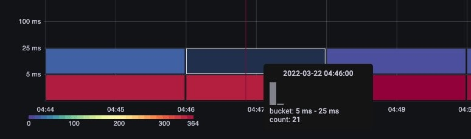
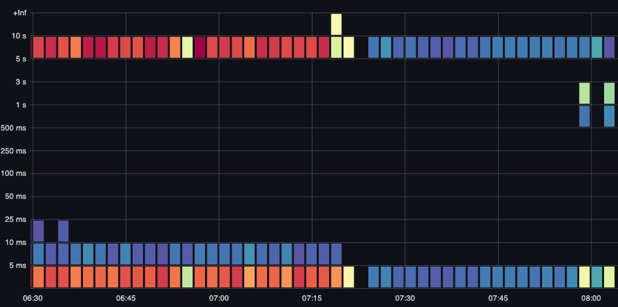

# Surveillance du serveur API Amazon EKS

Dans cette section du guide des meilleures pratiques d'Observability, nous allons approfondir les sujets suivants lies a la surveillance du serveur API :

* Introduction a la surveillance du serveur API Amazon EKS
* Configuration d'un tableau de bord de depannage du serveur API
* Utilisation du tableau de bord de depannage API pour comprendre les problemes du serveur API
* Comprendre les appels list non bornes au serveur API
* Arreter les mauvais comportements envers le serveur API
* API Priority and Fairness
* Identification des appels API les plus lents et des problemes de latence du serveur API

### Introduction

La surveillance de votre plan de controle gere Amazon EKS est une activite operationnelle Day 2 tres importante pour identifier de maniere proactive les problemes de sante de votre cluster EKS. La surveillance du plan de controle Amazon EKS vous aide a prendre des mesures proactives basees sur les metriques collectees. Ces metriques nous aideraient a resoudre les problemes des serveurs API et a identifier precisement le probleme sous-jacent.

Nous utiliserons Amazon Managed Service for Prometheus (AMP) pour notre demonstration dans cette section pour la surveillance du serveur API Amazon EKS et Amazon Managed Grafana (AMG) pour la visualisation des metriques. Prometheus est un outil de surveillance open source populaire qui offre des fonctionnalites d'interrogation puissantes et un large support pour une variete de charges de travail. Amazon Managed Service for Prometheus est un service entierement gere compatible avec Prometheus qui facilite la surveillance des environnements, tels qu'Amazon EKS, [Amazon Elastic Container Service (Amazon ECS)](http://aws.amazon.com/ecs) et [Amazon Elastic Compute Cloud (Amazon EC2)](http://aws.amazon.com/ec2), de maniere securisee et fiable. [Amazon Managed Grafana](https://aws.amazon.com/grafana/) est un service de visualisation de donnees entierement gere et securise pour Grafana open source qui permet aux clients d'interroger, de correler et de visualiser instantanement les metriques operationnelles, les journaux et les traces de leurs applications a partir de multiples sources de donnees.

Nous allons d'abord configurer un tableau de bord de demarrage en utilisant Amazon Managed Service for Prometheus et Amazon Managed Grafana pour vous aider a depanner les serveurs API d'[Amazon Elastic Kubernetes Service (Amazon EKS)](https://aws.amazon.com/eks) avec Prometheus. Nous approfondirons dans les sections suivantes la comprehension des problemes lors du depannage des serveurs API EKS, l'API Priority and Fairness et l'arret des mauvais comportements. Enfin, nous approfondirons l'identification des appels API les plus lents et les problemes de latence du serveur API qui nous aident a prendre des mesures pour maintenir l'etat de notre cluster Amazon EKS en bonne sante.

### Configuration d'un tableau de bord de depannage du serveur API

Nous allons configurer un tableau de bord de demarrage pour vous aider a depanner les serveurs API d'[Amazon Elastic Kubernetes Service (Amazon EKS)](https://aws.amazon.com/eks) avec AMP. Nous utiliserons cela pour vous aider a comprendre les metriques lors du depannage de vos clusters EKS de production. Nous nous concentrerons davantage sur les metriques collectees pour comprendre leur importance lors du depannage de vos clusters Amazon EKS.

Premierement, configurez un [collecteur ADOT pour collecter les metriques de votre cluster Amazon EKS vers Amazon Managed Service for Prometheus](https://aws.amazon.com/blogs/containers/metrics-and-traces-collection-using-amazon-eks-add-ons-for-aws-distro-for-opentelemetry/). Dans cette configuration, vous utiliserez l'add-on EKS ADOT qui permet aux utilisateurs d'activer ADOT en tant qu'add-on a tout moment apres que le cluster EKS soit en fonctionnement. L'add-on ADOT inclut les derniers correctifs de securite et corrections de bugs et est valide par AWS pour fonctionner avec Amazon EKS. Cette configuration vous montrera comment installer l'add-on ADOT dans un cluster EKS puis l'utiliser pour collecter les metriques de votre cluster.

Ensuite, [configurez votre espace de travail Amazon Managed Grafana pour visualiser les metriques en utilisant AMP](https://aws.amazon.com/blogs/mt/amazon-managed-grafana-getting-started/) comme source de donnees que vous avez configuree dans la premiere etape. Enfin, telechargez le [tableau de bord de depannage API](https://github.com/RiskyAdventure/Troubleshooting-Dashboards/blob/main/api-troubleshooter.json), naviguez vers Amazon Managed Grafana pour telecharger le JSON du tableau de bord de depannage API afin de visualiser les metriques pour un depannage plus approfondi.

### Utilisation du tableau de bord de depannage API pour comprendre les problemes

Disons que vous avez trouve un projet open source interessant que vous souhaitiez installer dans votre cluster. Cet operateur deploie un DaemonSet sur votre cluster qui pourrait utiliser des requetes malformees, un volume inutilement eleve d'appels LIST, ou peut-etre que chacun de ses DaemonSets sur vos 1 000 noeuds demande le statut de tous les 50 000 pods de votre cluster chaque minute !
Cela arrive-t-il vraiment souvent ? Oui ! Faisons un rapide detour sur la facon dont cela se produit.

#### Comprendre LIST vs. WATCH

Certaines applications ont besoin de comprendre l'etat des objets dans votre cluster. Par exemple, votre application de machine learning (ML) veut connaitre le statut du job en comprenant combien de pods ne sont pas au statut *Completed*. Dans Kubernetes, il existe des manieres bien comportees de le faire avec quelque chose appele un WATCH, et des manieres moins bien comportees qui listent chaque objet du cluster pour trouver le dernier statut de ces pods.

#### Un WATCH bien comporte

Utiliser un WATCH ou une connexion unique de longue duree pour recevoir des mises a jour via un modele push est la maniere la plus evolutive de faire des mises a jour dans Kubernetes. Pour simplifier, nous demandons l'etat complet du systeme, puis ne mettons a jour l'objet dans un cache que lorsque des changements sont recus pour cet objet, en executant periodiquement une re-synchronisation pour s'assurer qu'aucune mise a jour n'a ete manquee.

Dans l'image ci-dessous, nous utilisons `apiserver_longrunning_gauge` pour avoir une idee du nombre de ces connexions de longue duree a travers les deux serveurs API.

*Figure : Metrique `apiserver_longrunning_gauge`*

Meme avec ce systeme efficace, nous pouvons toujours en avoir trop. Par exemple, si nous utilisons de nombreux tres petits noeuds, chacun utilisant deux DaemonSets ou plus qui ont besoin de communiquer avec le serveur API, il est assez facile d'augmenter considerablement le nombre d'appels WATCH sur le systeme inutilement. Par exemple, regardons la difference entre huit noeuds xlarge vs. un seul 8xlarge. Ici nous voyons une augmentation de 8x des appels WATCH sur le systeme.

*Figure : Appels WATCH entre 8 noeuds xlarge.*

Maintenant ce sont des appels efficaces, mais que se passerait-il si a la place ils etaient les appels mal comportes auxquels nous avons fait allusion precedemment ? Imaginez si l'un des DaemonSets ci-dessus sur chacun des 1 000 noeuds demande des mises a jour sur chacun des 50 000 pods totaux du cluster. Nous explorerons cette idee d'un appel list non borne dans la section suivante.

Un mot de prudence avant de continuer, le type de consolidation dans l'exemple ci-dessus doit etre fait avec beaucoup de soin, et a de nombreux autres facteurs a considerer. Tout, depuis le delai du nombre de threads en competition pour un nombre limite de CPUs sur le systeme, le taux de rotation des pods, jusqu'au nombre maximum d'attachements de volumes qu'un noeud peut gerer en toute securite. Cependant, notre attention se portera sur les metriques qui nous menent a des etapes actionnables pouvant prevenir les problemes -- et peut-etre nous donner un nouvel apercu de nos conceptions.

La metrique WATCH est simple, mais elle peut etre utilisee pour suivre et reduire le nombre de watches, si c'est un probleme pour vous. Voici quelques options que vous pourriez envisager pour reduire ce nombre :

* Limiter le nombre de ConfigMaps que Helm cree pour suivre l'historique
* Utiliser des ConfigMaps et Secrets immuables qui n'utilisent pas de WATCH
* Dimensionnement et consolidation raisonnables des noeuds

### Comprendre les appels list non bornes au serveur API

Maintenant pour l'appel LIST dont nous avons parle. Un appel list tire l'historique complet de nos objets Kubernetes a chaque fois que nous avons besoin de comprendre l'etat d'un objet, rien n'est sauvegarde dans un cache cette fois-ci.

Quel est l'impact de tout cela ? Cela variera en fonction du nombre d'agents qui demandent des donnees, de la frequence a laquelle ils le font et de la quantite de donnees qu'ils demandent. Demandent-ils tout sur le cluster, ou juste un seul namespace ? Cela se produit-il chaque minute, sur chaque noeud ? Utilisons un exemple d'un agent de journalisation qui ajoute des metadonnees Kubernetes a chaque journal envoye depuis un noeud. Cela pourrait etre une quantite ecrasante de donnees dans les clusters plus grands. Il existe de nombreuses facons pour l'agent d'obtenir ces donnees via un appel list, alors examinons-en quelques-unes.

La requete ci-dessous demande les pods d'un namespace specifique.

`/api/v1/namespaces/my-namespace/pods`

Ensuite, nous demandons les 50 000 pods du cluster, mais par lots de 500 pods a la fois.

`/api/v1/pods?limit=500`

L'appel suivant est le plus perturbateur. Recuperer les 50 000 pods de l'ensemble du cluster en meme temps.

`/api/v1/pods`

Cela arrive assez couramment sur le terrain et peut etre vu dans les journaux.

### Arreter les mauvais comportements envers le serveur API

Comment pouvons-nous proteger notre cluster de ces mauvais comportements ? Avant Kubernetes 1.20, le serveur API se protegeait en limitant le nombre de requetes *inflight* traitees par seconde. Puisque etcd ne peut gerer qu'un certain nombre de requetes a la fois de maniere performante, nous devons nous assurer que le nombre de requetes est limite a une valeur par seconde qui maintient les lectures et ecritures etcd dans une bande de latence raisonnable. Malheureusement, au moment de la redaction, il n'existe pas de moyen dynamique de le faire.

Dans le graphique ci-dessous, nous voyons une ventilation des requetes de lecture, qui a un maximum par defaut de 400 requetes inflight par serveur API et un maximum par defaut de 200 requetes d'ecriture concurrentes. Dans un cluster EKS par defaut, vous verrez deux serveurs API pour un total de 800 lectures et 400 ecritures. Cependant, la prudence est de mise car ces serveurs peuvent avoir des charges asymetriques a differents moments, comme juste apres une mise a niveau, etc.

*Figure : Graphique Grafana avec ventilation des requetes de lecture.*

Il s'avere que le schema ci-dessus n'etait pas parfait. Par exemple, comment pourrions-nous empecher ce nouvel operateur mal comporte que nous venons d'installer de prendre toutes les requetes d'ecriture inflight sur le serveur API et potentiellement de retarder des requetes importantes telles que les messages keepalive des noeuds ?

### API Priority and Fairness

Au lieu de s'inquieter du nombre de requetes lecture/ecriture ouvertes par seconde, que se passerait-il si nous traitions la capacite comme un nombre total unique, et que chaque application sur le cluster obtenait un pourcentage ou une part equitable de ce nombre maximum total ?

Pour faire cela efficacement, nous aurions besoin d'identifier qui a envoye la requete au serveur API, puis donner a cette requete une sorte d'etiquette de nom. Avec cette nouvelle etiquette de nom, nous pourrions alors voir que toutes ces requetes proviennent d'un nouvel agent que nous appellerons "Bavard." Maintenant nous pouvons regrouper toutes les requetes de Bavard dans quelque chose appele un *flow*, qui identifie que ces requetes proviennent du meme DaemonSet. Ce concept nous donne maintenant la capacite de restreindre ce mauvais agent et de s'assurer qu'il ne consomme pas l'ensemble du cluster.

Cependant, toutes les requetes ne sont pas creees egales. Le trafic du plan de controle necessaire pour maintenir le cluster operationnel devrait etre d'une priorite plus elevee que notre nouvel operateur. C'est la que l'idee des niveaux de priorite entre en jeu. Et si, par defaut, nous avions plusieurs "seaux" ou files d'attente pour le trafic de priorite critique, haute et basse ? Nous ne voulons pas que le flow de l'agent bavard obtienne une part equitable du trafic dans la file d'attente du trafic critique. Nous pouvons cependant mettre ce trafic dans une file d'attente de basse priorite de sorte que ce flow soit en competition avec peut-etre d'autres agents bavards. Nous voudrions alors nous assurer que chaque niveau de priorite ait le bon nombre de parts ou pourcentage du maximum global que le serveur API peut gerer pour garantir que les requetes ne soient pas trop retardees.

#### Priority and Fairness en action

Puisque c'est une fonctionnalite relativement nouvelle, de nombreux tableaux de bord existants utiliseront l'ancien modele de maximum de lectures inflight et maximum d'ecritures inflight. Pourquoi cela peut-il etre problematique ?

Et si nous donnions des etiquettes de haute priorite a tout dans le namespace kube-system, mais que nous installions ensuite ce mauvais agent dans ce namespace important, ou meme simplement deployions trop d'applications dans ce namespace ? Nous pourrions finir par avoir le meme probleme que nous essayions d'eviter ! Il est donc preferable de garder un oeil attentif sur de telles situations.

J'ai isole pour vous certaines des metriques que je trouve les plus interessantes pour suivre ces types de problemes.

* Quel pourcentage des parts d'un groupe de priorite est utilise ?
* Quel est le temps le plus long qu'une requete a attendu dans une file d'attente ?
* Quel flow utilise le plus de parts ?
* Y a-t-il des retards inattendus sur le systeme ?

#### Pourcentage en utilisation

Ici nous voyons les differents groupes de priorite par defaut sur le cluster et quel pourcentage du maximum est utilise.

*Figure : Groupes de priorite sur le cluster.*

#### Temps de la requete dans la file d'attente

Combien de temps en secondes la requete a reste dans la file de priorite avant d'etre traitee.

*Figure : Temps de la requete dans la file de priorite.*

#### Requetes les plus executees par flow

Quel flow prend le plus de parts ?

*Figure : Requetes les plus executees par flow.*

#### Temps d'execution des requetes

Y a-t-il des retards inattendus dans le traitement ?

*Figure : Temps d'execution des requetes de controle de flux.*

### Identification des appels API les plus lents et des problemes de latence du serveur API

Maintenant que nous comprenons la nature des choses qui causent la latence de l'API, nous pouvons prendre du recul et regarder la vue d'ensemble. Il est important de se rappeler que nos conceptions de tableaux de bord essaient simplement d'obtenir un apercu rapide s'il y a un probleme que nous devrions investiguer. Pour une analyse detaillee, nous utiliserions des requetes ad-hoc avec PromQL -- ou mieux encore, des requetes de journaux.

Quelles sont quelques idees pour les metriques de haut niveau que nous voudrions examiner ?

* Quel appel API prend le plus de temps a se terminer ?
    * Que fait l'appel ? (Lister des objets, les supprimer, etc.)
    * Sur quels objets essaie-t-il d'effectuer cette operation ? (Pods, Secrets, ConfigMaps, etc.)
* Y a-t-il un probleme de latence sur le serveur API lui-meme ?
    * Y a-t-il un retard dans une de mes files de priorite causant un engorgement des requetes ?
* Est-ce que cela semble juste que le serveur API est lent parce que le serveur etcd connait de la latence ?

#### Appel API le plus lent

Dans le graphique ci-dessous, nous cherchons les appels API qui ont pris le plus de temps a se terminer pour cette periode. Dans ce cas, nous voyons qu'une definition de ressource personnalisee (CRD) appelle une fonction LIST qui est l'appel le plus latent pendant la plage horaire de 05:40. Armes de ces donnees, nous pouvons utiliser CloudWatch Insights pour extraire les requetes LIST du journal d'audit dans cette plage horaire pour voir quelle application cela pourrait etre.

*Figure : Top 5 des appels API les plus lents.*

#### Duree des requetes API

Ce graphique de latence API nous aide a comprendre si des requetes approchent la valeur de timeout d'une minute. J'apprecie le format histogramme dans le temps ci-dessous car je peux voir les valeurs aberrantes dans les donnees qu'un graphique en ligne cacherait.

*Figure : Carte thermique de la duree des requetes API.*

Simplement survoler un bucket nous montre le nombre exact d'appels qui ont pris environ 25 millisecondes.
[Image: Image.jpg]*Figure : Appels de plus de 25 millisecondes.*

Ce concept est important lorsque nous travaillons avec d'autres systemes qui mettent en cache les requetes. Les requetes en cache seront rapides ; nous ne voulons pas fusionner ces latences de requetes avec des requetes plus lentes. Ici nous pouvons voir deux bandes distinctes de latence, les requetes qui ont ete mises en cache et celles qui ne l'ont pas ete.

*Figure : Latence, requetes en cache.*

#### Duree des requetes ETCD

La latence ETCD est l'un des facteurs les plus importants dans la performance de Kubernetes. Amazon EKS vous permet de voir cette performance du point de vue du serveur API en examinant la metrique `request_duration_seconds_bucket`.

*Figure : Metrique `request_duration_seconds_bucket`.*

Nous pouvons maintenant commencer a assembler les choses que nous avons apprises en voyant si certains evenements sont correles. Dans le graphique ci-dessous, nous voyons la latence du serveur API, mais nous voyons aussi qu'une grande partie de cette latence provient du serveur etcd. Pouvoir rapidement se diriger vers la bonne zone de probleme d'un simple coup d'oeil est ce qui rend un tableau de bord puissant.

*Figure : Requetes Etcd*

## Conclusion

Dans cette section du guide des meilleures pratiques d'Observability, nous avons utilise un [tableau de bord de demarrage](https://github.com/RiskyAdventure/Troubleshooting-Dashboards/blob/main/api-troubleshooter.json) en utilisant Amazon Managed Service for Prometheus et Amazon Managed Grafana pour vous aider a depanner les serveurs API d'[Amazon Elastic Kubernetes Service (Amazon EKS)](https://aws.amazon.com/eks). De plus, nous avons approfondi la comprehension des problemes lors du depannage des serveurs API EKS, l'API Priority and Fairness et l'arret des mauvais comportements. Enfin, nous avons approfondi l'identification des appels API les plus lents et les problemes de latence du serveur API qui nous aident a prendre des mesures pour maintenir l'etat de notre cluster Amazon EKS en bonne sante. Pour approfondir davantage, nous vous recommandons fortement de pratiquer le module Application Monitoring dans la categorie Observability native AWS du [One Observability Workshop](https://catalog.workshops.aws/observability/en-US).
