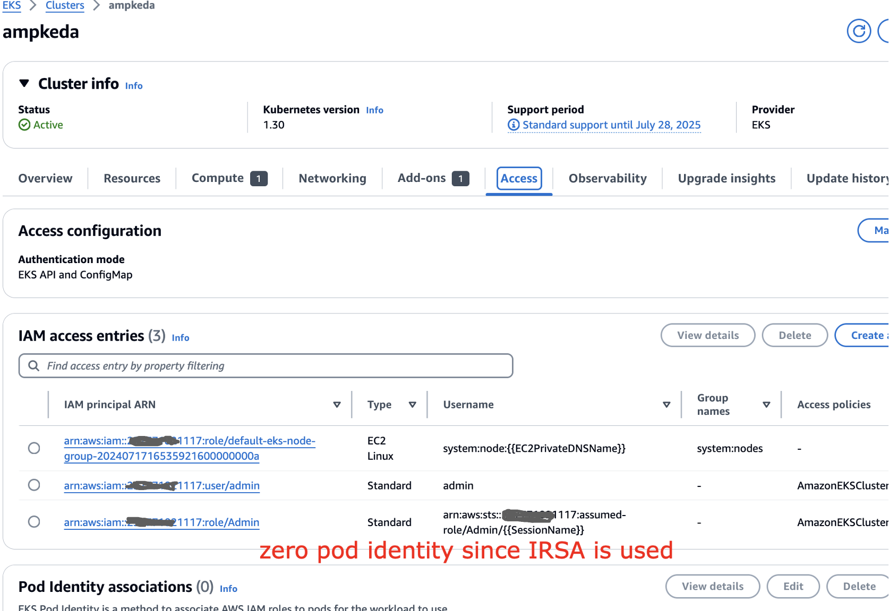
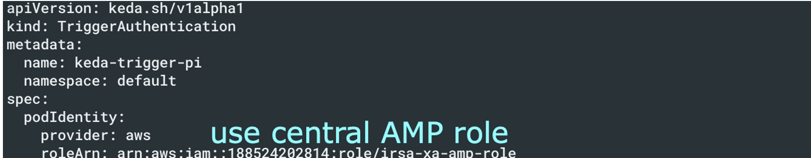

# Auto-scaling des applications avec KEDA sur AMP et EKS

# Contexte actuel

La gestion de l'augmentation du trafic sur les applications Amazon EKS est un defi, le scaling manuel etant inefficace et sujet aux erreurs. L'auto-scaling offre une meilleure solution pour l'allocation des ressources. KEDA permet l'auto-scaling Kubernetes base sur diverses metriques et evenements, tandis qu'Amazon Managed Service for Prometheus fournit une surveillance securisee des metriques pour les clusters EKS. Cette solution combine KEDA avec Amazon Managed Service for Prometheus, en demontrant l'auto-scaling base sur les metriques de requetes par seconde (RPS). L'approche offre un scaling automatise adapte aux exigences de la charge de travail, que les utilisateurs peuvent appliquer a leurs propres charges de travail EKS. Amazon Managed Grafana est utilise pour la surveillance et la visualisation des modeles de scaling, permettant aux utilisateurs d'obtenir des informations sur les comportements d'auto-scaling et de les correler avec les evenements metier.

# Auto-scaling d'applications base sur les metriques AMP avec KEDA 

Cette solution demontre l'integration AWS avec des logiciels open source pour creer un pipeline de scaling automatise. Elle combine Amazon EKS pour le Kubernetes gere, AWS Distro for Open Telemetry (ADOT) pour la collecte de metriques, KEDA pour l'auto-scaling pilote par les evenements, Amazon Managed Service for Prometheus pour le stockage des metriques, et Amazon Managed Grafana pour la visualisation. L'architecture implique le deploiement de KEDA sur EKS, la configuration d'ADOT pour scruter les metriques, la definition de regles d'auto-scaling avec KEDA ScaledObject, et l'utilisation de tableaux de bord Grafana pour surveiller le scaling. Le processus d'auto-scaling commence par les requetes des utilisateurs vers le microservice, ADOT collecte les metriques et les envoie a Prometheus. KEDA interroge ces metriques a intervalles reguliers, determine les besoins de scaling et interagit avec le Horizontal Pod Autoscaler (HPA) pour ajuster le nombre de replicas de pods. Cette configuration permet l'auto-scaling pilote par les metriques pour les microservices Kubernetes, fournissant une architecture cloud-native flexible qui peut scaler en fonction de divers indicateurs d'utilisation.

# Scaling inter-comptes d'applications EKS avec KEDA sur les metriques AMP
Dans ce cas, supposons que KEDA EKS s'execute sur le compte AWS se terminant par l'ID 117 et que l'ID du compte AMP central se termine par 814. Dans le compte KEDA EKS, configurez le role IAM inter-comptes comme suit :

De plus, la relation de confiance doit etre mise a jour comme suit :

Dans le cluster EKS, vous pouvez voir que nous n'utilisons pas Pod identity puisque IRSA est utilise ici

Tandis que dans le compte AMP central, nous avons l'acces AMP configure comme suit

La relation de confiance dispose egalement de l'acces

Et notez l'ID de l'espace de travail comme suit

## Configuration de KEDA
Avec la configuration en place, assurons-nous que KEDA fonctionne comme indique ci-dessous. Pour les instructions d'installation, consultez le lien du blog partage ci-dessous

Assurez-vous d'utiliser le role AMP central defini ci-dessus dans la configuration

Dans la configuration du scaler KEDA, pointez vers le compte AMP central comme suit

Et maintenant vous pouvez voir que les pods sont mis a l'echelle de maniere appropriee

## Blogs

[https://aws.amazon.com/blogs/mt/autoscaling-kubernetes-workloads-with-keda-using-amazon-managed-service-for-prometheus-metrics/](https://aws.amazon.com/blogs/mt/autoscaling-kubernetes-workloads-with-keda-using-amazon-managed-service-for-prometheus-metrics/)
