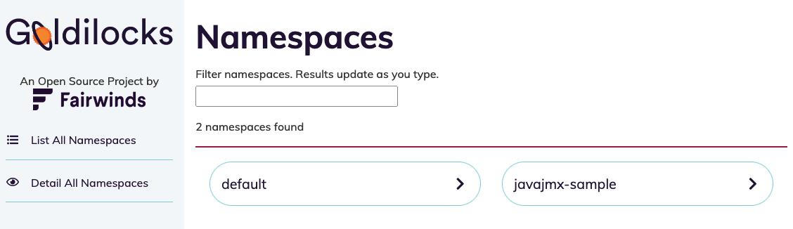
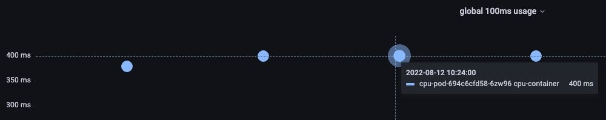

# Meilleures pratiques d'optimisation des ressources pour les charges de travail Kubernetes
L'adoption de Kubernetes continue de s'accelerer, alors que beaucoup migrent vers des architectures basees sur les microservices. Une grande partie de l'attention initiale etait portee sur la conception et la construction de nouvelles architectures cloud-native pour supporter les applications. A mesure que les environnements se developpent, nous commencons a voir l'accent mis sur l'optimisation de l'allocation des ressources de la part des clients. L'optimisation des ressources est la deuxieme question la plus importante que les equipes d'exploitation posent apres la securite.
Parlons des recommandations sur la facon d'optimiser l'allocation des ressources et de dimensionner correctement les applications dans les environnements Kubernetes. Cela inclut les applications s'executant sur Amazon EKS deployees avec des groupes de noeuds geres, des groupes de noeuds autogeres et AWS Fargate.

## Raisons du dimensionnement correct des applications sur Kubernetes
Dans Kubernetes, le dimensionnement correct des ressources se fait en definissant les specifications de ressources sur les applications. Ces parametres ont un impact direct sur :

* Performance -- Les applications Kubernetes vont arbitrairement se disputer les ressources sans specifications de ressources appropriees. Cela peut avoir un impact negatif sur les performances des applications.
* Optimisation des couts -- Les applications deployees avec des specifications de ressources surdimensionnees entraineront une augmentation des couts et une infrastructure sous-utilisee.
* Auto-scaling -- Le Cluster Autoscaler de Kubernetes et le Horizontal Pod Autoscaling necessitent des specifications de ressources pour fonctionner.

Les specifications de ressources les plus courantes dans Kubernetes concernent les [requetes et limites de CPU et de memoire](https://kubernetes.io/docs/concepts/configuration/manage-resources-containers/#requests-and-limits).

## Requetes et limites

Les applications conteneurisees sont deployees sur Kubernetes en tant que Pods. Les requetes et limites de CPU et de memoire sont une partie optionnelle de la definition du Pod. Le CPU est specifie en unites de [CPU Kubernetes](https://kubernetes.io/docs/concepts/configuration/manage-resources-containers/#meaning-of-cpu) tandis que la memoire est specifiee en octets, generalement en [mebibytes (Mi)](https://simple.wikipedia.org/wiki/Mebibyte).

Les requetes et les limites remplissent chacune des fonctions differentes dans Kubernetes et impactent differemment la planification et l'application des ressources.

## Recommandations
Un proprietaire d'application doit choisir les "bonnes" valeurs pour ses requetes de ressources CPU et memoire. Un moyen ideal est de tester la charge de l'application dans un environnement de developpement et de mesurer l'utilisation des ressources a l'aide d'outils d'observabilite. Bien que cela puisse avoir du sens pour les applications les plus critiques de votre organisation, ce n'est probablement pas faisable pour chaque application conteneurisee deployee dans votre cluster. Parlons des outils qui peuvent nous aider a optimiser et dimensionner correctement les charges de travail :

### Vertical Pod Autoscaler (VPA)
[VPA](https://github.com/kubernetes/autoscaler/tree/master/vertical-pod-autoscaler) est un sous-projet Kubernetes gere par le groupe d'interet special (SIG) Autoscaling. Il est concu pour definir automatiquement les requetes de Pod en fonction des performances applicatives observees. VPA collecte l'utilisation des ressources en utilisant le [Kubernetes Metric Server](https://github.com/kubernetes-sigs/metrics-server) par defaut mais peut etre optionnellement configure pour utiliser Prometheus comme source de donnees.
VPA dispose d'un moteur de recommandation qui mesure les performances des applications et fait des recommandations de dimensionnement. Le moteur de recommandation VPA peut etre deploye de maniere autonome de sorte que VPA n'effectuera aucune action d'auto-scaling. Il est configure en creant une ressource personnalisee VerticalPodAutoscaler pour chaque application et VPA met a jour le champ status de l'objet avec des recommandations de dimensionnement des ressources.
Creer des objets VerticalPodAutoscaler pour chaque application de votre cluster et essayer de lire et interpreter les resultats JSON est difficile a grande echelle. [Goldilocks](https://github.com/FairwindsOps/goldilocks) est un projet open source qui facilite cela.

### Goldilocks
Goldilocks est un projet open source de Fairwinds concu pour aider les organisations a obtenir des requetes de ressources d'applications Kubernetes "parfaitement ajustees". La configuration par defaut de Goldilocks est un modele opt-in. Vous choisissez quelles charges de travail sont surveillees en ajoutant le label goldilocks.fairwinds.com/enabled: true a un namespace.


Le Metrics Server collecte les metriques de ressources du Kubelet s'executant sur les noeuds de travail et les expose via l'API Metrics pour utilisation par le Vertical Pod Autoscaler. Le controleur Goldilocks surveille les namespaces avec le label goldilocks.fairwinds.com/enabled: true et cree des objets VerticalPodAutoscaler pour chaque charge de travail dans ces namespaces.

Pour activer les namespaces pour les recommandations de ressources, executez la commande ci-dessous :

```
kubectl create ns javajmx-sample
kubectl label ns javajmx-sample goldilocks.fairwinds.com/enabled=true
```

Pour deployer goldilocks dans le cluster Amazon EKS, executez la commande ci-dessous :

```
helm repo add fairwinds-stable https://charts.fairwinds.com/stable
helm upgrade --install goldilocks fairwinds-stable/goldilocks --namespace goldilocks --create-namespace --set vpa.enabled=true
```

Le tableau de bord Goldilocks expose le tableau de bord sur le port 8080 et nous pouvons y acceder pour obtenir les recommandations de ressources. Executez la commande ci-dessous pour acceder au tableau de bord :

```
kubectl -n goldilocks port-forward svc/goldilocks-dashboard 8080:80
```
Ensuite, ouvrez votre navigateur a l'adresse http://localhost:8080




Analysons le namespace d'exemple pour voir les recommandations fournies par Goldilocks. Nous devrions pouvoir voir les recommandations pour le deploiement.


Nous pouvons voir les recommandations de requetes et limites pour la charge de travail javajmx-sample. La colonne Current sous chaque Quality of Service (QoS) indique les requetes et limites CPU et memoire actuellement configurees. Les colonnes Guaranteed et Burstable indiquent les requetes et limites CPU et memoire recommandees pour le QoS respectif.

 Nous pouvons clairement constater que nous avons sur-provisionne les ressources et goldilocks a fait des recommandations pour optimiser les requetes CPU et memoire. Les requetes et limites CPU ont ete recommandees a 15m et 15m compare a 100m et 300m pour le QoS Guaranteed et les requetes et limites memoire a 105M et 105M, compare a 180Mi et 300Mi.
Vous pouvez simplement copier le fichier manifeste respectif pour la classe QoS qui vous interesse et deployer les charges de travail qui sont correctement dimensionnees et optimisees.

### Comprendre le throttling avec la metrique cAdvisor et configurer les ressources de maniere appropriee
Lorsque nous configurons des limites, nous indiquons au noeud Linux combien de temps une application conteneurisee specifique peut s'executer pendant une periode de temps specifique. Nous faisons cela pour proteger les autres charges de travail sur un noeud d'un ensemble de processus errants qui prendraient un nombre deraisonnable de cycles CPU. Nous ne definissons pas plusieurs "coeurs" physiques situes sur une carte mere ; cependant, nous configurons combien de temps un regroupement de processus ou de threads dans un seul conteneur peut s'executer avant que nous voulions temporairement mettre en pause le conteneur pour eviter de submerger les autres applications.

Il existe une metrique cAdvisor pratique appelee `container_cpu_cfs_throttled_seconds_total` qui additionne toutes les tranches de 5 ms limitees et nous donne une idee de combien le processus depasse le quota. Cette metrique est en secondes, donc nous divisons la valeur par 10 pour obtenir 100 ms, qui est la veritable periode de temps associee au conteneur.

Requete PromQL pour comprendre l'utilisation CPU des trois premiers pods sur une periode de 100 ms.
```
topk(3, max by (pod, container)(rate(container_cpu_usage_seconds_total{image!="", instance="$instance"}[$__rate_interval]))) / 10
```
 Une valeur de 400 ms d'utilisation de vCPU est observee.



PromQL nous donne un throttling par seconde, avec 10 periodes par seconde. Pour obtenir le throttling par periode, nous divisons par 10. Si nous voulons savoir de combien augmenter le parametre de limites, nous pouvons multiplier par 10 (par exemple, 400 ms * 10 = 4000 m).

Bien que les outils ci-dessus fournissent des moyens d'identifier les opportunites d'optimisation des ressources, les equipes applicatives devraient prendre le temps d'identifier si une application donnee est intensive en CPU / memoire et allouer les ressources pour eviter le throttling / le sur-provisionnement. 

