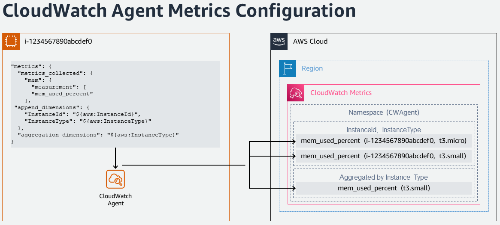

# OLA pour les charges de travail EC2 existantes

## Programme AWS OLA

[AWS Optimization and Licensing Assessment (AWS OLA)](https://aws.amazon.com/optimization-and-licensing-assessment/) offre aux clients la meilleure approche pour migrer les charges de travail vers le cloud et optimiser les coûts des ressources. Il s'agit d'un programme gratuit destiné à aider les clients à analyser leurs charges de travail nouvelles et existantes, à évaluer leurs environnements on-premises et cloud pour optimiser l'allocation des ressources, les licences tierces et les dépendances applicatives, et ainsi améliorer l'efficacité des ressources et potentiellement réduire les dépenses de calcul.

Grâce aux données recueillies dans ce processus, le programme AWS OLA fournit un rapport complet que les clients peuvent utiliser pour prendre des décisions éclairées pour leur parcours cloud et leur migration. Le rapport modélise les options de déploiement basées sur l'utilisation réelle des ressources, les droits de licence existants et aide les clients à découvrir des économies potentielles grâce à nos options de licence flexibles.

Les avantages du programme AWS OLA incluent :

- **Dimensionner correctement l'allocation des ressources** pour vos charges de travail avec une approche de découverte basée sur des outils qui offre des informations sur les ressources de calcul et aide à identifier la meilleure taille et le meilleur type d'instance Amazon Elastic Compute Cloud (Amazon EC2), Amazon Relational Database Service (Amazon RDS) ou VMware Cloud on AWS pour chaque charge de travail.
- **Réduire les coûts** en optimisant votre infrastructure cloud, ce qui est l'un des aspects clés.
- Modéliser des scénarios de licence, y compris les instances avec licence incluse ou BYOL, pour la flexibilité dans la gestion des charges de travail saisonnières et l'expérimentation agile afin d'**explorer des options de licence optimisées** et ainsi éliminer les coûts de licence inutiles.


## AWS OLA pour les charges de travail EEC2

L'AWS OLA (Optimization and Licensing Assessment) est axé sur l'optimisation des coûts pour les charges de travail EC2 existantes, appelé '**AWS OLA for EEC2**' - AWS OLA (Optimization and Licensing Assessment) pour l'évaluation des **charges de travail EC2 existantes**.

L'AWS OLA for EEC2 s'appuie sur [AWS Compute Optimizer](https://aws.amazon.com/compute-optimizer/) pour fournir des recommandations de dimensionnement correct Amazon EC2 aux clients inscrits au plan [AWS Enterprise Support](https://aws.amazon.com/premiumsupport/plans/enterprise/). L'OLA for EEC2 est un engagement en libre-service via un processus simplifié, dans lequel l'équipe AWS OLA prépare les recommandations sous forme de rapport d'évaluation et l'équipe de compte AWS respective présente ces résultats au client pour le dimensionnement correct et l'optimisation des coûts Amazon EC2. En plus des recommandations de dimensionnement correct Amazon EC2, l'AWS OLA fournit également des stratégies d'optimisation Microsoft SQL Server pour les instances BYOL (Bring Your Own License) et les instances Microsoft SQL Server avec licence incluse. L'OLA for EEC2 propose des stratégies supplémentaires au dimensionnement correct Amazon EC2 qui réduisent les dépenses Microsoft SQL Server en 1) optimisant les configurations CPU sur les instances Microsoft SQL Server sur EC2 avec une recommandation CPU inférieure et 2) rétrogradant les serveurs hors production exécutant des éditions SQL sous licence (Enterprise/Standard) vers l'édition gratuite SQL Developer.

Pour effectuer une évaluation, le processus AWS OLA for EEC2 collecte des paramètres d'environnement à partir des comptes AWS du client, y compris des métriques comme l'utilisation de la mémoire et du CPU (via Amazon CloudWatch et l'agent CloudWatch). Une fois les paramètres requis collectés, l'équipe AWS OLA prépare les recommandations en utilisant les données agrégées et présente un fichier PPT et un rapport Excel aux TAM AWS et à l'équipe de compte, qui peuvent ensuite être présentés aux clients. Les informations fournies par le rapport aident les clients à optimiser leurs dépenses Amazon EC2 existantes et à explorer des stratégies d'optimisation des licences pour leurs charges de travail.

## Évaluation AWS OLA for EEC2

Tout client AWS bénéficiant d'Enterprise Support peut optimiser les coûts de ses instances Amazon EC2 existantes (Linux et Windows) avec une évaluation gratuite Optimization and Licensing Assessment (OLA) pour les charges de travail EC2 existantes. Pour qu'une évaluation AWS OLA for EEC2 soit réalisée sans frais pour vos charges de travail, veuillez contacter votre équipe de compte AWS.

## Métriques mémoire Amazon CloudWatch pour un dimensionnement précis

Bien que l'AWS OLA for EEC2 offre un rapport d'évaluation pour le dimensionnement correct Amazon EC2, les informations fournies par [Amazon CloudWatch](https://aws.amazon.com/cloudwatch/) démontrent la valeur d'incorporer les métriques d'utilisation mémoire pour un dimensionnement plus précis des ressources pour les clients. Ainsi, en encourageant et facilitant la surveillance des métriques mémoire Amazon CloudWatch en parallèle du programme AWS OLA for EEC2, les clients obtiennent des recommandations d'optimisation des ressources plus impactantes pour leurs environnements AWS et acquièrent également une perspective plus large de la consommation de ressources de leurs charges de travail. Cela vous aide à réduire les coûts et à améliorer les performances de vos charges de travail.

Les instances Amazon EC2 émettent plusieurs métriques vers Amazon CloudWatch par défaut. Cependant, les métriques mémoire ne font pas partie des métriques par défaut fournies par Amazon EC2. Connaître les métriques mémoire d'Amazon EC2 permet de comprendre l'utilisation actuelle de la mémoire de vos instances EC2, afin que les instances ne soient ni sous-provisionnées ni sur-provisionnées. Le sous-provisionnement des instances Amazon EC2 altère généralement les performances du système ou de l'application, tandis que le sur-provisionnement entraîne des dépenses inutiles. Les applications à forte consommation de mémoire comme l'analytique Big Data, les bases de données en mémoire et le streaming en temps réel nécessitent de surveiller l'utilisation de la mémoire sur les instances pour une visibilité opérationnelle.


### Collecte des métriques mémoire depuis les instances Amazon EC2

Pour collecter les métriques mémoire depuis les [instances Amazon EC2](https://aws.amazon.com/ec2/), voici les étapes à haut niveau.

- Créer un rôle dans AWS Identity and Access Management (IAM) avec des permissions pour
  - [Amazon Systems Manager](https://aws.amazon.com/systems-manager/) pour gérer les instances Amazon EC2, requis si les instances Amazon EC2 sont gérées par Systems Manager. L'[AWS Systems Manager Agent (SSM Agent)](https://docs.aws.amazon.com/systems-manager/latest/userguide/ssm-agent.html) est requis sur les instances Amazon EC2 pour permettre à l'instance de communiquer avec AWS Systems Manager et activer l'exécution de commandes et scripts à distance contre l'instance, comme l'exécution de Systems Manager Run Command sur les instances EC2 en votre nom. AWS Systems Manager Agent (SSM Agent) est un logiciel Amazon installé et exécuté sur les instances Amazon EC2, qui permet au service Amazon Systems Manager de mettre à jour, gérer et configurer les instances EC2 en tant qu'instances gérées. Le SSM agent reçoit les demandes du service Systems Manager, les traite et renvoie les informations de statut et d'exécution au service Systems Manager. Veuillez noter que l'AWS Systems Manager Agent (SSM Agent) est [préinstallé sur certaines Amazon Machine Images (AMIs)](https://docs.aws.amazon.com/systems-manager/latest/userguide/ami-preinstalled-agent.html) fournies par AWS par défaut.
  - Si l'assistant de configuration de l'agent CloudWatch est utilisé pour générer le fichier de configuration de l'agent CloudWatch, le Systems Manager Parameter Store peut optionnellement être utilisé comme emplacement commun sécurisé pour stocker le fichier de configuration pour une récupération ultérieure. Alors l'agent CloudWatch doit avoir un accès en écriture au [Systems Manager Parameter Store](https://aws.amazon.com/systems-manager/features/#Parameter_Store) pour écrire le fichier de configuration et un accès en lecture pour le lire.
  - L'[agent CloudWatch](https://docs.aws.amazon.com/AmazonCloudWatch/latest/monitoring/Install-CloudWatch-Agent.html) pour écrire des données (métriques et journaux) vers Amazon CloudWatch
- Lancer les instances Amazon EC2 et attribuer le rôle IAM créé à l'étape précédente. Pour ce rôle IAM, veuillez vous référer à l'Annexe [1] ci-dessous pour la politique de confiance et à l'Annexe [2] pour les politiques gérées Amazon - AmazonSSMManagedInstanceCore, CloudWatchAgentAdminPolicy et CloudWatchAgentServerPolicy (y compris les permissions au format JSON) qui peuvent être utilisées.
- Installer l'agent CloudWatch sur les instances EC2 requises (Windows ou Linux) soit [manuellement](https://docs.aws.amazon.com/AmazonCloudWatch/latest/monitoring/installing-cloudwatch-agent-commandline.html) soit en utilisant [Systems Manager Run Command](https://docs.aws.amazon.com/AmazonCloudWatch/latest/monitoring/installing-cloudwatch-agent-ssm.html).
- Configurer l'agent CloudWatch pour collecter les métriques mémoire et les écrire dans Amazon CloudWatch.



- Visualiser les [métriques](https://docs.aws.amazon.com/AmazonCloudWatch/latest/monitoring/viewing_metrics_with_cloudwatch.html) et [journaux](https://docs.aws.amazon.com/AmazonCloudWatch/latest/logs/AnalyzingLogData.html) collectés dans la console CloudWatch.
- Utiliser CloudWatch Logs Insights pour analyser les données de journaux


### Collecte des métriques mémoire à grande échelle depuis les instances Amazon EC2

Les étapes ci-dessous peuvent être suivies pour installer et configurer l'agent CloudWatch pour la collecte de signaux (métriques et journaux) vers Amazon CloudWatch sur une ou plusieurs instances Amazon EC2.

- Se connecter à l'instance Amazon EC2 (Windows ou Linux) en utilisant Bureau à distance ou SSH, requis une fois pour préparer le fichier de configuration de l'agent CloudWatch.
- Exécuter l'assistant de configuration de l'agent CloudWatch pour configurer la collecte des métriques et des journaux
  - Configurer les métriques hôte comme CPU, mémoire, disques
  - Optionnellement ajouter des fichiers journaux personnalisés à surveiller (par ex., journaux IIS, journaux Apache)
  - Optionnellement surveiller les journaux d'événements Windows
  - Stocker la configuration dans Systems Manager Parameter Store, si la même configuration peut être appliquée à d'autres instances Amazon EC2.
- Appliquer la configuration de l'agent CloudWatch aux autres instances EC2 en utilisant Systems Manager Run Command. Le document de commande Systems Manager [AmazonCloudWatch-ManageAgent](https://docs.aws.amazon.com/prescriptive-guidance/latest/implementing-logging-monitoring-cloudwatch/create-store-cloudwatch-configurations.html#store-cloudwatch-configuration-s3) peut être utilisé pour mettre à jour la configuration CloudWatch sur plusieurs instances EC2 en une seule exécution.

### Automatisation de la collecte des métriques mémoire depuis les instances Amazon EC2

Les étapes ci-dessous peuvent être suivies pour automatiser, orchestrer et gérer à grande échelle la collecte de signaux (métriques et journaux) vers Amazon CloudWatch. Un template [AWS CloudFormation](https://aws.amazon.com/cloudformation/) peut être utilisé pour effectuer les actions suivantes :

- Créer un rôle d'exécution IAM qui permet à l'automatisation Systems Manager d'exécuter des runbooks sur les instances Amazon EC2 en votre nom.
- Configurer un rôle IAM avec les permissions pour que l'agent CloudWatch écrive des données (métriques et journaux) vers Amazon CloudWatch
- Construire un [runbook personnalisé](https://docs.aws.amazon.com/systems-manager/latest/userguide/automation-documents.html) pour installer et configurer l'agent CloudWatch sur les instances Amazon EC2. Veuillez vous référer à l'Annexe [3] ci-dessous, un exemple de document runbook personnalisé qui peut être utilisé pour installer l'agent CloudWatch et configurer l'agent CloudWatch soit avec les métriques par défaut soit avec un paramètre dans Amazon Systems Manager Parameter Store
- Téléverser un fichier de configuration de l'agent CloudWatch vers Systems Manager Parameter Store.

### Références

- [Collecter les métriques et journaux depuis les instances Amazon EC2 avec l'agent CloudWatch](https://www.youtube.com/watch?v=vAnIhIwE5hY)
- [Configurer les métriques mémoire pour les instances Amazon EC2 en utilisant AWS Systems Manager](https://aws.amazon.com/blogs/mt/setup-memory-metrics-for-amazon-ec2-instances-using-aws-systems-manager/)

### Annexes

[1] **Politique de confiance** pour qu'Amazon EC2 assume le rôle

```json
{
  "Version": "2012-10-17",
  "Statement": [
    {
      "Effect": "Allow",
      "Action": ["sts:AssumeRole"],
      "Principal": {
        "Service": ["ec2.amazonaws.com"]
      }
    }
  ]
}
```

[2] [AmazonSSMManagedInstanceCore](https://docs.aws.amazon.com/aws-managed-policy/latest/reference/AmazonSSMManagedInstanceCore.html) - Politique gérée AWS pour le rôle Amazon EC2 pour activer les fonctionnalités de base du service AWS Systems Manager.

```json
{
  "Version": "2012-10-17",
  "Statement": [
    {
      "Effect": "Allow",
      "Action": [
        "ssm:DescribeAssociation",
        "ssm:GetDeployablePatchSnapshotForInstance",
        "ssm:GetDocument",
        "ssm:DescribeDocument",
        "ssm:GetManifest",
        "ssm:GetParameter",
        "ssm:GetParameters",
        "ssm:ListAssociations",
        "ssm:ListInstanceAssociations",
        "ssm:PutInventory",
        "ssm:PutComplianceItems",
        "ssm:PutConfigurePackageResult",
        "ssm:UpdateAssociationStatus",
        "ssm:UpdateInstanceAssociationStatus",
        "ssm:UpdateInstanceInformation"
      ],
      "Resource": "*"
    },
    {
      "Effect": "Allow",
      "Action": [
        "ssmmessages:CreateControlChannel",
        "ssmmessages:CreateDataChannel",
        "ssmmessages:OpenControlChannel",
        "ssmmessages:OpenDataChannel"
      ],
      "Resource": "*"
    },
    {
      "Effect": "Allow",
      "Action": [
        "ec2messages:AcknowledgeMessage",
        "ec2messages:DeleteMessage",
        "ec2messages:FailMessage",
        "ec2messages:GetEndpoint",
        "ec2messages:GetMessages",
        "ec2messages:SendReply"
      ],
      "Resource": "*"
    }
  ]
}
```

[CloudWatchAgentAdminPolicy](https://docs.aws.amazon.com/aws-managed-policy/latest/reference/CloudWatchAgentAdminPolicy.html) - Politique gérée Amazon avec les permissions complètes requises pour utiliser AmazonCloudWatchAgent

```json
{
  "Version": "2012-10-17",
  "Statement": [
    {
      "Sid": "CWACloudWatchPermissions",
      "Effect": "Allow",
      "Action": [
        "cloudwatch:PutMetricData",
        "ec2:DescribeTags",
        "logs:PutLogEvents",
        "logs:PutRetentionPolicy",
        "logs:DescribeLogStreams",
        "logs:DescribeLogGroups",
        "logs:CreateLogStream",
        "logs:CreateLogGroup",
        "xray:PutTraceSegments",
        "xray:PutTelemetryRecords",
        "xray:GetSamplingRules",
        "xray:GetSamplingTargets",
        "xray:GetSamplingStatisticSummaries"
      ],
      "Resource": "*"
    },
    {
      "Sid": "CWASSMPermissions",
      "Effect": "Allow",
      "Action": ["ssm:GetParameter", "ssm:PutParameter"],
      "Resource": "arn:aws:ssm:*:*:parameter/AmazonCloudWatch-*"
    }
  ]
}
```

[CloudWatchAgentServerPolicy](https://docs.aws.amazon.com/aws-managed-policy/latest/reference/CloudWatchAgentServerPolicy.html) - Politique gérée Amazon avec les permissions complètes requises pour utiliser AmazonCloudWatchAgent sur les serveurs

```json
{
  "Version": "2012-10-17",
  "Statement": [
    {
      "Sid": "CWACloudWatchServerPermissions",
      "Effect": "Allow",
      "Action": [
        "cloudwatch:PutMetricData",
        "ec2:DescribeVolumes",
        "ec2:DescribeTags",
        "logs:PutLogEvents",
        "logs:PutRetentionPolicy",
        "logs:DescribeLogStreams",
        "logs:DescribeLogGroups",
        "logs:CreateLogStream",
        "logs:CreateLogGroup",
        "xray:PutTraceSegments",
        "xray:PutTelemetryRecords",
        "xray:GetSamplingRules",
        "xray:GetSamplingTargets",
        "xray:GetSamplingStatisticSummaries"
      ],
      "Resource": "*"
    },
    {
      "Sid": "CWASSMServerPermissions",
      "Effect": "Allow",
      "Action": ["ssm:GetParameter"],
      "Resource": "arn:aws:ssm:*:*:parameter/AmazonCloudWatch-*"
    }
  ]
}
```

[3] Un exemple de document runbook personnalisé qui peut être utilisé pour installer l'agent CloudWatch et configurer l'agent CloudWatch soit avec les métriques par défaut soit avec un paramètre dans Amazon Systems Manager Parameter Store

```
#-------------------------------------------------
# Composite document and State Manager association to install and configure the Amazon CloudWatch agent
#-------------------------------------------------
InstallAndConfigureCloudWatchAgent:
Type: AWS::SSM::Document
Properties:
    Content:
    schemaVersion: '2.2'
    description: The InstallAndManageCloudWatch command document installs the Amazon CloudWatch agent and manages the configuration of the agent for Amazon EC2 instances.
    parameters:
        action:
        description: The action CloudWatch Agent should take.
        type: String
        default: configure
        allowedValues:
        - configure
        - configure (append)
        - configure (remove)
        - start
        - status
        - stop
        mode:
        description: Controls platform-specific default behavior such as whether to include
            EC2 Metadata in metrics.
        type: String
        default: ec2
        allowedValues:
        - ec2
        - onPremise
        - auto
        optionalConfigurationSource:
        description: Only for 'configure' related actions. Use 'ssm' to apply a ssm parameter
            as config. Use 'default' to apply default config for amazon-cloudwatch-agent.
            Use 'all' with 'configure (remove)' to clean all configs for amazon-cloudwatch-agent.
        type: String
        allowedValues:
        - ssm
        - default
        - all
        default: ssm
        optionalConfigurationLocation:
        description: Only for 'configure' related actions. Only needed when Optional Configuration
            Source is set to 'ssm'. The value should be a ssm parameter name.
        type: String
        default: ''
        allowedPattern: '[a-zA-Z0-9-"~:_@./^(*)!<>?=+]*$'
        optionalRestart:
        description: Only for 'configure' related actions. If 'yes', restarts the agent
            to use the new configuration. Otherwise the new config will only apply on the
            next agent restart.
        type: String
        default: 'yes'
        allowedValues:
        - 'yes'
        - 'no'
    mainSteps:
    - inputs:
        documentParameters:
            name: AmazonCloudWatchAgent
            action: Install
        documentType: SSMDocument
        documentPath: AWS-ConfigureAWSPackage
        name: installCWAgent
        action: aws:runDocument
    - inputs:
        documentParameters:
            mode: '{{mode}}'
            optionalRestart: '{{optionalRestart}}'
            optionalConfigurationSource: '{{optionalConfigurationSource}}'
            optionalConfigurationLocation: '{{optionalConfigurationLocation}}'
            action: '{{action}}'
        documentType: SSMDocument
        documentPath: AmazonCloudWatch-ManageAgent
        name: manageCWAgent
        action: aws:runDocument
    DocumentFormat: YAML
    DocumentType: Command
    TargetType: /AWS::EC2::Instance

CloudWatchAgentAssociation:
Type: AWS::SSM::Association
Properties:
    AssociationName: InstallCloudWatchAgent
    Name: !Ref InstallAndConfigureCloudWatchAgent
    ScheduleExpression: rate(7 days)
    Targets:
    - Key: tag:Platform
    Values:
    - Linux
    WaitForSuccessTimeoutSeconds: 300
```
