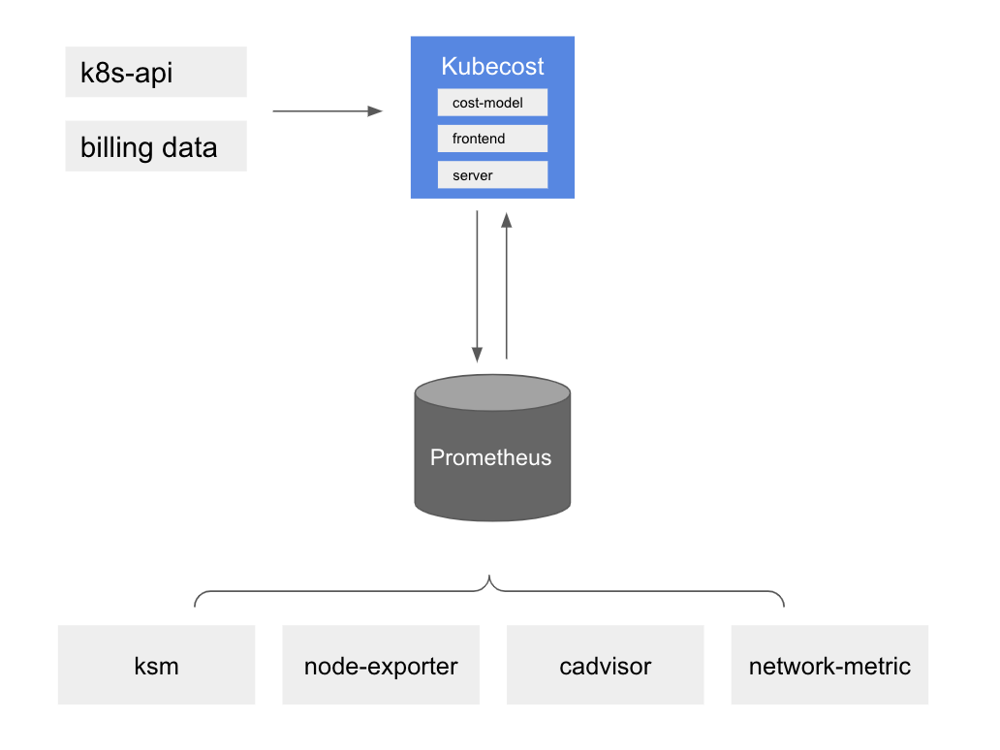

# Utilisation de Kubecost
Kubecost offre aux clients une visibilité sur les dépenses et l'efficacité des ressources dans les environnements Kubernetes. De manière générale, la surveillance des coûts Amazon EKS est déployée avec Kubecost, qui inclut Prometheus, un système de surveillance open source et une base de données de séries temporelles. Kubecost lit les métriques depuis Prometheus, effectue des calculs d'allocation des coûts et réécrit les métriques dans Prometheus. Enfin, l'interface utilisateur de Kubecost lit les métriques depuis Prometheus et les affiche sur le tableau de bord Kubecost. L'architecture est illustrée par le diagramme suivant :



## Raisons d'utiliser Kubecost
Lorsque les clients modernisent leurs applications et déploient des charges de travail à l'aide d'Amazon EKS, ils gagnent en efficacité en consolidant les ressources de calcul nécessaires à l'exécution de leurs applications. Cependant, cette efficacité d'utilisation se fait au prix d'une difficulté accrue pour mesurer les coûts des applications. Aujourd'hui, vous pouvez utiliser l'une de ces méthodes pour distribuer les coûts par locataire :

* Multi-tenancy stricte — Exécuter des clusters EKS séparés dans des comptes AWS dédiés.
* Multi-tenancy souple — Exécuter plusieurs groupes de nœuds dans un cluster EKS partagé.
* Facturation basée sur la consommation — Utiliser la consommation de ressources pour calculer le coût engendré dans un cluster EKS partagé.

Avec la multi-tenancy stricte, les charges de travail sont déployées dans des clusters EKS séparés et vous pouvez identifier le coût engendré pour le cluster et ses dépendances sans avoir à générer des rapports pour déterminer les dépenses de chaque locataire.
Avec la multi-tenancy souple, vous pouvez utiliser des fonctionnalités Kubernetes comme les [Node Selectors](https://kubernetes.io/docs/concepts/scheduling-eviction/assign-pod-node/#nodeselector) et le [Node Affinity](https://kubernetes.io/docs/concepts/scheduling-eviction/assign-pod-node/#affinity-and-anti-affinity) pour demander au planificateur Kubernetes d'exécuter la charge de travail d'un locataire sur des groupes de nœuds dédiés. Vous pouvez étiqueter les instances EC2 d'un groupe de nœuds avec un identifiant (comme le nom du produit ou de l'équipe) et utiliser les [tags](https://docs.aws.amazon.com/awsaccountbilling/latest/aboutv2/cost-alloc-tags.html) pour distribuer les coûts.
Un inconvénient des deux approches ci-dessus est que vous pouvez vous retrouver avec de la capacité inutilisée et ne pas profiter pleinement des économies de coûts qui accompagnent l'exécution d'un cluster densément rempli. Vous avez toujours besoin de moyens pour allouer le coût des ressources partagées comme Elastic Load Balancing et les frais de transfert réseau.

La manière la plus efficace de suivre les coûts dans les clusters Kubernetes multi-locataires est de distribuer les coûts engagés en fonction de la quantité de ressources consommées par les charges de travail. Ce modèle vous permet de maximiser l'utilisation de vos instances EC2 car différentes charges de travail peuvent partager des nœuds, ce qui vous permet d'augmenter la densité de pods sur vos nœuds. Cependant, le calcul des coûts par charge de travail ou par namespace est une tâche complexe. Comprendre la responsabilité des coûts d'une charge de travail nécessite d'agréger toutes les ressources consommées ou réservées pendant une période donnée, et d'évaluer les charges en fonction du coût de la ressource et de la durée de l'utilisation. C'est exactement le défi que Kubecost se consacre à résoudre.

:::tip
    Consultez notre [One Observability Workshop](https://catalog.workshops.aws/observability/en-US/aws-managed-oss/amp/ingest-kubecost-metrics) pour une expérience pratique sur Kubecost.
:::

## Recommandations
### Allocation des coûts
Le tableau de bord d'allocation des coûts de Kubecost vous permet de voir rapidement les dépenses allouées et les opportunités d'optimisation à travers tous les concepts natifs de Kubernetes, par exemple namespace, label k8s et service. Il permet également d'allouer les coûts à des concepts organisationnels comme l'équipe, le produit/projet, le département ou l'environnement. Vous pouvez modifier la plage de dates et les filtres pour obtenir des informations sur une charge de travail spécifique et sauvegarder le rapport. Pour optimiser les coûts Kubernetes, vous devez prêter attention à l'efficacité et aux coûts d'inactivité du cluster.


### Efficacité

L'efficacité des ressources d'un pod est définie comme l'utilisation des ressources par rapport à la demande de ressources sur une fenêtre temporelle donnée. Elle est pondérée par le coût et peut être exprimée comme suit :
```
(((CPU Usage / CPU Requested) * CPU Cost) + ((RAM Usage / RAM Requested) * RAM Cost)) / (RAM Cost + CPU Cost)
```
où CPU Usage = rate(container_cpu_usage_seconds_total) sur la fenêtre temporelle, RAM Usage = avg(container_memory_working_set_bytes) sur la fenêtre temporelle

Comme les prix explicites de RAM, CPU ou GPU ne sont pas fournis par AWS, le modèle Kubecost se rabat sur le ratio des prix de base de CPU, GPU et RAM fournis en entrée. Les valeurs par défaut de ces paramètres sont basées sur les taux de ressources marginaux du fournisseur cloud, mais elles peuvent être personnalisées dans Kubecost. Ces prix de ressources de base (RAM/CPU/GPU) sont normalisés pour que la somme de chaque composant soit égale au prix total du nœud provisionné, basé sur les taux de facturation de votre fournisseur.

Il est de la responsabilité de chaque équipe de service de tendre vers une efficacité maximale et d'ajuster les charges de travail pour atteindre cet objectif.

### Coût d'inactivité
Le coût d'inactivité du cluster est défini comme la différence entre le coût des ressources allouées et le coût du matériel sur lequel elles s'exécutent. L'allocation est définie comme le maximum entre l'utilisation et les demandes. Il peut également être exprimé comme suit :
```
idle_cost = sum(node_cost) - (cpu_allocation_cost + ram_allocation_cost + gpu_allocation_cost)
```
où allocation = max(request, usage)

Ainsi, les coûts d'inactivité peuvent aussi être considérés comme le coût de l'espace dans lequel le planificateur Kubernetes pourrait planifier des pods, sans perturber les charges de travail existantes, mais ne le fait pas actuellement. Ils peuvent être distribués aux charges de travail, au cluster ou par nœuds selon la configuration souhaitée.


### Coût réseau

Kubecost utilise une approche au mieux pour allouer les coûts de transfert réseau aux charges de travail qui les génèrent. La manière la plus précise de déterminer le coût réseau est d'utiliser la combinaison de [AWS Cloud Integration](https://www.ibm.com/docs/en/kubecost/self-hosted/3.x?topic=integration-aws-cloud-using-irsaeks-pod-identities) et du [daemonset de coûts réseau](https://docs.kubecost.com/install-and-configure/advanced-configuration/network-costs-configuration).

Vous voudrez prendre en compte votre score d'efficacité et le coût d'inactivité pour ajuster les charges de travail afin d'utiliser pleinement le potentiel du cluster. Cela nous amène au sujet suivant, à savoir le dimensionnement correct du cluster.

### Dimensionnement correct des charges de travail

Kubecost fournit des recommandations de dimensionnement correct pour vos charges de travail basées sur les métriques natives Kubernetes. Le panneau d'économies dans l'interface Kubecost est un excellent point de départ.


Kubecost peut vous donner des recommandations sur :

* Le dimensionnement correct des demandes de ressources des conteneurs en examinant à la fois les demandes sur-provisionnées et sous-provisionnées
* L'ajustement du nombre et de la taille des nœuds du cluster pour cesser de dépenser excessivement en capacité inutilisée
* La réduction, suppression ou redimensionnement des pods qui n'envoient ou ne reçoivent pas un taux significatif de trafic
* L'identification des charges de travail prêtes pour les nœuds spot
* L'identification des volumes inutilisés par aucun pod


Kubecost dispose également d'une fonctionnalité en pré-version qui peut automatiquement implémenter ses recommandations pour les demandes de ressources des conteneurs si vous avez le composant Cluster Controller activé. L'utilisation du dimensionnement automatique des demandes vous permet d'optimiser instantanément l'allocation des ressources sur l'ensemble de votre cluster, sans tester un YAML excessif ou des commandes kubectl compliquées. Vous pouvez facilement éliminer la sur-allocation de ressources dans votre cluster, ce qui ouvre la voie à d'importantes économies via le dimensionnement correct du cluster et d'autres optimisations.

### Intégration de Kubecost avec Amazon Managed Service for Prometheus

Kubecost s'appuie sur le projet open source Prometheus comme base de données de séries temporelles et post-traite les données dans Prometheus pour effectuer les calculs d'allocation des coûts. Selon la taille du cluster et l'échelle de la charge de travail, il pourrait être écrasant pour un serveur Prometheus de récupérer et stocker les métriques. Dans ce cas, vous pouvez utiliser Amazon Managed Service for Prometheus, un service de surveillance géré compatible avec Prometheus, pour stocker les métriques de manière fiable et vous permettre de surveiller facilement les coûts Kubernetes à grande échelle.

Vous devez configurer les [rôles IAM pour les comptes de service Kubecost](https://docs.aws.amazon.com/eks/latest/userguide/iam-roles-for-service-accounts.html). En utilisant le fournisseur OIDC de votre cluster, vous accordez des permissions IAM aux comptes de service de votre cluster. Vous devez accorder les permissions appropriées aux comptes de service kubecost-cost-analyzer et kubecost-prometheus-server. Ceux-ci seront utilisés pour envoyer et récupérer des métriques depuis l'espace de travail. Exécutez les commandes suivantes en ligne de commande :

```
eksctl create iamserviceaccount \ 
--name kubecost-cost-analyzer \ 
--namespace kubecost \ 
--cluster <CLUSTER_NAME> \
--region <REGION> \ 
--attach-policy-arn arn:aws:iam::aws:policy/AmazonPrometheusQueryAccess \ 
--attach-policy-arn arn:aws:iam::aws:policy/AmazonPrometheusRemoteWriteAccess \ 
--override-existing-serviceaccounts \ 
--approve 

eksctl create iamserviceaccount \ 
--name kubecost-prometheus-server \ 
--namespace kubecost \ 
--cluster <CLUSTER_NAME> --region <REGION> \ 
--attach-policy-arn arn:aws:iam::aws:policy/AmazonPrometheusQueryAccess \ 
--attach-policy-arn arn:aws:iam::aws:policy/AmazonPrometheusRemoteWriteAccess \ 
--override-existing-serviceaccounts \ 
--approve

```
`CLUSTER_NAME` est le nom du cluster Amazon EKS où vous souhaitez installer Kubecost et "REGION" est la région du cluster Amazon EKS.

Une fois terminé, vous devrez mettre à niveau le chart Helm de Kubecost comme ci-dessous :
```
helm upgrade -i kubecost \
oci://public.ecr.aws/kubecost/cost-analyzer --version <$VERSION> \
--namespace kubecost --create-namespace \
-f https://tinyurl.com/kubecost-amazon-eks \
-f https://tinyurl.com/kubecost-amp \
--set global.amp.prometheusServerEndpoint=${QUERYURL} \
--set global.amp.remoteWriteService=${REMOTEWRITEURL}
```
### Accès à l'interface utilisateur Kubecost

Kubecost fournit un tableau de bord web auquel vous pouvez accéder soit via kubectl port-forward, un ingress, ou un équilibreur de charge. La version entreprise de Kubecost prend également en charge la restriction de l'accès au tableau de bord en utilisant [SSO/SAML](https://www.ibm.com/docs/en/kubecost/self-hosted/3.x?topic=configuration-user-management-oidc) et fournissant différents niveaux d'accès. Par exemple, restreindre la vue d'une équipe aux seuls produits dont elle est responsable.

Dans un environnement AWS, envisagez d'utiliser le [AWS Load Balancer Controller](https://docs.aws.amazon.com/eks/latest/userguide/aws-load-balancer-controller.html) pour exposer Kubecost et utilisez [Amazon Cognito](https://aws.amazon.com/cognito/) pour l'authentification, l'autorisation et la gestion des utilisateurs. Vous pouvez en apprendre davantage sur [Comment utiliser Application Load Balancer et Amazon Cognito pour authentifier les utilisateurs de vos applications web Kubernetes](https://aws.amazon.com/blogs/containers/how-to-use-application-load-balancer-and-amazon-cognito-to-authenticate-users-for-your-kubernetes-web-apps/)


### Vue multi-cluster

Votre équipe FinOps voudra examiner le cluster EKS pour partager des recommandations avec les propriétaires métier. Lors d'une exploitation à grande échelle, il devient difficile pour les équipes de se connecter à chaque cluster pour consulter les recommandations. Le mode multi-cluster vous permet d'avoir une vue unifiée sur tous les coûts agrégés des clusters à l'échelle mondiale. Il existe trois options que Kubecost prend en charge pour les environnements avec plusieurs clusters : Kubecost Free, Kubecost Business et Kubecost Enterprise. Dans les modes free et business, la réconciliation de la facturation cloud sera effectuée au niveau de chaque cluster. Dans le mode enterprise, la réconciliation de la facturation cloud sera effectuée dans un cluster principal qui sert l'interface Kubecost et utilise le bucket partagé où les métriques sont stockées.
Il est important de noter que la rétention des métriques est illimitée uniquement lorsque vous utilisez le mode enterprise.

### Références
* [Expérience pratique Kubecost sur One Observability Workshop](https://catalog.workshops.aws/observability/en-US/aws-managed-oss/amp/ingest-kubecost-metrics)
* [Blog - Intégration de Kubecost avec Amazon Managed Service for Prometheus](https://aws.amazon.com/blogs/mt/integrating-kubecost-with-amazon-managed-service-for-prometheus/)
