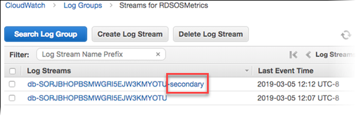
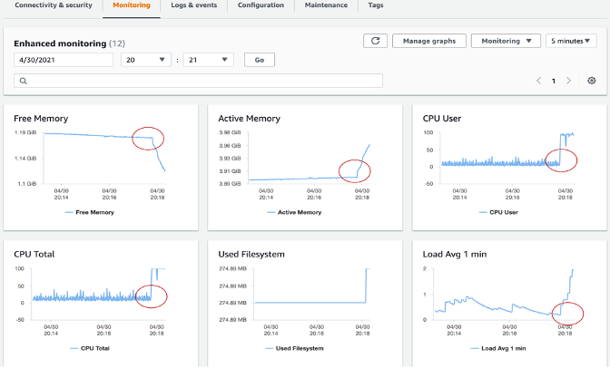

# Surveiller les bases de donnees Amazon RDS et Aurora

La surveillance est un element essentiel du maintien de la fiabilite, de la disponibilite et des performances des clusters de bases de donnees Amazon RDS et Aurora. AWS fournit plusieurs outils pour surveiller la sante de vos ressources de bases de donnees Amazon RDS et Aurora, detecter les problemes avant qu'ils ne deviennent critiques et optimiser les performances pour une experience utilisateur coherente. Ce guide fournit les bonnes pratiques d'observabilite pour garantir le bon fonctionnement de vos bases de donnees.

## Recommandations de performance

En tant que bonne pratique, vous souhaitez commencer par etablir une reference de performance pour vos charges de travail. Lorsque vous configurez une instance de base de donnees et l'executez avec une charge de travail typique, capturez les valeurs moyennes, maximales et minimales de toutes les metriques de performance. Faites-le a differents intervalles (par exemple, une heure, 24 heures, une semaine, deux semaines). Cela peut vous donner une idee de ce qui est normal. Il est utile d'obtenir des comparaisons pour les heures de pointe et les heures creuses. Vous pouvez ensuite utiliser ces informations pour identifier quand les performances passent en dessous des niveaux standards.
 
## Options de surveillance

### Metriques Amazon CloudWatch

[Amazon CloudWatch](https://docs.aws.amazon.com/AmazonRDS/latest/UserGuide/monitoring-cloudwatch.html) est un outil essentiel pour la surveillance et la gestion de vos bases de donnees [RDS](https://aws.amazon.com/rds/) et [Aurora](https://aws.amazon.com/rds/aurora/). Il fournit des informations precieuses sur les performances de la base de donnees et vous aide a identifier et resoudre les problemes rapidement. Amazon RDS et Aurora envoient des metriques a CloudWatch pour chaque instance de base de donnees active avec une granularite d'une minute. La surveillance est activee par defaut et les metriques sont disponibles pendant 15 jours. RDS et Aurora publient des metriques au niveau de l'instance vers Amazon CloudWatch dans l'espace de noms **AWS/RDS**.

En utilisant les metriques CloudWatch, vous pouvez identifier les tendances ou les modeles dans les performances de votre base de donnees, et utiliser ces informations pour optimiser vos configurations et ameliorer les performances de votre application. Voici les metriques cles a surveiller :

* **CPU Utilization** - Pourcentage de capacite de traitement informatique utilisee.
* **DB Connections** - Le nombre de sessions client connectees a l'instance de base de donnees. Envisagez de limiter les connexions a la base de donnees si vous constatez un nombre eleve de connexions utilisateurs conjointement avec une diminution des performances de l'instance et du temps de reponse. Le nombre optimal de connexions utilisateurs pour votre instance de base de donnees variera en fonction de la classe de votre instance et de la complexite des operations effectuees. Pour determiner le nombre de connexions a la base de donnees, associez votre instance de base de donnees a un groupe de parametres.
* **Freeable Memory** - Quantite de RAM disponible sur l'instance de base de donnees, en megaoctets. La ligne rouge dans les metriques de l'onglet Monitoring est marquee a 75 % pour les metriques de CPU, memoire et stockage. Si la consommation de memoire de l'instance depasse frequemment cette ligne, cela indique que vous devriez verifier votre charge de travail ou mettre a niveau votre instance.
* **Network throughput** - Le taux de trafic reseau vers et depuis l'instance de base de donnees en octets par seconde.
* **Read/Write Latency** - Le temps moyen pour une operation de lecture ou d'ecriture en millisecondes.
* **Read/Write IOPS** - Le nombre moyen d'operations de lecture ou d'ecriture sur disque par seconde.
* **Free Storage Space** - Quantite d'espace disque non utilisee actuellement par l'instance de base de donnees, en megaoctets. Examinez la consommation d'espace disque si l'espace utilise est systematiquement a ou au-dessus de 85 % de l'espace disque total. Verifiez s'il est possible de supprimer des donnees de l'instance ou d'archiver des donnees vers un autre systeme pour liberer de l'espace.


Pour le depannage des problemes lies aux performances, la premiere etape est d'optimiser les requetes les plus utilisees et les plus couteuses. Optimisez-les pour voir si cela reduit la pression sur les ressources systeme. Pour plus d'informations, consultez [Tuning queries](https://docs.aws.amazon.com/AmazonRDS/latest/UserGuide/CHAP_BestPractices.html#CHAP_BestPractices.TuningQueries).

Si vos requetes sont optimisees et que le probleme persiste, envisagez de mettre a niveau vos classes d'instances de base de donnees. Vous pouvez les mettre a niveau vers une instance avec plus de ressources (CPU, RAM, espace disque, bande passante reseau, capacite d'E/S).

Ensuite, vous pouvez configurer des alarmes pour alerter lorsque ces metriques atteignent des seuils critiques, et prendre des mesures pour resoudre tout probleme aussi rapidement que possible.

Pour plus d'informations sur les metriques CloudWatch, consultez [Amazon CloudWatch metrics for Amazon RDS](https://docs.aws.amazon.com/AmazonRDS/latest/UserGuide/rds-metrics.html) et [Viewing DB instance metrics in the CloudWatch console and AWS CLI](https://docs.aws.amazon.com/AmazonRDS/latest/UserGuide/metrics_dimensions.html).

#### CloudWatch Logs Insights

[CloudWatch Logs Insights](https://docs.aws.amazon.com/AmazonCloudWatch/latest/logs/AnalyzingLogData.html) vous permet de rechercher et d'analyser de maniere interactive vos donnees de logs dans Amazon CloudWatch Logs. Vous pouvez effectuer des requetes pour vous aider a repondre plus efficacement aux problemes operationnels. Si un probleme survient, vous pouvez utiliser CloudWatch Logs Insights pour identifier les causes potentielles et valider les correctifs deployes.

Pour publier les logs d'un cluster de base de donnees RDS ou Aurora vers CloudWatch, consultez [Publish logs for Amazon RDS or Aurora for MySQL instances to CloudWatch](https://repost.aws/knowledge-center/rds-aurora-mysql-logs-cloudwatch)

Pour plus d'informations sur la surveillance des logs RDS ou Aurora avec CloudWatch, consultez [Monitoring Amazon RDS log file](https://docs.aws.amazon.com/AmazonRDS/latest/UserGuide/USER_LogAccess.html).

#### Alarmes CloudWatch

Pour identifier quand les performances sont degradees pour vos clusters de base de donnees, vous devriez surveiller et alerter sur les metriques de performance cles de maniere reguliere. En utilisant les [alarmes Amazon CloudWatch](https://docs.aws.amazon.com/AmazonCloudWatch/latest/monitoring/AlarmThatSendsEmail.html), vous pouvez surveiller une seule metrique sur une periode que vous specifiez. Si la metrique depasse un seuil donne, une notification est envoyee a un sujet Amazon SNS ou a une politique AWS Auto Scaling. Les alarmes CloudWatch n'invoquent pas d'actions simplement parce qu'elles sont dans un etat particulier. L'etat doit avoir change et ete maintenu pendant un nombre specifie de periodes. Les alarmes invoquent des actions uniquement lorsqu'un changement d'etat d'alarme se produit. Etre dans un etat d'alarme ne suffit pas.

Pour configurer une alarme CloudWatch -

* Naviguez vers la console de gestion AWS et ouvrez la console Amazon RDS a [https://console.aws.amazon.com/rds/](https://console.aws.amazon.com/rds/).
* Dans le volet de navigation, choisissez Databases, puis choisissez une instance de base de donnees.
* Choisissez Logs & events.

Dans la section CloudWatch alarms, choisissez Create alarm.


* Pour Send notifications, choisissez Yes, et pour Send notifications to, choisissez New email or SMS topic.
* Pour Topic name, entrez un nom pour la notification, et pour With these recipients, entrez une liste separee par des virgules d'adresses email et de numeros de telephone.
* Pour Metric, choisissez la statistique d'alarme et la metrique a definir.
* Pour Threshold, specifiez si la metrique doit etre superieure, inferieure ou egale au seuil, et specifiez la valeur du seuil.
* Pour Evaluation period, choisissez la periode d'evaluation de l'alarme. Pour consecutive period(s) of, choisissez la periode pendant laquelle le seuil doit avoir ete atteint pour declencher l'alarme.
* Pour Name of alarm, entrez un nom pour l'alarme.
* Choisissez Create Alarm.

L'alarme apparait dans la section CloudWatch alarms.

Consultez cet [exemple](https://docs.aws.amazon.com/AmazonRDS/latest/UserGuide/multi-az-db-cluster-cloudwatch-alarm.html) pour creer une alarme Amazon CloudWatch pour le decalage de replica d'un cluster DB Multi-AZ.

#### Logs d'audit de base de donnees

Les logs d'audit de base de donnees fournissent un enregistrement detaille de toutes les actions effectuees sur vos bases de donnees RDS et Aurora, vous permettant de surveiller les acces non autorises, les modifications de donnees et d'autres activites potentiellement nuisibles. Voici quelques bonnes pratiques pour l'utilisation des logs d'audit de base de donnees :

* Activez les logs d'audit de base de donnees pour toutes vos instances RDS et Aurora, et configurez-les pour capturer toutes les donnees pertinentes.
* Utilisez une solution centralisee de gestion des logs, comme Amazon CloudWatch Logs ou Amazon Kinesis Data Streams, pour collecter et analyser vos logs d'audit de base de donnees.
* Surveillez regulierement vos logs d'audit de base de donnees pour detecter les activites suspectes, et prenez des mesures pour enqueter et resoudre tout probleme rapidement.

Pour plus d'informations sur la configuration des logs d'audit de base de donnees, consultez [Configuring an Audit Log to Capture database activities for Amazon RDS and Aurora](https://aws.amazon.com/blogs/database/configuring-an-audit-log-to-capture-database-activities-for-amazon-rds-for-mysql-and-amazon-aurora-with-mysql-compatibility/).

#### Logs de requetes lentes et logs d'erreurs de base de donnees

Les logs de requetes lentes vous aident a trouver les requetes peu performantes dans la base de donnees afin d'investiguer les raisons de la lenteur et d'optimiser les requetes si necessaire. Les logs d'erreurs vous aident a trouver les erreurs de requetes, ce qui vous aide ensuite a identifier les changements dans l'application dus a ces erreurs.

Vous pouvez surveiller les logs de requetes lentes et les logs d'erreurs en creant un tableau de bord CloudWatch utilisant Amazon CloudWatch Logs Insights (qui vous permet de rechercher et d'analyser de maniere interactive vos donnees de logs dans Amazon CloudWatch Logs).

Pour activer et surveiller le log d'erreurs, le log de requetes lentes et le log general pour un Amazon RDS, consultez [Manage slow query logs and general logs for RDS MySQL](https://repost.aws/knowledge-center/rds-mysql-logs). Pour activer le log de requetes lentes pour Aurora PostgreSQL, consultez [Enable slow query logs for PostgreSQL](https://catalog.us-east-1.prod.workshops.aws/workshops/31babd91-aa9a-4415-8ebf-ce0a6556a216/en-US/postgresql-logs/enable-slow-query-log).

## Performance Insights et metriques du systeme d'exploitation

#### Enhanced Monitoring

[Enhanced Monitoring](https://docs.aws.amazon.com/AmazonRDS/latest/UserGuide/USER_Monitoring.OS.html) vous permet d'obtenir des metriques detaillees en temps reel pour le systeme d'exploitation (OS) sur lequel votre instance de base de donnees s'execute.

RDS delivre les metriques d'Enhanced Monitoring dans votre compte Amazon CloudWatch Logs. Par defaut, ces metriques sont stockees pendant 30 jours dans le groupe de logs **RDSOSMetrics** dans Amazon CloudWatch. Vous avez la possibilite de choisir une granularite entre 1s et 60s. Vous pouvez creer des filtres de metriques personnalises dans CloudWatch a partir de CloudWatch Logs et afficher les graphiques sur le tableau de bord CloudWatch.



Enhanced Monitoring inclut egalement la liste des processus au niveau OS. Actuellement, Enhanced Monitoring est disponible pour les moteurs de base de donnees suivants :

* MariaDB
* Microsoft SQL Server
* MySQL
* Oracle
* PostgreSQL

**Difference entre CloudWatch et Enhanced Monitoring**
CloudWatch collecte les metriques d'utilisation du CPU depuis l'hyperviseur pour une instance de base de donnees. En revanche, Enhanced Monitoring collecte ses metriques depuis un agent sur l'instance de base de donnees. Un hyperviseur cree et execute des machines virtuelles (VM). En utilisant un hyperviseur, une instance peut prendre en charge plusieurs VM invitees en partageant virtuellement la memoire et le CPU. Vous pourriez constater des differences entre les mesures CloudWatch et Enhanced Monitoring, car la couche hyperviseur effectue une petite quantite de travail. Les differences peuvent etre plus importantes si vos instances de base de donnees utilisent des classes d'instances plus petites. Dans ce scenario, plus de machines virtuelles (VM) sont probablement gerees par la couche hyperviseur sur une seule instance physique.


Pour en savoir plus sur toutes les metriques disponibles avec Enhanced Monitoring, veuillez consulter [OS metrics in Enhanced Monitoring](https://docs.aws.amazon.com/AmazonRDS/latest/UserGuide/USER_Monitoring-Available-OS-Metrics.html)




#### Performance Insights

[Amazon RDS Performance Insights](https://aws.amazon.com/rds/performance-insights/) est une fonctionnalite d'optimisation et de surveillance des performances de base de donnees qui vous aide a evaluer rapidement la charge sur votre base de donnees et a determiner quand et ou agir. Avec le tableau de bord Performance Insights, vous pouvez visualiser la charge de la base de donnees sur votre cluster de base de donnees et filtrer la charge par attentes, instructions SQL, hotes ou utilisateurs. Il vous permet de vous concentrer sur la cause profonde plutot que de poursuivre les symptomes. Performance Insights utilise des methodes de collecte de donnees legeres qui n'impactent pas les performances de vos applications et facilite l'identification des instructions SQL qui causent la charge et pourquoi.

Performance Insights fournit sept jours de retention gratuite de l'historique de performance et vous pouvez l'etendre jusqu'a 2 ans avec des frais. Vous pouvez activer Performance Insights depuis la console de gestion RDS ou l'AWS CLI. Performance Insights expose egalement une API publiquement disponible pour permettre aux clients et aux tiers d'integrer Performance Insights avec leurs propres outils personnalises.

:::note
	Actuellement, RDS Performance Insights est disponible uniquement pour Aurora (editions compatibles PostgreSQL et MySQL), Amazon RDS for PostgreSQL, MySQL, MariaDB, SQL Server et Oracle.
:::

**DBLoad** est la metrique cle qui represente le nombre moyen de sessions actives de la base de donnees. Dans Performance Insights, cette donnee est interrogee comme la metrique **db.load.avg**.


Pour plus d'informations sur l'utilisation de Performance Insights avec Aurora, consultez : [Monitoring DB load with Performance Insights on Amazon Aurora](https://docs.aws.amazon.com/AmazonRDS/latest/AuroraUserGuide/USER_PerfInsights.html).


## Outils d'observabilite open source

#### Amazon Managed Grafana
[Amazon Managed Grafana](https://aws.amazon.com/grafana/) est un service entierement gere qui facilite la visualisation et l'analyse des donnees des bases de donnees RDS et Aurora.

L'**espace de noms AWS/RDS** dans Amazon CloudWatch inclut les metriques cles qui s'appliquent aux entites de base de donnees executees sur Amazon RDS et Amazon Aurora. Pour visualiser et suivre la sante et les problemes de performance potentiels de nos bases de donnees RDS/Aurora dans Amazon Managed Grafana, nous pouvons exploiter la source de donnees CloudWatch.


A l'heure actuelle, seules les metriques Performance Insights de base sont disponibles dans CloudWatch, ce qui n'est pas suffisant pour analyser les performances de la base de donnees et identifier les goulets d'etranglement. Pour visualiser les metriques RDS Performance Insights dans Amazon Managed Grafana et avoir une visibilite centralisee, les clients peuvent utiliser une fonction Lambda personnalisee pour collecter toutes les metriques RDS Performance Insights et les publier dans un espace de noms de metriques CloudWatch personnalise. Une fois ces metriques disponibles dans Amazon CloudWatch, vous pouvez les visualiser dans Amazon Managed Grafana.

Pour deployer la fonction Lambda personnalisee pour collecter les metriques RDS Performance Insights, clonez le depot GitHub suivant et executez le script install.sh.

```
$ git clone https://github.com/aws-observability/observability-best-practices.git
$ cd sandbox/monitor-aurora-with-grafana

$ chmod +x install.sh
$ ./install.sh
```

Le script ci-dessus utilise AWS CloudFormation pour deployer une fonction Lambda personnalisee et un role IAM. La fonction Lambda se declenche automatiquement toutes les 10 minutes pour invoquer l'API RDS Performance Insights et publier des metriques personnalisees dans l'espace de noms personnalise /AuroraMonitoringGrafana/PerformanceInsights dans Amazon CloudWatch.


Pour des informations detaillees etape par etape sur le deploiement de la fonction Lambda personnalisee et les tableaux de bord Grafana, consultez [Performance Insights in Amazon Managed Grafana](https://aws.amazon.com/blogs/mt/monitoring-amazon-rds-and-amazon-aurora-using-amazon-managed-grafana/).

En identifiant rapidement les changements involontaires dans votre base de donnees et en notifiant a l'aide d'alertes, vous pouvez prendre des mesures pour minimiser les perturbations. Amazon Managed Grafana prend en charge plusieurs canaux de notification tels que SNS, Slack, PagerDuty, etc. auxquels vous pouvez envoyer des notifications d'alertes. [Grafana Alerting](https://docs.aws.amazon.com/grafana/latest/userguide/alerts-overview.html) vous montrera plus d'informations sur la configuration des alertes dans Amazon Managed Grafana.

<!-- blank line -->
<figure class="video_container">
  <iframe width="560" height="315" src="https://www.youtube.com/embed/Uj9UJ1mXwEA" title="YouTube video player" frameborder="0" allow="accelerometer; autoplay; clipboard-write; encrypted-media; gyroscope; picture-in-picture; web-share" allowfullscreen></iframe>
</figure>
<!-- blank line -->

## AIOps - Detection des goulets d'etranglement de performance basee sur le machine learning

#### Amazon DevOps Guru for RDS

Avec [Amazon DevOps Guru for RDS](https://aws.amazon.com/devops-guru/features/devops-guru-for-rds/), vous pouvez surveiller vos bases de donnees pour detecter les goulets d'etranglement de performance et les problemes operationnels. Il utilise les metriques Performance Insights, les analyse a l'aide du Machine Learning (ML) pour fournir des analyses specifiques a la base de donnees sur les problemes de performance, et recommande des actions correctives. DevOps Guru for RDS peut identifier et analyser divers problemes de performance lies a la base de donnees, tels que la sur-utilisation des ressources de l'hote, les goulets d'etranglement de la base de donnees ou le mauvais comportement des requetes SQL, entre autres. Lorsqu'un probleme ou un comportement anormal est detecte, DevOps Guru for RDS affiche la decouverte sur la console DevOps Guru et envoie des notifications en utilisant [Amazon EventBridge](https://aws.amazon.com/pm/eventbridge) ou [Amazon Simple Notification Service (SNS)](https://aws.amazon.com/pm/sns), permettant aux equipes DevOps ou SRE de prendre des mesures en temps reel sur les problemes de performance et operationnels avant qu'ils ne deviennent des pannes impactant les clients.

DevOps Guru for RDS etablit une reference pour les metriques de la base de donnees. L'etablissement de la reference implique l'analyse des metriques de performance de la base de donnees sur une periode de temps pour etablir un comportement normal. Amazon DevOps Guru for RDS utilise ensuite le ML pour detecter les anomalies par rapport a la reference etablie. Si votre modele de charge de travail change, DevOps Guru for RDS etablit une nouvelle reference qu'il utilise pour detecter les anomalies par rapport au nouveau normal.

:::note
	Pour les nouvelles instances de base de donnees, Amazon DevOps Guru for RDS prend jusqu'a 2 jours pour etablir une reference initiale, car il necessite une analyse des modeles d'utilisation de la base de donnees et l'etablissement de ce qui est considere comme un comportement normal.
:::


Pour plus d'informations sur la prise en main, veuillez visiter [Amazon DevOps Guru for RDS to Detect, Diagnose, and Resolve Amazon Aurora-Related Issues using ML](https://aws.amazon.com/blogs/aws/new-amazon-devops-guru-for-rds-to-detect-diagnose-and-resolve-amazon-aurora-related-issues-using-ml/)

<!-- blank line -->
<figure class="video_container">
  <iframe width="560" height="315" src="https://www.youtube.com/embed/N3NNYgzYUDA" title="YouTube video player" frameborder="0" allow="accelerometer; autoplay; clipboard-write; encrypted-media; gyroscope; picture-in-picture; web-share" allowfullscreen></iframe>
</figure>
<!-- blank line -->

## Audit et gouvernance

#### Logs AWS CloudTrail

[AWS CloudTrail](https://docs.aws.amazon.com/awscloudtrail/latest/userguide/cloudtrail-user-guide.html) fournit un enregistrement des actions effectuees par un utilisateur, un role ou un service AWS dans RDS. CloudTrail capture tous les appels API pour RDS en tant qu'evenements, y compris les appels depuis la console et les appels de code aux operations de l'API RDS. En utilisant les informations collectees par CloudTrail, vous pouvez determiner la requete qui a ete faite a RDS, l'adresse IP a partir de laquelle la requete a ete faite, qui a fait la requete, quand elle a ete faite, et des details supplementaires. Pour plus d'informations, consultez [Monitoring Amazon RDS API calls in AWS CloudTrail](https://docs.aws.amazon.com/AmazonRDS/latest/UserGuide/logging-using-cloudtrail.html).

Pour plus d'informations, consultez [Monitoring Amazon RDS API calls in AWS CloudTrail](https://docs.aws.amazon.com/AmazonRDS/latest/UserGuide/logging-using-cloudtrail.html).

## References pour plus d'informations

[Blog - Monitor RDS and Aurora databases with Amazon Managed Grafana](https://aws.amazon.com/blogs/mt/monitoring-amazon-rds-and-amazon-aurora-using-amazon-managed-grafana/)

[Video - Monitor RDS and Aurora databases with Amazon Managed Grafana](https://www.youtube.com/watch?v=Uj9UJ1mXwEA)

[Blog - Monitor RDS and Aurora databases with Amazon CloudWatch](https://aws.amazon.com/blogs/database/creating-an-amazon-cloudwatch-dashboard-to-monitor-amazon-rds-and-amazon-aurora-mysql/)

[Blog - Build proactive database monitoring for Amazon RDS with Amazon CloudWatch Logs, AWS Lambda, and Amazon SNS](https://aws.amazon.com/blogs/database/build-proactive-database-monitoring-for-amazon-rds-with-amazon-cloudwatch-logs-aws-lambda-and-amazon-sns/)

[Documentation officielle - Amazon Aurora Monitoring Guide](https://docs.aws.amazon.com/AmazonRDS/latest/AuroraUserGuide/MonitoringOverview.html)

[Atelier pratique - Observe and Identify SQL Performance Issues in Amazon Aurora](https://catalog.workshops.aws/awsauroramysql/en-US/provisioned/perfobserve)
