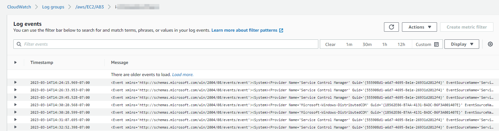
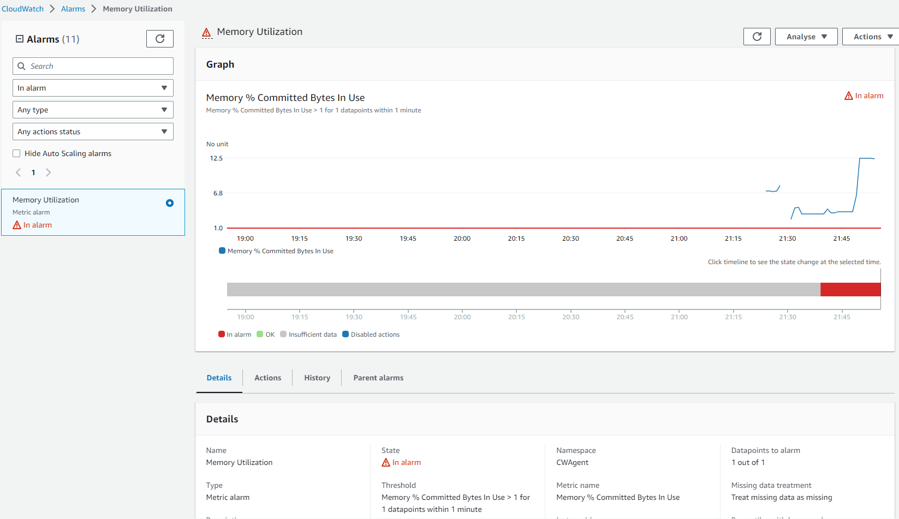
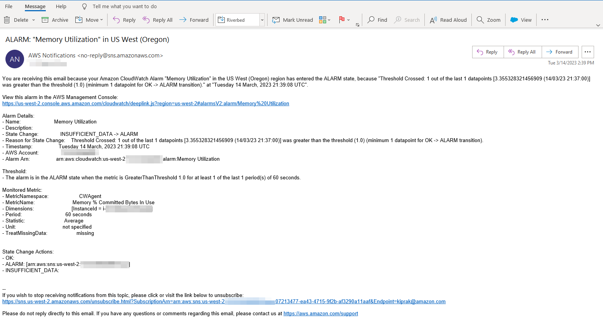
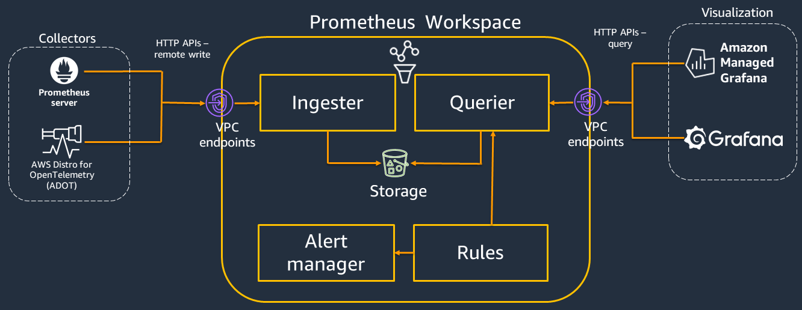
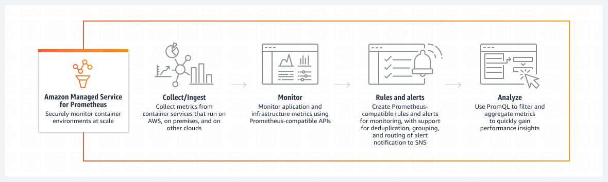
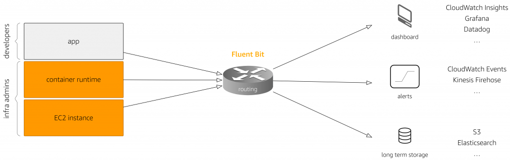

# Surveillance et observabilité EC2

## Introduction

La surveillance et l'observabilité continues augmentent l'agilité, améliorent l'expérience client et réduisent les risques de l'environnement cloud. Selon Wikipedia, l'[Observabilité](https://en.wikipedia.org/wiki/Observability) est une mesure de la capacité à déduire les états internes d'un système à partir de la connaissance de ses sorties externes. Le terme observabilité lui-même provient du domaine de la théorie du contrôle, où il signifie essentiellement que vous pouvez déduire l'état interne des composants d'un système en analysant les signaux/sorties externes qu'il produit.

La différence entre la surveillance et l'observabilité est que la surveillance vous dit si un système fonctionne ou non, tandis que l'observabilité vous dit pourquoi le système ne fonctionne pas. La surveillance est généralement une mesure réactive alors que l'objectif de l'observabilité est de pouvoir améliorer vos indicateurs clés de performance (KPI) de manière proactive. Un système ne peut être contrôlé ou optimisé que s'il est observé. L'instrumentation des charges de travail par la collecte de métriques, de logs ou de traces et l'obtention d'informations significatives et de contexte détaillé en utilisant les bons outils de surveillance et d'observabilité aident les clients à contrôler et optimiser l'environnement.

AWS permet aux clients de passer de la surveillance à l'observabilité afin d'avoir une visibilité de bout en bout complète sur les services. Dans cet article, nous nous concentrons sur Amazon Elastic Compute Cloud (Amazon EC2) et les meilleures pratiques pour améliorer la surveillance et l'observabilité du service dans l'environnement AWS Cloud à travers des outils natifs AWS et open source.

## Amazon EC2

[Amazon Elastic Compute Cloud](https://aws.amazon.com/ec2/) (Amazon EC2) est une plateforme de calcul hautement évolutive dans le cloud Amazon Web Services (AWS). Amazon EC2 élimine le besoin d'investissement matériel initial, permettant aux clients de développer et déployer des applications plus rapidement tout en ne payant que pour ce qu'ils utilisent. Parmi les fonctionnalités clés que EC2 fournit, on trouve les environnements de calcul virtuels appelés instances, les modèles préconfigurés d'instances appelés Amazon Machine Images, et les diverses configurations de ressources comme le CPU, la mémoire, le stockage et la capacité réseau disponibles sous forme de types d'instances.

## Surveillance et observabilité avec les outils natifs AWS

### Amazon CloudWatch

[Amazon CloudWatch](https://aws.amazon.com/cloudwatch/) est un service de surveillance et de gestion qui fournit des données et des informations exploitables pour les applications et ressources d'infrastructure AWS, hybrides et sur site. CloudWatch collecte des données de surveillance et opérationnelles sous forme de logs, de métriques et d'événements. Il fournit également une vue unifiée des ressources AWS, des applications et des services qui s'exécutent sur AWS et sur les serveurs sur site. CloudWatch vous aide à obtenir une visibilité à l'échelle du système sur l'utilisation des ressources, les performances des applications et la santé opérationnelle.

### Agent CloudWatch unifié

L'agent CloudWatch unifié est un logiciel open source sous licence MIT qui prend en charge la plupart des systèmes d'exploitation utilisant les architectures x86-64 et ARM64. L'agent CloudWatch aide à collecter des métriques au niveau du système à partir des instances Amazon EC2 et des serveurs sur site dans un environnement hybride à travers les systèmes d'exploitation, à récupérer des métriques personnalisées à partir d'applications ou de services, et à collecter des logs à partir d'instances Amazon EC2 et de serveurs sur site.

### Installation de l'agent CloudWatch sur les instances Amazon EC2

#### Installation en ligne de commande

L'agent CloudWatch peut être installé via la [ligne de commande](https://docs.aws.amazon.com/AmazonCloudWatch/latest/monitoring/installing-cloudwatch-agent-commandline.html). Le package requis pour les diverses architectures et les différents systèmes d'exploitation est disponible au [téléchargement](https://docs.aws.amazon.com/AmazonCloudWatch/latest/monitoring/download-cloudwatch-agent-commandline.html). Créez le [rôle IAM](https://docs.aws.amazon.com/AmazonCloudWatch/latest/monitoring/create-iam-roles-for-cloudwatch-agent-commandline.html) nécessaire qui fournit les autorisations pour que l'agent CloudWatch puisse lire les informations de l'instance Amazon EC2 et les écrire dans CloudWatch. Une fois le rôle IAM requis créé, vous pouvez [installer et exécuter](https://docs.aws.amazon.com/AmazonCloudWatch/latest/monitoring/install-CloudWatch-Agent-commandline-fleet.html) l'agent CloudWatch sur l'instance Amazon EC2 requise.

:::info
    Documentation : [Installation de l'agent CloudWatch en utilisant la ligne de commande](https://docs.aws.amazon.com/AmazonCloudWatch/latest/monitoring/installing-cloudwatch-agent-commandline.html)

    Atelier AWS Observability : [Configuration et installation de l'agent CloudWatch](https://catalog.workshops.aws/observability/en-US/aws-native/ec2-monitoring/install-ec2)
:::

#### Installation via AWS Systems Manager

L'agent CloudWatch peut également être installé via [AWS Systems Manager](https://docs.aws.amazon.com/AmazonCloudWatch/latest/monitoring/installing-cloudwatch-agent-ssm.html). Créez le rôle IAM nécessaire qui fournit les autorisations pour que l'agent CloudWatch puisse lire les informations de l'instance Amazon EC2 et les écrire dans CloudWatch, et communiquer avec AWS Systems Manager. Avant d'installer l'agent CloudWatch sur les instances EC2, [installez ou mettez à jour](https://docs.aws.amazon.com/AmazonCloudWatch/latest/monitoring/download-CloudWatch-Agent-on-EC2-Instance-SSM-first.html#update-SSM-Agent-EC2instance-first) l'agent SSM sur les instances EC2 requises. L'agent CloudWatch peut être téléchargé via AWS Systems Manager. Un fichier de configuration JSON peut être créé pour spécifier quelles métriques (y compris les métriques personnalisées) et logs doivent être collectés. Une fois le rôle IAM requis et le fichier de configuration créés, vous pouvez installer et exécuter l'agent CloudWatch sur les instances Amazon EC2 requises.

:::info
    Documentation : [Installation de l'agent CloudWatch en utilisant AWS Systems Manager](https://docs.aws.amazon.com/AmazonCloudWatch/latest/monitoring/installing-cloudwatch-agent-ssm.html)

    Atelier AWS Observability : [Installer l'agent CloudWatch en utilisant AWS Systems Manager Quick Setup](https://catalog.workshops.aws/observability/en-US/aws-native/ec2-monitoring/install-ec2/ssm-quicksetup)

    Article de blog associé : [Amazon CloudWatch Agent with AWS Systems Manager Integration – Unified Metrics & Log Collection for Linux & Windows](https://aws.amazon.com/blogs/aws/new-amazon-cloudwatch-agent-with-aws-systems-manager-integration-unified-metrics-log-collection-for-linux-windows/)

    Vidéo YouTube : [Collect Metrics and Logs from Amazon EC2 instances with the CloudWatch Agent](https://www.youtube.com/watch?v=vAnIhIwE5hY)
:::

#### Installation de l'agent CloudWatch sur des serveurs sur site dans un environnement hybride

Dans les environnements hybrides des clients, où les serveurs sont à la fois sur site et dans le cloud, une approche similaire peut être adoptée pour obtenir une observabilité unifiée dans Amazon CloudWatch. L'agent CloudWatch peut être directement téléchargé depuis Amazon S3 ou via AWS Systems Manager. Créez un utilisateur IAM pour le serveur sur site afin d'envoyer des données à Amazon CloudWatch. Installez et démarrez l'agent sur les serveurs sur site.

:::note
    Documentation : [Installation de l'agent CloudWatch sur des serveurs sur site](https://docs.aws.amazon.com/AmazonCloudWatch/latest/monitoring/install-CloudWatch-Agent-on-premise.html)
:::

### Surveillance des instances Amazon EC2 avec Amazon CloudWatch

Un aspect clé du maintien de la fiabilité, de la disponibilité et des performances de vos instances Amazon EC2 et de vos applications passe par la [surveillance continue](https://catalog.workshops.aws/observability/en-US/aws-native/ec2-monitoring). Avec l'agent CloudWatch installé sur les instances Amazon EC2 requises, surveiller la santé des instances et leurs performances est nécessaire pour maintenir un environnement stable. Comme ligne de base, des éléments tels que l'utilisation du CPU, l'utilisation du réseau, les performances de disque, les lectures/écritures de disque, l'utilisation de la mémoire, l'utilisation du swap disque, l'utilisation de l'espace disque, l'utilisation du fichier page et la collecte de logs des instances EC2 sont recommandés.

#### Surveillance de base et détaillée

Amazon CloudWatch collecte et traite les données brutes d'Amazon EC2 en métriques lisibles en quasi temps réel. Par défaut, Amazon EC2 envoie des données métriques à CloudWatch par périodes de 5 minutes en tant que surveillance de base pour une instance. Pour envoyer des données métriques pour votre instance à CloudWatch par périodes de 1 minute, la [surveillance détaillée](https://docs.aws.amazon.com/AWSEC2/latest/UserGuide/using-cloudwatch-new.html) peut être activée sur l'instance.

#### Outils automatisés et manuels pour la surveillance

AWS fournit deux types d'outils, automatisés et manuels, qui aident les clients à surveiller leurs Amazon EC2 et à signaler quand quelque chose ne va pas. Certains de ces outils nécessitent peu de configuration et quelques-uns nécessitent une intervention manuelle.
Les [outils de surveillance automatisés](https://docs.aws.amazon.com/AWSEC2/latest/UserGuide/monitoring_automated_manual.html#monitoring_automated_tools) incluent les vérifications d'état du système AWS, les vérifications d'état d'instance, les alarmes Amazon CloudWatch, Amazon EventBridge, Amazon CloudWatch Logs, l'agent CloudWatch, le pack de gestion AWS pour Microsoft System Center Operations Manager. Les outils de [surveillance manuelle](https://docs.aws.amazon.com/AWSEC2/latest/UserGuide/monitoring_automated_manual.html#monitoring_manual_tools) incluent les tableaux de bord que nous examinerons en détail dans une section séparée ci-dessous dans cet article.

:::note
    Documentation : [Surveillance automatisée et manuelle](https://docs.aws.amazon.com/AWSEC2/latest/UserGuide/monitoring_automated_manual.html)
:::
### Métriques des instances Amazon EC2 avec l'agent CloudWatch

Les métriques sont le concept fondamental dans CloudWatch. Une métrique représente un ensemble ordonné dans le temps de points de données publiés dans CloudWatch. Pensez à une métrique comme une variable à surveiller, et les points de données comme représentant les valeurs de cette variable au fil du temps. Par exemple, l'utilisation du CPU d'une instance EC2 particulière est une métrique fournie par Amazon EC2.

#### Métriques par défaut avec l'agent CloudWatch

Amazon CloudWatch collecte les métriques des instances Amazon EC2 qui peuvent être consultées via la console de gestion AWS, l'AWS CLI ou une API. Les métriques disponibles sont des points de données couverts pour un intervalle de 5 minutes par la surveillance de base ou à un intervalle de 1 minute pour la surveillance détaillée (si activée).

#### Métriques personnalisées avec l'agent CloudWatch

Les clients peuvent également publier leurs propres métriques personnalisées dans CloudWatch en utilisant l'API ou la CLI avec une résolution standard de granularité de 1 minute ou une granularité haute résolution jusqu'à un intervalle de 1 seconde. L'agent CloudWatch unifié prend en charge la récupération de métriques personnalisées via [StatsD](https://docs.aws.amazon.com/AmazonCloudWatch/latest/monitoring/CloudWatch-Agent-custom-metrics-statsd.html) et [collectd](https://docs.aws.amazon.com/AmazonCloudWatch/latest/monitoring/CloudWatch-Agent-custom-metrics-collectd.html).

Les métriques personnalisées des applications ou services peuvent être récupérées en utilisant l'agent CloudWatch avec le protocole StatsD. StatsD est une solution open source populaire qui peut collecter des métriques d'une grande variété d'applications. StatsD est particulièrement utile pour instrumenter vos propres métriques, supportant à la fois les serveurs basés sur Linux et Windows.

Les métriques personnalisées des applications ou services peuvent également être récupérées en utilisant l'agent CloudWatch avec le protocole collectd, qui est une solution open source populaire supportée uniquement sur les serveurs Linux avec des plugins qui peuvent collecter des statistiques système pour une grande variété d'applications. En combinant les métriques système que l'agent CloudWatch peut déjà collecter avec les métriques supplémentaires de collectd, vous pouvez mieux surveiller, analyser et dépanner vos systèmes et applications.

#### Métriques personnalisées supplémentaires avec l'agent CloudWatch

L'agent CloudWatch prend en charge la collecte de métriques personnalisées à partir de vos instances EC2. Quelques exemples populaires sont :

- Métriques de performance réseau pour les instances EC2 fonctionnant sous Linux qui utilisent l'Elastic Network Adapter (ENA).
- Métriques GPU Nvidia depuis les serveurs Linux.
- Métriques de processus utilisant le plugin procstat à partir de processus individuels sur les serveurs Linux et Windows.

### Logs des instances Amazon EC2 avec l'agent CloudWatch

Amazon CloudWatch Logs aide les clients à surveiller et dépanner les systèmes et applications en quasi temps réel en utilisant les fichiers de logs système, applicatifs et personnalisés existants. Pour collecter les logs des instances Amazon EC2 et des serveurs sur site vers CloudWatch, l'agent CloudWatch unifié doit être installé. Le dernier agent CloudWatch unifié est recommandé, car il peut collecter à la fois les logs et les métriques avancées. Il prend également en charge une variété de systèmes d'exploitation. Si l'instance utilise Instance Metadata Service Version 2 (IMDSv2), l'agent unifié est requis.

Les logs collectés par l'agent CloudWatch unifié sont traités et stockés dans Amazon CloudWatch Logs. Les logs peuvent être collectés depuis des serveurs Windows ou Linux et à la fois depuis Amazon EC2 et des serveurs sur site. L'assistant de configuration de l'agent CloudWatch peut être utilisé pour configurer le fichier JSON qui définit la configuration de l'agent CloudWatch.

:::note
    Atelier AWS Observability : [Logs](https://catalog.workshops.aws/observability/en-US/aws-native/logs)
:::

### Événements des instances Amazon EC2

Un événement indique un changement dans votre environnement AWS. Les ressources et applications AWS peuvent générer des événements lorsque leur état change. CloudWatch Events fournit un flux quasi temps réel d'événements système qui décrivent les changements apportés à vos ressources et applications AWS. Par exemple, Amazon EC2 génère un événement lorsque l'état d'une instance EC2 passe de « pending » à « running ». Les clients peuvent également générer des événements personnalisés au niveau applicatif et les publier dans CloudWatch Events.

Les clients peuvent [surveiller le statut des instances Amazon EC2](https://docs.aws.amazon.com/AWSEC2/latest/UserGuide/monitoring-instances-status-check.html) en visualisant les vérifications d'état et les événements planifiés. Une vérification d'état fournit les résultats des contrôles automatisés effectués par Amazon EC2. Ces contrôles automatisés détectent si des problèmes spécifiques affectent les instances. Les informations de vérification d'état, combinées avec les données fournies par Amazon CloudWatch, offrent une visibilité opérationnelle détaillée sur chacune des instances.

#### Règle Amazon EventBridge pour les événements d'instances Amazon EC2

Amazon CloudWatch Events peut utiliser Amazon EventBridge pour automatiser les événements système afin de répondre automatiquement aux actions telles que les changements de ressources ou les problèmes. Les événements des services AWS, y compris Amazon EC2, sont livrés à CloudWatch Events en quasi temps réel et les clients peuvent créer des règles EventBridge pour prendre les actions appropriées lorsqu'un événement correspond à une règle.
Les actions peuvent être : invoquer une fonction AWS Lambda, invoquer Amazon EC2 Run Command, relayer l'événement vers Amazon Kinesis Data Streams, activer une machine d'état AWS Step Functions, notifier un sujet Amazon SNS, notifier une file Amazon SQS, acheminer vers une application interne ou externe de réponse aux incidents ou un outil SIEM.

:::note
    Atelier AWS Observability : [Réponse aux incidents - Règle EventBridge](https://catalog.workshops.aws/observability/en-US/aws-native/ec2-monitoring/incident-response/create-eventbridge-rule)
:::

#### Alarmes Amazon CloudWatch pour les instances Amazon EC2

Les [alarmes Amazon CloudWatch](https://docs.aws.amazon.com/AmazonCloudWatch/latest/monitoring/AlarmThatSendsEmail.html) peuvent surveiller une métrique sur une période que vous spécifiez, et effectuer une ou plusieurs actions basées sur la valeur de la métrique par rapport à un seuil donné sur un nombre de périodes. Une alarme n'invoque des actions que lorsque l'alarme change d'état. L'action peut être une notification envoyée à un sujet Amazon Simple Notification Service (Amazon SNS) ou Amazon EC2 Auto Scaling ou prendre d'autres actions appropriées comme [arrêter, terminer, redémarrer ou récupérer une instance EC2.](https://docs.aws.amazon.com/AmazonCloudWatch/latest/monitoring/UsingAlarmActions.html)

Une fois l'alarme déclenchée, une notification par email est envoyée à un sujet SNS comme action.

#### Surveillance pour les instances Auto Scaling

Amazon EC2 Auto Scaling aide les clients à s'assurer que le bon nombre d'instances Amazon EC2 sont disponibles pour gérer la charge de votre application. Les [métriques Amazon EC2 Auto Scaling](https://docs.aws.amazon.com/autoscaling/ec2/userguide/ec2-auto-scaling-cloudwatch-monitoring.html) collectent des informations sur les groupes Auto Scaling et se trouvent dans l'espace de noms AWS/AutoScaling. Les métriques d'instances Amazon EC2 représentant l'utilisation du CPU et d'autres données d'utilisation des instances Auto Scaling se trouvent dans l'espace de noms AWS/EC2.

### Tableaux de bord dans CloudWatch

Connaître les détails d'inventaire des ressources dans les comptes AWS, les performances et les vérifications de santé des ressources est important pour une gestion stable des ressources. Les [tableaux de bord Amazon CloudWatch](https://docs.aws.amazon.com/AmazonCloudWatch/latest/monitoring/CloudWatch_Dashboards.html) sont des pages d'accueil personnalisables dans la console CloudWatch qui peuvent être utilisées pour surveiller vos ressources dans une vue unique, même celles qui sont réparties dans différentes régions. Il existe des moyens d'obtenir une bonne vue et des détails des instances Amazon EC2 disponibles.

#### Tableaux de bord automatiques dans CloudWatch

Les tableaux de bord automatiques sont disponibles dans toutes les régions publiques AWS et fournissent une vue agrégée de la santé et des performances de toutes les ressources AWS, y compris les instances Amazon EC2 sous CloudWatch. Cela aide les clients à démarrer rapidement avec la surveillance, une vue basée sur les ressources des métriques et alarmes, et à facilement approfondir pour comprendre la cause racine des problèmes de performance. Les tableaux de bord automatiques sont préconstruits avec les [meilleures pratiques](https://docs.aws.amazon.com/prescriptive-guidance/latest/implementing-logging-monitoring-cloudwatch/cloudwatch-dashboards-visualizations.html) recommandées par les services AWS, restent conscients des ressources et se mettent à jour dynamiquement pour refléter le dernier état des métriques de performance importantes.

#### Tableaux de bord personnalisés dans CloudWatch

Avec les [tableaux de bord personnalisés](https://docs.aws.amazon.com/AmazonCloudWatch/latest/monitoring/create_dashboard.html), les clients peuvent créer autant de tableaux de bord supplémentaires qu'ils le souhaitent avec différents widgets et les personnaliser en conséquence. Les tableaux de bord peuvent être configurés pour une vue inter-régions et inter-comptes et peuvent être ajoutés à une liste de favoris.

#### Tableaux de bord de santé des ressources dans CloudWatch

Resource Health dans CloudWatch ServiceLens est une solution entièrement gérée que les clients peuvent utiliser pour découvrir, gérer et visualiser automatiquement la [santé et les performances des hôtes Amazon EC2](https://aws.amazon.com/blogs/mt/introducing-cloudwatch-resource-health-monitor-ec2-hosts/) à travers leurs applications. Les clients peuvent visualiser la santé de leurs hôtes par dimension de performance telle que le CPU ou la mémoire, et segmenter des centaines d'hôtes dans une seule vue en utilisant des filtres tels que le type d'instance, l'état de l'instance ou les groupes de sécurité. Cela permet une comparaison côte à côte d'un groupe d'hôtes EC2 et fournit des informations granulaires sur un hôte individuel.

## Surveillance et observabilité avec les outils open source

### Surveillance des instances Amazon EC2 avec AWS Distro for OpenTelemetry

[AWS Distro for OpenTelemetry (ADOT)](https://aws.amazon.com/otel) est une distribution sécurisée, prête pour la production et supportée par AWS du projet OpenTelemetry. Faisant partie de la Cloud Native Computing Foundation, OpenTelemetry fournit des API, bibliothèques et agents open source pour collecter des traces distribuées et des métriques pour la surveillance des applications. Avec AWS Distro for OpenTelemetry, les clients peuvent instrumenter les applications une seule fois pour envoyer des métriques et traces corrélées à plusieurs solutions de surveillance AWS et partenaires.

AWS Distro for OpenTelemetry (ADOT) fournit un cadre de surveillance distribué qui permet de corréler les données pour surveiller les performances et la santé des applications de manière simple, ce qui est essentiel pour une plus grande visibilité et maintenance des services.

Les composants clés d'ADOT sont les SDKs, les agents d'auto-instrumentation, les collecteurs et les exportateurs pour envoyer des données aux services backend.

[SDK OpenTelemetry](https://github.com/aws-observability) : Pour permettre la collecte de métadonnées spécifiques aux ressources AWS, le support du format de trace X-Ray et du contexte a été ajouté aux SDKs OpenTelemetry. Les SDKs OpenTelemetry corrèlent maintenant les données de traces et de métriques ingérées depuis AWS X-Ray et CloudWatch.

[Agent d'auto-instrumentation](https://aws-otel.github.io/docs/getting-started/java-sdk/auto-instr) : Le support dans l'agent d'auto-instrumentation Java OpenTelemetry a été ajouté pour le SDK AWS et les données de trace AWS X-Ray.

[Collecteur OpenTelemetry](https://github.com/open-telemetry/opentelemetry-collector) : Le collecteur dans la distribution est construit en utilisant le collecteur OpenTelemetry upstream. Des exportateurs spécifiques à AWS ont été ajoutés au collecteur upstream pour envoyer des données aux services AWS, y compris AWS X-Ray, Amazon CloudWatch et Amazon Managed Service for Prometheus.

#### Métriques et traces via le collecteur ADOT et Amazon CloudWatch

Le collecteur AWS Distro for OpenTelemetry (ADOT) ainsi que l'agent CloudWatch peuvent être installés côte à côte sur une instance Amazon EC2 et les SDKs OpenTelemetry peuvent être utilisés pour collecter les traces et métriques applicatives de vos charges de travail s'exécutant sur les instances Amazon EC2.

Pour prendre en charge les métriques OpenTelemetry dans Amazon CloudWatch, l'[exportateur AWS EMF pour le collecteur OpenTelemetry](https://github.com/open-telemetry/opentelemetry-collector-contrib/tree/main/exporter/awsemfexporter) convertit les métriques au format OpenTelemetry en format CloudWatch Embedded Metric Format (EMF), ce qui permet aux applications intégrées avec les métriques OpenTelemetry d'envoyer des métriques applicatives à haute cardinalité à CloudWatch. L'[exportateur X-Ray](https://aws-otel.github.io/docs/getting-started/x-ray#configuring-the-aws-x-ray-exporter) permet aux traces collectées au format OTLP d'être exportées vers [AWS X-Ray](https://aws.amazon.com/xray/).

Le collecteur ADOT sur Amazon EC2 peut être installé via AWS CloudFormation ou en utilisant [AWS Systems Manager Distributor](https://catalog.workshops.aws/observability/en-US/aws-managed-oss/ec2-monitoring/configure-adot-collector) pour collecter les métriques applicatives.

### Surveillance des instances Amazon EC2 avec Prometheus

[Prometheus](https://prometheus.io/) est un projet open source autonome maintenu indépendamment pour la surveillance et les alertes des systèmes. Prometheus collecte et stocke les métriques sous forme de données de séries temporelles, c'est-à-dire que les informations de métriques sont stockées avec l'horodatage auquel elles ont été enregistrées, accompagnées de paires clé-valeur optionnelles appelées labels.

Prometheus est configuré via des flags en ligne de commande et tous les détails de configuration sont maintenus dans le fichier prometheus.yaml. La section 'scrape_config' dans le fichier de configuration spécifie les cibles et les paramètres décrivant comment les scraper. [Prometheus Service Discovery](https://github.com/prometheus/prometheus/tree/main/discovery) (SD) est une méthodologie pour trouver les endpoints à scraper pour les métriques. Les configurations de découverte de service Amazon EC2 permettant de récupérer les cibles de scrape depuis les instances AWS EC2 sont configurées dans le `ec2_sd_config`.

#### Métriques via Prometheus et Amazon CloudWatch

L'agent CloudWatch sur les instances EC2 peut être installé et configuré avec Prometheus pour scraper les métriques pour la surveillance dans CloudWatch. Cela peut être utile aux clients qui préfèrent les charges de travail en conteneurs sur EC2 et nécessitent des métriques personnalisées compatibles avec la surveillance open source Prometheus. L'installation de l'agent CloudWatch peut être effectuée en suivant les étapes expliquées dans la section précédente ci-dessus. L'agent CloudWatch avec la surveillance Prometheus nécessite deux configurations pour scraper les métriques Prometheus. L'une est pour les configurations standard Prometheus telles que documentées dans 'scrape_config' dans la documentation Prometheus. L'autre est pour la [configuration de l'agent CloudWatch](https://docs.aws.amazon.com/AmazonCloudWatch/latest/monitoring/CloudWatch-Agent-PrometheusEC2.html#CloudWatch-Agent-PrometheusEC2-configure).

#### Métriques via Prometheus et le collecteur ADOT

Les clients peuvent choisir d'avoir une configuration entièrement open source pour leurs besoins d'observabilité. Pour cela, le collecteur AWS Distro for OpenTelemetry (ADOT) peut être configuré pour scraper depuis une application instrumentée avec Prometheus et envoyer les métriques au serveur Prometheus. Trois composants OpenTelemetry sont impliqués dans ce flux : le Prometheus Receiver, le Prometheus Remote Write Exporter et l'extension Sigv4 Authentication. Le Prometheus Receiver reçoit les données métriques au format Prometheus. Le Prometheus Exporter exporte les données au format Prometheus. L'extension Sigv4 Authenticator fournit l'authentification Sigv4 pour effectuer des requêtes vers les services AWS.

#### Prometheus Node Exporter

[Prometheus Node Exporter](https://github.com/prometheus/node_exporter) est un système open source de surveillance et d'alertes de séries temporelles pour les environnements cloud. Les instances Amazon EC2 peuvent être instrumentées avec Node Exporter pour collecter et stocker des métriques au niveau des noeuds sous forme de données de séries temporelles, enregistrant les informations avec un horodatage. Node exporter est un exportateur Prometheus qui peut exposer une variété de métriques hôte via l'URL http://localhost:9100/metrics.

 Une fois les métriques créées, elles peuvent être envoyées à [Amazon Managed Prometheus](https://aws.amazon.com/prometheus/).

### Streaming des logs depuis les instances Amazon EC2 avec le plugin Fluent Bit

[Fluent Bit](https://fluentbit.io/) est un outil open source et multiplateforme de traitement de logs pour gérer la collecte de données à grande échelle, la collecte et l'agrégation de données diverses traitant avec diverses sources d'information, une variété de formats de données, la fiabilité des données, la sécurité, le routage flexible et les destinations multiples.

Fluent Bit aide à créer un point d'extension facile pour le streaming des logs depuis Amazon EC2 vers les services AWS, y compris Amazon CloudWatch pour la rétention et l'analyse des logs. Le [plugin Fluent Bit](https://github.com/aws/amazon-cloudwatch-logs-for-fluent-bit#new-higher-performance-core-fluent-bit-plugin) récemment lancé peut router les logs vers Amazon CloudWatch.

### Tableaux de bord avec Amazon Managed Grafana

[Amazon Managed Grafana](https://aws.amazon.com/grafana/) est un service entièrement géré basé sur le projet open source Grafana, avec des visualisations de données riches, interactives et sécurisées pour aider les clients à interroger, corréler, analyser, surveiller et alerter instantanément sur les métriques, logs et traces à travers plusieurs sources de données. Les clients peuvent créer des tableaux de bord interactifs et les partager avec quiconque dans leur organisation avec un service automatiquement mis à l'échelle, hautement disponible et sécurisé pour l'entreprise. Avec Amazon Managed Grafana, les clients peuvent gérer l'accès des utilisateurs et des équipes aux tableaux de bord à travers les comptes AWS, les régions AWS et les sources de données.

Amazon Managed Grafana peut être ajouté avec Amazon CloudWatch comme source de données en utilisant l'option de configuration de source de données AWS dans la console de l'espace de travail Grafana. Cette fonctionnalité simplifie l'ajout de CloudWatch comme source de données en découvrant les comptes CloudWatch existants et en gérant la configuration des identifiants d'authentification nécessaires pour accéder à CloudWatch. Amazon Managed Grafana prend également en charge les [sources de données Prometheus](https://docs.aws.amazon.com/grafana/latest/userguide/prometheus-data-source.html), c'est-à-dire à la fois les serveurs Prometheus autogérés et les espaces de travail Amazon Managed Service for Prometheus comme sources de données.

Amazon Managed Grafana est livré avec une variété de panneaux, facilitant la construction des bonnes requêtes et la personnalisation des propriétés d'affichage, permettant aux clients de créer les tableaux de bord dont ils ont besoin.

## Conclusion

La surveillance vous informe si un système fonctionne correctement. L'observabilité vous permet de comprendre pourquoi le système ne fonctionne pas correctement. Une bonne observabilité vous permet de répondre aux questions dont vous ne saviez pas que vous deviez être conscient. La surveillance et l'observabilité ouvrent la voie à la mesure des états internes d'un système qui peuvent être déduits de ses sorties.

Les applications modernes, celles fonctionnant dans le cloud en architectures de microservices, serverless et asynchrones, génèrent de grands volumes de données sous forme de métriques, de logs, de traces et d'événements. Amazon CloudWatch ainsi que les outils open source tels qu'AWS Distro for OpenTelemetry, Amazon Managed Prometheus et Amazon Managed Grafana permettent aux clients de collecter, accéder et corréler ces données sur une plateforme unifiée. Aidant les clients à briser les silos de données afin d'obtenir facilement une visibilité à l'échelle du système et de résoudre rapidement les problèmes.
