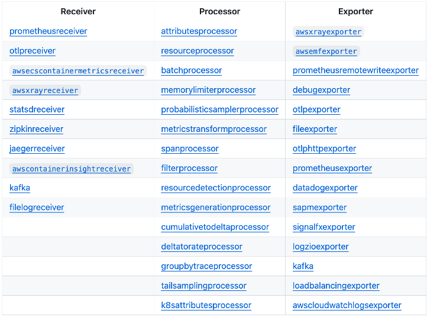

# Configurer les agents/collecteurs

Une fois que votre structure de compte de surveillance est en place, vous devrez configurer vos applications, services et autres composants d'infrastructure pour envoyer la télémétrie vers CloudWatch.

Ceci est un guide de haut niveau pour configurer vos agents et collecteurs. Pour des conseils approfondis, veuillez consulter les différentes sections de ce guide de bonnes pratiques.

## Amazon EKS

Pour EKS, la manière la plus simple de configurer l'observabilité est d'utiliser l'add-on Amazon EKS. Celui-ci installera Container Insights avec une observabilité améliorée pour Amazon EKS. L'add-on installe l'agent CloudWatch pour envoyer les métriques d'infrastructure depuis le cluster, installe Fluent Bit pour envoyer les journaux des conteneurs, et active également CloudWatch Application Signals pour envoyer la télémétrie de performance applicative. (Il est configurable si vous ne souhaitez pas Application Signals, Container Insights, etc.)

Typiquement, l'add-on Amazon CloudWatch Observability EKS est installé en tant que DaemonSet.

Quelques options pour EKS sont :

### Agent CloudWatch pour EKS

- Add-on Amazon CloudWatch Observability EKS
- Chart Helm Amazon CloudWatch Observability

### Collecteur OTEL pour EKS

Alternativement, si vous souhaitez utiliser le collecteur OTEL, vous pouvez :
- Configurer les exportateurs AWS
- Définir votre exportateur OTLP pour pointer vers les endpoints OTLP de journaux et de traces
- Définir vos pipelines de traitement
- Instrumenter votre application en utilisant les bibliothèques OTEL (si nécessaire)

## Amazon ECS

Pour ECS, vous pouvez activer Container Insights pour collecter les métriques d'infrastructure de vos clusters. Vous pouvez également déployer Application Signals pour collecter la télémétrie de performance applicative et les traces associées. Pour les journaux, vous pouvez utiliser le pilote awslogs pour envoyer vos données de journaux vers CloudWatch, ou vous pouvez utiliser les collecteurs OpenTelemetry pour envoyer les données.

Quelques options pour ECS sont :

### Agent CloudWatch pour ECS

- Activer Container Insights
- Déployer Application Signals (optionnel)
- Utiliser le pilote de journaux awslogs

### Collecteur OTEL pour ECS

Alternativement, vous pouvez :
- Exécuter en tant que sidecar
- Configurer les exportateurs AWS
- Définir les endpoints OTLP
- Définir les pipelines de traitement
- Instrumenter les applications (si nécessaire)

## Amazon EC2 et on-premises

L'agent CloudWatch peut être utilisé pour envoyer les données de télémétrie depuis les instances EC2, d'autres machines virtuelles et les serveurs on-premises vers CloudWatch.

### Options de déploiement

- **Workload Detection pour EC2** – Fournit un moyen automatisé de déployer l'agent

- **Systems Manager** – Déployer et configurer l'agent en utilisant AWS Systems Manager
- **Automatisation personnalisée** – Utiliser vos propres outils d'automatisation
- **Installation manuelle** – Installer manuellement pour des cas d'utilisation spécifiques

Vous pouvez configurer/personnaliser la télémétrie via un fichier de configuration (automatiquement ou manuellement), et un assistant est disponible pour vous aider à affiner vos paramètres.

### Collecteur OTEL pour EC2

Vous pouvez également utiliser le collecteur OTEL avec :

**Exportateurs OTLP :**

Utilisez les exportateurs OTLP pour les endpoints OTLP de traces et de journaux.

**Exportateurs spécifiques AWS :**

Utilisez les exportateurs spécifiques AWS et les pipelines de traitement.

## Résumé

En résumé :
1. Choisissez l'agent/collecteur approprié pour votre plateforme de calcul (EKS, ECS, EC2)
2. Déployez en utilisant des méthodes automatisées (add-ons, charts Helm, Systems Manager) ou une installation manuelle
3. Configurez la collecte de télémétrie selon vos besoins
4. Utilisez optionnellement OpenTelemetry pour une instrumentation indépendante du fournisseur

Pour des guides de configuration détaillés, consultez les sections spécifiques de ce guide de bonnes pratiques pour votre plateforme de calcul et vos outils d'observabilité.

## Étapes suivantes

Continuez vers [Tableaux de bord et alertes](./dashboards-alerts.md)
