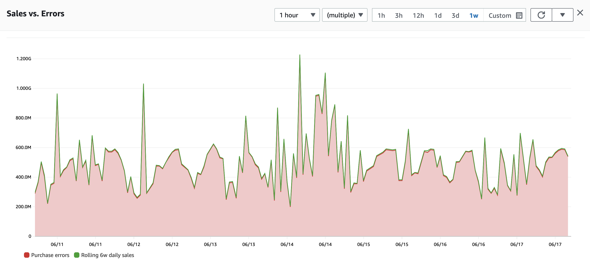

# Vue d'ensemble des meilleures pratiques

L'observabilité est un sujet vaste avec un paysage mature d'outils. Cependant, chaque outil n'est pas adapté à chaque solution ! Pour vous aider à naviguer dans vos exigences d'observabilité, votre configuration et votre déploiement final, nous avons résumé cinq meilleures pratiques clés qui informeront votre processus de prise de décision sur votre stratégie d'observabilité.

## Surveillez ce qui compte

La considération la plus importante en matière d'observabilité n'est pas vos serveurs, votre réseau, vos applications ou vos clients. C'est ce qui compte pour *vous*, votre entreprise, votre projet ou vos utilisateurs.

Commencez d'abord par vos critères de réussite. Par exemple, si vous exploitez une application de commerce en ligne, vos mesures de succès peuvent être le nombre d'achats effectués au cours de la dernière heure. Si vous gérez une organisation à but non lucratif, ce sera peut-être les dons par rapport à votre objectif mensuel. Un processeur de paiement surveillerait le temps de traitement des transactions, tandis que les universités voudraient mesurer la présence des étudiants.

:::tip
	Les métriques de succès sont différentes pour chacun ! Nous pouvons utiliser une application de commerce en ligne comme exemple ici, mais vos projets peuvent avoir des mesures très différentes. Quoi qu'il en soit, le conseil reste le même : sachez à quoi ressemble le *succès* et mesurez-le.
:::

Quelle que soit votre application, vous devez commencer par identifier vos métriques clés. Ensuite, *travaillez à rebours[^1]* à partir de cela pour voir ce qui l'impacte du point de vue de l'application ou de l'infrastructure. Par exemple, si un CPU élevé sur vos serveurs web met en danger la satisfaction client, et par conséquent vos ventes, alors la surveillance de l'utilisation du CPU est importante !

#### Connaissez vos objectifs et mesurez-les !

Ayant identifié vos KPI importants de haut niveau, votre prochaine tâche est d'avoir un moyen automatisé de les suivre et de les mesurer. Un facteur critique de succès est de le faire dans le même système qui surveille les opérations de votre charge de travail. Pour notre exemple d'application de commerce en ligne, cela pourrait signifier :

* Publier les données de ventes dans une [*série temporelle*](https://en.wikipedia.org/wiki/Time_series)
* Suivre les inscriptions d'utilisateurs dans ce même système
* Mesurer combien de temps les clients restent sur les pages web, et (encore) pousser ces données dans une série temporelle

La plupart des clients disposent déjà de ces données, bien que pas nécessairement aux bons endroits du point de vue de l'observabilité. Les données de ventes se trouvent généralement dans des bases de données relationnelles ou des systèmes de reporting d'intelligence d'affaires, ainsi que les inscriptions d'utilisateurs. Et les données de durée de visite peuvent être extraites des logs ou du [Real User Monitoring](../tools/rum).

Quel que soit l'emplacement ou le format d'origine de vos données métriques, elles doivent être maintenues en tant que [*série temporelle*](https://en.wikipedia.org/wiki/Time_series). Chaque métrique clé qui compte le plus pour vous, qu'elle soit commerciale, personnelle, académique ou à toute autre fin, doit être au format de série temporelle pour que vous puissiez la corréler avec d'autres données d'observabilité (parfois appelées *signaux* ou *télémétrie*).

*Figure 1 : exemple de série temporelle*

## Propagation du contexte et sélection des outils

La sélection des outils est importante et a un impact profond sur la façon dont vous opérez et remédiez aux problèmes. Mais pire que de choisir un outil sous-optimal est de ne pas outiller tous les types de signaux de base. Par exemple, collecter des [logs](../signals/logs) basiques d'une charge de travail, mais manquer les traces de transactions, vous laisse avec une lacune. Le résultat est une vue incohérente de l'ensemble de l'expérience de votre application. Toutes les approches modernes de l'observabilité dépendent de la « connexion des points » avec les traces d'application.

Une image complète de votre santé et de vos opérations nécessite des outils qui collectent les [logs](../signals/logs), les [métriques](../signals/metrics) et les [traces](../signals/traces), puis effectuent la corrélation, l'analyse, la [détection d'anomalies](../signals/anomalies), la création de [tableaux de bord](../tools/dashboards), les [alarmes](../tools/alarms) et plus encore.

:::info
	Certaines solutions d'observabilité peuvent ne pas contenir tout ce qui précède mais sont destinées à augmenter, étendre ou apporter une valeur ajoutée aux systèmes existants. Dans tous les cas, l'interopérabilité et l'extensibilité des outils sont des considérations importantes lors du démarrage d'un projet d'observabilité.
:::

#### Chaque charge de travail est différente, mais des outils communs permettent des résultats plus rapides

L'utilisation d'un ensemble commun d'outils pour chaque charge de travail présente des avantages supplémentaires tels que la réduction des frictions opérationnelles et de la formation, et généralement vous devriez viser un nombre réduit d'outils ou de fournisseurs. Cela vous permet de déployer rapidement des solutions d'observabilité existantes vers de nouveaux environnements ou charges de travail, et avec un temps de résolution plus rapide lorsque les choses tournent mal.

Vos outils doivent être suffisamment larges pour observer chaque niveau de votre charge de travail : infrastructure de base, applications, sites web et tout ce qui se trouve entre les deux. Dans les cas où un seul outil n'est pas possible, la meilleure pratique est d'utiliser ceux qui ont un standard ouvert, sont open source et offrent donc les possibilités d'intégration multiplateforme les plus larges.

#### Intégrez avec les outils et processus existants

Ne réinventez pas la roue ! Le « rond » est déjà une excellente forme, et nous devrions toujours construire des systèmes collaboratifs et ouverts, pas des silos de données.

* Intégrez avec les fournisseurs d'identité existants (par ex. Active Directory, IdPs basés sur SAML).
* Si vous avez un système de suivi des incidents IT existant (par ex. JIRA, ServiceNow), intégrez-le pour gérer rapidement les problèmes dès qu'ils surviennent.
* Utilisez les outils de gestion de charge de travail et d'escalade existants (par ex. PagerDuty, OpsGenie) si vous les avez déjà !
* Les outils d'infrastructure as code tels qu'Ansible, SaltStack, CloudFormation, Terraform et CDK sont tous d'excellents outils. Utilisez-les pour gérer votre observabilité ainsi que tout le reste, et construisez votre solution d'observabilité avec les mêmes outils d'infrastructure as code que vous utilisez déjà aujourd'hui (voir [inclure l'observabilité dès le premier jour](#inclure-lobservabilité-dès-le-premier-jour)).

#### Utilisez l'automatisation et l'apprentissage automatique

Les ordinateurs sont doués pour trouver des patterns, et pour trouver quand les données ne suivent *pas* un pattern ! Si vous avez des centaines, des milliers, voire des millions de points de données à surveiller, il serait alors impossible de comprendre les seuils sains pour chacun d'entre eux. Mais de nombreuses solutions d'observabilité disposent de capacités de détection d'anomalies et d'apprentissage automatique qui gèrent le travail lourd indifférencié de l'établissement de la ligne de base de vos données.

Nous appelons cela « savoir à quoi ressemble le bon ». Si vous avez effectué des tests de charge approfondis sur votre charge de travail, vous connaissez peut-être déjà ces métriques de performance saines, mais pour une application distribuée complexe, il peut être difficile de créer des lignes de base pour chaque métrique. C'est là que la détection d'anomalies, l'automatisation et l'apprentissage automatique sont inestimables.

Exploitez les outils qui gèrent l'établissement de la ligne de base et les alertes de santé des applications en votre nom, vous permettant ainsi de vous concentrer sur vos objectifs et de [surveiller ce qui compte](#surveillez-ce-qui-compte).

## Collectez la télémétrie de tous les niveaux de votre charge de travail

Vos applications n'existent pas en isolation, et les interactions avec votre infrastructure réseau, les fournisseurs cloud, les fournisseurs d'accès Internet, les partenaires SaaS et d'autres composants à la fois dans et hors de votre contrôle peuvent tous impacter vos résultats. Il est important que vous ayez une vue holistique de l'ensemble de votre charge de travail.

#### Concentrez-vous sur les intégrations

Si vous devez choisir un domaine à instrumenter, ce sera sans aucun doute vos intégrations entre composants. C'est là que la puissance de l'observabilité est la plus évidente. En règle générale, chaque fois qu'un composant ou service appelle un autre, cet appel doit avoir au moins ces points de données mesurés :

1. La durée de la requête et de la réponse
1. Le statut de la réponse

Et pour créer la vue cohésive et holistique que l'observabilité exige, un [identifiant unique](../signals/traces) pour l'ensemble de la chaîne de requêtes doit être inclus dans les signaux collectés.

#### N'oubliez pas l'expérience de l'utilisateur final

Avoir une vue complète de votre charge de travail signifie la comprendre à tous les niveaux, y compris la façon dont vos utilisateurs finaux l'expérimentent. Mesurer, quantifier et comprendre quand vos objectifs sont menacés par une mauvaise expérience utilisateur est tout aussi important que surveiller l'espace disque libre ou l'utilisation du CPU - sinon plus important !

Si vos charges de travail interagissent directement avec l'utilisateur final (comme toute application servie en tant que site web ou application mobile), alors le [Real User Monitoring](../tools/rum) surveille non seulement le « dernier kilomètre » de la livraison à l'utilisateur, mais aussi la façon dont ils ont réellement vécu votre application. En fin de compte, rien du parcours d'observabilité ne compte si vos utilisateurs ne peuvent pas réellement utiliser vos services.

## Les données sont un pouvoir, mais ne vous attardez pas sur les détails

Selon la taille de votre application, vous pouvez avoir un très grand nombre de composants à partir desquels collecter des signaux. Bien que cela soit important et donnant du pouvoir, les rendements de vos efforts peuvent diminuer. C'est pourquoi la meilleure pratique est de commencer par [surveiller ce qui compte](#surveillez-ce-qui-compte), d'utiliser cela comme un moyen de cartographier vos intégrations importantes et vos composants critiques, et de vous concentrer sur les bons détails.

## Inclure l'observabilité dès le premier jour

Comme la sécurité, l'observabilité ne devrait pas être une réflexion après coup dans votre développement ou vos opérations. La meilleure pratique est de mettre l'observabilité tôt dans votre planification, tout comme la sécurité, ce qui crée un modèle avec lequel les gens peuvent travailler et réduit les coins opaques de votre application. Ajouter le traçage des transactions après que le travail de développement majeur est terminé prend du temps, même avec l'auto-instrumentation. L'effort rapporte des rendements bien supérieurs ! Mais le faire tard dans votre cycle de développement peut créer du retravail.

Plutôt que de boulonner l'observabilité dans votre charge de travail plus tard, utilisez-la pour aider à *accélérer* votre travail. Une collecte appropriée de [logs](../signals/logs), de [métriques](../signals/metrics) et de [traces](../signals/traces) permet un développement d'application plus rapide, favorise les bonnes pratiques et pose les bases d'une résolution rapide des problèmes à l'avenir.

[^1]: Amazon utilise le processus de *travail à rebours* de manière extensive comme moyen de se focaliser sur nos clients et leurs résultats, et nous recommandons vivement à toute personne travaillant sur des solutions d'observabilité de travailler à rebours à partir de ses propres objectifs de la même manière. Vous pouvez en savoir plus sur le *travail à rebours* sur le [blog de Werner Vogels](https://www.allthingsdistributed.com/2006/11/working_backwards.html).
