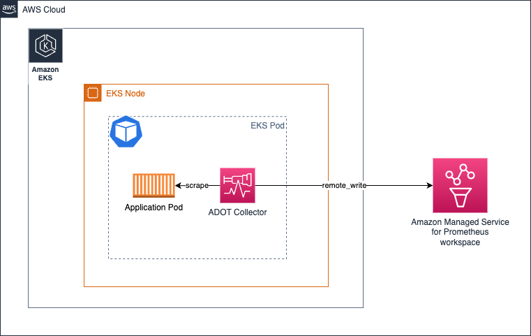
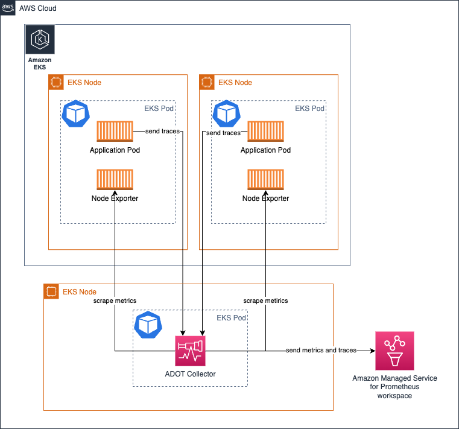

# Exploitation du collecteur AWS Distro for OpenTelemetry (ADOT)

Le [collecteur ADOT](https://aws-otel.github.io/) est une distribution en aval du [collecteur OpenTelemetry](https://opentelemetry.io/docs/collector/) open-source par [CNCF](https://www.cncf.io/).

Les clients peuvent utiliser le collecteur ADOT pour collecter des signaux tels que les métriques et les traces depuis différents environnements, y compris on-prem, AWS et d'autres fournisseurs cloud.

Pour exploiter le collecteur ADOT dans un environnement réel et à grande échelle, les opérateurs doivent surveiller la santé du collecteur et le mettre à l'échelle selon les besoins. Dans ce guide, vous apprendrez les actions à entreprendre pour exploiter le collecteur ADOT dans un environnement de production.

## Architecture de déploiement

Selon vos exigences, il existe plusieurs options de déploiement que vous pourriez envisager.

* Sans collecteur
* Agent
* Gateway


:::tip
    Consultez la [documentation OpenTelemetry](https://opentelemetry.io/docs/collector/deployment/)
    pour des informations supplémentaires sur ces concepts.
:::

### Sans collecteur
Cette option élimine essentiellement le collecteur de l'équation. Si vous ne le savez pas, il est possible de faire des appels API directement aux services de destination depuis le SDK OTEL et d'envoyer les signaux. Imaginez que vous faites des appels à l'API [PutTraceSegments](https://docs.aws.amazon.com/xray/latest/api/API_PutTraceSegments.html) d'AWS X-Ray directement depuis le processus de votre application au lieu d'envoyer les spans à un agent hors-processus tel que le collecteur ADOT.

Nous vous encourageons fortement à consulter la [section](https://opentelemetry.io/docs/collector/deployment/no-collector/) dans la documentation upstream pour plus de détails car il n'y a pas d'aspect spécifique à AWS qui change les recommandations pour cette approche.


### Agent
Dans cette approche, vous exécuterez le collecteur de manière distribuée et collecterez les signaux vers les destinations. Contrairement à l'option `Sans collecteur`, ici nous séparons les préoccupations et découplons l'application de l'obligation d'utiliser ses ressources pour effectuer des appels API distants et la faisons plutôt communiquer avec un agent accessible localement.

Essentiellement, cela ressemblera à ce qui suit dans un environnement Amazon EKS **exécutant le collecteur comme sidecar Kubernetes :**



Dans cette architecture ci-dessus, votre configuration de scrape ne devrait pas avoir besoin d'utiliser de mécanismes de service discovery puisque vous scraperez les cibles depuis `localhost` étant donné que le collecteur s'exécute dans le même pod que le conteneur de l'application.

La même architecture s'applique également à la collecte de traces. Vous devrez simplement créer un pipeline OTEL comme [montré ici](https://aws-otel.github.io/docs/getting-started/x-ray#sample-collector-configuration-putting-it-together)

##### Avantages et inconvénients
* Un argument en faveur de cette conception est que vous n'avez pas à allouer une quantité extraordinaire de ressources (CPU, mémoire) pour que le collecteur fasse son travail puisque les cibles sont limitées aux sources localhost.

* L'inconvénient de cette approche pourrait être que le nombre de configurations variées pour la configuration du pod du collecteur est directement proportionnel au nombre d'applications que vous exécutez sur le cluster.
Cela signifie que vous devrez gérer le CPU, la mémoire et l'allocation d'autres ressources individuellement pour chaque Pod en fonction de la charge de travail attendue pour le Pod. En ne faisant pas attention à cela, vous pourriez sur- ou sous-allouer des ressources pour le Pod du collecteur, ce qui entraînerait soit des performances insuffisantes, soit le verrouillage de cycles CPU et de mémoire qui pourraient autrement être utilisés par d'autres Pods dans le noeud.

Vous pouvez également déployer le collecteur dans d'autres modèles tels que Deployments, Daemonset, Statefulset, etc. selon vos besoins.

#### Exécution du collecteur en tant que Daemonset sur Amazon EKS

Vous pouvez choisir d'exécuter le collecteur en tant que [Daemonset](https://kubernetes.io/docs/concepts/workloads/controllers/daemonset/) si vous souhaitez répartir uniformément la charge (scraping et envoi des métriques vers le workspace Amazon Managed Service for Prometheus) des collecteurs à travers les noeuds EKS.


Assurez-vous d'avoir l'action `keep` qui fait que le collecteur ne scrape que les cibles de son propre hôte/noeud.

Voir l'exemple ci-dessous pour référence. Trouvez plus de détails de configuration [ici.](https://aws-otel.github.io/docs/getting-started/adot-eks-add-on/config-advanced#daemonset-collector-configuration)

```yaml
scrape_configs:
    - job_name: kubernetes-apiservers
    bearer_token_file: /var/run/secrets/kubernetes.io/serviceaccount/token
    kubernetes_sd_configs:
    - role: endpoints
    relabel_configs:
    - action: keep
        regex: $K8S_NODE_NAME
        source_labels: [__meta_kubernetes_endpoint_node_name]
    scheme: https
    tls_config:
        ca_file: /var/run/secrets/kubernetes.io/serviceaccount/ca.crt
        insecure_skip_verify: true
```

La même architecture peut également être utilisée pour la collecte de traces. Dans ce cas, au lieu que le collecteur contacte les endpoints pour scraper les métriques Prometheus, les spans de trace seront envoyés au collecteur par les pods d'application.

##### Avantages et inconvénients
**Avantages**

* Préoccupations minimales de mise à l'échelle
* La configuration de la haute disponibilité est un défi
* Trop de copies du collecteur en utilisation
* Peut être facile pour le support des logs

**Inconvénients**

* Pas le plus optimal en termes d'utilisation des ressources
* Allocation de ressources disproportionnée


#### Exécution du collecteur sur Amazon EC2
Comme il n'y a pas d'approche sidecar pour exécuter le collecteur sur EC2, vous exécuteriez le collecteur comme agent sur l'instance EC2. Vous pouvez définir une configuration de scrape statique comme celle ci-dessous pour découvrir les cibles dans l'instance à scraper.

La configuration ci-dessous scrape les endpoints aux ports `9090` et `8081` sur localhost.

Obtenez une expérience pratique approfondie sur ce sujet en parcourant notre [module axé sur EC2 dans le One Observability Workshop.](https://catalog.workshops.aws/observability/en-US/aws-managed-oss/ec2-monitoring)

```yaml
global:
  scrape_interval: 15s # By default, scrape targets every 15 seconds.

scrape_configs:
- job_name: 'prometheus'
  static_configs:
  - targets: ['localhost:9090', 'localhost:8081']
```

#### Exécution du collecteur en tant que Deployment sur Amazon EKS

Exécuter le collecteur en tant que Deployment est particulièrement utile lorsque vous souhaitez également fournir une haute disponibilité pour vos collecteurs. En fonction du nombre de cibles, des métriques disponibles à scraper, etc., les ressources du collecteur doivent être ajustées pour s'assurer que le collecteur ne manque pas de ressources et ne cause donc pas de problèmes dans la collecte de signaux.

[En savoir plus sur ce sujet dans le guide ici.](https://aws-observability.github.io/observability-best-practices/guides/containers/oss/eks/best-practices-metrics-collection)

L'architecture suivante montre comment un collecteur est déployé dans un noeud séparé en dehors des noeuds de charge de travail pour collecter les métriques et les traces.



Pour configurer la haute disponibilité pour la collecte de métriques, [lisez notre documentation qui fournit des instructions détaillées sur la façon de le configurer](https://docs.aws.amazon.com/prometheus/latest/userguide/Send-high-availability-prom-community.html)

#### Exécution du collecteur comme tâche centrale sur Amazon ECS pour la collecte de métriques

Vous pouvez utiliser l'[extension ECS Observer](https://github.com/open-telemetry/opentelemetry-collector-contrib/tree/main/extension/observer/ecsobserver) pour collecter des métriques Prometheus à travers différentes tâches dans un cluster ECS ou à travers les clusters.


Exemple de configuration du collecteur pour l'extension :

```yaml
extensions:
  ecs_observer:
    refresh_interval: 60s # format is https://golang.org/pkg/time/#ParseDuration
    cluster_name: 'Cluster-1' # cluster name need manual config
    cluster_region: 'us-west-2' # region can be configured directly or use AWS_REGION env var
    result_file: '/etc/ecs_sd_targets.yaml' # the directory for file must already exists
    services:
      - name_pattern: '^retail-.*$'
    docker_labels:
      - port_label: 'ECS_PROMETHEUS_EXPORTER_PORT'
    task_definitions:
      - job_name: 'task_def_1'
        metrics_path: '/metrics'
        metrics_ports:
          - 9113
          - 9090
        arn_pattern: '.*:task-definition/nginx:[0-9]+'
```


##### Avantages et inconvénients
* Un avantage de ce modèle est qu'il y a moins de collecteurs et de configurations à gérer vous-même.
* Lorsque le cluster est plutôt grand et qu'il y a des milliers de cibles à scraper, vous devrez concevoir soigneusement l'architecture de manière à ce que la charge soit répartie entre les collecteurs. Ajouter à cela le fait de devoir exécuter des quasi-clones des mêmes collecteurs pour des raisons de HA doit être fait avec soin afin d'éviter des problèmes opérationnels.

### Gateway


## Gestion de la santé du collecteur
Le collecteur OTEL expose plusieurs signaux pour nous permettre de suivre sa santé et ses performances. Il est essentiel que la santé du collecteur soit étroitement surveillée afin de prendre des actions correctives telles que :

* Mise à l'échelle horizontale du collecteur
* Provisionnement de ressources supplémentaires pour que le collecteur fonctionne comme souhaité


### Collecte des métriques de santé du collecteur

Le collecteur OTEL peut être configuré pour exposer des métriques au format Prometheus Exposition Format en ajoutant simplement la section `telemetry` au pipeline `service`. Le collecteur peut également exposer ses propres logs vers stdout.

Plus de détails sur la configuration de la télémétrie peuvent être trouvés dans la [documentation OpenTelemetry ici.](https://opentelemetry.io/docs/collector/configuration/#service)

Exemple de configuration de télémétrie pour le collecteur.

```yaml
service:
  telemetry:
    logs:
      level: debug
    metrics:
      level: detailed
      address: 0.0.0.0:8888
```
Une fois configuré, le collecteur commencera à exporter des métriques comme celles-ci à `http://localhost:8888/metrics`.

```bash
# HELP otelcol_exporter_enqueue_failed_spans Number of spans failed to be added to the sending queue.
# TYPE otelcol_exporter_enqueue_failed_spans counter
otelcol_exporter_enqueue_failed_spans{exporter="awsxray",service_instance_id="523a2182-539d-47f6-ba3c-13867b60092a",service_name="aws-otel-collector",service_version="v0.25.0"} 0

# HELP otelcol_process_runtime_total_sys_memory_bytes Total bytes of memory obtained from the OS (see 'go doc runtime.MemStats.Sys')
# TYPE otelcol_process_runtime_total_sys_memory_bytes gauge
otelcol_process_runtime_total_sys_memory_bytes{service_instance_id="523a2182-539d-47f6-ba3c-13867b60092a",service_name="aws-otel-collector",service_version="v0.25.0"} 2.4462344e+07

# HELP otelcol_process_memory_rss Total physical memory (resident set size)
# TYPE otelcol_process_memory_rss gauge
otelcol_process_memory_rss{service_instance_id="523a2182-539d-47f6-ba3c-13867b60092a",service_name="aws-otel-collector",service_version="v0.25.0"} 6.5675264e+07

# HELP otelcol_exporter_enqueue_failed_metric_points Number of metric points failed to be added to the sending queue.
# TYPE otelcol_exporter_enqueue_failed_metric_points counter
otelcol_exporter_enqueue_failed_metric_points{exporter="awsxray",service_instance_id="d234b769-dc8a-4b20-8b2b-9c4f342466fe",service_name="aws-otel-collector",service_version="v0.25.0"} 0
otelcol_exporter_enqueue_failed_metric_points{exporter="logging",service_instance_id="d234b769-dc8a-4b20-8b2b-9c4f342466fe",service_name="aws-otel-collector",service_version="v0.25.0"} 0
```

Dans l'exemple de sortie ci-dessus, vous pouvez voir que le collecteur expose une métrique appelée `otelcol_exporter_enqueue_failed_spans` montrant le nombre de spans qui n'ont pas pu être ajoutés à la file d'envoi. Cette métrique est à surveiller pour comprendre si le collecteur a des problèmes pour envoyer les données de trace à la destination configurée. Dans ce cas, vous pouvez voir que le label `exporter` avec la valeur `awsxray` indique la destination de trace en cours d'utilisation.

L'autre métrique `otelcol_process_runtime_total_sys_memory_bytes` est un indicateur pour comprendre la quantité de mémoire utilisée par le collecteur. Si cette mémoire se rapproche trop de la valeur de la métrique `otelcol_process_memory_rss`, c'est une indication que le collecteur approche de l'épuisement de la mémoire allouée au processus et qu'il est peut-être temps pour vous d'agir, comme allouer plus de mémoire au collecteur pour éviter les problèmes.

De même, vous pouvez voir qu'il existe une autre métrique de type compteur appelée `otelcol_exporter_enqueue_failed_metric_points` qui indique le nombre de métriques qui n'ont pas pu être envoyées à la destination distante.

#### Vérification de santé du collecteur
Il existe une sonde de vivacité (liveness probe) que le collecteur expose pour vous permettre de vérifier si le collecteur est actif ou non. Il est recommandé d'utiliser cet endpoint pour vérifier périodiquement la disponibilité du collecteur.

L'extension [`healthcheck`](https://github.com/open-telemetry/opentelemetry-collector-contrib/tree/main/extension/healthcheckextension) peut être utilisée pour que le collecteur expose l'endpoint. Voir la configuration d'exemple ci-dessous :

```yaml
extensions:
  health_check:
    endpoint: 0.0.0.0:13133
```

Pour les options de configuration complètes, référez-vous au [dépôt GitHub ici.](https://github.com/open-telemetry/opentelemetry-collector-contrib/tree/main/extension/healthcheckextension)

```bash
> curl -v http://localhost:13133
*   Trying 127.0.0.1:13133...
* Connected to localhost (127.0.0.1) port 13133 (#0)
> GET / HTTP/1.1
> Host: localhost:13133
> User-Agent: curl/7.79.1
> Accept: */*
>
* Mark bundle as not supporting multiuse
< HTTP/1.1 200 OK
< Date: Fri, 24 Feb 2023 19:09:22 GMT
< Content-Length: 0
<
* Connection #0 to host localhost left intact
```

#### Définition de limites pour prévenir les défaillances catastrophiques
Étant donné que les ressources (CPU, mémoire) sont finies dans tout environnement, vous devriez définir des limites sur les composants du collecteur afin d'éviter les défaillances dues à des situations imprévues.

C'est particulièrement important lorsque vous exploitez le collecteur ADOT pour collecter des métriques Prometheus.
Prenons ce scénario - Vous êtes dans l'équipe DevOps et êtes responsable du déploiement et de l'exploitation du collecteur ADOT dans un cluster Amazon EKS. Vos équipes d'application peuvent simplement déposer leurs pods d'application à volonté à tout moment de la journée, et elles s'attendent à ce que les métriques exposées depuis leurs pods soient collectées dans un workspace Amazon Managed Service for Prometheus.

Il est maintenant de votre responsabilité de vous assurer que ce pipeline fonctionne sans accroc. Il existe deux façons de résoudre ce problème à un niveau élevé :

* Mettre le collecteur à l'échelle à l'infini (donc ajouter des noeuds au cluster si nécessaire) pour répondre à cette exigence
* Définir des limites sur la collecte de métriques et communiquer le seuil supérieur aux équipes d'application

Il y a des avantages et des inconvénients aux deux approches. Vous pouvez argumenter que vous voulez choisir l'option 1, si vous êtes entièrement engagé à soutenir vos besoins métier en croissance constante sans considérer les coûts ou la surcharge que cela pourrait entraîner. Bien que soutenir les besoins métier en croissance constante à l'infini puisse ressembler au point de vue "le cloud est pour la scalabilité infinie", cela peut apporter beaucoup de surcharge opérationnelle et pourrait mener à des situations beaucoup plus catastrophiques si on ne dispose pas d'un temps infini et de ressources humaines pour assurer des opérations continues ininterrompues, ce qui dans la plupart des cas n'est pas pratique.

Une approche beaucoup plus pragmatique et frugale serait de choisir l'option 2, où vous définissez des limites supérieures (et potentiellement les augmentez graduellement en fonction des besoins progressivement) à tout moment donné pour vous assurer que la frontière opérationnelle est évidente.

Voici un exemple de comment vous pouvez faire cela en utilisant le récepteur Prometheus dans le collecteur ADOT.

Dans la [scrape_config](https://prometheus.io/docs/prometheus/latest/configuration/configuration/#relabel_config) de Prometheus, vous pouvez définir plusieurs limites pour tout job de scrape particulier. Vous pourriez mettre des limites sur :

* La taille totale du corps du scrape
* Le nombre de labels à accepter (le scrape sera rejeté si cette limite est dépassée et vous pouvez le voir dans les logs du collecteur)
* Le nombre de cibles à scraper
* ...et plus

Vous pouvez voir toutes les options disponibles dans la [documentation Prometheus.](https://prometheus.io/docs/prometheus/latest/configuration/configuration/#relabel_config)

##### Limitation de l'utilisation de la mémoire
Le pipeline du collecteur peut être configuré pour utiliser le [`memorylimiterprocessor`](https://github.com/open-telemetry/opentelemetry-collector/tree/main/processor/memorylimiterprocessor) pour limiter la quantité de mémoire que le composant processeur utilisera. Il est courant de voir des clients vouloir que le collecteur effectue des opérations complexes nécessitant des besoins intensifs en mémoire et en CPU.

Bien que l'utilisation de processeurs tels que [`redactionprocessor,`](https://github.com/open-telemetry/opentelemetry-collector-contrib/tree/main/processor/redactionprocessor)[`filterprocessor,`](https://github.com/open-telemetry/opentelemetry-collector-contrib/tree/main/processor/filterprocessor)[`spanprocessor,`](https://github.com/open-telemetry/opentelemetry-collector-contrib/tree/main/processor/spanprocessor) soit passionnante et très utile, vous devriez également vous rappeler que les processeurs en général traitent des tâches de transformation de données et qu'ils ont besoin de garder les données en mémoire pour compléter les tâches. Cela peut amener un processeur spécifique à casser complètement le collecteur et également empêcher le collecteur d'avoir assez de mémoire pour exposer ses propres métriques de santé.

Vous pouvez éviter cela en limitant la quantité de mémoire que le collecteur peut utiliser en utilisant le [`memorylimiterprocessor.`](https://github.com/open-telemetry/opentelemetry-collector/tree/main/processor/memorylimiterprocessor). La recommandation est de fournir une mémoire tampon pour que le collecteur puisse l'utiliser pour exposer les métriques de santé et effectuer d'autres tâches afin que les processeurs ne prennent pas toute la mémoire allouée.

Par exemple, si votre pod EKS a une limite de mémoire de `10Gi`, alors définissez le `memorylimitprocessor` à moins de `10Gi`, par exemple `9Gi`, afin que le tampon de `1Gi` puisse être utilisé pour effectuer d'autres opérations telles que l'exposition des métriques de santé, les tâches du récepteur et de l'exportateur.

#### Gestion de la contre-pression

Certains patterns d'architecture (pattern Gateway) comme celui montré ci-dessous peuvent être utilisés pour centraliser certaines tâches opérationnelles telles que (mais sans s'y limiter) le filtrage des données sensibles hors des données de signal pour maintenir les exigences de conformité.


Cependant, il est possible de submerger le collecteur Gateway avec trop de tâches de _traitement_ qui peuvent causer des problèmes. L'approche recommandée serait de distribuer les tâches intensives en processus/mémoire entre les collecteurs individuels et le gateway afin que la charge de travail soit partagée.

Par exemple, vous pourriez utiliser le [`resourceprocessor`](https://github.com/open-telemetry/opentelemetry-collector-contrib/tree/main/processor/resourceprocessor) pour traiter les attributs de ressource et utiliser le [`transformprocessor`](https://github.com/open-telemetry/opentelemetry-collector-contrib/tree/main/processor/transformprocessor) pour transformer les données de signal depuis les collecteurs individuels dès que la collecte de signal se produit.

Ensuite, vous pourriez utiliser le [`filterprocessor`](https://github.com/open-telemetry/opentelemetry-collector-contrib/tree/main/processor/filterprocessor) pour filtrer certaines parties des données de signal et utiliser le [`redactionprocessor`](https://github.com/open-telemetry/opentelemetry-collector-contrib/tree/main/processor/redactionprocessor) pour expurger les informations sensibles telles que les numéros de carte de crédit, etc.

Le diagramme d'architecture de haut niveau ressemblerait à celui ci-dessous :


Comme vous l'avez peut-être déjà observé, le collecteur Gateway peut rapidement devenir un point de défaillance unique. Un choix évident est de démarrer plus d'un collecteur Gateway et de proxier les requêtes via un load balancer comme [AWS Application Load Balancer (ALB)](https://aws.amazon.com/elasticloadbalancing/application-load-balancer/) comme montré ci-dessous.


##### Gestion des échantillons hors-séquence dans la collecte de métriques Prometheus

Considérez le scénario suivant dans l'architecture ci-dessous :


1. Supposons que les métriques du **ADOT Collector-1** dans le cluster Amazon EKS sont envoyées au cluster Gateway, qui est dirigé vers le **Gateway ADOT Collector-1**
1. À un moment, les métriques du même **ADOT Collector-1** (qui collecte les mêmes cibles, donc les mêmes échantillons de métriques sont traités) sont envoyées au **Gateway ADOT Collector-2**
1. Maintenant si le **Gateway ADOT Collector-2** envoie les métriques au workspace Amazon Managed Service for Prometheus en premier puis suivi par le **Gateway ADOT Collector-1** qui contient des échantillons plus anciens pour la même série de métriques, vous recevrez l'erreur `out of order sample` d'Amazon Managed Service for Prometheus.

Voir l'exemple d'erreur ci-dessous :

```bash
Error message:
 2023-03-02T21:18:54.447Z        error   exporterhelper/queued_retry.go:394      Exporting failed. The error is not retryable. Dropping data.    {"kind": "exporter", "data_type": "metrics", "name": "prometheusremotewrite", "error": "Permanent error: Permanent error: remote write returned HTTP status 400 Bad Request; err = %!w(<nil>): user=820326043460_ws-5f42c3b6-3268-4737-b215-1371b55a9ef2: err: out of order sample. timestamp=2023-03-02T21:17:59.782Z, series={__name__=\"otelcol_exporter_send_failed_metric_points\", exporter=\"logging\", http_scheme=\"http\", instance=\"10.195.158.91:28888\", ", "dropped_items": 6474}
go.opentelemetry.io/collector/exporter/exporterhelper.(*retrySender).send
        go.opentelemetry.io/collector@v0.66.0/exporter/exporterhelper/queued_retry.go:394
go.opentelemetry.io/collector/exporter/exporterhelper.(*metricsSenderWithObservability).send
        go.opentelemetry.io/collector@v0.66.0/exporter/exporterhelper/metrics.go:135
go.opentelemetry.io/collector/exporter/exporterhelper.(*queuedRetrySender).start.func1
        go.opentelemetry.io/collector@v0.66.0/exporter/exporterhelper/queued_retry.go:205
go.opentelemetry.io/collector/exporter/exporterhelper/internal.(*boundedMemoryQueue).StartConsumers.func1
        go.opentelemetry.io/collector@v0.66.0/exporter/exporterhelper/internal/bounded_memory_queue.go:61
```

###### Résolution de l'erreur out of order sample

Vous pouvez résoudre l'erreur out of order sample dans cette configuration particulière de plusieurs façons :

* Utilisez un load balancer sticky pour diriger les requêtes d'une source particulière vers la même cible en fonction de l'adresse IP.

  Référez-vous au [lien ici](https://aws.amazon.com/premiumsupport/knowledge-center/elb-route-requests-with-source-ip-alb/) pour des détails supplémentaires.


* Comme option alternative, vous pouvez ajouter un label externe dans les collecteurs Gateway pour distinguer les séries de métriques afin qu'Amazon Managed Service for Prometheus considère que ces métriques sont des séries de métriques individuelles et ne proviennent pas de la même source.

:::warning
        L'utilisation de cette solution entraînera une multiplication des séries de métriques proportionnelle au nombre de collecteurs Gateway dans la configuration. Cela pourrait signifier que vous pouvez dépasser certaines limites telles que les [`Active time series limits`](https://docs.aws.amazon.com/prometheus/latest/userguide/AMP_quotas.html)
:::

* **Si vous déployez le collecteur ADOT en tant que Daemonset** : assurez-vous d'utiliser `relabel_configs` pour ne garder que les échantillons du même noeud où chaque pod du collecteur ADOT s'exécute. Consultez les liens ci-dessous pour en savoir plus.
    - [Advanced Collector Configuration for Amazon Managed Prometheus](https://aws-otel.github.io/docs/getting-started/adot-eks-add-on/config-advanced) - Développez la section *Click to View*, et recherchez les entrées similaires aux suivantes :
        ```yaml
            relabel_configs:
            - action: keep
              regex: $K8S_NODE_NAME
        ```
    - [ADOT Add-On Advanced Configuration](https://aws-otel.github.io/docs/getting-started/adot-eks-add-on/add-on-configuration) - Apprenez comment déployer le collecteur ADOT en utilisant les configurations avancées du ADOT Add-On pour EKS.
    - [ADOT Collector deployment strategies](https://aws-otel.github.io/docs/getting-started/adot-eks-add-on/installation#deploy-the-adot-collector) - Apprenez-en plus sur les différentes alternatives pour déployer le collecteur ADOT à grande échelle et les avantages de chaque approche.


#### Open Agent Management Protocol (OpAMP)

OpAMP est un protocole client/serveur qui prend en charge la communication via HTTP et WebSockets. OpAMP est implémenté dans le collecteur OTel et donc le collecteur OTel peut être utilisé comme serveur dans le cadre du plan de contrôle pour gérer d'autres agents qui prennent en charge OpAMP, comme le collecteur OTel lui-même. La partie "gérer" ici implique la capacité de mettre à jour les configurations des collecteurs, de surveiller la santé ou même de mettre à niveau les collecteurs.

Les détails de ce protocole sont bien [documentés dans le site web upstream OpenTelemetry.](https://opentelemetry.io/docs/collector/management/)

### Mise à l'échelle horizontale
Il peut devenir nécessaire de mettre à l'échelle horizontalement un collecteur ADOT en fonction de votre charge de travail. L'exigence de mise à l'échelle horizontale dépend entièrement de votre cas d'utilisation, de la configuration du collecteur et du débit de télémétrie.

Des techniques de mise à l'échelle horizontale spécifiques à la plateforme peuvent être appliquées à un collecteur comme vous le feriez pour toute autre application tout en étant conscient des composants du collecteur avec état, sans état et de type scraper.

La plupart des composants du collecteur sont `sans état` (stateless), ce qui signifie qu'ils ne conservent pas d'état en mémoire, et s'ils le font, ce n'est pas pertinent pour les besoins de mise à l'échelle. Des réplicas supplémentaires de collecteurs sans état peuvent être mis à l'échelle derrière un Application Load Balancer.

Les composants `avec état` (stateful) du collecteur sont des composants qui conservent des informations en mémoire qui sont cruciales pour le fonctionnement de ce composant.

Des exemples de composants avec état dans le collecteur ADOT incluent, mais ne sont pas limités à :

* [Tail Sampling Processor](https://github.com/open-telemetry/opentelemetry-collector-contrib/tree/main/processor/tailsamplingprocessor) - nécessite toutes les spans d'une trace pour prendre des décisions d'échantillonnage précises. Les techniques avancées de mise à l'échelle de l'échantillonnage sont [documentées sur le portail développeur ADOT](https://aws-otel.github.io/docs/getting-started/advanced-sampling).
* [AWS EMF Exporter](https://github.com/open-telemetry/opentelemetry-collector-contrib/tree/main/exporter/awsemfexporter) - effectue des conversions cumulatif vers delta sur certains types de métriques. Cette conversion nécessite que la valeur précédente de la métrique soit stockée en mémoire.
* [Cumulative to Delta Processor](https://github.com/open-telemetry/opentelemetry-collector-contrib/tree/main/processor/cumulativetodeltaprocessor#cumulative-to-delta-processor) - la conversion cumulatif vers delta nécessite le stockage de la valeur précédente de la métrique en mémoire.

Les composants du collecteur qui sont des `scrapers` obtiennent activement les données de télémétrie plutôt que de les recevoir passivement. Actuellement, le [récepteur Prometheus](https://github.com/open-telemetry/opentelemetry-collector-contrib/tree/main/receiver/prometheusreceiver) est le seul composant de type scraper dans le collecteur ADOT. La mise à l'échelle horizontale d'une configuration de collecteur contenant un récepteur Prometheus nécessitera de diviser les jobs de scraping par collecteur pour s'assurer qu'aucun deux collecteurs ne scrapent le même endpoint. Ne pas le faire peut entraîner des erreurs Prometheus out of order sample.

Le processus et les techniques de mise à l'échelle des collecteurs sont [documentés plus en détail dans le site web upstream OpenTelemetry](https://opentelemetry.io/docs/collector/scaling/).

