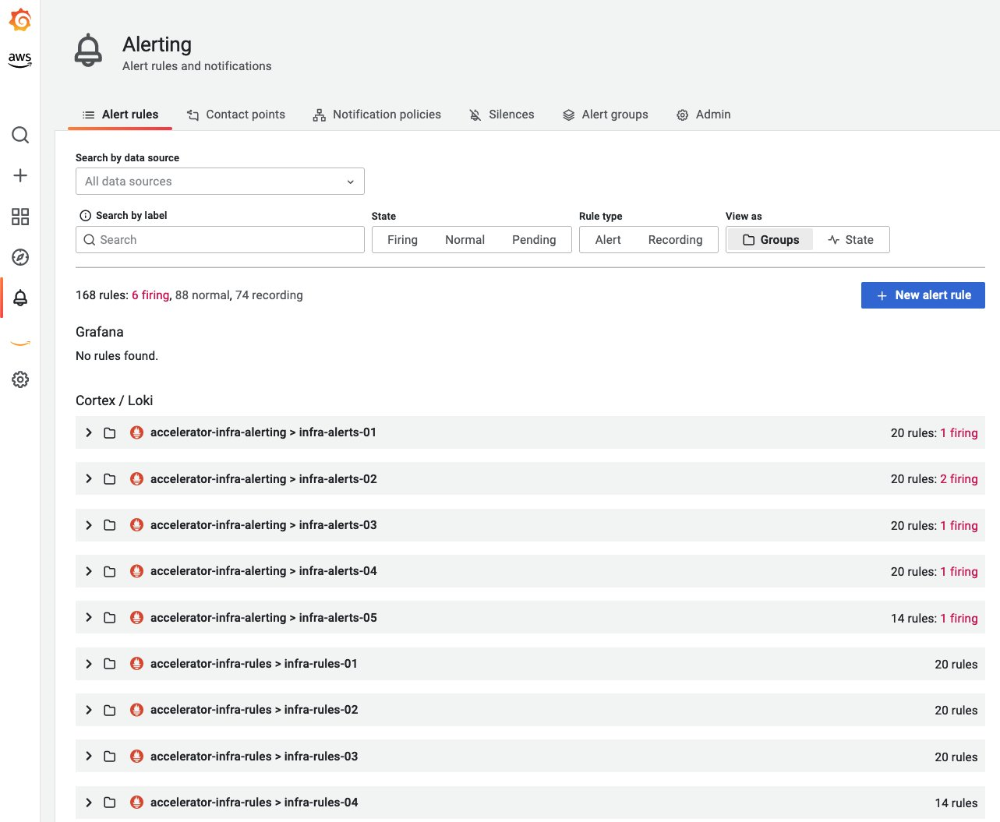

# Amazon Managed Service for Prometheus Alert Manager

## Introduction

[Amazon Managed Service for Prometheus](https://aws.amazon.com/prometheus/) (AMP) prend en charge deux types de règles, à savoir les '**règles d'enregistrement**' et les '**règles d'alerte**', qui peuvent être importées depuis votre serveur Prometheus existant et sont évaluées à intervalles réguliers.

Les [règles d'alerte](https://prometheus.io/docs/prometheus/latest/configuration/alerting_rules/) permettent aux clients de définir des conditions d'alerte basées sur [PromQL](https://prometheus.io/docs/prometheus/latest/querying/basics/) et un seuil. Lorsque la valeur de la règle d'alerte dépasse le seuil, une notification est envoyée à Alert Manager dans Amazon Managed Service for Prometheus, qui fournit une fonctionnalité similaire à Alert Manager dans Prometheus autonome. Une alerte est le résultat d'une règle d'alerte dans Prometheus lorsqu'elle est active.

## Fichier de règles d'alerte

Une règle d'alerte dans Amazon Managed Service for Prometheus est définie par un fichier de règles au format YAML, qui suit le même format qu'un fichier de règles dans Prometheus autonome. Les clients peuvent avoir plusieurs fichiers de règles dans un workspace Amazon Managed Service for Prometheus. Un workspace est un espace logique dédié au stockage et à l'interrogation des métriques Prometheus.

Un fichier de règles contient typiquement les champs suivants :

```
groups:
  - name:
  rules:
  - alert:
  expr:
  for:
  labels:
  annotations:
```

```console
Groups: A collection of rules that are run sequentially at a regular interval
Name: Name of the group
Rules: The rules in a group
Alert: Name of the alert
Expr: The expression for the alert to trigger
For: Minimum duration for an alert's expression to be exceeding threshold before updating to a firing status
Labels: Any additional labels attached to the alert
Annotations: Contextual details such as a description or link
```

Un exemple de fichier de règles ressemble à ceci :

```
groups:
  - name: test
    rules:
    - record: metric:recording_rule
      expr: avg(rate(container_cpu_usage_seconds_total[5m]))
  - name: alert-test
    rules:
    - alert: metric:alerting_rule
      expr: avg(rate(container_cpu_usage_seconds_total[5m])) > 0
      for: 2m
```

## Fichier de configuration Alert Manager

L'Alert Manager d'Amazon Managed Service for Prometheus utilise un fichier de configuration au format YAML pour configurer les alertes (pour le service récepteur) qui suit la même structure qu'un fichier de configuration Alert Manager dans Prometheus autonome. Le fichier de configuration se compose de deux sections clés pour Alert Manager et le templating :

1.  [template_files](https://prometheus.io/docs/prometheus/latest/configuration/template_reference/), contient les modèles d'annotations et de labels dans les alertes exposés sous forme de variables `$value`, `$labels`, `$externalLabels` et `$externalURL` pour plus de commodité. La variable `$labels` contient les paires clé/valeur de label d'une instance d'alerte. Les labels externes configurés globalement sont accessibles via la variable `$externalLabels`. La variable `$value` contient la valeur évaluée d'une instance d'alerte. `.Value`, `.Labels`, `.ExternalLabels` et `.ExternalURL` contiennent respectivement la valeur de l'alerte, les labels de l'alerte, les labels externes configurés globalement et l'URL externe (configurée avec `--web.external-url`).

2.  [alertmanager_config](https://prometheus.io/docs/alerting/latest/configuration/), contient la configuration d'Alert Manager qui utilise la même structure qu'un fichier de configuration Alert Manager dans Prometheus autonome.

Un exemple de fichier de configuration Alert Manager contenant à la fois template_files et alertmanager_config ressemble à ceci :

```
template_files:
  default_template: |
    {{ define "sns.default.subject" }}[{{ .Status | toUpper }}{{ if eq .Status "firing" }}:{{ .Alerts.Firing | len }}{{ end }}]{{ end }}
    {{ define "__alertmanager" }}AlertManager{{ end }}
    {{ define "__alertmanagerURL" }}{{ .ExternalURL }}/#/alerts?receiver={{ .Receiver | urlquery }}{{ end }}
alertmanager_config: |
  global:
  templates:
    - 'default_template'
  route:
    receiver: default
  receivers:
    - name: 'default'
      sns_configs:
      - topic_arn: arn:aws:sns:us-east-2:accountid:My-Topic
        sigv4:
          region: us-east-2
        attributes:
          key: severity
          value: SEV2
```

## Aspects clés de l'alerting

Il y a trois aspects importants à connaître lors de la création du [fichier de configuration Alert Manager](https://docs.aws.amazon.com/prometheus/latest/userguide/AMP-alert-manager.html) d'Amazon Managed Service for Prometheus.

- **Regroupement** : Cela permet de rassembler des alertes similaires en une seule notification, ce qui est utile lorsque le rayon d'impact d'une défaillance ou d'une panne est important, affectant de nombreux systèmes et que plusieurs alertes se déclenchent simultanément. Cela peut également être utilisé pour regrouper par catégories (ex. alertes de noeud, alertes de pod). Le bloc [route](https://prometheus.io/docs/alerting/latest/configuration/#route) dans le fichier de configuration Alert Manager peut être utilisé pour configurer ce regroupement.
- **Inhibition** : C'est un moyen de supprimer certaines notifications pour éviter le spam d'alertes similaires déjà actives et déclenchées. Le bloc [inhibit_rules](https://prometheus.io/docs/alerting/latest/configuration/#inhibit_rule) peut être utilisé pour écrire des règles d'inhibition.
- **Mise en silence** : Les alertes peuvent être mises en sourdine pour une durée spécifiée, par exemple pendant une fenêtre de maintenance ou une interruption planifiée. Les alertes entrantes sont vérifiées pour correspondre à toutes les conditions d'égalité ou d'expression régulière avant de mettre l'alerte en silence. L'API [PutAlertManagerSilences](https://docs.aws.amazon.com/prometheus/latest/userguide/AMP-APIReference.html#AMP-APIReference-PutAlertManagerSilences) peut être utilisée pour créer une mise en silence.

## Routage des alertes via Amazon Simple Notification Service (SNS)

Actuellement, [l'Alert Manager d'Amazon Managed Service for Prometheus prend en charge Amazon SNS](https://docs.aws.amazon.com/prometheus/latest/userguide/AMP-alertmanager-receiver-AMPpermission.html) comme seul récepteur. La section clé dans le bloc alertmanager_config est receivers, qui permet aux clients de configurer [Amazon SNS pour recevoir des alertes](https://docs.aws.amazon.com/prometheus/latest/userguide/AMP-alertmanager-receiver-config.html). La section suivante peut être utilisée comme modèle pour le bloc receivers.

```
- name: name_of_receiver
  sns_configs:
    - sigv4:
        region: <AWS_Region>
    topic_arn: <ARN_of_SNS_topic>
    subject: somesubject
    attributes:
       key: <somekey>
       value: <somevalue>
```

La configuration Amazon SNS utilise le modèle suivant par défaut, sauf s'il est explicitement remplacé.

```
{{ define "sns.default.message" }}{{ .CommonAnnotations.SortedPairs.Values | join " " }}
  {{ if gt (len .Alerts.Firing) 0 -}}
  Alerts Firing:
    {{ template "__text_alert_list" .Alerts.Firing }}
  {{- end }}
  {{ if gt (len .Alerts.Resolved) 0 -}}
  Alerts Resolved:
    {{ template "__text_alert_list" .Alerts.Resolved }}
  {{- end }}
{{- end }}
```

Référence supplémentaire : [Notification Template Examples](https://prometheus.io/docs/alerting/latest/notification_examples/)

## Routage des alertes vers d'autres destinations au-delà d'Amazon SNS

L'Alert Manager d'Amazon Managed Service for Prometheus peut utiliser [Amazon SNS pour se connecter à d'autres destinations](https://docs.aws.amazon.com/prometheus/latest/userguide/AMP-alertmanager-SNS-otherdestinations.html) telles que l'email, le webhook (HTTP), Slack, PagerDuty et OpsGenie.

- **Email** Une notification réussie résultera en un email reçu depuis l'Alert Manager d'Amazon Managed Service for Prometheus via le topic Amazon SNS avec les détails de l'alerte comme l'une des cibles.
- L'Alert Manager d'Amazon Managed Service for Prometheus peut [envoyer des alertes au format JSON](https://docs.aws.amazon.com/prometheus/latest/userguide/AMP-alertmanager-receiver-JSON.html), afin qu'elles puissent être traitées en aval depuis Amazon SNS dans AWS Lambda ou dans des endpoints recevant des webhooks.
- **Webhook** Un topic Amazon SNS existant peut être configuré pour envoyer des messages à un endpoint webhook. Les webhooks sont des messages au format JSON ou XML sérialisé, échangés via HTTP entre applications sur la base de déclencheurs événementiels. Cela peut être utilisé pour connecter tout [outil SIEM ou de collaboration](https://repost.aws/knowledge-center/sns-lambda-webhooks-chime-slack-teams) existant pour l'alerting, la gestion des tickets ou des incidents.
- **Slack** Les clients peuvent s'intégrer avec l'intégration [email-vers-canal de Slack](https://aws.amazon.com/blogs/mt/how-to-integrate-amazon-managed-service-for-prometheus-with-slack/) où Slack peut accepter un email et le transférer à un canal Slack, ou utiliser une fonction Lambda pour réécrire la notification SNS vers Slack.
- **PagerDuty** Le modèle utilisé dans le bloc `template_files` dans la définition `alertmanager_config` peut être personnalisé pour envoyer la charge utile vers [PagerDuty](https://aws.amazon.com/blogs/mt/using-amazon-managed-service-for-prometheus-alert-manager-to-receive-alerts-with-pagerduty/) comme destination d'Amazon SNS.

Référence supplémentaire : [Custom Alert manager Templates](https://prometheus.io/blog/2016/03/03/custom-alertmanager-templates/)

## Statut des alertes

Les règles d'alerte définissent des conditions d'alerte basées sur des expressions pour envoyer des alertes à tout service de notification, chaque fois que le seuil défini est dépassé. Un exemple de règle et son expression est montré ci-dessous.

```
rules:
- alert: metric:alerting_rule
  expr: avg(rate(container_cpu_usage_seconds_total[5m])) > 0
  for: 2m

```

Chaque fois que l'expression d'alerte produit un ou plusieurs éléments vectoriels à un moment donné, l'alerte est considérée comme active. Les alertes prennent un statut actif (pending | firing) ou résolu.

- **Pending** : Le temps écoulé depuis le dépassement du seuil est inférieur à l'intervalle d'enregistrement
- **Firing** : Le temps écoulé depuis le dépassement du seuil est supérieur à l'intervalle d'enregistrement et Alert Manager route les alertes.
- **Resolved** : L'alerte n'est plus en cours de déclenchement car le seuil n'est plus dépassé.

Cela peut être vérifié manuellement en interrogeant l'endpoint Alert Manager d'Amazon Managed Service for Prometheus avec l'API [ListAlerts](https://docs.aws.amazon.com/prometheus/latest/userguide/AMP-APIReference.html#AMP-APIReference-ListAlerts) en utilisant la commande [awscurl](https://docs.aws.amazon.com/prometheus/latest/userguide/AMP-compatible-APIs.html). Un exemple de requête est montré ci-dessous.

```
awscurl https://aps-workspaces.us-east-1.amazonaws.com/workspaces/$WORKSPACE_ID/alertmanager/api/v2/alerts --service="aps" -H "Content-Type: application/json"
```

## Règles Alert Manager d'Amazon Managed Service for Prometheus dans Amazon Managed Grafana

La fonctionnalité d'alerting d'Amazon Managed Grafana (AMG) permet aux clients d'avoir une visibilité sur les alertes Alert Manager d'Amazon Managed Service for Prometheus depuis leur workspace Amazon Managed Grafana. Les clients utilisant les workspaces Amazon Managed Service for Prometheus pour collecter des métriques Prometheus utilisent les fonctionnalités entièrement gérées Alert Manager et Ruler du service pour configurer les règles d'alerte et d'enregistrement. Avec cette fonctionnalité, ils peuvent visualiser toutes leurs règles d'alerte et d'enregistrement configurées dans leur workspace Amazon Managed Service for Prometheus. La vue des alertes Prometheus peut être activée dans la console Amazon Managed Grafana (AMG) en cochant la case Grafana alerting dans l'onglet des options de configuration du workspace. Une fois activée, cela migrera également les alertes Grafana natives précédemment créées dans les tableaux de bord Grafana vers une nouvelle page Alerting dans le workspace Grafana.

Référence : [Announcing Prometheus Alert manager rules in Amazon Managed Grafana](https://aws.amazon.com/blogs/mt/announcing-prometheus-alertmanager-rules-in-amazon-managed-grafana/)



## Alertes recommandées pour une surveillance de base

L'alerting est un aspect clé des bonnes pratiques de surveillance et d'Observability. Le mécanisme d'alerting doit trouver un équilibre entre la fatigue d'alerte et le risque de manquer des alertes critiques. Voici quelques alertes recommandées pour améliorer la fiabilité globale des charges de travail. Différentes équipes au sein de l'organisation surveillent leur infrastructure et leurs charges de travail sous différentes perspectives, ce qui signifie que cette liste peut être étendue ou modifiée selon les besoins et les scénarios ; il ne s'agit certainement pas d'une liste exhaustive.

- Le noeud de conteneur utilise plus d'un certain pourcentage (ex. 80%) de la limite de mémoire allouée.
- Le noeud de conteneur utilise plus d'un certain pourcentage (ex. 80%) de la limite CPU allouée.
- Le noeud de conteneur utilise plus d'un certain pourcentage (ex. 90%) de l'espace disque alloué.
- Le conteneur dans un pod dans un namespace utilise plus d'un certain pourcentage (ex. 80%) de la limite CPU allouée.
- Le conteneur dans un pod dans un namespace utilise plus d'un certain pourcentage (ex. 80%) de la limite de mémoire.
- Le conteneur dans un pod dans un namespace a eu trop de redémarrages.
- Le volume persistant dans un namespace utilise plus d'un certain pourcentage (max 75%) de l'espace disque.
- Le déploiement n'a actuellement aucun pod actif en cours d'exécution.
- Le Horizontal Pod Autoscaler (HPA) dans un namespace fonctionne à pleine capacité.

L'élément essentiel dans la configuration des alertes pour les scénarios ci-dessus ou similaires nécessitera que l'expression soit modifiée selon les besoins. Par exemple :

```
expr: |
        ((sum(irate(container_cpu_usage_seconds_total{image!="",container!="POD", namespace!="kube-sys"}[30s])) by (namespace,container,pod) /
sum(container_spec_cpu_quota{image!="",container!="POD", namespace!="kube-sys"} /
container_spec_cpu_period{image!="",container!="POD", namespace!="kube-sys"}) by (namespace,container,pod) ) * 100)  > 80
      for: 5m
```

## Contrôleur ACK pour Amazon Managed Service for Prometheus

Le contrôleur [AWS Controller for Kubernetes](https://github.com/aws-controllers-k8s/community) (ACK) d'Amazon Managed Service for Prometheus est disponible pour les ressources Workspace, Alert Manager et Ruler, ce qui permet aux clients de tirer parti de Prometheus en utilisant des [définitions de ressources personnalisées](https://kubernetes.io/docs/concepts/extend-kubernetes/api-extension/custom-resources/) (CRDs) et des objets ou services natifs fournissant des capacités de support sans avoir à définir des ressources en dehors du cluster Kubernetes. Le [contrôleur ACK pour Amazon Managed Service for Prometheus](https://aws.amazon.com/blogs/mt/introducing-the-ack-controller-for-amazon-managed-service-for-prometheus/) peut être utilisé pour gérer toutes les ressources directement depuis le cluster Kubernetes que vous surveillez, permettant à Kubernetes d'agir comme votre "source de vérité" pour l'état souhaité de votre charge de travail. [ACK](https://aws-controllers-k8s.github.io/community/docs/community/overview/) est une collection de CRDs Kubernetes et de contrôleurs personnalisés travaillant ensemble pour étendre l'API Kubernetes et gérer les ressources AWS.

Un extrait de règles d'alerte configurées avec ACK est montré ci-dessous :

```
apiVersion: prometheusservice.services.k8s.aws/v1alpha1
kind: RuleGroupsNamespace
metadata:
  name: default-rule
spec:
  workspaceID: WORKSPACE-ID
  name: default-rule
  configuration: |
    groups:
    - name: example
      rules:
      - alert: HostHighCpuLoad
        expr: 100 - (avg(rate(node_cpu_seconds_total{mode="idle"}[2m])) * 100) > 60
        for: 5m
        labels:
          severity: warning
          event_type: scale_up
        annotations:
          summary: Host high CPU load (instance {{ $labels.instance }})
          description: "CPU load is > 60%\n  VALUE = {{ $value }}\n  LABELS = {{ $labels }}"
      - alert: HostLowCpuLoad
        expr: 100 - (avg(rate(node_cpu_seconds_total{mode="idle"}[2m])) * 100) < 30
        for: 5m
        labels:
          severity: warning
          event_type: scale_down
        annotations:
          summary: Host low CPU load (instance {{ $labels.instance }})
          description: "CPU load is < 30%\n  VALUE = {{ $value }}\n  LABELS = {{ $labels }}"
```

## Restriction de l'accès aux règles avec une politique IAM

Les organisations ont besoin que différentes équipes puissent créer et administrer leurs propres règles pour leurs besoins d'enregistrement et d'alerting. La gestion des règles dans Amazon Managed Service for Prometheus permet de contrôler l'accès aux règles en utilisant des politiques AWS Identity and Access Management (IAM) afin que chaque équipe puisse contrôler son propre ensemble de règles et alertes regroupées par rulegroupnamespaces.

L'image ci-dessous montre deux exemples de rulegroupnamespaces appelés devops et engg ajoutés dans la gestion des règles d'Amazon Managed Service for Prometheus.


Le JSON ci-dessous est un exemple de politique IAM qui restreint l'accès au rulegroupnamespace devops (montré ci-dessus) avec l'ARN de la ressource spécifié. Les actions notables dans la politique IAM ci-dessous sont [PutRuleGroupsNamespace](https://docs.aws.amazon.com/cli/latest/reference/amp/put-rule-groups-namespace.html) et [DeleteRuleGroupsNamespace](https://docs.aws.amazon.com/cli/latest/reference/amp/delete-rule-groups-namespace.html) qui sont restreintes à l'ARN de ressource spécifié du rulegroupsnamespace du workspace AMP. Une fois la politique créée, elle peut être assignée à tout utilisateur, groupe ou rôle requis pour le contrôle d'accès souhaité. L'Action dans la politique IAM peut être modifiée/restreinte selon les besoins en fonction des [permissions IAM](https://docs.aws.amazon.com/prometheus/latest/userguide/AMP-APIReference.html) pour les actions requises et autorisées.

```json
{
  "Version": "2012-10-17",
  "Statement": [
    {
      "Sid": "VisualEditor0",
      "Effect": "Allow",
      "Action": [
        "aps:RemoteWrite",
        "aps:DescribeRuleGroupsNamespace",
        "aps:PutRuleGroupsNamespace",
        "aps:DeleteRuleGroupsNamespace"
      ],
      "Resource": [
        "arn:aws:aps:us-west-2:XXXXXXXXXXXX:workspace/ws-8da31ad6-f09d-44ff-93a3-xxxxxxxxxx",
        "arn:aws:aps:us-west-2:XXXXXXXXXXXX:rulegroupsnamespace/ws-8da31ad6-f09d-44ff-93a3-xxxxxxxxxx/devops"
      ]
    }
  ]
}
```

L'interaction awscli ci-dessous montre un exemple d'un utilisateur IAM ayant un accès restreint à un rulegroupsnamespace spécifié via l'ARN de ressource (c.-à-d. le rulegroupnamespace devops) dans la politique IAM et comment le même utilisateur se voit refuser l'accès aux autres ressources (c.-à-d. le rulegroupnamespace engg) n'ayant pas d'accès.

```
$ aws amp describe-rule-groups-namespace --workspace-id ws-8da31ad6-f09d-44ff-93a3-xxxxxxxxxx --name devops
{
    "ruleGroupsNamespace": {
        "arn": "arn:aws:aps:us-west-2:XXXXXXXXXXXX:rulegroupsnamespace/ws-8da31ad6-f09d-44ff-93a3-xxxxxxxxxx/devops",
        "createdAt": "2023-04-28T01:50:15.408000+00:00",
        "data": "Z3JvdXBzOgogIC0gbmFtZTogZGV2b3BzX3VwZGF0ZWQKICAgIHJ1bGVzOgogICAgLSByZWNvcmQ6IG1ldHJpYzpob3N0X2NwdV91dGlsCiAgICAgIGV4cHI6IGF2ZyhyYXRlKGNvbnRhaW5lcl9jcHVfdXNhZ2Vfc2Vjb25kc190b3RhbFsybV0pKQogICAgLSBhbGVydDogaGlnaF9ob3N0X2NwdV91c2FnZQogICAgICBleHByOiBhdmcocmF0ZShjb250YWluZXJfY3B1X3VzYWdlX3NlY29uZHNfdG90YWxbNW1dKSkKICAgICAgZm9yOiA1bQogICAgICBsYWJlbHM6CiAgICAgICAgICAgIHNldmVyaXR5OiBjcml0aWNhbAogIC0gbmFtZTogZGV2b3BzCiAgICBydWxlczoKICAgIC0gcmVjb3JkOiBjb250YWluZXJfbWVtX3V0aWwKICAgICAgZXhwcjogYXZnKHJhdGUoY29udGFpbmVyX21lbV91c2FnZV9ieXRlc190b3RhbFs1bV0pKQogICAgLSBhbGVydDogY29udGFpbmVyX2hvc3RfbWVtX3VzYWdlCiAgICAgIGV4cHI6IGF2ZyhyYXRlKGNvbnRhaW5lcl9tZW1fdXNhZ2VfYnl0ZXNfdG90YWxbNW1dKSkKICAgICAgZm9yOiA1bQogICAgICBsYWJlbHM6CiAgICAgICAgc2V2ZXJpdHk6IGNyaXRpY2FsCg==",
        "modifiedAt": "2023-05-01T17:47:06.409000+00:00",
        "name": "devops",
        "status": {
            "statusCode": "ACTIVE",
            "statusReason": ""
        },
        "tags": {}
    }
}


$ cat > devops.yaml <<EOF
> groups:
>  - name: devops_new
>    rules:
>   - record: metric:host_cpu_util
>     expr: avg(rate(container_cpu_usage_seconds_total[2m]))
>   - alert: high_host_cpu_usage
>     expr: avg(rate(container_cpu_usage_seconds_total[5m]))
>     for: 5m
>     labels:
>            severity: critical
>  - name: devops
>    rules:
>    - record: container_mem_util
>      expr: avg(rate(container_mem_usage_bytes_total[5m]))
>    - alert: container_host_mem_usage
>      expr: avg(rate(container_mem_usage_bytes_total[5m]))
>      for: 5m
>      labels:
>        severity: critical
> EOF


$ base64 devops.yaml > devops_b64.yaml


$ aws amp put-rule-groups-namespace --workspace-id ws-8da31ad6-f09d-44ff-93a3-xxxxxxxxxx --name devops --data file://devops_b64.yaml
{
    "arn": "arn:aws:aps:us-west-2:XXXXXXXXXXXX:rulegroupsnamespace/ws-8da31ad6-f09d-44ff-93a3-xxxxxxxxxx/devops",
    "name": "devops",
    "status": {
        "statusCode": "UPDATING"
    },
    "tags": {}
}
```

`$ aws amp describe-rule-groups-namespace --workspace-id ws-8da31ad6-f09d-44ff-93a3-xxxxxxxxxx --name engg
An error occurred (AccessDeniedException) when calling the DescribeRuleGroupsNamespace operation: User: arn:aws:iam::XXXXXXXXXXXX:user/amp_ws_user is not authorized to perform: aps:DescribeRuleGroupsNamespace on resource: arn:aws:aps:us-west-2:XXXXXXXXXXXX:rulegroupsnamespace/ws-8da31ad6-f09d-44ff-93a3-xxxxxxxxxx/engg`

`$ aws amp put-rule-groups-namespace --workspace-id ws-8da31ad6-f09d-44ff-93a3-xxxxxxxxxx --name engg --data file://devops_b64.yaml
An error occurred (AccessDeniedException) when calling the PutRuleGroupsNamespace operation: User: arn:aws:iam::XXXXXXXXXXXX:user/amp_ws_user is not authorized to perform: aps:PutRuleGroupsNamespace on resource: arn:aws:aps:us-west-2:XXXXXXXXXXXX:rulegroupsnamespace/ws-8da31ad6-f09d-44ff-93a3-xxxxxxxxxx/engg`

`$ aws amp delete-rule-groups-namespace --workspace-id ws-8da31ad6-f09d-44ff-93a3-xxxxxxxxxx --name engg
An error occurred (AccessDeniedException) when calling the DeleteRuleGroupsNamespace operation: User: arn:aws:iam::XXXXXXXXXXXX:user/amp_ws_user is not authorized to perform: aps:DeleteRuleGroupsNamespace on resource: arn:aws:aps:us-west-2:XXXXXXXXXXXX:rulegroupsnamespace/ws-8da31ad6-f09d-44ff-93a3-xxxxxxxxxx/engg`

Les permissions utilisateur pour utiliser les règles peuvent également être restreintes en utilisant une [politique IAM](https://docs.aws.amazon.com/prometheus/latest/userguide/AMP-alertmanager-IAM-permissions.html) (exemple de documentation).

Pour plus d'informations, les clients peuvent consulter la [documentation AWS](https://docs.aws.amazon.com/prometheus/latest/userguide/AMP-alert-manager.html), parcourir l'[AWS Observability Workshop](https://catalog.workshops.aws/observability/en-US/aws-managed-oss/amp/setup-alert-manager) sur l'Alert Manager d'Amazon Managed Service for Prometheus.

Référence supplémentaire : [Amazon Managed Service for Prometheus Is Now Generally Available with Alert Manager and Ruler](https://aws.amazon.com/blogs/aws/amazon-managed-service-for-prometheus-is-now-generally-available-with-alert-manager-and-ruler/)
