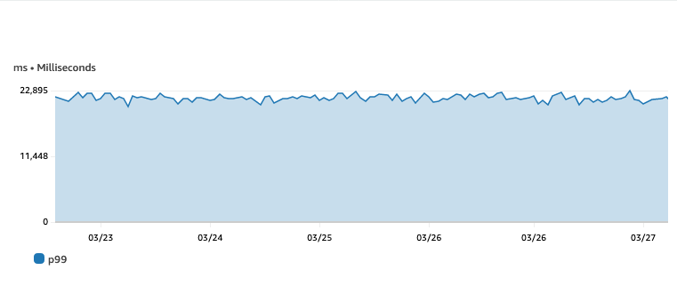
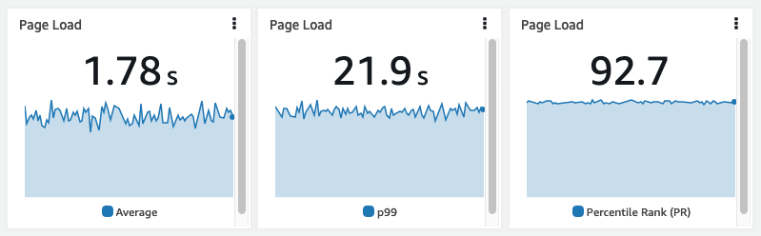

# Les percentiles sont importants

Les percentiles sont importants dans la surveillance et le reporting car ils fournissent une vue plus détaillée et précise de la distribution des données par rapport à la simple utilisation des moyennes. Une moyenne peut parfois masquer des informations importantes, telles que les valeurs aberrantes ou les variations dans les données, qui peuvent impacter significativement les performances et l'expérience utilisateur. Les percentiles, en revanche, peuvent révéler ces détails cachés et donner une meilleure compréhension de la distribution des données.

Dans [Amazon CloudWatch](https://aws.amazon.com/cloudwatch/), les percentiles peuvent être utilisés pour surveiller et rapporter diverses métriques, telles que les temps de réponse, la latence et les taux d'erreur, à travers vos applications et votre infrastructure. En configurant des alarmes sur les percentiles, vous pouvez être alerté lorsque des valeurs de percentile spécifiques dépassent des seuils, vous permettant d'agir avant qu'ils n'impactent davantage de clients.

Pour utiliser les [percentiles dans CloudWatch](https://docs.aws.amazon.com/AmazonCloudWatch/latest/monitoring/cloudwatch_concepts.html#Percentiles), choisissez votre métrique dans **All metrics** dans la console CloudWatch et utilisez une métrique existante en définissant la **statistic** sur **p99**, vous pouvez ensuite modifier la valeur après le p pour le percentile que vous souhaitez. Vous pouvez ensuite afficher les graphiques de percentiles, les ajouter aux [tableaux de bord CloudWatch](https://docs.aws.amazon.com/AmazonCloudWatch/latest/monitoring/CloudWatch_Dashboards.html) et définir des alarmes sur ces métriques. Par exemple, vous pourriez définir une alarme pour vous notifier lorsque le 95e percentile des temps de réponse dépasse un certain seuil, indiquant qu'un pourcentage significatif d'utilisateurs connaissent des temps de réponse lents.

L'histogramme ci-dessous a été créé dans [Amazon Managed Grafana](https://aws.amazon.com/grafana/) en utilisant une requête [CloudWatch Logs Insights](https://docs.aws.amazon.com/AmazonCloudWatch/latest/logs/AnalyzingLogData.html) à partir des logs [CloudWatch RUM](https://docs.aws.amazon.com/AmazonCloudWatch/latest/monitoring/CloudWatch-RUM.html). La requête utilisée était :

```
fields @timestamp, event_details.duration
| filter event_type = "com.amazon.rum.performance_navigation_event"
| sort @timestamp desc
```

L'histogramme représente le temps de chargement de la page en millisecondes. Avec cette vue, il est possible de voir clairement les valeurs aberrantes. Ces données sont masquées si la moyenne est utilisée.


Les mêmes données affichées dans CloudWatch en utilisant la valeur moyenne indiquent que les pages prennent moins de deux secondes à charger. Vous pouvez voir dans l'histogramme ci-dessus que la plupart des pages prennent en fait moins d'une seconde et que nous avons des valeurs aberrantes.


En utilisant les mêmes données avec un percentile (p99), on constate qu'il y a un problème, le graphique CloudWatch montre maintenant que 99 pour cent des chargements de page prennent moins de 23 secondes.



Pour faciliter la visualisation, les graphiques ci-dessous comparent la valeur moyenne au 99e percentile. Dans ce cas, le temps de chargement cible de la page est de deux secondes, il est possible d'utiliser des [statistiques CloudWatch](https://docs.aws.amazon.com/AmazonCloudWatch/latest/monitoring/Statistics-definitions.html#Percentile-versus-Trimmed-Mean) alternatives et le [metric math](https://docs.aws.amazon.com/AmazonCloudWatch/latest/monitoring/using-metric-math.html) pour effectuer d'autres calculs. Dans ce cas, le Percentile Rank (PR) est utilisé avec la statistique **PR(:2000)** pour montrer que 92,7% des chargements de page se produisent dans la cible de 2000ms.



L'utilisation des percentiles dans CloudWatch peut vous aider à obtenir des informations plus approfondies sur les performances de votre système, à détecter les problèmes tôt et à améliorer l'expérience de vos clients en identifiant les valeurs aberrantes qui seraient autrement masquées.


