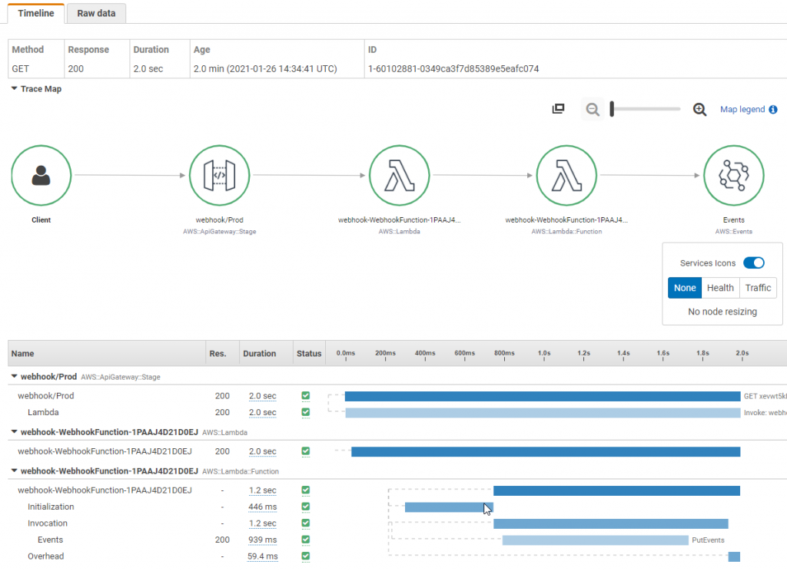

# Observability serverless basée sur AWS Lambda

Dans le monde des systèmes distribués et du calcul serverless, atteindre l'observability est la clé pour garantir la fiabilité et les performances des applications. Cela va au-delà de la surveillance traditionnelle. En tirant parti des outils d'observability AWS comme Amazon CloudWatch et AWS X-Ray, vous pouvez obtenir des informations sur vos applications serverless, résoudre des problèmes et optimiser les performances des applications. Dans ce guide, nous apprendrons les concepts essentiels, les outils et les bonnes pratiques pour implémenter l'Observability de votre application serverless basée sur Lambda.

La première étape avant d'implémenter l'observability pour votre infrastructure ou application est de déterminer vos objectifs clés. Il peut s'agir d'une expérience utilisateur améliorée, d'une productivité accrue des développeurs, du respect des objectifs de niveau de service (SLOs), de l'augmentation des revenus de l'entreprise ou de tout autre objectif spécifique en fonction du type de votre application. Définissez donc clairement ces objectifs clés et établissez comment vous les mesurerez. Ensuite, travaillez à rebours à partir de là pour concevoir votre stratégie d'observability. Consultez "[Surveiller ce qui compte](https://aws-observability.github.io/observability-best-practices/guides/#monitor-what-matters)" pour en savoir plus.

## Piliers de l'Observability

Il y a trois piliers principaux de l'observability :

* Journaux : Enregistrements horodatés d'événements discrets qui se sont produits au sein d'une application ou d'un système, tels qu'une défaillance, une erreur ou une transformation d'état
* Métriques : Données numériques mesurées à différents intervalles de temps (données de séries temporelles) ; SLIs (taux de requêtes, taux d'erreurs, durée, CPU%, etc.)
* Traces : Une trace représente le parcours d'un seul utilisateur à travers plusieurs applications et systèmes (généralement des microservices)


 AWS offre des outils à la fois natifs et open source pour faciliter la journalisation, la surveillance des métriques et le traçage afin d'obtenir des informations exploitables pour votre application AWS Lambda.

## **Journaux**

Dans cette section du guide des bonnes pratiques d'observability, nous approfondirons les sujets suivants :

* Journaux non structurés vs structurés
* CloudWatch Logs Insights
* Journalisation de l'identifiant de corrélation
* Exemple de code avec Lambda Powertools
* Visualisation des journaux avec les tableaux de bord CloudWatch
* Rétention des journaux CloudWatch


Les journaux sont des événements discrets qui se sont produits au sein de votre application. Ils peuvent inclure des événements tels que des défaillances, des erreurs, un chemin d'exécution ou autre chose. Les journaux peuvent être enregistrés dans des formats non structurés, semi-structurés ou structurés.

### **Journaux non structurés vs structurés**

Nous voyons souvent les développeurs commencer avec de simples messages de journal dans leur application en utilisant des instructions `print` ou `console.log`. Ceux-ci sont difficiles à analyser et à traiter par programme à grande échelle, en particulier dans les applications basées sur AWS Lambda qui peuvent générer de nombreuses lignes de messages de journal à travers différents groupes de journaux. Par conséquent, consolider ces journaux dans CloudWatch devient un défi et les rend difficiles à analyser. Vous devriez effectuer une correspondance textuelle ou utiliser des expressions régulières pour trouver des informations pertinentes dans les journaux. Voici un exemple de ce à quoi ressemble la journalisation non structurée :

```
[2023-07-19T19:59:07Z]  INFO  Request started
[2023-07-19T19:59:07Z]  INFO  AccessDenied: Could not access resource
[2023-07-19T19:59:08Z]  INFO  Request finished
```

Comme vous pouvez le voir, les messages de journal manquent de structure cohérente, ce qui rend difficile d'en tirer des informations utiles. De plus, il est difficile d'y ajouter des informations contextuelles.

En revanche, la journalisation structurée est une façon de journaliser les informations dans un format cohérent, souvent en JSON, qui permet de traiter les journaux comme des données plutôt que du texte, ce qui simplifie les requêtes et le filtrage. Elle donne aux développeurs la possibilité de stocker, récupérer et analyser efficacement les journaux par programme. Elle facilite également un meilleur débogage. La journalisation structurée offre un moyen plus simple de modifier la verbosité des journaux entre différents environnements via les niveaux de journal. **Faites attention aux niveaux de journalisation.** Trop journaliser augmentera les coûts et diminuera le débit de l'application. Assurez-vous que les informations personnellement identifiables sont masquées avant la journalisation. Voici un exemple de ce à quoi ressemble la journalisation structurée :

```
{
   "correlationId": "9ac54d82-75e0-4f0d-ae3c-e84ca400b3bd",
   "requestId": "58d9c96e-ae9f-43db-a353-c48e7a70bfa8",
   "level": "INFO",
   "message": "AccessDenied",
   "function-name": "demo-observability-function",
   "cold-start": true
}
```


**`Préférez la journalisation structurée et centralisée dans CloudWatch logs`** pour émettre des informations opérationnelles sur les transactions, les identifiants de corrélation entre différents composants et les résultats métier de votre application. 

### **CloudWatch Logs Insights**
Utilisez CloudWatch Logs Insights, qui peut automatiquement découvrir les champs dans les journaux formatés en JSON. De plus, les journaux JSON peuvent être étendus pour journaliser des métadonnées personnalisées spécifiques à votre application qui peuvent être utilisées pour rechercher, filtrer et agréger vos journaux.


### **Journalisation de l'identifiant de corrélation**

Par exemple, pour une requête http provenant d'API Gateway, l'identifiant de corrélation est défini au chemin `requestContext.requestId`, qui peut être facilement extrait et journalisé dans les fonctions Lambda en aval en utilisant Lambda Powertools. Les systèmes distribués impliquent souvent plusieurs services et composants travaillant ensemble pour traiter une requête. Ainsi, journaliser l'identifiant de corrélation et le transmettre aux systèmes en aval devient crucial pour le traçage et le débogage de bout en bout. Un identifiant de corrélation est un identifiant unique attribué à une requête dès le début. Lorsque la requête traverse différents services, l'identifiant de corrélation est inclus dans les journaux, vous permettant de tracer le chemin complet de la requête. Vous pouvez soit insérer manuellement l'identifiant de corrélation dans vos journaux AWS Lambda, soit utiliser des outils comme [AWS Lambda Powertools](https://docs.powertools.aws.dev/lambda/python/latest/core/logger/#setting-a-correlation-id) pour facilement extraire l'identifiant de corrélation d'API Gateway et le journaliser avec les journaux de votre application. Par exemple, pour une requête http, l'identifiant de corrélation pourrait être un request-id qui peut être initié à API Gateway puis transmis à vos services backend comme les fonctions Lambda.

### **Exemple de code avec Lambda Powertools**
Comme bonne pratique, générez un identifiant de corrélation aussi tôt que possible dans le cycle de vie de la requête, de préférence au point d'entrée de votre application serverless, tel qu'API Gateway ou un Application Load Balancer. Utilisez des UUIDs, des request-id ou tout autre attribut unique qui peut être utilisé pour suivre la requête à travers les systèmes distribués. Transmettez l'identifiant de corrélation avec chaque requête soit dans l'en-tête personnalisé, le corps ou les métadonnées. Assurez-vous que l'identifiant de corrélation est inclus dans toutes les entrées de journal et traces de vos services en aval. 

Vous pouvez soit capturer et inclure manuellement l'identifiant de corrélation dans les journaux de votre fonction Lambda, soit utiliser des outils comme [AWS Lambda Powertools](https://docs.powertools.aws.dev/lambda/python/latest/core/logger/#setting-a-correlation-id). Avec Lambda Powertools, vous pouvez facilement extraire l'identifiant de corrélation à partir du [mappage de chemin](https://github.com/aws-powertools/powertools-lambda-python/blob/08a0a7b68d2844d36c33ab8156640f4ea9632d0c/aws_lambda_powertools/logging/correlation_paths.py) de requête prédéfini pour les services en amont supportés et l'ajouter automatiquement aux journaux de votre application. Assurez-vous également que l'identifiant de corrélation est ajouté à tous vos messages d'erreur pour facilement déboguer et identifier la cause racine en cas de défaillance et le lier à la requête d'origine.

Examinons l'exemple de code pour démontrer la journalisation structurée avec identifiant de corrélation et sa visualisation dans CloudWatch pour l'architecture serverless ci-dessous :


```
// Initializing Logger
Logger log = LogManager.getLogger();

// Uses @Logger annotation from Lambda Powertools, which takes optional parameter correlationIdPath to extract correlation Id from the API Gateway header and inserts correlation_id to the Lambda function logs in a structured format.
@Logging(correlationIdPath = "/headers/path-to-correlation-id")
public APIGatewayProxyResponseEvent handleRequest(final APIGatewayProxyRequestEvent input, final Context context) {
  ...
  // The log statement below will also have additional correlation_id
  log.info("Success")
  ...
}
```

Dans cet exemple, une fonction Lambda basée sur Java utilise la bibliothèque Lambda Powertools pour journaliser le `correlation_id` provenant de la requête API Gateway.

Exemple de journaux CloudWatch pour l'échantillon de code :

```
{
   "level": "INFO",
   "message": "Success",
   "function-name": "demo-observability-function",
   "cold-start": true,
   "lambda_request_id": "52fdfc07-2182-154f-163f-5f0f9a621d72",
   "correlation_id": "<correlation_id_value>"
}_
```

### **Visualisation des journaux avec les tableaux de bord CloudWatch**

Une fois que vous journalisez les données au format JSON structuré, [CloudWatch Logs Insights](https://docs.aws.amazon.com/AmazonCloudWatch/latest/logs/AnalyzingLogData.html) découvre automatiquement les valeurs dans la sortie JSON et analyse les messages en tant que champs. CloudWatch Logs Insights fournit un langage de [requête de type SQL](https://serverlessland.com/snippets?type=CloudWatch+Logs+Insights) conçu pour rechercher et filtrer plusieurs flux de journaux. Vous pouvez effectuer des requêtes sur plusieurs groupes de journaux en utilisant des expressions glob et régulières. De plus, vous pouvez écrire vos requêtes personnalisées et les sauvegarder pour les réexécuter sans avoir à les recréer à chaque fois.


Dans CloudWatch Logs Insights, vous pouvez générer des visualisations comme des graphiques linéaires, des graphiques à barres et des graphiques en aires empilées à partir de vos requêtes avec une ou plusieurs fonctions d'agrégation. Vous pouvez ensuite facilement ajouter ces visualisations aux tableaux de bord CloudWatch. L'exemple de tableau de bord ci-dessous montre le rapport des percentiles de la durée d'exécution d'une fonction Lambda. De tels tableaux de bord vous donneront rapidement des informations sur où vous devriez concentrer vos efforts pour améliorer les performances de l'application. La latence moyenne est une bonne métrique à regarder, mais **`vous devriez viser à optimiser pour le p99 et non la latence moyenne.`** 


Pour envoyer les journaux (plateforme, fonction et extensions) vers des emplacements autres que CloudWatch, vous pouvez utiliser l'[API Lambda Telemetry](https://docs.aws.amazon.com/lambda/latest/dg/telemetry-api.html) avec les extensions Lambda. Un certain nombre de [solutions partenaires](https://docs.aws.amazon.com/lambda/latest/dg/extensions-api-partners.html) fournissent des layers Lambda qui utilisent l'API Lambda Telemetry et facilitent l'intégration avec leurs systèmes.

Pour tirer le meilleur parti de CloudWatch Logs Insights, réfléchissez aux données que vous devez ingérer dans vos journaux sous forme de journalisation structurée, ce qui vous aidera ensuite à mieux surveiller la santé de votre application.


### **Rétention des journaux CloudWatch**

Par défaut, tous les messages écrits sur stdout dans votre fonction Lambda sont sauvegardés dans un flux de journaux Amazon CloudWatch. Le rôle d'exécution de la fonction Lambda doit avoir la permission de créer des flux de journaux CloudWatch et d'écrire des événements de journal dans les flux. Il est important d'être conscient que CloudWatch est facturé par la quantité de données ingérées et le stockage utilisé. Par conséquent, réduire la quantité de journalisation vous aidera à minimiser les coûts associés. **`Par défaut, les journaux CloudWatch sont conservés indéfiniment et n'expirent jamais. Il est recommandé de configurer une politique de rétention des journaux pour réduire les coûts de stockage des journaux`**, et de l'appliquer à tous vos groupes de journaux. Vous pourriez vouloir des politiques de rétention différentes par environnement. La rétention des journaux peut être configurée manuellement dans la console AWS, mais pour assurer la cohérence et les bonnes pratiques, vous devriez la configurer dans le cadre de vos déploiements Infrastructure as Code (IaC). Voici un exemple de template CloudFormation qui démontre comment configurer la rétention des journaux pour une fonction Lambda :

```
Resources:
  Function:
    Type: AWS::Serverless::Function
    Properties:
      CodeUri: .
      Runtime: python3.8
      Handler: main.handler
      Tracing: Active

  # Explicit log group that refers to the Lambda function
  LogGroup:
    Type: AWS::Logs::LogGroup
    Properties:
      LogGroupName: !Sub "/aws/lambda/${Function}"
      # Explicit retention time
      RetentionInDays: 7
```

Dans cet exemple, nous avons créé une fonction Lambda et le groupe de journaux correspondant. La propriété **`RetentionInDays`** est **définie à 7 jours**, ce qui signifie que les journaux de ce groupe de journaux seront conservés pendant 7 jours avant d'être automatiquement supprimés, aidant ainsi à contrôler le coût de stockage des journaux.


## **Métriques**

Dans cette section du guide des bonnes pratiques d'Observability, nous approfondirons les sujets suivants :

* Surveiller et alerter sur les métriques prêtes à l'emploi
* Publier des métriques personnalisées
* Utiliser embedded-metrics pour générer automatiquement des métriques à partir de vos journaux
* Utiliser CloudWatch Lambda Insights pour surveiller les métriques au niveau du système
* Créer des alarmes CloudWatch 

### **Surveiller et alerter sur les métriques prêtes à l'emploi**

Les métriques sont des données numériques mesurées à différents intervalles de temps (données de séries temporelles) et des indicateurs de niveau de service (taux de requêtes, taux d'erreurs, durée, CPU, etc.). Les services AWS fournissent un certain nombre de métriques standard prêtes à l'emploi pour aider à surveiller la santé opérationnelle de votre application. Établissez les métriques clés applicables à votre application et utilisez-les pour surveiller les performances de votre application. Des exemples de métriques clés peuvent inclure les erreurs de fonction, la profondeur de file d'attente, les exécutions de machine d'état échouées et les temps de réponse de l'API.

Un défi avec les métriques prêtes à l'emploi est de savoir comment les analyser dans un tableau de bord CloudWatch. Par exemple, lorsque vous regardez la concurrence, regardez-vous le max, la moyenne ou le percentile ? Et la bonne statistique à surveiller diffère pour chaque métrique.

Comme bonnes pratiques, pour la métrique `ConcurrentExecutions` de la fonction Lambda, regardez la statistique `Count` pour vérifier si elle se rapproche de la limite du compte et de la région ou de la limite de concurrence réservée Lambda si applicable.
Pour la métrique `Duration`, qui indique combien de temps votre fonction prend pour traiter un événement, regardez la statistique `Average` ou `Max`. Pour mesurer la latence de votre API, regardez les statistiques `Percentile` pour les métriques `Latency` d'API Gateway. P50, P90 et P99 sont de bien meilleures méthodes de surveillance de la latence que les moyennes.

Une fois que vous savez quelles métriques surveiller, configurez des alertes sur ces métriques clés pour vous avertir lorsque des composants de votre application sont en mauvaise santé. Par exemple :

* Pour AWS Lambda, alertez sur Duration, Errors, Throttling et ConcurrentExecutions. Pour les invocations basées sur les flux, alertez sur IteratorAge. Pour les invocations asynchrones, alertez sur DeadLetterErrors.
* Pour Amazon API Gateway, alertez sur IntegrationLatency, Latency, 5XXError, 4XXError
* Pour Amazon SQS, alertez sur ApproximateAgeOfOldestMessage, ApproximateNumberOfMessageVisible
* Pour AWS Step Functions, alertez sur ExecutionThrottled, ExecutionsFailed, ExecutionsTimedOut

### **Publier des métriques personnalisées**

Identifiez les indicateurs clés de performance (KPIs) basés sur les résultats métier et client souhaités pour votre application. Évaluez les KPIs pour déterminer le succès de l'application et la santé opérationnelle. Les métriques clés peuvent varier selon le type d'application, mais les exemples incluent les visites de site, les commandes passées, les vols achetés, le temps de chargement de page, les visiteurs uniques, etc.

Une façon de publier des métriques personnalisées vers AWS CloudWatch est d'appeler l'API `putMetricData` du SDK CloudWatch metrics. Cependant, l'appel API `putMetricData` est synchrone. Il augmentera la durée de votre fonction Lambda et peut potentiellement bloquer d'autres appels API dans votre application, entraînant des goulots d'étranglement de performance. De plus, une durée d'exécution plus longue de votre fonction Lambda contribuera à un coût plus élevé. En outre, vous êtes facturé à la fois pour le nombre de métriques personnalisées envoyées à CloudWatch et le nombre d'appels API (c'est-à-dire les appels API PutMetricData) effectués. 

**`Une façon plus efficace et économique de publier des métriques personnalisées est avec`** [CloudWatch Embedded Metrics Format](https://docs.aws.amazon.com/AmazonCloudWatch/latest/monitoring/CloudWatch_Embedded_Metric_Format.html) (EMF). Le format CloudWatch Embedded Metric vous permet de générer des métriques personnalisées **`de manière asynchrone`** sous forme de journaux écrits dans CloudWatch Logs, résultant en une amélioration des performances de votre application à un coût moindre. Avec EMF, vous pouvez intégrer des métriques personnalisées aux côtés de données d'événements de journal détaillées, et CloudWatch extrait automatiquement ces métriques personnalisées afin que vous puissiez les visualiser et définir des alarmes sur elles comme vous le feriez avec les métriques prêtes à l'emploi. En envoyant des journaux au format embedded metric, vous pouvez les interroger en utilisant [CloudWatch Logs Insights](https://docs.aws.amazon.com/AmazonCloudWatch/latest/logs/AnalyzingLogData.html), et vous ne payez que pour la requête, pas le coût des métriques.

Pour y parvenir, vous pouvez générer les journaux en utilisant la [spécification EMF](https://docs.aws.amazon.com/AmazonCloudWatch/latest/monitoring/CloudWatch_Embedded_Metric_Format_Specification.html), et les envoyer à CloudWatch en utilisant l'API `PutLogEvents`. Pour simplifier le processus, il existe **deux bibliothèques client qui supportent la création de métriques au format EMF** :

* Bibliothèques client de bas niveau ([aws-embedded-metrics](https://docs.aws.amazon.com/AmazonCloudWatch/latest/monitoring/CloudWatch_Embedded_Metric_Format_Libraries.html))
* Lambda Powertools [Metrics](https://docs.aws.amazon.com/powertools/java/latest/core/metrics/).


### **Utiliser [CloudWatch Lambda Insights](https://docs.aws.amazon.com/AmazonCloudWatch/latest/monitoring/Lambda-Insights.html) pour surveiller les métriques au niveau du système**

CloudWatch Lambda Insights vous fournit des métriques au niveau du système, incluant le temps CPU, l'utilisation mémoire, l'utilisation disque et les performances réseau. Lambda Insights collecte, agrège et résume également les informations de diagnostic, telles que les **`démarrages à froid`** et les arrêts de workers Lambda. Lambda Insights exploite l'extension CloudWatch Lambda, qui est empaquetée comme un layer Lambda. Une fois activé, il collecte les métriques au niveau du système et émet un seul événement de journal de performance vers CloudWatch Logs pour chaque invocation de cette fonction Lambda au format embedded metrics. 

:::note
    CloudWatch Lambda Insights n'est pas activé par défaut et doit être activé par fonction Lambda. 
:::

Vous pouvez l'activer via la console AWS ou via Infrastructure as Code (IaC). Voici un exemple de comment l'activer en utilisant AWS Serverless Application Model (SAM). Vous ajoutez le layer d'extension `LambdaInsightsExtension` à votre fonction Lambda, et vous ajoutez également la politique IAM gérée `CloudWatchLambdaInsightsExecutionRolePolicy`, qui donne les permissions à votre fonction Lambda de créer un flux de journaux et d'appeler l'API `PutLogEvents` pour pouvoir y écrire des journaux.

```
// Add LambdaInsightsExtension Layer to your function resource
Resources:
  MyFunction:
    Type: AWS::Serverless::Function
    Properties:
      Layers:
        - !Sub "arn:aws:lambda:${AWS::Region}:580247275435:layer:LambdaInsightsExtension:14"
        
// Add IAM policy to enable Lambda function to write logs to CloudWatch
Resources:
  MyFunction:
    Type: AWS::Serverless::Function
    Properties:
      Policies:
        - `CloudWatchLambdaInsightsExecutionRolePolicy`
```

Vous pouvez ensuite utiliser la console CloudWatch pour visualiser ces métriques de performance au niveau du système sous Lambda Insights.


### **Créer des alarmes CloudWatch**
Créer des alarmes CloudWatch et prendre les actions nécessaires lorsque les métriques se déclenchent est une partie essentielle de l'observability. Les [alarmes Amazon CloudWatch](https://docs.aws.amazon.com/AmazonCloudWatch/latest/monitoring/AlarmThatSendsEmail.html) sont utilisées pour vous alerter ou automatiser les actions de remédiation lorsque les métriques d'application et d'infrastructure dépassent des seuils statiques ou définis dynamiquement. 

Pour configurer une alarme pour une métrique, vous sélectionnez une valeur seuil qui déclenche un ensemble d'actions. Une valeur seuil fixe est connue comme un seuil statique. Par exemple, vous pouvez configurer une alarme sur la métrique `Throttles` d'une fonction Lambda pour s'activer si elle dépasse 10% du temps dans une période de 5 minutes. Cela pourrait potentiellement signifier que la fonction Lambda a atteint sa concurrence maximale pour votre compte et région.

Dans une application serverless, il est courant d'envoyer une alerte en utilisant SNS (Simple Notification Service). Cela permet aux utilisateurs de recevoir des alertes par e-mail, SMS ou d'autres canaux. De plus, vous pouvez abonner une fonction Lambda au sujet SNS, lui permettant de remédier automatiquement à tout problème qui a provoqué le déclenchement de l'alarme. 

Par exemple, imaginons que vous avez une fonction Lambda A qui interroge une file SQS et appelle un service en aval. Si le service en aval est en panne et ne répond pas, la fonction Lambda continuera à interroger la file SQS et à essayer d'appeler le service en aval avec des échecs. Bien que vous puissiez surveiller ces erreurs et générer une alarme CloudWatch en utilisant SNS pour notifier l'équipe appropriée, vous pouvez également appeler une autre fonction Lambda B (via un abonnement SNS), qui peut désactiver le event-source-mapping pour la fonction Lambda A, l'empêchant ainsi d'interroger la file SQS, jusqu'à ce que le service en aval soit de nouveau opérationnel.

Bien que configurer des alarmes sur une métrique individuelle soit bien, parfois surveiller plusieurs métriques devient nécessaire pour mieux comprendre la santé opérationnelle et les performances de votre application. Dans un tel scénario, vous devriez configurer des alarmes basées sur plusieurs métriques en utilisant une expression de [calcul de métriques](https://docs.aws.amazon.com/AmazonCloudWatch/latest/monitoring/using-metric-math.html). 

Par exemple, si vous voulez surveiller les erreurs AWS Lambda mais permettre un petit nombre d'erreurs sans déclencher votre alarme, vous pouvez créer une expression de taux d'erreur sous forme de pourcentage, c'est-à-dire ErrorRate = errors / invocation * 100, puis créer une alarme pour envoyer une alerte si le ErrorRate dépasse 20% dans la période d'évaluation configurée.


## **Traçage**

Dans cette section du guide des bonnes pratiques d'Observability, nous approfondirons les sujets suivants :

* Introduction au traçage distribué et AWS X-Ray
* Appliquer une règle d'échantillonnage appropriée
* Utiliser le SDK X-Ray pour tracer les interactions avec d'autres services
* Exemple de code pour le traçage de services intégrés avec le SDK X-Ray

### Introduction au traçage distribué et AWS X-Ray

La plupart des applications serverless sont composées de plusieurs microservices, chacun utilisant plusieurs services AWS. En raison de la nature des architectures serverless, il est crucial d'avoir un traçage distribué. Pour une surveillance efficace des performances et un suivi des erreurs, il est important de tracer la transaction à travers l'ensemble du flux de l'application, du demandeur source à travers tous les services en aval. Bien qu'il soit possible d'y parvenir en utilisant les journaux de chaque service individuel, il est plus rapide et plus efficace d'utiliser un outil de traçage comme AWS X-Ray. Consultez [Instrumenter votre application avec AWS X-Ray](https://docs.aws.amazon.com/xray/latest/devguide/xray-instrumenting-your-app.html) pour plus d'informations.

AWS X-Ray vous permet de tracer les requêtes lorsqu'elles traversent les microservices impliqués. Les cartes de service X-Ray vous permettent de comprendre les différents points d'intégration et d'identifier toute dégradation de performance de votre application. Vous pouvez rapidement isoler quel composant de votre application cause des erreurs, de la limitation ou des problèmes de latence en quelques clics seulement. Sous le graphe de service, vous pouvez également consulter les traces individuelles pour identifier la durée exacte prise par chaque microservice.



**`Comme bonne pratique, créez des sous-segments personnalisés dans votre code pour les appels en aval`** ou toute fonctionnalité spécifique nécessitant une surveillance. Par exemple, vous pouvez créer un sous-segment pour surveiller un appel à une API HTTP externe ou une requête de base de données SQL.

Par exemple, pour créer un sous-segment personnalisé pour une fonction qui effectue des appels à des services en aval, utilisez la fonction `captureAsyncFunc` (en node.js) :

```
var AWSXRay = require('aws-xray-sdk');

app.use(AWSXRay.express.openSegment('MyApp'));

app.get('/', function (req, res) {
  var host = 'api.example.com';

  // start of the subsegment
  AWSXRay.captureAsyncFunc('send', function(subsegment) {
    sendRequest(host, function() {
      console.log('rendering!');
      res.render('index');

      // end of the subsegment
      subsegment.close();
    });
  });
});
```

Dans cet exemple, l'application crée un sous-segment personnalisé nommé `send` pour les appels à la fonction `sendRequest`. `captureAsyncFunc` passe un sous-segment que vous devez fermer dans la fonction de rappel lorsque les appels asynchrones qu'il effectue sont terminés.


### **Appliquer une règle d'échantillonnage appropriée**

Le SDK AWS X-Ray ne trace pas toutes les requêtes par défaut. Il applique une règle d'échantillonnage conservatrice pour fournir un échantillon représentatif des requêtes sans engendrer un coût élevé. Cependant, vous pouvez [personnaliser](https://docs.aws.amazon.com/xray/latest/devguide/xray-console-sampling.html#xray-console-config) la règle d'échantillonnage par défaut ou désactiver complètement l'échantillonnage et commencer à tracer toutes vos requêtes en fonction de vos besoins spécifiques. 

Il est important de noter qu'AWS X-Ray n'est pas destiné à être utilisé comme un outil d'audit ou de conformité. Vous devriez envisager d'avoir **`des taux d'échantillonnage différents pour différents types d'applications`**. Par exemple, les appels en lecture seule à haut volume, comme le polling en arrière-plan ou les vérifications de santé, peuvent être échantillonnés à un taux plus bas tout en fournissant suffisamment de données pour identifier tout problème potentiel qui pourrait survenir. Vous pouvez également vouloir avoir **`des taux d'échantillonnage différents par environnement`**. Par exemple, dans votre environnement de développement, vous pouvez vouloir que toutes vos requêtes soient tracées pour résoudre facilement les erreurs ou problèmes de performance, tandis que pour l'environnement de production vous pouvez avoir un nombre plus faible de traces. **`Vous devez également garder à l'esprit qu'un traçage extensif peut entraîner un coût accru`**. Pour plus d'informations sur les règles d'échantillonnage, consultez [_Configuration des règles d'échantillonnage dans la console X-Ray_](https://docs.aws.amazon.com/xray/latest/devguide/xray-console-sampling.html).

### **Utiliser le SDK X-Ray pour tracer les interactions avec d'autres services AWS**

Bien que le traçage X-Ray puisse être facilement activé pour des services comme AWS Lambda et Amazon API Gateway, avec quelques clics ou quelques lignes dans votre outil IaC, d'autres services nécessitent des étapes supplémentaires pour instrumenter leur code. Voici la liste complète des [services AWS intégrés avec X-Ray](https://docs.aws.amazon.com/xray/latest/devguide/xray-services.html). 

Pour instrumenter les appels aux services qui ne sont pas intégrés avec X-Ray, comme DynamoDB, vous pouvez capturer les traces en enveloppant les appels SDK AWS avec le SDK AWS X-Ray. Par exemple, lors de l'utilisation de node.js, vous pouvez suivre l'exemple de code ci-dessous pour capturer tous les appels SDK AWS :

### **Exemple de code pour le traçage de services intégrés avec le SDK X-Ray**

```
//... FROM (old code)
const AWS = require('aws-sdk');

//... TO (new code)
const AWSXRay = require('aws-xray-sdk-core');
const AWS = AWSXRay.captureAWS(require('aws-sdk'));
...
```

:::note
    Pour instrumenter des clients individuels, enveloppez votre client SDK AWS dans un appel à `AWSXRay.captureAWSClient`. N'utilisez pas `captureAWS` et `captureAWSClient` ensemble. Cela entraînerait des traces en double.
:::

## **Ressources supplémentaires**

[CloudWatch Logs Insights](https://docs.aws.amazon.com/AmazonCloudWatch/latest/logs/AnalyzingLogData.html)

[CloudWatch Lambda Insights](https://docs.aws.amazon.com/AmazonCloudWatch/latest/monitoring/Lambda-Insights.html)

[Embedded Metrics Library](https://github.com/awslabs/aws-embedded-metrics-java)


## Résumé

Dans ce guide de bonnes pratiques d'observability pour les applications serverless basées sur AWS Lambda, nous avons mis en évidence les aspects critiques tels que la journalisation, les métriques et le traçage en utilisant les services AWS natifs comme Amazon CloudWatch et AWS X-Ray. Nous avons recommandé l'utilisation de la bibliothèque AWS Lambda Powertools pour ajouter facilement les bonnes pratiques d'observability à votre application. En adoptant ces bonnes pratiques, vous pouvez débloquer des informations précieuses sur votre application serverless, permettant une détection plus rapide des erreurs et une optimisation des performances.

Pour approfondir davantage, nous vous recommandons vivement de pratiquer le module Observability natif AWS de l'[AWS One Observability Workshop](https://catalog.workshops.aws/observability/en-US).
