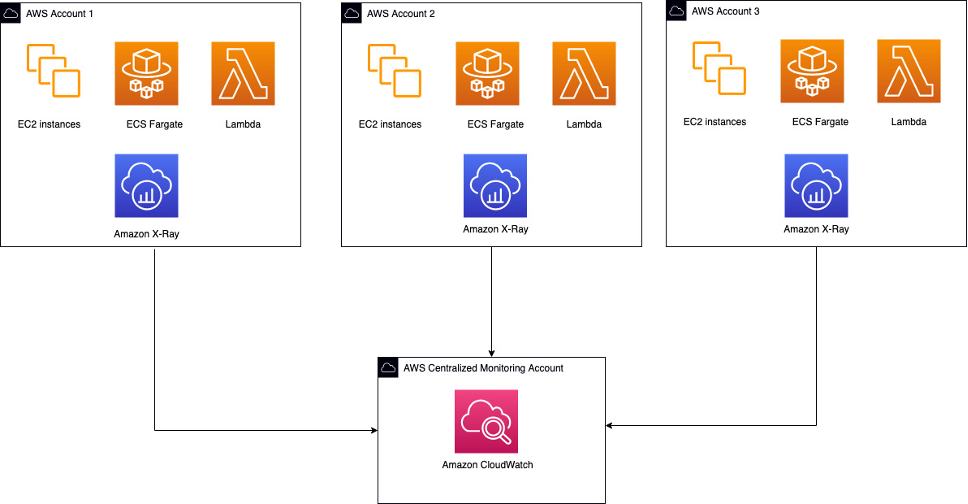

# Surveillance multi-comptes avec les services natifs AWS

Avec la complexité croissante des environnements cloud modernes, la gestion et la surveillance de multiples comptes AWS sont devenues un aspect critique des opérations cloud efficaces. La surveillance multi-comptes AWS fournit une approche centralisée pour surveiller et gérer les ressources à travers plusieurs comptes AWS, permettant aux organisations d'obtenir une meilleure visibilité, de renforcer la sécurité et de rationaliser les opérations.

Dans le paysage numérique actuel en rapide évolution, les organisations sont sous pression constante pour maintenir un avantage concurrentiel et stimuler la croissance. Le cloud computing est apparu comme un facteur déterminant, offrant évolutivité, agilité et rentabilité. Cependant, à mesure que l'adoption du cloud continue de s'accélérer, la complexité de la gestion et de la surveillance de ces environnements augmente également de manière exponentielle. C'est là que la surveillance multi-comptes AWS entre en jeu, fournissant une solution puissante pour gérer efficacement les ressources à travers plusieurs comptes AWS.

La surveillance multi-comptes AWS offre une gamme d'avantages qui peuvent améliorer significativement les opérations cloud d'une organisation. L'un des principaux avantages est la visibilité centralisée, qui consolide les données de surveillance de multiples comptes AWS en une vue unique. Cette vue complète de l'infrastructure cloud permet aux organisations d'obtenir une compréhension holistique de leurs ressources, permettant une meilleure prise de décision et une optimisation des ressources. De plus, la surveillance multi-comptes AWS joue un rôle crucial dans l'amélioration de la sécurité et de la conformité. En appliquant des politiques de sécurité cohérentes et en permettant la détection des menaces potentielles à travers tous les comptes, les organisations peuvent traiter proactivement les vulnérabilités et atténuer les risques. Les exigences de conformité peuvent également être efficacement surveillées et respectées, garantissant que l'organisation opère dans les cadres réglementaires et les normes de l'industrie.

## Statistiques :

Selon Gartner, d'ici 2025, plus de 95% des nouvelles charges de travail numériques seront déployées sur des plateformes natives cloud, soulignant le besoin de solutions robustes de surveillance multi-comptes. Une étude de Cloud Conformity a révélé que les organisations avec plus de 25 comptes AWS ont connu en moyenne 223 incidents de sécurité à haut risque par mois, soulignant l'importance d'une surveillance et d'une gouvernance centralisées. Forrester Research estime que les organisations avec des stratégies efficaces de gouvernance et de surveillance cloud peuvent réduire les coûts opérationnels jusqu'à 30%.

         *Figure 1 : Surveillance multi-comptes avec AWS CloudWatch*

## Avantages de la surveillance multi-comptes AWS :

1. **Visibilité centralisée** : Consolidez les données de surveillance de multiples comptes AWS en une vue unique, fournissant une vue complète de votre infrastructure cloud.
2. **Sécurité et conformité améliorées** : Appliquez des politiques de sécurité cohérentes, détectez les menaces potentielles et assurez la conformité à travers tous les comptes.
3. **Optimisation des coûts** : Identifiez et éliminez les ressources sous-utilisées ou redondantes, optimisant les dépenses cloud et réduisant le gaspillage.
4. **Opérations rationalisées** : Automatisez les processus de surveillance et d'alerte, réduisant l'effort manuel et améliorant l'efficacité opérationnelle.
5. **Évolutivité** : Intégrez facilement de nouveaux comptes et ressources AWS sans compromettre les capacités de surveillance.

## Inconvénients de la surveillance multi-comptes AWS :

1. **Complexité de mise en oeuvre** : La configuration et le paramétrage de la surveillance multi-comptes peuvent être difficiles, surtout dans les environnements à grande échelle.
2. **Surcharge d'agrégation des données** : La collecte et l'agrégation de données provenant de multiples comptes peuvent introduire une surcharge de performance et de la latence.
3. **Gestion des accès** : La gestion des accès et des permissions à travers plusieurs comptes peut devenir complexe et sujette aux erreurs.
4. **Implications de coûts** : La mise en oeuvre et la maintenance d'une solution complète de surveillance multi-comptes peuvent entraîner des coûts supplémentaires, si elle n'est pas faite correctement.

## Services et outils AWS clés pour la surveillance multi-comptes :

1. **AWS Organizations** : Gérez et gouvernez de manière centralisée plusieurs comptes AWS, permettant la facturation consolidée, la gestion basée sur les politiques et la création/gestion de comptes.
2. **AWS Config** : Surveillez et enregistrez en continu les configurations de ressources, permettant l'audit de conformité et le suivi des changements à travers les comptes.
3. **AWS CloudTrail** : Journalisez et surveillez l'activité API et les actions des utilisateurs à travers plusieurs comptes AWS à des fins de sécurité et opérationnelles.
4. **Amazon CloudWatch** : Surveillez et collectez les métriques, logs et événements provenant de diverses ressources AWS à travers plusieurs comptes pour une surveillance et des alertes centralisées.
5. **AWS Security Hub** : Visualisez et gérez de manière centralisée les résultats de sécurité à travers plusieurs comptes AWS, permettant une surveillance complète de la sécurité et un suivi de la conformité.

## Références :

1. Documentation AWS : "CloudWatch cross-account observability" (https://docs.aws.amazon.com/AmazonCloudWatch/latest/monitoring/CloudWatch-Unified-Cross-Account.html)
2. Rapport Cloud Conformity : "The State of AWS Security and Compliance in the Cloud" (https://www.trendmicro.com/cloudoneconformity/knowledge-base/aws/)
3. Forrester Research : "The Total Economic Impact™ Of AWS Cloud Operations" (https://pages.awscloud.com/rs/112-TZM-766/images/GEN_forrester-tei-cloud-ops_May-2022.pdf)
4. How Audible used Amazon CloudWatch cross-account observability to resolve severity tickets faster (https://aws.amazon.com/blogs/mt/how-audible-used-amazon-cloudwatch-cross-account-observability-to-resolve-severity-tickets-faster/)
