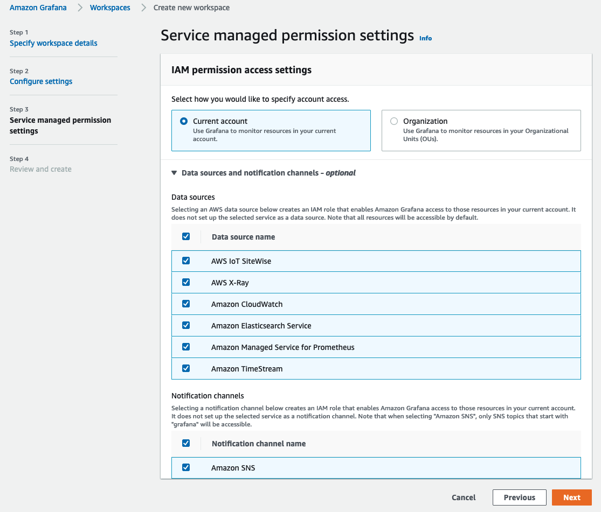
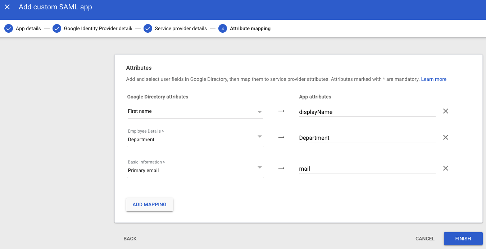

# Configurer l'authentification Google Workspaces avec Amazon Managed Grafana en utilisant SAML

Dans ce guide, nous allons vous montrer comment configurer Google Workspaces comme fournisseur d'identité (IdP) pour Amazon Managed Grafana en utilisant le protocole SAML v2.0.

Pour suivre ce guide, vous devez créer un compte [Google Workspaces][google-workspaces] payant en plus d'avoir un [espace de travail Amazon Managed Grafana][amg-ws] créé.

### Créer un espace de travail Amazon Managed Grafana

Connectez-vous à la console Amazon Managed Grafana et cliquez sur **Create workspace.** Dans l'écran suivant, fournissez un nom d'espace de travail comme indiqué ci-dessous. Puis cliquez sur **Next** :

Dans la page **Configure settings**, sélectionnez l'option **Security Assertion Markup Language (SAML)** afin de pouvoir configurer un fournisseur d'identité basé sur SAML pour la connexion des utilisateurs :

Sélectionnez les sources de données que vous souhaitez choisir et cliquez sur **Next** :

Cliquez sur le bouton **Create workspace** dans l'écran **Review and create** :

Cela créera un nouvel espace de travail Amazon Managed Grafana comme indiqué ci-dessous :

### Configurer Google Workspaces

Connectez-vous à Google Workspaces avec les permissions Super Admin et allez dans **Web and mobile apps** sous la section **Apps**. Là, cliquez sur **Add App** et sélectionnez **Add custom SAML app.** Donnez maintenant un nom à l'application comme indiqué ci-dessous. Cliquez sur **CONTINUE.** :

Sur l'écran suivant, cliquez sur le bouton **DOWNLOAD METADATA** pour télécharger le fichier de métadonnées SAML. Cliquez sur **CONTINUE.**

Sur l'écran suivant, vous verrez les champs ACS URL, Entity ID et Start URL. Vous pouvez obtenir les valeurs de ces champs depuis la console Amazon Managed Grafana.

Sélectionnez **EMAIL** dans le menu déroulant du champ **Name ID format** et sélectionnez **Basic Information > Primary email** dans le champ **Name ID**.

Cliquez sur **CONTINUE.**

Dans l'écran **Attribute mapping**, effectuez le mappage entre les **Google Directory attributes** et les **App attributes** comme indiqué dans la capture d'écran ci-dessous

Pour que les utilisateurs se connectant via l'authentification Google aient les privilèges **Admin** dans **Amazon Managed Grafana**, définissez la valeur du champ **Department** comme ***monitoring*.** Vous pouvez choisir n'importe quel champ et n'importe quelle valeur pour cela. Quel que soit votre choix côté Google Workspaces, assurez-vous de faire le mappage correspondant dans les paramètres SAML d'Amazon Managed Grafana.

### Télécharger les métadonnées SAML dans Amazon Managed Grafana

Maintenant dans la console Amazon Managed Grafana, cliquez sur l'option **Upload or copy/paste** et sélectionnez le bouton **Choose file** pour télécharger le fichier de métadonnées SAML téléchargé depuis Google Workspaces précédemment.

Dans la section **Assertion mapping**, tapez **Department** dans le champ **Assertion attribute role** et **monitoring** dans le champ **Admin role values**. Cela permettra aux utilisateurs se connectant avec **Department** défini sur **monitoring** d'avoir les privilèges **Admin** dans Grafana afin qu'ils puissent effectuer des tâches d'administration telles que la création de tableaux de bord et de sources de données.

Définissez les valeurs sous la section **Additional settings - optional** comme indiqué dans la capture d'écran ci-dessous. Cliquez sur **Save SAML configuration** :

Amazon Managed Grafana est maintenant configuré pour authentifier les utilisateurs via Google Workspaces.

Lorsque les utilisateurs se connectent, ils seront redirigés vers la page de connexion Google comme ceci :

Après avoir saisi leurs identifiants, ils seront connectés à Grafana comme indiqué dans la capture d'écran ci-dessous.

Comme vous pouvez le voir, l'utilisateur a pu se connecter avec succès à Grafana en utilisant l'authentification Google Workspaces.

[google-workspaces]: https://workspace.google.com/
[amg-ws]: https://docs.aws.amazon.com/grafana/latest/userguide/getting-started-with-AMG.html#AMG-getting-started-workspace
