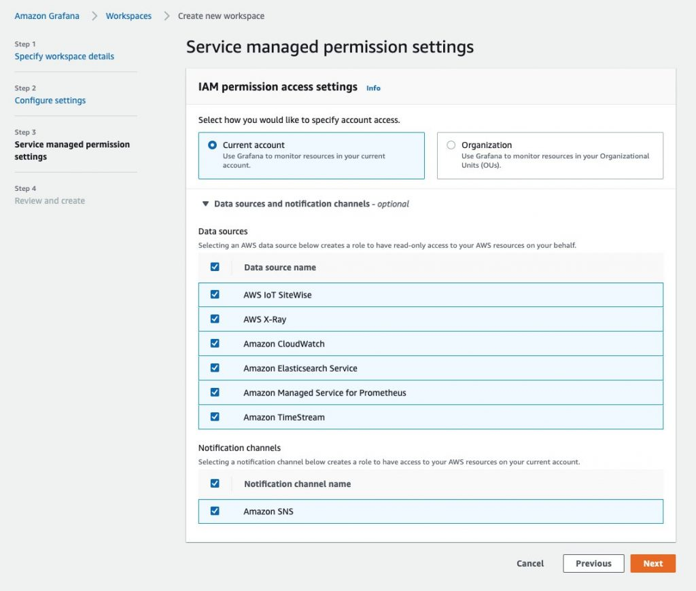

# Utilisation d'AWS Distro for OpenTelemetry dans EKS sur Fargate avec Amazon Managed Service for Prometheus

Dans cette recette, nous vous montrons comment instrumenter une [application Go exemple](https://github.com/aws-observability/aws-otel-community/tree/master/sample-apps/prometheus-sample-app) et
utiliser [AWS Distro for OpenTelemetry (ADOT)](https://aws.amazon.com/otel) pour ingerer des metriques dans
[Amazon Managed Service for Prometheus](https://aws.amazon.com/prometheus/).
Ensuite, nous utilisons [Amazon Managed Grafana](https://aws.amazon.com/grafana/) pour visualiser les metriques.

Nous allons configurer un cluster [Amazon Elastic Kubernetes Service (EKS)](https://aws.amazon.com/eks/)
sur [AWS Fargate](https://aws.amazon.com/fargate/) et utiliser un
depot [Amazon Elastic Container Registry (ECR)](https://aws.amazon.com/ecr/)
pour illustrer un scenario complet.

:::note
    Ce guide prendra environ 1 heure a completer.
:::
## Infrastructure
Dans la section suivante, nous allons configurer l'infrastructure pour cette recette.

### Architecture

Le pipeline ADOT nous permet d'utiliser le
[collecteur ADOT](https://github.com/aws-observability/aws-otel-collector) pour
scraper une application instrumentee avec Prometheus, et ingerer les metriques scrapees dans
Amazon Managed Service for Prometheus.


Le collecteur ADOT comprend deux composants specifiques a Prometheus :

* le Prometheus Receiver, et
* l'AWS Prometheus Remote Write Exporter.

:::info
    Pour plus d'informations sur le Prometheus Remote Write Exporter, consultez :
    [Getting Started with Prometheus Remote Write Exporter for AMP](https://aws-otel.github.io/docs/getting-started/prometheus-remote-write-exporter).
:::

### Prerequis

* L'AWS CLI est [installee](https://docs.aws.amazon.com/cli/latest/userguide/cli-chap-install.html) et [configuree](https://docs.aws.amazon.com/cli/latest/userguide/cli-chap-configure.html) dans votre environnement.
* Vous devez installer la commande [eksctl](https://docs.aws.amazon.com/eks/latest/userguide/eksctl.html) dans votre environnement.
* Vous devez installer [kubectl](https://docs.aws.amazon.com/eks/latest/userguide/install-kubectl.html) dans votre environnement.
* Vous avez [Docker](https://docs.docker.com/get-docker/) installe dans votre environnement.

### Creer un cluster EKS sur Fargate

Notre application de demonstration est une application Kubernetes que nous executerons dans un cluster EKS sur Fargate.
Commencez donc par creer un cluster EKS en utilisant le
fichier modele [cluster-config.yaml](./fargate-eks-metrics-go-adot-ampamg/cluster-config.yaml)
fourni en changeant `<YOUR_REGION>` par l'une des
[regions prises en charge pour AMP](https://docs.aws.amazon.com/prometheus/latest/userguide/what-is-Amazon-Managed-Service-Prometheus.html#AMP-supported-Regions).

Assurez-vous de definir `<YOUR_REGION>` dans votre session shell, par exemple, en Bash :

```
export AWS_DEFAULT_REGION=<YOUR_REGION>
```

Creez votre cluster avec la commande suivante :

```
eksctl create cluster -f cluster-config.yaml
```

### Creer un depot ECR

Pour deployer notre application sur EKS, nous avons besoin d'un depot de conteneurs.
Vous pouvez utiliser la commande suivante pour creer un nouveau depot ECR dans votre compte.
Assurez-vous de definir egalement `<YOUR_REGION>`.

```
aws ecr create-repository \
    --repository-name prometheus-sample-app \
    --image-scanning-configuration scanOnPush=true \
    --region <YOUR_REGION>
```

### Configurer AMP

Tout d'abord, creez un espace de travail Amazon Managed Service for Prometheus avec l'AWS CLI :

```
aws amp create-workspace --alias prometheus-sample-app
```

Verifiez que l'espace de travail est cree avec :

```
aws amp list-workspaces
```

:::info
    Pour plus de details, consultez le guide [AMP Getting started](https://docs.aws.amazon.com/prometheus/latest/userguide/AMP-getting-started.html).
:::

### Configurer le collecteur ADOT

Telechargez [adot-collector-fargate.yaml](./fargate-eks-metrics-go-adot-ampamg/adot-collector-fargate.yaml)
et editez ce document YAML avec les parametres decrits dans les etapes suivantes.

Dans cet exemple, la configuration du collecteur ADOT utilise une annotation `(scrape=true)`
pour indiquer quels endpoints cibles scraper. Cela permet au collecteur ADOT de distinguer
l'endpoint de l'application exemple des endpoints `kube-system` dans votre cluster.
Vous pouvez supprimer cela des configurations de re-labellisation si vous souhaitez scraper une autre application exemple.

Suivez les etapes suivantes pour editer le fichier telecharge pour votre environnement :

1\. Remplacez `<YOUR_REGION>` par votre region actuelle.

2\. Remplacez `<YOUR_ENDPOINT>` par l'URL d'ecriture distante de votre espace de travail.

Obtenez l'URL de l'endpoint d'ecriture distante AMP en executant les requetes suivantes.

Tout d'abord, obtenez l'ID de l'espace de travail comme suit :

```
YOUR_WORKSPACE_ID=$(aws amp list-workspaces \
                    --alias prometheus-sample-app \
                    --query 'workspaces[0].workspaceId' --output text)
```

Maintenant, obtenez l'URL de l'endpoint d'ecriture distante pour votre espace de travail avec :

```
YOUR_ENDPOINT=$(aws amp describe-workspace \
                --workspace-id $YOUR_WORKSPACE_ID  \
                --query 'workspace.prometheusEndpoint' --output text)api/v1/remote_write
```

:::warning
    Assurez-vous que `YOUR_ENDPOINT` est bien l'URL d'ecriture distante, c'est-a-dire
    que l'URL doit se terminer par `/api/v1/remote_write`.
:::
Apres avoir cree le fichier de deploiement, nous pouvons maintenant l'appliquer a notre cluster avec la commande suivante :

```
kubectl apply -f adot-collector-fargate.yaml
```

:::info
    Pour plus d'informations, consultez la [configuration du collecteur AWS Distro for OpenTelemetry (ADOT)](https://aws-otel.github.io/docs/getting-started/prometheus-remote-write-exporter/eks#aws-distro-for-opentelemetry-adot-collector-setup).
:::
### Configurer AMG

Configurez un nouvel espace de travail AMG en utilisant le
guide [Amazon Managed Grafana - Getting Started](https://aws.amazon.com/blogs/mt/amazon-managed-grafana-getting-started/).

Assurez-vous d'ajouter "Amazon Managed Service for Prometheus" comme source de donnees lors de la creation.



## Application

Dans cette recette, nous utiliserons une
[application exemple](https://github.com/aws-observability/aws-otel-community/tree/master/sample-apps/prometheus-sample-app)
du depot AWS Observability.

Cette application Prometheus exemple genere les quatre types de metriques Prometheus
(counter, gauge, histogram, summary) et les expose au endpoint `/metrics`.

### Construire l'image de conteneur

Pour construire l'image de conteneur, clonez d'abord le depot Git et naviguez
dans le repertoire comme suit :

```
git clone https://github.com/aws-observability/aws-otel-community.git && \
cd ./aws-otel-community/sample-apps/prometheus
```

Tout d'abord, definissez la region (si ce n'est pas deja fait ci-dessus) et l'ID de compte applicables a votre cas.
Remplacez `<YOUR_REGION>` par votre region actuelle. Par
exemple, dans le shell Bash, cela ressemblerait a :

```
export AWS_DEFAULT_REGION=<YOUR_REGION>
export ACCOUNTID=`aws sts get-caller-identity --query Account --output text`
```

Ensuite, construisez l'image de conteneur :

```
docker build . -t "$ACCOUNTID.dkr.ecr.$AWS_DEFAULT_REGION.amazonaws.com/prometheus-sample-app:latest"
```

:::note
    Si `go mod` echoue dans votre environnement en raison d'un timeout i/o de proxy.golang.org,
    vous pouvez contourner le proxy go mod en editant le Dockerfile.

    Changez la ligne suivante dans le Dockerfile :
    ```
    RUN GO111MODULE=on go mod download
    ```
    en :
    ```
    RUN GOPROXY=direct GO111MODULE=on go mod download
    ```
:::

Vous pouvez maintenant pousser l'image de conteneur vers le depot ECR que vous avez cree precedemment.

Pour cela, connectez-vous d'abord au registre ECR par defaut :

```
aws ecr get-login-password --region $AWS_DEFAULT_REGION | \
    docker login --username AWS --password-stdin \
    "$ACCOUNTID.dkr.ecr.$AWS_DEFAULT_REGION.amazonaws.com"
```

Et enfin, poussez l'image de conteneur vers le depot ECR que vous avez cree ci-dessus :

```
docker push "$ACCOUNTID.dkr.ecr.$AWS_DEFAULT_REGION.amazonaws.com/prometheus-sample-app:latest"
```

### Deployer l'application exemple

Editez [prometheus-sample-app.yaml](./fargate-eks-metrics-go-adot-ampamg/prometheus-sample-app.yaml)
pour contenir le chemin de votre image ECR. C'est-a-dire, remplacez `ACCOUNTID` et `AWS_DEFAULT_REGION` dans le
fichier par vos propres valeurs :

```
    # changez ce qui suit par votre image de conteneur :
    image: "ACCOUNTID.dkr.ecr.AWS_DEFAULT_REGION.amazonaws.com/prometheus-sample-app:latest"
```

Vous pouvez maintenant deployer l'application exemple sur votre cluster avec :

```
kubectl apply -f prometheus-sample-app.yaml
```

## De bout en bout

Maintenant que vous avez l'infrastructure et l'application en place, nous allons
tester la configuration en envoyant des metriques depuis l'application Go executee dans EKS vers AMP et
les visualiser dans AMG.

### Verifier que votre pipeline fonctionne

Pour verifier si le collecteur ADOT scrape le pod de l'application exemple et
ingere les metriques dans AMP, nous examinons les logs du collecteur.

Entrez la commande suivante pour suivre les logs du collecteur ADOT :

```
kubectl -n adot-col logs adot-collector -f
```

Un exemple de sortie dans les logs des metriques scrapees de l'application exemple
devrait ressembler a ceci :

```
...
Resource labels:
     -> service.name: STRING(kubernetes-service-endpoints)
     -> host.name: STRING(192.168.16.238)
     -> port: STRING(8080)
     -> scheme: STRING(http)
InstrumentationLibraryMetrics #0
Metric #0
Descriptor:
     -> Name: test_gauge0
     -> Description: This is my gauge
     -> Unit:
     -> DataType: DoubleGauge
DoubleDataPoints #0
StartTime: 0
Timestamp: 1606511460471000000
Value: 0.000000
...
```

:::tip
    Pour verifier si AMP a recu les metriques, vous pouvez utiliser [awscurl](https://github.com/okigan/awscurl).
    Cet outil vous permet d'envoyer des requetes HTTP depuis la ligne de commande avec l'authentification AWS Sigv4,
    vous devez donc avoir des identifiants AWS configures localement avec les permissions appropriees pour interroger AMP.
    Dans la commande suivante, remplacez `$AMP_ENDPOINT` par l'endpoint de votre espace de travail AMP :

    ```
    $ awscurl --service="aps" \
            --region="$AWS_DEFAULT_REGION" "https://$AMP_ENDPOINT/api/v1/query?query=adot_test_gauge0"
    {"status":"success","data":{"resultType":"vector","result":[{"metric":{"__name__":"adot_test_gauge0"},"value":[1606512592.493,"16.87214000011479"]}]}}
    ```
:::
### Creer un tableau de bord Grafana

Vous pouvez importer un tableau de bord exemple, disponible via
[prometheus-sample-app-dashboard.json](./fargate-eks-metrics-go-adot-ampamg/prometheus-sample-app-dashboard.json),
pour l'application exemple qui ressemble a ceci :


De plus, utilisez les guides suivants pour creer votre propre tableau de bord dans Amazon Managed Grafana :

* [Guide utilisateur : Tableaux de bord](https://docs.aws.amazon.com/grafana/latest/userguide/dashboard-overview.html)
* [Bonnes pratiques pour la creation de tableaux de bord](https://grafana.com/docs/grafana/latest/best-practices/best-practices-for-creating-dashboards/)

C'est tout, felicitations ! Vous avez appris a utiliser ADOT dans EKS sur Fargate pour
ingerer des metriques.

## Nettoyage

Supprimez d'abord les ressources Kubernetes et detruisez le cluster EKS :

```
kubectl delete all --all && \
eksctl delete cluster --name amp-eks-fargate
```

Supprimez l'espace de travail Amazon Managed Service for Prometheus :

```
aws amp delete-workspace --workspace-id \
    `aws amp list-workspaces --alias prometheus-sample-app --query 'workspaces[0].workspaceId' --output text`
```

Supprimez le role IAM :

```
aws delete-role --role-name adot-collector-role
```

Enfin, supprimez l'espace de travail Amazon Managed Grafana en le supprimant via la console AWS.
