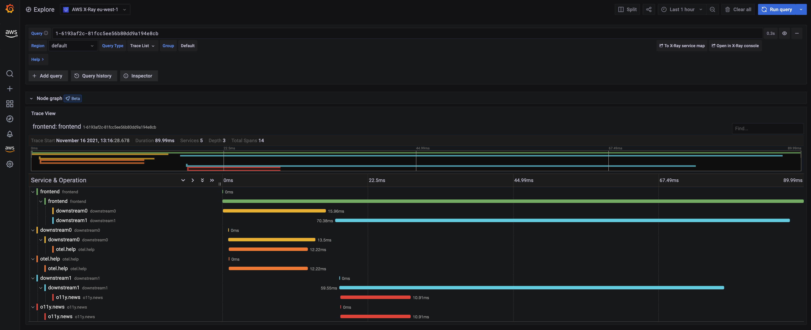

# Utilisation d'AWS Distro for OpenTelemetry dans EKS sur Fargate avec AWS X-Ray

Dans cette recette, nous montrons comment instrumenter un exemple d'application Go
et utiliser [AWS Distro for OpenTelemetry (ADOT)](https://aws.amazon.com/otel) pour
ingerer des traces dans [AWS X-Ray](https://aws.amazon.com/xray/) et visualiser
les traces dans [Amazon Managed Grafana](https://aws.amazon.com/grafana/).

Nous allons configurer un cluster [Amazon Elastic Kubernetes Service (EKS)](https://aws.amazon.com/eks/)
sur [AWS Fargate](https://aws.amazon.com/fargate/) et utiliser un depot
[Amazon Elastic Container Registry (ECR)](https://aws.amazon.com/ecr/)
pour demontrer un scenario complet.

:::note
    Ce guide prendra environ 1 heure a completer.
:::
## Infrastructure
Dans la section suivante, nous allons mettre en place l'infrastructure pour cette recette.

### Architecture

Le pipeline ADOT nous permet d'utiliser le
[collecteur ADOT](https://github.com/aws-observability/aws-otel-collector) pour
collecter les traces d'une application instrumentee et les ingerer dans X-Ray :


### Prerequis

* L'AWS CLI est [installee](https://docs.aws.amazon.com/cli/latest/userguide/cli-chap-install.html) et [configuree](https://docs.aws.amazon.com/cli/latest/userguide/cli-chap-configure.html) dans votre environnement.
* Vous devez installer la commande [eksctl](https://docs.aws.amazon.com/eks/latest/userguide/eksctl.html) dans votre environnement.
* Vous devez installer [kubectl](https://docs.aws.amazon.com/eks/latest/userguide/install-kubectl.html) dans votre environnement.
* Vous avez [Docker](https://docs.docker.com/get-docker/) installe dans votre environnement.
* Vous avez clone le depot [aws-observability/aws-o11y-recipes](https://github.com/aws-observability/aws-o11y-recipes/)
  dans votre environnement local.

### Creer un cluster EKS sur Fargate

Notre application de demonstration est une application Kubernetes que nous allons executer dans un cluster EKS sur Fargate.
Donc, creez d'abord un cluster EKS en utilisant le
fichier [cluster_config.yaml](./fargate-eks-xray-go-adot-amg/cluster-config.yaml) fourni.

Creez votre cluster en utilisant la commande suivante :

```
eksctl create cluster -f cluster-config.yaml
```

### Creer un depot ECR

Pour deployer notre application sur EKS, nous avons besoin d'un depot de conteneurs. Nous
allons utiliser le registre ECR prive, mais vous pouvez aussi utiliser ECR Public, si vous
souhaitez partager l'image de conteneur.

D'abord, definissez les variables d'environnement, comme montre ici (remplacez par votre
region) :

```
export REGION="eu-west-1"
export ACCOUNTID=`aws sts get-caller-identity --query Account --output text`
```

Vous pouvez utiliser la commande suivante pour creer un nouveau depot ECR dans votre compte :

```
aws ecr create-repository \
    --repository-name ho11y \
    --image-scanning-configuration scanOnPush=true \
    --region $REGION
```

### Configurer le collecteur ADOT

Telechargez [adot-collector-fargate.yaml](./fargate-eks-xray-go-adot-amg/adot-collector-fargate.yaml)
et editez ce document YAML avec les parametres decrits dans les etapes suivantes.


```
kubectl apply -f adot-collector-fargate.yaml
```

### Configurer Managed Grafana

Configurez un nouvel espace de travail en utilisant le guide
[Amazon Managed Grafana - Premiers pas](https://aws.amazon.com/blogs/mt/amazon-managed-grafana-getting-started/)
et ajoutez [X-Ray comme source de donnees](https://docs.aws.amazon.com/grafana/latest/userguide/x-ray-data-source.html).

## Generateur de signaux

Nous allons utiliser `ho11y`, un generateur de signaux synthetiques disponible
via le [sandbox](https://github.com/aws-observability/observability-best-practices/tree/main/sandbox/ho11y)
du depot de recettes. Donc, si vous n'avez pas encore clone le depot dans votre
environnement local, faites-le maintenant :

```
git clone https://github.com/aws-observability/aws-o11y-recipes.git
```

### Construire l'image de conteneur
Assurez-vous que vos variables d'environnement `ACCOUNTID` et `REGION` sont definies,
par exemple :

```
export REGION="eu-west-1"
export ACCOUNTID=`aws sts get-caller-identity --query Account --output text`
```
Pour construire l'image de conteneur `ho11y`, allez d'abord dans le repertoire `./sandbox/ho11y/`
et construisez l'image de conteneur :

:::note
    L'etape de construction suivante suppose que le daemon Docker ou un outil equivalent
    de construction d'images OCI est en cours d'execution.
:::

```
docker build . -t "$ACCOUNTID.dkr.ecr.$REGION.amazonaws.com/ho11y:latest"
```

### Pousser l'image de conteneur
Ensuite, vous pouvez pousser l'image de conteneur vers le depot ECR que vous avez cree precedemment.
Pour cela, connectez-vous d'abord au registre ECR par defaut :

```
aws ecr get-login-password --region $REGION | \
    docker login --username AWS --password-stdin \
    "$ACCOUNTID.dkr.ecr.$REGION.amazonaws.com"
```

Et enfin, poussez l'image de conteneur vers le depot ECR que vous avez cree ci-dessus :

```
docker push "$ACCOUNTID.dkr.ecr.$REGION.amazonaws.com/ho11y:latest"
```

### Deployer le generateur de signaux

Editez [x-ray-sample-app.yaml](./fargate-eks-xray-go-adot-amg/x-ray-sample-app.yaml)
pour qu'il contienne le chemin de votre image ECR. C'est-a-dire, remplacez `ACCOUNTID` et `REGION` dans le
fichier par vos propres valeurs (au total, a trois endroits) :

```
    # change the following to your container image:
    image: "ACCOUNTID.dkr.ecr.REGION.amazonaws.com/ho11y:latest"
```

Maintenant vous pouvez deployer l'application exemple sur votre cluster en utilisant :

```
kubectl -n example-app apply -f x-ray-sample-app.yaml
```

## De bout en bout

Maintenant que vous avez l'infrastructure et l'application en place, nous allons
tester la configuration, en envoyant des traces depuis `ho11y` executee dans EKS vers X-Ray et
les visualiser dans AMG.

### Verifier le pipeline

Pour verifier si le collecteur ADOT ingere les traces depuis `ho11y`, nous rendons
l'un des services disponible localement et l'invoquons.

D'abord, transmettons le trafic comme suit :

```
kubectl -n example-app port-forward svc/frontend 8765:80
```

Avec la commande ci-dessus, le microservice `frontend` (une instance `ho11y` configuree
pour communiquer avec deux autres instances `ho11y`) est disponible dans votre environnement local
et vous pouvez l'invoquer comme suit (declenchant la creation de traces) :

```
$ curl localhost:8765/
{"traceId":"1-6193a9be-53693f29a0119ee4d661ba0d"}
```

:::tip
    Si vous voulez automatiser l'invocation, vous pouvez encapsuler l'appel `curl` dans
    une boucle `while true`.
:::
Pour verifier notre configuration, visitez la [vue X-Ray dans CloudWatch](https://console.aws.amazon.com/cloudwatch/home#xray:service-map/)
ou vous devriez voir quelque chose comme ci-dessous :


Maintenant que nous avons le generateur de signaux configure et actif et le pipeline OpenTelemetry
en place, voyons comment consommer les traces dans Grafana.

### Tableau de bord Grafana

Vous pouvez importer un exemple de tableau de bord, disponible via
[x-ray-sample-dashboard.json](./fargate-eks-xray-go-adot-amg/x-ray-sample-dashboard.json)
qui ressemble a ceci :


De plus, lorsque vous cliquez sur l'une des traces dans le panneau inferieur `downstreams`,
vous pouvez y plonger et la visualiser dans l'onglet "Explore" comme ceci :



A partir d'ici, vous pouvez utiliser les guides suivants pour creer votre propre tableau de bord dans
Amazon Managed Grafana :

* [Guide de l'utilisateur : Tableaux de bord](https://docs.aws.amazon.com/grafana/latest/userguide/dashboard-overview.html)
* [Bonnes pratiques pour la creation de tableaux de bord](https://grafana.com/docs/grafana/latest/best-practices/best-practices-for-creating-dashboards/)

C'est tout, felicitations, vous avez appris a utiliser ADOT dans EKS sur Fargate pour
ingerer des traces.

## Nettoyage

D'abord, supprimez les ressources Kubernetes et detruisez le cluster EKS :

```
kubectl delete all --all && \
eksctl delete cluster --name xray-eks-fargate
```
Enfin, supprimez l'espace de travail Amazon Managed Grafana en le supprimant via la console AWS.
