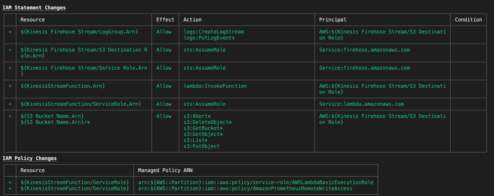

# Exportation de CloudWatch Metric Streams via Firehose et AWS Lambda vers Amazon Managed Service for Prometheus

Dans cette recette, nous vous montrons comment instrumenter un [CloudWatch Metric Stream](https://console.aws.amazon.com/cloudwatch/home#metric-streams:streamsList) et utiliser [Kinesis Data Firehose](https://aws.amazon.com/kinesis/data-firehose/) et [AWS Lambda](https://aws.amazon.com/lambda) pour ingerer des metriques dans [Amazon Managed Service for Prometheus (AMP)](https://aws.amazon.com/prometheus/).

Nous allons configurer une pile en utilisant [AWS Cloud Development Kit (CDK)](https://aws.amazon.com/cdk/) pour creer un Firehose Delivery Stream, une fonction Lambda et un bucket S3 afin de demontrer un scenario complet.

:::note
    Ce guide prendra environ 30 minutes a completer.
:::
## Infrastructure
Dans la section suivante, nous allons configurer l'infrastructure pour cette recette.

CloudWatch Metric Streams permet le transfert des donnees de metriques en streaming vers un
endpoint HTTP ou un [bucket S3](https://aws.amazon.com/s3).

### Prerequis

* L'AWS CLI est [installee](https://docs.aws.amazon.com/cli/latest/userguide/cli-chap-install.html) et [configuree](https://docs.aws.amazon.com/cli/latest/userguide/cli-chap-configure.html) dans votre environnement.
* [AWS CDK Typescript](https://docs.aws.amazon.com/cdk/latest/guide/work-with-cdk-typescript.html) est installe dans votre environnement.
* Node.js et Go.
* Le [depot](https://github.com/aws-observability/observability-best-practices/) a ete clone sur votre machine locale. Le code de ce projet se trouve sous `/sandbox/CWMetricStreamExporter`.

### Creer un espace de travail AMP

Notre application de demonstration dans cette recette s'executera sur AMP.
Creez votre espace de travail AMP avec la commande suivante :

```
aws amp create-workspace --alias prometheus-demo-recipe
```

Verifiez que votre espace de travail a ete cree avec la commande suivante :
```
aws amp list-workspaces
```

:::info
    Pour plus de details, consultez le guide [AMP Getting started](https://docs.aws.amazon.com/prometheus/latest/userguide/AMP-getting-started.html).
:::
### Installer les dependances

Depuis la racine du depot aws-o11y-recipes, changez votre repertoire vers CWMetricStreamExporter avec la commande :

```
cd sandbox/CWMetricStreamExporter
```

Ceci sera desormais considere comme la racine du depot.

Changez de repertoire vers `/cdk` avec la commande suivante :

```
cd cdk
```

Installez les dependances CDK avec la commande suivante :

```
npm install
```

Revenez a la racine du depot, puis changez de repertoire vers `/lambda` avec la commande suivante :

```
cd lambda
```

Une fois dans le dossier `/lambda`, installez les dependances Go avec :

```
go get
```

Toutes les dependances sont maintenant installees.

### Modifier le fichier de configuration

A la racine du depot, ouvrez `config.yaml` et modifiez l'URL de l'espace de travail AMP
en remplacant `{workspace}` par l'ID du nouvel espace de travail cree, et la
region dans laquelle se trouve votre espace de travail AMP.

Par exemple, modifiez comme suit :

```
AMP:
    remote_write_url: "https://aps-workspaces.us-east-2.amazonaws.com/workspaces/{workspaceId}/api/v1/remote_write"
    region: us-east-2
```

Changez les noms du Firehose Delivery Stream et du bucket S3 selon vos preferences.

### Deployer la pile

Une fois le fichier `config.yaml` modifie avec l'ID de l'espace de travail AMP, il est temps
de deployer la pile vers CloudFormation. Pour construire le CDK et le code Lambda,
a la racine du depot, executez la commande suivante :

```
npm run build
```

Cette etape de construction garantit que le binaire Lambda Go est construit et deploie le CDK
vers CloudFormation.

Acceptez les modifications IAM suivantes pour deployer la pile :



Verifiez que la pile a ete creee en executant la commande suivante :

```
aws cloudformation list-stacks
```

Une pile nommee `CDK Stack` devrait avoir ete creee.

## Creer un flux CloudWatch

Naviguez vers la console CloudWatch, par exemple
`https://console.aws.amazon.com/cloudwatch/home?region=us-east-1#metric-streams:streamsList`
et cliquez sur "Create metric stream".

Selectionnez les metriques necessaires, soit toutes les metriques soit uniquement celles des espaces de noms selectionnes.

Configurez le Metric Stream en utilisant un Firehose existant cree par le CDK.
Changez le format de sortie en JSON au lieu d'OpenTelemetry 0.7.
Modifiez le nom du Metric Stream selon vos preferences, et cliquez sur "Create metric stream" :


Pour verifier l'invocation de la fonction Lambda, naviguez vers la [console Lambda](https://console.aws.amazon.com/lambda/home)
et cliquez sur la fonction `KinesisMessageHandler`. Cliquez sur l'onglet `Monitor` et le sous-onglet `Logs`, et sous `Recent Invocations`, il devrait y avoir des entrees indiquant que la fonction Lambda a ete declenchee.

:::note
    Il peut falloir jusqu'a 5 minutes pour que les invocations apparaissent dans l'onglet Monitor.
:::
C'est tout ! Felicitations, vos metriques sont maintenant diffusees en streaming de CloudWatch vers Amazon Managed Service for Prometheus.

## Nettoyage

Tout d'abord, supprimez la pile CloudFormation :

```
cd cdk
cdk destroy
```

Supprimez l'espace de travail AMP :

```
aws amp delete-workspace --workspace-id \
    `aws amp list-workspaces --alias prometheus-sample-app --query 'workspaces[0].workspaceId' --output text`
```

Enfin, supprimez le CloudWatch Metric Stream en le retirant depuis la console.
