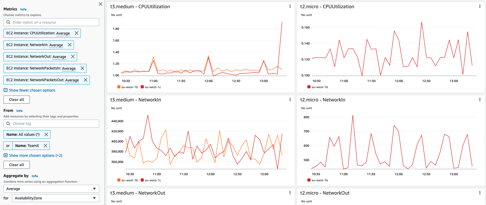

# Utiliser Amazon CloudWatch Metrics Explorer pour agréger et visualiser les métriques filtrées par tags de ressources

Dans cette recette, nous vous montrons comment utiliser Metrics Explorer pour filtrer, agréger et visualiser les métriques par tags de ressources et propriétés de ressources - [Utiliser Metrics Explorer pour surveiller les ressources par leurs tags et propriétés][metrics-explorer].

Il existe plusieurs façons de créer des visualisations avec Metrics Explorer ; dans ce guide, nous utilisons simplement la console AWS.

:::note
    Ce guide prendra environ 5 minutes à compléter.
:::
## Prérequis

* Accès à un compte AWS
* Accès à Amazon CloudWatch Metrics Explorer via la console AWS
* Tags de ressources définis pour les ressources concernées

## Requêtes et visualisations basées sur les tags avec Metrics Explorer

*  Ouvrez la console CloudWatch

*  Sous <b>Metrics</b>, cliquez sur le menu <b>Explorer</b>

<!--  -->

*  Vous pouvez choisir parmi l'un des <b>Generic templates</b> ou une liste de <b>Service based templates</b> ; dans cet exemple nous utilisons le modèle <b>EC2 Instances by type</b>

<!--  -->

*  Choisissez les métriques que vous souhaitez explorer ; supprimez celles qui sont obsolètes et ajoutez d'autres métriques que vous souhaitez voir

<!--  -->

*  Sous <b>From</b>, choisissez un tag de ressource ou une propriété de ressource que vous recherchez ; dans l'exemple ci-dessous nous montrons un certain nombre de métriques CPU et réseau pour différentes instances EC2 avec le Tag <b>Name: TeamX</b>

<!--

// width="386" height="176" -->

*  Veuillez noter que vous pouvez combiner des séries temporelles en utilisant une fonction d'agrégation sous <b>Aggregated by</b> ; dans l'exemple ci-dessous les métriques <b>TeamX</b> sont agrégées par <b>Availability Zone</b>

<!--  -->

Alternativement, vous pourriez agréger <b>TeamX</b> et <b>TeamY</b> par le Tag <b>Team</b>, ou choisir toute autre configuration qui correspond à vos besoins

<!--  -->

## Visualisations dynamiques
Vous pouvez facilement personnaliser les visualisations résultantes en utilisant les options <b>From</b>, <b>Aggregated by</b> et <b>Split by</b>. Les visualisations de Metrics Explorer sont dynamiques, donc toute nouvelle ressource taguée apparaît automatiquement dans le widget de l'explorateur.

## Référence

Pour plus d'informations sur Metrics Explorer, veuillez consulter l'article suivant :
https://docs.aws.amazon.com/AmazonCloudWatch/latest/monitoring/CloudWatch-Metrics-Explorer.html

[metrics-explorer]: https://docs.aws.amazon.com/AmazonCloudWatch/latest/monitoring/CloudWatch-Metrics-Explorer.html
