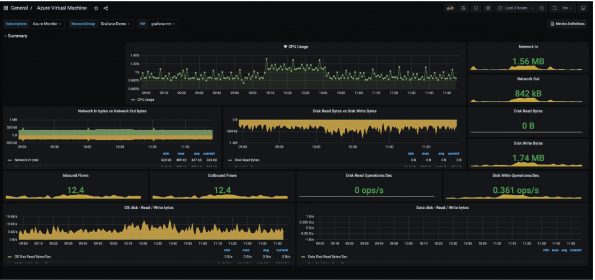
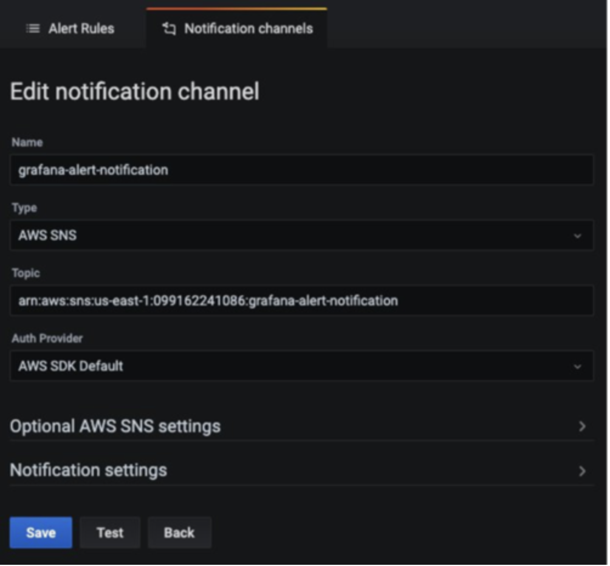

# Surveillance des environnements hybrides avec Amazon Managed Service for Grafana

Dans cette recette, nous vous montrons comment visualiser les métriques d'un environnement Azure Cloud dans [Amazon Managed Service for Grafana](https://aws.amazon.com/grafana/) (AMG) et configurer des notifications d'alerte dans AMG pour les envoyer vers [Amazon Simple Notification Service](https://docs.aws.amazon.com/sns/latest/dg/welcome.html) et Slack.


Dans le cadre de l'implémentation, nous allons créer un espace de travail AMG, configurer le plugin Azure Monitor comme source de données pour AMG et configurer le tableau de bord Grafana. Nous allons créer deux canaux de notification : un pour Amazon SNS et un pour Slack. Nous configurerons également des alertes dans le tableau de bord AMG pour les envoyer aux canaux de notification.

:::note
    Ce guide prendra environ 30 minutes à compléter.
:::
## Infrastructure
Dans la section suivante, nous allons mettre en place l'infrastructure pour cette recette.

### Prérequis

* L'AWS CLI est [installée](https://docs.aws.amazon.com/cli/latest/userguide/cli-chap-install.html) et [configurée](https://docs.aws.amazon.com/cli/latest/userguide/cli-chap-configure.html) dans votre environnement.
* Vous devez activer [AWS-SSO](https://docs.aws.amazon.com/singlesignon/latest/userguide/step1.html)

### Architecture


Tout d'abord, créez un espace de travail AMG pour visualiser les métriques depuis Azure Monitor. Suivez les étapes du billet de blog [Getting Started with Amazon Managed Service for Grafana](https://aws.amazon.com/blogs/mt/amazon-managed-grafana-getting-started/). Après avoir créé l'espace de travail, vous pouvez attribuer l'accès à l'espace de travail Grafana à un utilisateur individuel ou à un groupe d'utilisateurs. Par défaut, l'utilisateur a un type d'utilisateur viewer. Modifiez le type d'utilisateur en fonction du rôle de l'utilisateur.

:::note 
    Vous devez attribuer un rôle Admin à au moins un utilisateur dans l'espace de travail.
:::
Dans la Figure 1, le nom d'utilisateur est grafana-admin. Le type d'utilisateur est Admin. Dans l'onglet Data sources, choisissez la source de données requise. Vérifiez la configuration, puis choisissez Create workspace.


### Configurer la source de données et le tableau de bord personnalisé

Maintenant, sous Data sources, configurez le plugin Azure Monitor pour commencer à interroger et visualiser les métriques depuis l'environnement Azure. Choisissez Data sources pour ajouter une source de données.


Dans Add data source, recherchez Azure Monitor puis configurez les paramètres depuis la console d'enregistrement d'application dans l'environnement Azure.


Pour configurer le plugin Azure Monitor, vous avez besoin de l'ID de répertoire (tenant) et de l'ID d'application (client). Pour les instructions, consultez l'[article](https://docs.microsoft.com/en-us/azure/active-directory/develop/howto-create-service-principal-portal) sur la création d'une application Azure AD et d'un principal de service. Il explique comment enregistrer l'application et accorder l'accès à Grafana pour interroger les données.


Une fois la source de données configurée, importez un tableau de bord personnalisé pour analyser les métriques Azure. Dans le panneau de gauche, choisissez l'icône + , puis choisissez Import.

Dans Import via grafana.com, entrez l'ID du tableau de bord, 10532.


Cela importera le tableau de bord Azure Virtual Machine où vous pourrez commencer à analyser les métriques Azure Monitor. Dans ma configuration, j'ai une machine virtuelle en cours d'exécution dans l'environnement Azure.




### Configurer les canaux de notification sur AMG

Dans cette section, vous allez configurer deux canaux de notification puis envoyer des alertes.

Utilisez la commande suivante pour créer un sujet SNS nommé grafana-notification et abonner une adresse e-mail.

```
aws sns create-topic --name grafana-notification
aws sns subscribe --topic-arn arn:aws:sns:<region>:<account-id>:grafana-notification --protocol email --notification-endpoint <email-id>

```
Dans le panneau de gauche, choisissez l'icône de cloche pour ajouter un nouveau canal de notification.
Maintenant configurez le canal de notification grafana-notification. Sur Edit notification channel, pour Type, choisissez AWS SNS. Pour Topic, utilisez l'ARN du sujet SNS que vous venez de créer. Pour Auth Provider, choisissez le rôle IAM de l'espace de travail.



### Canal de notification Slack
Pour configurer un canal de notification Slack, créez un espace de travail Slack ou utilisez-en un existant. Activez les Incoming Webhooks comme décrit dans [Sending messages using Incoming Webhooks](https://api.slack.com/messaging/webhooks).

Après avoir configuré l'espace de travail, vous devriez pouvoir obtenir une URL de webhook qui sera utilisée dans le tableau de bord Grafana.


### Configurer les alertes dans AMG

Vous pouvez configurer des alertes Grafana lorsque la métrique dépasse le seuil. Avec AMG, vous pouvez configurer la fréquence d'évaluation de l'alerte dans le tableau de bord et envoyer la notification. Dans cet exemple, configurez une alerte pour l'utilisation CPU d'une machine virtuelle Azure. Lorsque l'utilisation dépasse un seuil, configurez AMG pour envoyer des notifications aux deux canaux.

Dans le tableau de bord, choisissez CPU utilization dans le menu déroulant, puis choisissez Edit. Dans l'onglet Alert du panneau graphique, configurez la fréquence d'évaluation de la règle d'alerte et les conditions qui doivent être remplies pour que l'alerte change d'état et déclenche ses notifications.

Dans la configuration suivante, une alerte est créée si l'utilisation CPU dépasse 50 %. Les notifications seront envoyées aux canaux grafana-alert-notification et slack-alert-notification.


Maintenant, vous pouvez vous connecter à la machine virtuelle Azure et lancer un test de charge en utilisant des outils comme stress. Lorsque l'utilisation CPU dépasse le seuil, vous recevrez des notifications sur les deux canaux.

Maintenant configurez les alertes pour l'utilisation CPU avec le bon seuil pour simuler une alerte envoyée au canal Slack.

## Conclusion

Dans cette recette, nous vous avons montré comment déployer l'espace de travail AMG, configurer les canaux de notification, collecter les métriques depuis Azure Cloud et configurer les alertes sur le tableau de bord AMG. Comme AMG est une solution entièrement gérée et serverless, vous pouvez consacrer votre temps aux applications qui transforment votre entreprise et laisser la gestion de Grafana à AWS.
