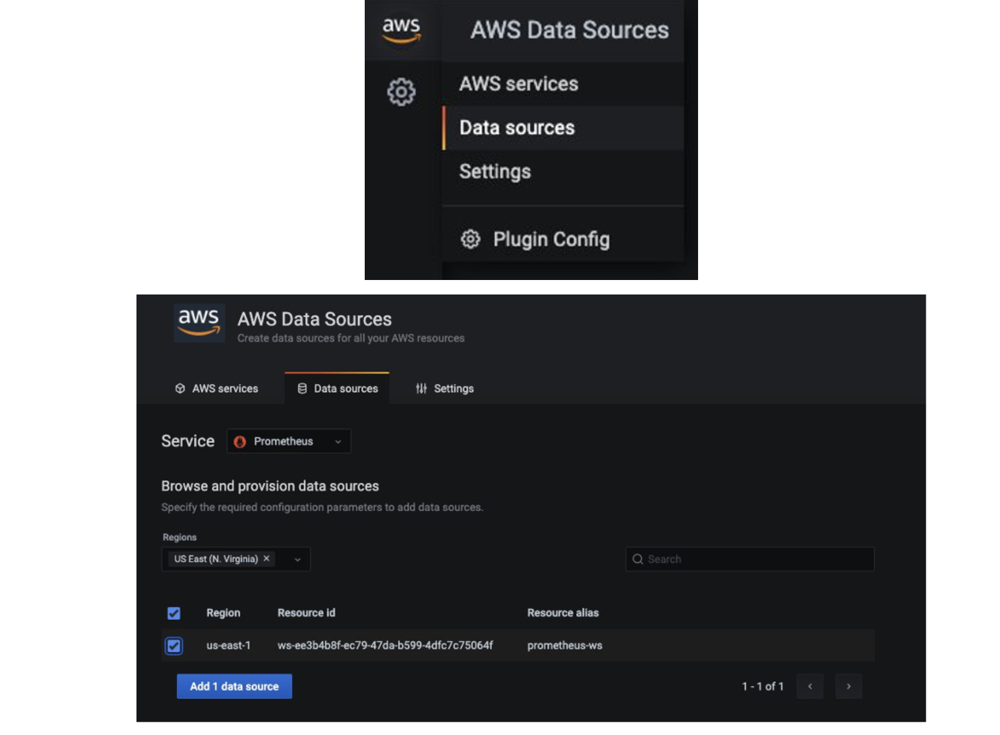
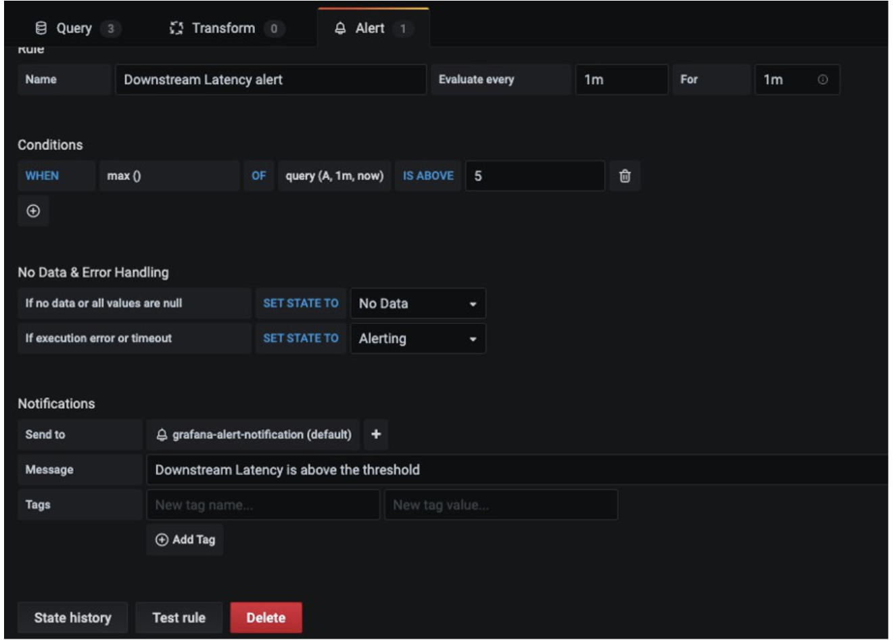

# Utilisation d'Amazon Managed Service for Prometheus pour surveiller un environnement App Mesh configure sur EKS

Dans cette recette, nous vous montrons comment ingerer les metriques [App Mesh](https://docs.aws.amazon.com/app-mesh/) Envoy
dans un cluster [Amazon Elastic Kubernetes Service](https://aws.amazon.com/eks/) (EKS)
vers [Amazon Managed Service for Prometheus](https://aws.amazon.com/prometheus/) (AMP)
et creer un tableau de bord personnalise sur [Amazon Managed Grafana](https://aws.amazon.com/grafana/)
(AMG) pour surveiller la sante et les performances des microservices.

Dans le cadre de l'implementation, nous allons creer un espace de travail AMP, installer le controleur
App Mesh pour Kubernetes et injecter le conteneur Envoy dans les pods. Nous collecterons
les metriques Envoy en utilisant [Grafana Agent](https://github.com/grafana/agent)
configure dans le cluster EKS et les ecrirons dans AMP. Enfin, nous creons
un espace de travail AMG, configurons AMP comme source de donnees et creons un tableau de bord personnalise.

:::note
    Ce guide prendra environ 45 minutes a completer.
:::
## Infrastructure
Dans la section suivante, nous allons configurer l'infrastructure pour cette recette.

### Architecture


L'agent Grafana est configure pour scraper les metriques Envoy et les ingerer dans AMP via l'endpoint d'ecriture distante AMP.

:::info
    Pour plus d'informations sur le Prometheus Remote Write Exporter, consultez
    [Getting Started with Prometheus Remote Write Exporter for AMP](https://aws-otel.github.io/docs/getting-started/prometheus-remote-write-exporter).
:::

### Prerequis

* L'AWS CLI est [installee](https://docs.aws.amazon.com/cli/latest/userguide/cli-chap-install.html) et [configuree](https://docs.aws.amazon.com/cli/latest/userguide/cli-chap-configure.html) dans votre environnement.
* Vous devez installer la commande [eksctl](https://docs.aws.amazon.com/eks/latest/userguide/eksctl.html) dans votre environnement.
* Vous devez installer [kubectl](https://docs.aws.amazon.com/eks/latest/userguide/install-kubectl.html) dans votre environnement.
* Vous avez [Docker](https://docs.docker.com/get-docker/) installe dans votre environnement.
* Vous avez besoin d'un espace de travail AMP configure dans votre compte AWS.
* Vous devez installer [Helm](https://www.eksworkshop.com/beginner/060_helm/helm_intro/install/index.html).
* Vous devez activer [AWS-SSO](https://docs.aws.amazon.com/singlesignon/latest/userguide/step1.html).

### Configurer un cluster EKS

Tout d'abord, creez un cluster EKS qui sera active avec App Mesh pour executer l'application exemple.
La CLI `eksctl` sera utilisee pour deployer le cluster en utilisant le fichier [eks-cluster-config.yaml](./servicemesh-monitoring-ampamg/eks-cluster-config.yaml).
Ce modele creera un nouveau cluster avec EKS.

Editez le fichier modele et definissez votre region sur l'une des regions disponibles pour AMP :

* `us-east-1`
* `us-east-2`
* `us-west-2`
* `eu-central-1`
* `eu-west-1`

Assurez-vous d'ecraser cette region dans votre session, par exemple, dans le shell Bash :

```
export AWS_REGION=eu-west-1
```

Creez votre cluster avec la commande suivante :

```
eksctl create cluster -f eks-cluster-config.yaml
```
Cela cree un cluster EKS nomme `AMP-EKS-CLUSTER` et un compte de service
nomme `appmesh-controller` qui sera utilise par le controleur App Mesh pour EKS.

### Installer le controleur App Mesh

Ensuite, nous executons les commandes ci-dessous pour installer le [controleur App Mesh](https://docs.aws.amazon.com/app-mesh/latest/userguide/getting-started-kubernetes.html)
et configurer les Custom Resource Definitions (CRDs) :

```
helm repo add eks https://aws.github.io/eks-charts
```

```
helm upgrade -i appmesh-controller eks/appmesh-controller \
     --namespace appmesh-system \
     --set region=${AWS_REGION} \
     --set serviceAccount.create=false \
     --set serviceAccount.name=appmesh-controller
```

### Configurer AMP
L'espace de travail AMP est utilise pour ingerer les metriques Prometheus collectees depuis Envoy.
Un espace de travail est un serveur Cortex logique dedie a un locataire. Un espace de travail prend en charge
un controle d'acces detaille pour autoriser sa gestion, comme la mise a jour, la liste,
la description et la suppression, ainsi que l'ingestion et l'interrogation des metriques.

Creez un espace de travail avec l'AWS CLI :

```
aws amp create-workspace --alias AMP-APPMESH --region $AWS_REGION
```

Ajoutez les depots Helm necessaires :

```
helm repo add prometheus-community https://prometheus-community.github.io/helm-charts && \
helm repo add kube-state-metrics https://kubernetes.github.io/kube-state-metrics 
```

Pour plus de details sur AMP, consultez le guide [AMP Getting started](https://docs.aws.amazon.com/prometheus/latest/userguide/AMP-getting-started.html).

### Scraping et ingestion des metriques

AMP ne scrape pas directement les metriques operationnelles des charges de travail conteneurisees dans un cluster Kubernetes.
Vous devez deployer et gerer un serveur Prometheus ou un agent OpenTelemetry tel que le
[collecteur AWS Distro for OpenTelemetry](https://github.com/aws-observability/aws-otel-collector)
ou l'agent Grafana pour effectuer cette tache. Dans cette recette, nous vous guidons a travers le
processus de configuration de l'agent Grafana pour scraper les metriques Envoy et les analyser avec AMP et AMG.

#### Configurer l'agent Grafana

L'agent Grafana est une alternative legere a l'execution d'un serveur Prometheus complet.
Il conserve les parties necessaires pour decouvrir et scraper les exportateurs Prometheus et
envoyer des metriques a un backend compatible Prometheus. L'agent Grafana inclut egalement
un support natif pour AWS Signature Version 4 (Sigv4) pour l'authentification AWS Identity and Access Management (IAM).

Nous vous guidons maintenant a travers les etapes pour configurer un role IAM afin d'envoyer des metriques Prometheus a AMP.
Nous installons l'agent Grafana sur le cluster EKS et transmettons les metriques a AMP.

#### Configurer les permissions
L'agent Grafana scrape les metriques operationnelles des charges de travail conteneurisees executees dans le
cluster EKS et les envoie a AMP. Les donnees envoyees a AMP doivent etre signees avec des identifiants AWS valides
en utilisant Sigv4 pour authentifier et autoriser chaque requete client pour le service gere.

L'agent Grafana peut etre deploye sur un cluster EKS pour s'executer sous l'identite d'un compte de service Kubernetes.
Avec les roles IAM pour les comptes de service (IRSA), vous pouvez associer un role IAM a un compte de service Kubernetes
et ainsi fournir des permissions IAM a tout pod qui utilise le compte de service.

Preparez la configuration IRSA comme suit :

```
kubectl create namespace grafana-agent

export WORKSPACE=$(aws amp list-workspaces | jq -r '.workspaces[] | select(.alias=="AMP-APPMESH").workspaceId')
export ROLE_ARN=$(aws iam get-role --role-name EKS-GrafanaAgent-AMP-ServiceAccount-Role --query Role.Arn --output text)
export NAMESPACE="grafana-agent"
export REMOTE_WRITE_URL="https://aps-workspaces.$AWS_REGION.amazonaws.com/workspaces/$WORKSPACE/api/v1/remote_write"
```

Vous pouvez utiliser le script shell [gca-permissions.sh](./servicemesh-monitoring-ampamg/gca-permissions.sh)
pour automatiser les etapes suivantes (notez de remplacer la variable de remplacement
`YOUR_EKS_CLUSTER_NAME` par le nom de votre cluster EKS) :

* Cree un role IAM nomme `EKS-GrafanaAgent-AMP-ServiceAccount-Role` avec une politique IAM qui a les permissions d'ecriture distante dans un espace de travail AMP.
* Cree un compte de service Kubernetes nomme `grafana-agent` sous l'espace de noms `grafana-agent` qui est associe au role IAM.
* Cree une relation de confiance entre le role IAM et le fournisseur OIDC heberge dans votre cluster Amazon EKS.

Vous avez besoin des outils CLI `kubectl` et `eksctl` pour executer le script `gca-permissions.sh`.
Ils doivent etre configures pour acceder a votre cluster Amazon EKS.

Creez maintenant un fichier manifeste, [grafana-agent.yaml](./servicemesh-monitoring-ampamg/grafana-agent.yaml),
avec la configuration de scraping pour extraire les metriques Envoy et deployer l'agent Grafana.

:::note
    Au moment de la redaction, cette solution ne fonctionnera pas pour EKS sur Fargate
    en raison du manque de support pour les daemon sets.
:::
L'exemple deploie un daemon set nomme `grafana-agent` et un deploiement nomme
`grafana-agent-deployment`. Le daemon set `grafana-agent` collecte les metriques
depuis les pods du cluster et le deploiement `grafana-agent-deployment` collecte
les metriques depuis les services qui ne resident pas sur le cluster, comme le plan de controle EKS.

```
kubectl apply -f grafana-agent.yaml
```
Apres le deploiement de `grafana-agent`, il collectera les metriques et les ingerera
dans l'espace de travail AMP specifie. Deployez maintenant une application exemple sur le
cluster EKS et commencez a analyser les metriques.

## Application exemple

Pour installer une application et injecter un conteneur Envoy, nous utilisons le controleur AppMesh pour Kubernetes.

Tout d'abord, installez l'application de base en clonant le depot d'exemples :

```
git clone https://github.com/aws/aws-app-mesh-examples.git
```

Et maintenant appliquez les ressources a votre cluster :

```
kubectl apply -f aws-app-mesh-examples/examples/apps/djapp/1_base_application
```

Verifiez le statut des pods et assurez-vous qu'ils sont en cours d'execution :

```
$ kubectl -n prod get all

NAME                            READY   STATUS    RESTARTS   AGE
pod/dj-cb77484d7-gx9vk          1/1     Running   0          6m8s
pod/jazz-v1-6b6b6dd4fc-xxj9s    1/1     Running   0          6m8s
pod/metal-v1-584b9ccd88-kj7kf   1/1     Running   0          6m8s
```

Ensuite, installez le controleur App Mesh et meshifiez le deploiement :

```
kubectl apply -f aws-app-mesh-examples/examples/apps/djapp/2_meshed_application/
kubectl rollout restart deployment -n prod dj jazz-v1 metal-v1
```

Maintenant, nous devrions voir deux conteneurs en cours d'execution dans chaque pod :

```
$ kubectl -n prod get all
NAME                        READY   STATUS    RESTARTS   AGE
dj-7948b69dff-z6djf         2/2     Running   0          57s
jazz-v1-7cdc4fc4fc-wzc5d    2/2     Running   0          57s
metal-v1-7f499bb988-qtx7k   2/2     Running   0          57s
```

Generez du trafic pendant 5 minutes et nous le visualiserons dans AMG plus tard :

```
dj_pod=`kubectl get pod -n prod --no-headers -l app=dj -o jsonpath='{.items[*].metadata.name}'`

loop_counter=0
while [ $loop_counter -le 300 ] ; do \
kubectl exec -n prod -it $dj_pod  -c dj \
-- curl jazz.prod.svc.cluster.local:9080 ; echo ; loop_counter=$[$loop_counter+1] ; \
done
```

### Creer un espace de travail AMG

Pour creer un espace de travail AMG, suivez les etapes du billet de blog [Getting Started with AMG](https://aws.amazon.com/blogs/mt/amazon-managed-grafana-getting-started/).
Pour accorder aux utilisateurs l'acces au tableau de bord, vous devez activer AWS SSO. Apres avoir cree l'espace de travail, vous pouvez attribuer l'acces a l'espace de travail Grafana a un utilisateur individuel ou a un groupe d'utilisateurs.
Par defaut, l'utilisateur a un type d'utilisateur de visualiseur. Changez le type d'utilisateur en fonction du role de l'utilisateur. Ajoutez l'espace de travail AMP comme source de donnees, puis commencez a creer le tableau de bord.

Dans cet exemple, le nom d'utilisateur est `grafana-admin` et le type d'utilisateur est `Admin`.
Selectionnez la source de donnees requise. Verifiez la configuration, puis choisissez `Create workspace`.


### Configurer la source de donnees AMG
Pour configurer AMP comme source de donnees dans AMG, dans la section `Data sources`, choisissez
`Configure in Grafana`, ce qui lancera un espace de travail Grafana dans le navigateur.
Vous pouvez egalement lancer manuellement l'URL de l'espace de travail Grafana dans le navigateur.



Comme vous pouvez le voir sur les captures d'ecran, vous pouvez visualiser les metriques Envoy comme la
latence en aval, les connexions, le code de reponse, et plus encore. Vous pouvez utiliser les filtres affiches pour
approfondir les metriques envoy d'une application particuliere.

### Configurer le tableau de bord AMG

Apres la configuration de la source de donnees, importez un tableau de bord personnalise pour analyser les metriques Envoy.
Pour cela, nous utilisons un tableau de bord predefini, donc choisissez `Import` (montre ci-dessous), et
entrez ensuite l'ID `11022`. Cela importera le tableau de bord Envoy Global afin que vous puissiez
commencer a analyser les metriques Envoy.


### Configurer les alertes sur AMG
Vous pouvez configurer des alertes Grafana lorsque la metrique depasse le seuil prevu.
Avec AMG, vous pouvez configurer la frequence d'evaluation de l'alerte dans le tableau de bord et envoyer la notification.
Avant de creer des regles d'alerte, vous devez creer un canal de notification.

Dans cet exemple, configurez Amazon SNS comme canal de notification. Le sujet SNS doit etre
prefixe par `grafana` pour que les notifications soient publiees avec succes vers le sujet
si vous utilisez les parametres par defaut, c'est-a-dire les [permissions gerees par le service](https://docs.aws.amazon.com/grafana/latest/userguide/AMG-manage-permissions.html#AMG-service-managed-account).

Utilisez la commande suivante pour creer un sujet SNS nomme `grafana-notification` :

```
aws sns create-topic --name grafana-notification
```

Et abonnez-vous via une adresse email. Assurez-vous de specifier la region et l'ID de compte dans la
commande ci-dessous :

```
aws sns subscribe \
    --topic-arn arn:aws:sns:<region>:<account-id>:grafana-notification \
	--protocol email \
	--notification-endpoint <email-id>
```

Maintenant, ajoutez un nouveau canal de notification depuis le tableau de bord Grafana.
Configurez le nouveau canal de notification nomme grafana-notification. Pour le Type,
utilisez AWS SNS dans le menu deroulant. Pour le Topic, utilisez l'ARN du sujet SNS que vous venez de creer.
Pour Auth provider, choisissez AWS SDK Default.


Configurez maintenant une alerte si la latence en aval depasse cinq millisecondes sur une periode d'une minute.
Dans le tableau de bord, choisissez Downstream latency dans le menu deroulant, puis choisissez Edit.
Dans l'onglet Alert du panneau graphique, configurez la frequence d'evaluation de la regle d'alerte
et les conditions qui doivent etre remplies pour que l'alerte change d'etat et initie ses notifications.

Dans la configuration suivante, une alerte est creee si la latence en aval depasse le
seuil et la notification sera envoyee via le canal grafana-alert-notification configure vers le sujet SNS.



## Nettoyage

1. Supprimez les ressources et le cluster :
```
kubectl delete all --all
eksctl delete cluster --name AMP-EKS-CLUSTER
```
2. Supprimez l'espace de travail AMP :
```
aws amp delete-workspace --workspace-id `aws amp list-workspaces --alias prometheus-sample-app --query 'workspaces[0].workspaceId' --output text`
```
3. Supprimez le role IAM amp-iamproxy-ingest-role :
```
aws delete-role --role-name amp-iamproxy-ingest-role
```
4. Supprimez l'espace de travail AMG en le retirant depuis la console.
