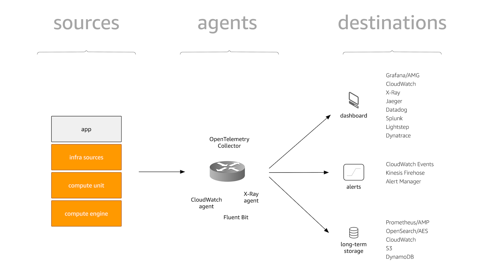

# Telemetrie

La telemetrie concerne la facon dont les signaux sont collectes a partir de diverses sources,
y compris votre propre application et infrastructure, et achemines vers des destinations
ou ils sont consommes :

:::info
    Consultez la section [Types de donnees](../signals/logs.md) pour une description detaillee des bonnes pratiques pour chaque type de telemetrie.
:::
Plongeons plus en detail dans les concepts introduits dans la figure ci-dessus.

## Sources

Nous considerons les sources comme quelque chose d'ou proviennent les signaux. Il existe deux types de sources :

1. Les elements sous votre controle, c'est-a-dire le code source de l'application, via l'instrumentation.
1. Tout le reste que vous pouvez utiliser, comme les services geres, qui n'est pas sous votre controle (direct).
   Ces types de sources sont generalement fournis par AWS, exposant des signaux via une API.

## Agents

Pour transporter les signaux des sources vers les destinations, vous avez besoin
d'une sorte d'intermediaire que nous appelons agent. Ces agents recoivent ou extraient
les signaux des sources et, generalement via la configuration, determinent ou les signaux
doivent aller, en prenant eventuellement en charge le filtrage et l'agregation.

:::note
    "Agents ? Routage ? Expedition ? Ingestion ?"
    Il existe de nombreux termes que les gens utilisent pour designer le processus
    d'acheminement des signaux des sources vers les destinations, y compris le routage,
    l'expedition, l'agregation, l'ingestion, etc. et bien qu'ils puissent signifier des
    choses legerement differentes, nous les utiliserons ici de maniere interchangeable.
    De maniere canonique, nous designerons ces composants de transport intermediaires
    comme des agents.
:::

## Destinations

L'endroit ou les signaux aboutissent, pour etre consommes. Que vous souhaitiez stocker
des signaux pour une consommation ulterieure, les afficher dans un tableau de bord, definir
une alerte si une certaine condition est vraie, ou correler des signaux. Tous ces composants
qui vous servent en tant qu'utilisateur final sont des destinations.
