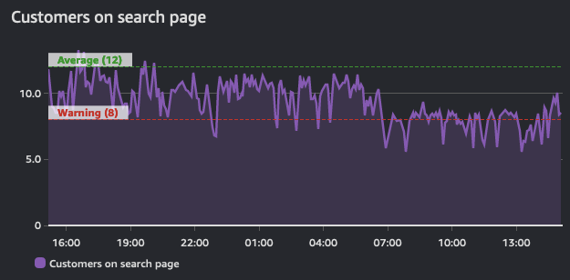

# Alarmes

Une alarme fait référence à l'état d'une sonde, d'un moniteur, ou à un changement de valeur au-dessus ou en dessous d'un seuil donné. Un exemple simple serait une alarme qui envoie un e-mail lorsqu'un disque est plein ou qu'un site web est en panne. Les alarmes plus sophistiquées sont entièrement programmatiques et utilisées pour piloter des interactions complexes comme l'auto-scaling ou la création de clusters de serveurs entiers.

Quel que soit le cas d'utilisation cependant, une alarme indique l'*état* actuel d'une métrique. Cet état peut être `OK`, `WARNING`, `ALERT`, ou `NO DATA`, selon le système en question.

Les alarmes reflètent cet état pendant une période de temps et sont construites au-dessus d'une série temporelle. En tant que telles, elles sont dérivées *d'une* série temporelle. Le graphique ci-dessous montre deux alarmes : une avec un seuil d'avertissement, et une autre qui est indicative des valeurs moyennes de cette série temporelle. Comme le montre le volume de trafic, les alarmes pour le seuil d'avertissement devraient être en état de violation lorsqu'il descend en dessous de la valeur définie.



:::info
	Le but d'une alarme peut être soit de déclencher une action (humaine ou programmatique), soit d'être informative (qu'un seuil est dépassé). Les alarmes fournissent un aperçu de la performance d'une métrique.
:::
## Alertez sur les choses qui sont actionnables

La fatigue d'alerte survient lorsque les personnes reçoivent tellement d'alertes qu'elles ont appris à les ignorer. Ce n'est pas l'indication d'un système bien surveillé ! C'est plutôt un anti-pattern.

:::info
	Créez des alarmes pour les choses qui sont actionnables, et vous devriez toujours travailler à partir de vos [objectifs](../guides/index.md#monitor-what-matters) en remontant.
:::

Par exemple, si vous exploitez un site web qui nécessite des temps de réponse rapides, créez une alerte à livrer lorsque vos temps de réponse dépassent un seuil donné. Et si vous avez identifié que les mauvaises performances sont liées à une utilisation élevée du CPU, alors alertez sur ce point de données *proactivement* avant qu'il ne devienne un problème. Cependant, il n'est peut-être pas nécessaire d'alerter sur toute l'utilisation du CPU *partout* dans votre environnement si cela ne *met pas en danger vos résultats*.

:::info
	Si une alarme n'a pas besoin de vous alerter, ou de déclencher un processus automatisé, alors il n'est pas nécessaire qu'elle vous alerte. Vous devriez supprimer les notifications des alarmes qui sont superflues.
:::

## Méfiez-vous de l'alarme "tout va bien"

De même, un pattern courant est l'alarme "tout va bien", lorsque les opérateurs sont tellement habitués à recevoir des alertes constantes qu'ils ne remarquent que lorsque les choses deviennent soudainement silencieuses ! C'est un mode de fonctionnement très dangereux, et un pattern qui va à l'encontre de l'excellence opérationnelle.

:::warning
	L'alarme "tout va bien" nécessite généralement un humain pour l'interpréter ! Cela rend des patterns comme les applications auto-réparatrices impossibles.[^1]
:::
## Combattez la fatigue d'alerte avec l'agrégation

L'observabilité est un problème *humain*, pas un problème technologique. Et en tant que tel, votre stratégie d'alarme devrait se concentrer sur la réduction des alarmes plutôt que sur leur création. Lorsque vous implémentez la collecte de télémétrie, il est naturel d'avoir plus d'alertes de votre environnement. Soyez cependant prudent de n'[alerter que sur les choses qui sont actionnables](#alertez-sur-les-choses-qui-sont-actionnables). Si la condition qui a causé l'alerte n'est pas actionnable, alors il n'est pas nécessaire de la signaler.

Cela s'illustre mieux par un exemple : si vous avez cinq serveurs web qui utilisent une seule base de données pour leur backend, qu'arrive-t-il à vos serveurs web si la base de données est en panne ? La réponse pour beaucoup de personnes est qu'elles reçoivent *au moins six* alertes - *cinq* pour les serveurs web et *une* pour la base de données !


Mais il n'y a que deux alertes qui ont du sens à délivrer :

1. Le site web est en panne, et
1. La base de données en est la cause


:::info
	Distiller vos alertes en agrégats les rend plus faciles à comprendre pour les personnes, et ensuite plus faciles à créer des runbooks et de l'automatisation.
:::
## Utilisez vos processus ITSM et de support existants

Quelle que soit votre plateforme de surveillance et d'observabilité, elle doit s'intégrer dans votre chaîne d'outils actuelle.

:::info
	Créez des tickets de problèmes et des incidents en utilisant une intégration programmatique depuis vos alertes vers ces outils, supprimant l'effort humain et rationalisant les processus en cours de route.
:::
Cela vous permet de dériver des données opérationnelles importantes telles que les [métriques DORA](https://en.wikipedia.org/wiki/DevOps).

## Activation des actions d'alarme selon un calendrier Cron

Les alarmes fournissent des capacités de surveillance essentielles pour les ressources AWS, permettant aux équipes de suivre les métriques et de recevoir des notifications lorsque les seuils sont dépassés. Bien que cette surveillance soit cruciale pour maintenir la conscience opérationnelle, un défi courant émerge lorsque les organisations implémentent des stratégies d'optimisation des coûts impliquant des arrêts programmés de ressources. Dans ce scénario spécifique, les ressources de production sont configurées pour s'arrêter automatiquement en dehors des heures de bureau (18h à 6h, du lundi au vendredi et les week-ends). Cependant, les alarmes CloudWatch continuent de surveiller et de déclencher des notifications pendant ces périodes d'indisponibilité planifiée, résultant en des alertes inutiles lorsque les ressources sont intentionnellement hors ligne. Une solution utilisant des EventBridge Schedules et des fonctions Lambda peut être implémentée pour activer et désactiver programmatiquement les alarmes basées sur des tags en alignement avec la planification des ressources, assurant une surveillance efficace pendant les heures de bureau tout en éliminant les fausses alertes pendant les périodes d'indisponibilité planifiée.

### Architecture


### Déploiement

Clonez le dépôt :
```
git clone https://github.com/aws-observability/observability-best-practices.git
```

Trouvez le modèle CloudFormation :
```
cd observability-best-practices/sandbox/cw-alarm-scheduler
```

Le modèle CloudFormation est 'cf.yaml' dans ce répertoire.

Accédez à la console CloudFormation et créez une pile à partir de ce modèle :

1. Spécifiez les détails de la pile :
    1. Fournissez un nom de pile :
        1. Stack name: $STACK-NAME
    2. Paramètres :
        1. DisableAlarmsCronSchedule: (entrez une expression cron pour définir quand désactiver les alarmes)
            1. Default cron(00 18 ? * 1-5 *)
        2. EnableAlarmsCronSchedule: (entrez une expression cron pour définir quand activer les alarmes)
            1. Default cron(00 06 ? * 1-5 *)
        3. LambdaArchitecture: Choisissez l'architecture de la fonction Lambda (x86_64 ou arm64)
            1. Default arm64
        4. ScheduleTimezone: Choisissez le fuseau horaire dans la liste déroulante
            1. Default America/New_York
        5. SuppressTagKey: Clé du tag pour filtrer les alarmes CloudWatch (par exemple, 'suppress' ou 'snooze')
            1. Default "suppress"
        6. SuppressTagValue: Valeur du tag pour filtrer les alarmes CloudWatch (par exemple, 'true')
            1. Default "true"
    3. Next

Cela fera en sorte que les alarmes taguées avec la clé-valeur que vous sélectionnez dans les paramètres CloudFormation adhèrent au calendrier Cron que vous avez choisi.

Par exemple :

Si vous choisissez 'suppress' pour SuppressTagKey et 'true' pour SuppressTagValue, alors toutes les alarmes avec un tag 'suppress':'true' adhéreront au calendrier que vous définissez dans DisableAlarmsCronSchedule et EnableAlarmsCronSchedule.

:::info
Comportement :
Lorsque les alarmes sont désactivées :
* Aucune alerte ni notification ne sera générée
* La collecte de métriques continue sans interruption

Lorsque les alarmes sont réactivées :
* La fonctionnalité d'alerte normale reprend peu après
:::

[^1]: Voir https://aws.amazon.com/blogs/apn/building-self-healing-infrastructure-as-code-with-dynatrace-aws-lambda-and-aws-service-catalog/ pour en savoir plus sur ce pattern.
