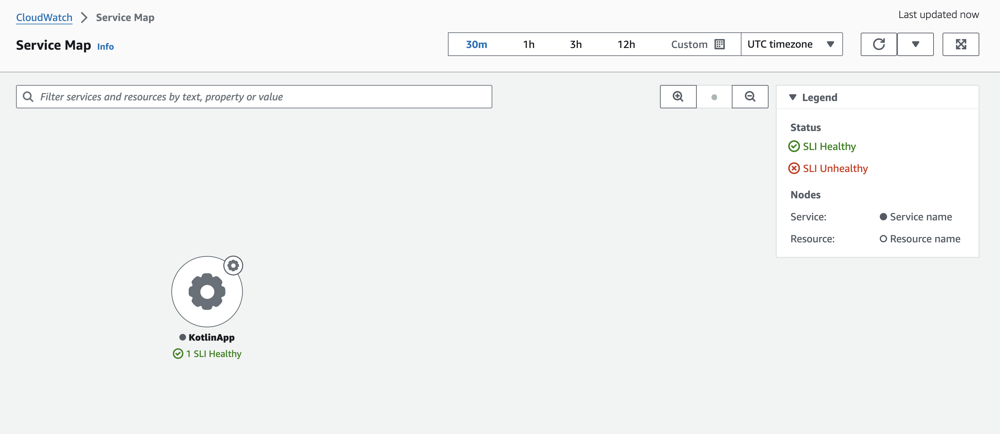

# Application Signals pour les services Kotlin

## Introduction

Surveiller la performance et la santé des applications web Kotlin peut être complexe en raison des interactions entre différents composants. Les services web [Kotlin](https://kotlinlang.org/) sont généralement compilés en fichiers Java Archive (jar), qui peuvent être déployés sur toute plateforme exécutant Java. Ces applications fonctionnent souvent dans des environnements distribués, impliquant de multiples composants interconnectés tels que des bases de données, des APIs externes et des couches de cache. Cette complexité peut augmenter significativement votre temps moyen de résolution (MTTR).

Dans ce guide, nous allons démontrer comment auto-instrumenter des services web Kotlin s'exécutant sur un serveur Linux EC2. L'activation de [CloudWatch Application Signals](https://docs.aws.amazon.com/AmazonCloudWatch/latest/monitoring/CloudWatch-Application-Monitoring-Sections.html) permet la collecte de télémétrie depuis l'application en utilisant l'agent d'auto-instrumentation Java [AWS Distro for OpenTelemetry](https://aws-otel.github.io/docs/introduction) (ADOT) pour collecter les métriques et traces de vos applications sans aucune modification de code. Vous pouvez exploiter des métriques clés telles que le volume d'appels, la disponibilité, la latence, les défaillances et les erreurs pour voir rapidement et trier la santé opérationnelle actuelle de vos services applicatifs et vérifier s'ils atteignent les objectifs de performance et métier à long terme.

## Prérequis

- Une instance Linux EC2 avec les [permissions IAM](https://docs.aws.amazon.com/AmazonCloudWatch/latest/monitoring/Application_Signals_Permissions.html) appropriées pour interagir avec CloudWatch Application Signals. Ce guide utilise une instance [Amazon Linux](https://aws.amazon.com/linux/amazon-linux-2023/), donc si vous utilisez autre chose, vos commandes peuvent légèrement différer.
- La capacité de se connecter en [SSH](https://docs.aws.amazon.com/AWSEC2/latest/UserGuide/connect-linux-inst-ssh.html) à l'instance.

## Aperçu de la solution

À un niveau général, les étapes que nous allons effectuer sont les suivantes.

- Activer CloudWatch Application Signals.
- Déployer un [service web ktor](https://ktor.io/) dans un fat jar.
- Installer l'agent CloudWatch configuré pour recevoir les Application Signals du service web.
- Télécharger l'agent d'auto-instrumentation [ADOT](https://aws-otel.github.io/docs/getting-started/java-sdk/auto-instr#introduction).
- Exécuter notre jar de service Kotlin avec l'agent Java pour auto-instrumenter le service.
- Exécuter quelques tests pour générer de la télémétrie.

### Diagramme d'architecture


### Activer CloudWatch Application Signals

Suivez les instructions de l'étape 1 : [Activer Application Signals](https://docs.aws.amazon.com/AmazonCloudWatch/latest/monitoring/CloudWatch-Application-Signals-Enable-EC2.html#CloudWatch-Application-Signals-EC2-Grant) dans votre compte.

### Déployer un service web Ktor
[Ktor](https://ktor.io/) est un framework Kotlin populaire pour créer des services web. Il vous permet de démarrer rapidement avec des applications côté serveur asynchrones.

Créez un répertoire de travail
```
mkdir kotlin-signals && cd kotlin-signals
```

Clonez le dépôt d'exemples Ktor
```
git clone https://github.com/ktorio/ktor-samples.git && cd ktor-samples/structured-logging
```

Compilez l'application
```
./gradlew build && cd build/libs
```

Testez que l'application s'exécute
```
java -jar structured-logging-all.jar
```

En supposant que le service s'est compilé et exécuté correctement, nous pouvons maintenant l'arrêter avec `ctrl + c`

### Configurer l'agent CloudWatch
Les instances Amazon Linux ont l'agent CloudWatch installé par défaut. Si votre instance ne l'a pas, vous devrez l'[installer](https://docs.aws.amazon.com/AmazonCloudWatch/latest/monitoring/install-CloudWatch-Agent-on-EC2-Instance.html).

Une fois installé, nous pouvons créer le fichier de configuration.
```
sudo nano /opt/aws/amazon-cloudwatch-agent/bin/app-signals-config.json
```

Copiez et collez la configuration suivante dans le fichier
```
{
    "traces": {
        "traces_collected": {
            "app_signals": {}
        }
    },
    "logs": {
        "metrics_collected": {
            "app_signals": {}
        }
    }
}
```

Sauvegardez le fichier puis démarrez l'agent CloudWatch avec la configuration que nous venons de créer
```
sudo /opt/aws/amazon-cloudwatch-agent/bin/amazon-cloudwatch-agent-ctl -a fetch-config -m ec2 -s -c file:/opt/aws/amazon-cloudwatch-agent/bin/app-signals-config.json
```

### Télécharger l'agent d'auto-instrumentation ADOT

Naviguez vers le répertoire contenant votre fichier jar, nous y placerons l'agent pour faciliter cette démonstration. Dans un scénario réel, il serait probablement dans son propre dossier.

```
cd kotlin-signals/ktor-samples/structured-logging/build/libs
```

Téléchargez l'agent d'auto-instrumentation
```
wget https://github.com/aws-observability/aws-otel-java-instrumentation/releases/latest/download/aws-opentelemetry-agent.jar
```

### Exécuter votre service Ktor avec l'agent ADOT
```
OTEL_RESOURCE_ATTRIBUTES=service.name=KotlinApp,service.namespace=MyKotlinService,aws.hostedin.environment=EC2 \
OTEL_AWS_APPLICATION_SIGNALS_ENABLED=true \
OTEL_AWS_APPLICATION_SIGNALS_EXPORTER_ENDPOINT=http://localhost:4316/v1/metrics \
OTEL_EXPORTER_OTLP_PROTOCOL=http/protobuf \
OTEL_EXPORTER_OTLP_TRACES_ENDPOINT=http://localhost:4316/v1/traces \
OTEL_METRICS_EXPORTER=none \
OTEL_LOGS_EXPORT=none \
java -javaagent:aws-opentelemetry-agent.jar -jar structured-logging-all.jar
```

### Générer du trafic vers le service pour créer de la télémétrie
```
for i in {1..1800}; do curl http://localhost:8080 && sleep 2; done
```

## Examiner votre télémétrie

Vous devriez maintenant pouvoir voir le service Kotlin apparaître dans la section 'Services' de CloudWatch


Vous pouvez également voir notre service dans la 'Service Map'



L'instrumentation fournit des métriques précieuses telles que la latence :


### Prochaines étapes

À partir de là, vos prochaines étapes seraient d'explorer davantage l'[expérience Application Signals](https://docs.aws.amazon.com/AmazonCloudWatch/latest/monitoring/CloudWatch-Application-Monitoring-Sections.html), y compris la création de [SLOs](https://docs.aws.amazon.com/AmazonCloudWatch/latest/monitoring/CloudWatch-ServiceLevelObjectives.html) pour votre service. Une autre bonne étape suivante serait de créer davantage de microservices Kotlin dans Ktor afin de commencer à assembler un backend plus complexe. Les environnements distribués et complexes sont ceux où vous tirez le plus de bénéfices d'un outil comme Application Signals.

### Nettoyage

Terminez votre instance EC2 et supprimez le groupe de logs `/aws/appsignals/generic`.
