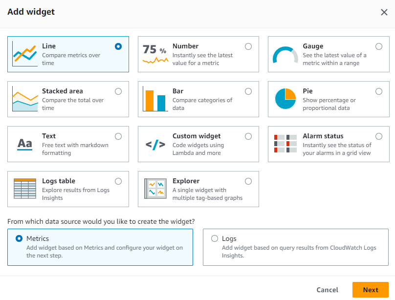
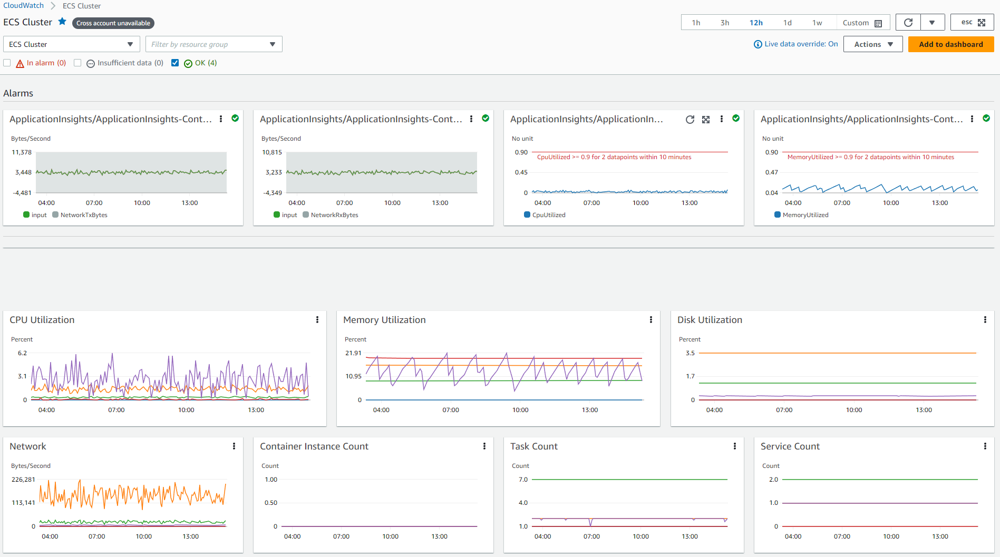
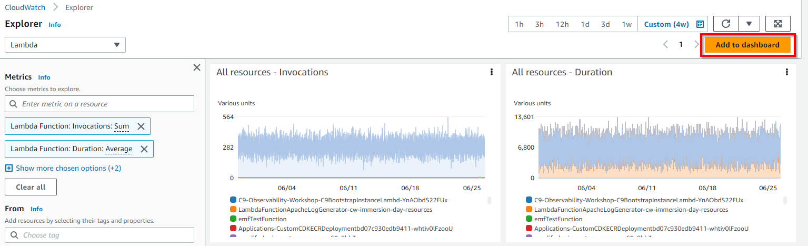
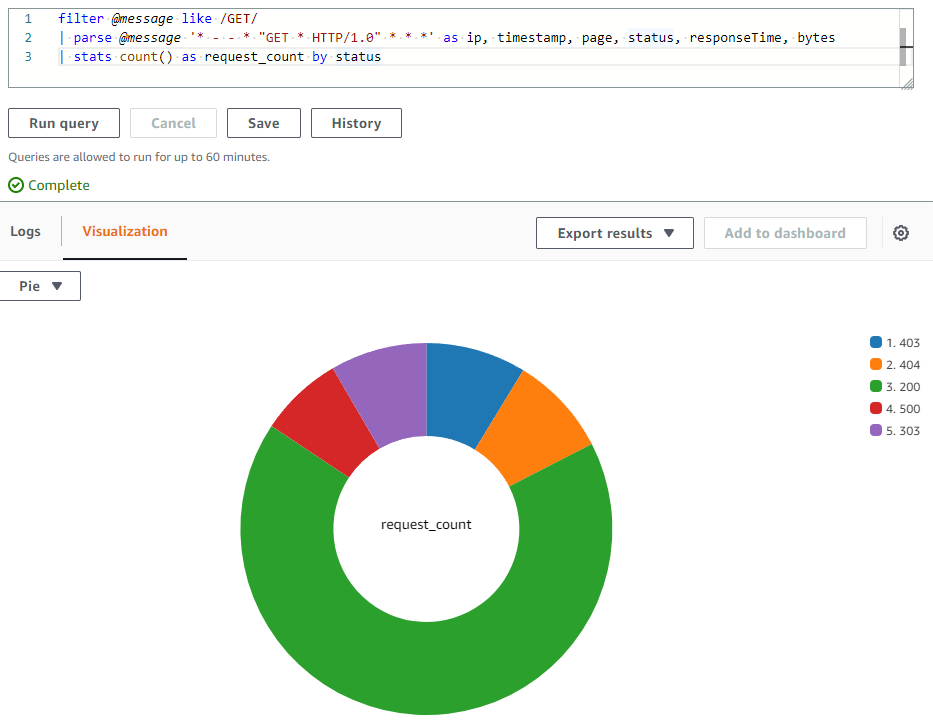

# Tableau de bord CloudWatch

## Introduction

Connaître les détails de l'inventaire des ressources dans les comptes AWS, les performances des ressources et les vérifications de santé est important pour une gestion stable des ressources. Les tableaux de bord Amazon CloudWatch sont des pages d'accueil personnalisables dans la console CloudWatch qui peuvent être utilisées pour surveiller vos ressources dans une vue unique, même si ces ressources sont inter-comptes ou réparties dans différentes régions.

[Les tableaux de bord Amazon CloudWatch](https://docs.aws.amazon.com/AmazonCloudWatch/latest/monitoring/CloudWatch_Dashboards.html) permettent aux clients de créer des graphiques réutilisables et de visualiser les ressources cloud et les applications dans une vue unifiée. Grâce aux tableaux de bord CloudWatch, les clients peuvent afficher côte à côte les données de métriques et de journaux dans une vue unifiée pour obtenir rapidement le contexte et passer du diagnostic du problème à la compréhension de la cause racine, réduisant ainsi le temps moyen de récupération ou de résolution (MTTR). Par exemple, les clients peuvent visualiser l'utilisation actuelle de métriques clés comme l'utilisation CPU et la mémoire et les comparer à la capacité allouée. Les clients peuvent également corréler les modèles de journaux d'une métrique spécifique et définir des alarmes pour alerter sur les problèmes de performance et opérationnels. Le tableau de bord CloudWatch aide également les clients à afficher l'état actuel des alarmes pour visualiser rapidement et attirer leur attention pour action. Le partage des tableaux de bord CloudWatch permet aux clients de partager facilement les informations affichées avec les équipes et/ou les parties prenantes internes ou externes aux organisations.

## Widgets

#### Widgets par défaut

Les widgets forment les blocs de construction des tableaux de bord CloudWatch qui affichent des informations importantes et des détails en quasi temps réel des métriques et journaux des ressources et applications dans l'environnement AWS. Les clients peuvent personnaliser les tableaux de bord selon leur expérience souhaitée en ajoutant, supprimant, réorganisant ou redimensionnant les widgets selon leurs besoins.

Les types de graphiques que vous pouvez ajouter à votre tableau de bord incluent Ligne, Nombre, Jauge, Zone empilée, Barre et Camembert.

Il existe des types de widgets par défaut comme **Ligne, Nombre, Jauge, Zone empilée, Barre, Camembert** qui sont de type **Graphique** et d'autres widgets comme **Texte, État des alarmes, Tableau de journaux, Explorer** sont également disponibles pour que les clients choisissent d'ajouter des données de métriques ou de journaux pour construire des tableaux de bord.



**Références supplémentaires :**

- Atelier AWS Observability sur les [widgets de nombres de métriques](https://catalog.workshops.aws/observability/en-US/aws-native/dashboards/metrics-number)
- Atelier AWS Observability sur les [widgets de texte](https://catalog.workshops.aws/observability/en-US/aws-native/dashboards/text-widget)
- Atelier AWS Observability sur les [widgets d'alarmes](https://catalog.workshops.aws/observability/en-US/aws-native/dashboards/alarm-widgets)
- Documentation sur la [création et l'utilisation des widgets dans les tableaux de bord CloudWatch](https://docs.aws.amazon.com/AmazonCloudWatch/latest/monitoring/create-and-work-with-widgets.html)

#### Widgets personnalisés

Les clients peuvent également choisir d'[ajouter un widget personnalisé](https://docs.aws.amazon.com/AmazonCloudWatch/latest/monitoring/create-and-work-with-widgets.html) dans les tableaux de bord CloudWatch pour des visualisations personnalisées, afficher des informations provenant de sources multiples ou ajouter des contrôles personnalisés comme des boutons pour effectuer des actions directement dans un tableau de bord CloudWatch. Les widgets personnalisés sont entièrement serverless propulsés par des fonctions Lambda, permettant un contrôle complet sur le contenu, la mise en page et les interactions. Le widget personnalisé est un moyen facile de construire une vue de données personnalisée ou un outil sur un tableau de bord qui ne nécessite pas d'apprendre un framework web complexe. Si vous pouvez écrire du code dans Lambda et créer du HTML, alors vous pouvez créer un widget personnalisé utile.


**Références supplémentaires :**

- Atelier AWS Observability sur les [widgets personnalisés](https://catalog.workshops.aws/observability/en-US/aws-native/dashboards/custom-widgets)
- [Exemples de widgets personnalisés CloudWatch](https://github.com/aws-samples/cloudwatch-custom-widgets-samples#what-are-custom-widgets) sur GitHub
- Blog : [Utilisation des widgets personnalisés des tableaux de bord Amazon CloudWatch](https://aws.amazon.com/blogs/mt/introducing-amazon-cloudwatch-dashboards-custom-widgets/)

## Tableaux de bord automatiques

Les tableaux de bord automatiques sont disponibles dans toutes les régions publiques AWS et fournissent une vue agrégée de la santé et des performances de toutes les ressources AWS sous Amazon CloudWatch. Cela aide les clients à démarrer rapidement avec la surveillance, une vue des métriques basée sur les ressources et les alarmes, et à approfondir facilement pour comprendre la cause racine des problèmes de performance. Les tableaux de bord automatiques sont préconstruits avec les [meilleures pratiques](https://docs.aws.amazon.com/prescriptive-guidance/latest/implementing-logging-monitoring-cloudwatch/cloudwatch-dashboards-visualizations.html) recommandées par les services AWS, restent conscients des ressources et se mettent à jour dynamiquement pour refléter le dernier état des métriques de performance importantes. Les tableaux de bord de service automatiques affichent toutes les métriques CloudWatch standard pour un service, graphent toutes les ressources utilisées pour chaque métrique de service et aident les clients à identifier rapidement les ressources aberrantes entre les comptes, ce qui peut aider à identifier les ressources à utilisation élevée ou faible pour optimiser les coûts.


**Références supplémentaires :**

- Atelier AWS Observability sur les [tableaux de bord automatiques](https://catalog.workshops.aws/observability/en-US/aws-native/dashboards/autogen-dashboard)
- [Surveiller les ressources AWS à l'aide des tableaux de bord Amazon CloudWatch](https://www.youtube.com/watch?v=I7EFLChc07M) sur YouTube

#### Container Insights dans les tableaux de bord automatiques

[CloudWatch Container Insights](https://docs.aws.amazon.com/AmazonCloudWatch/latest/monitoring/ContainerInsights.html) collecte, agrège et résume les métriques et journaux des applications et microservices conteneurisés. Container Insights est disponible pour Amazon Elastic Container Service (Amazon ECS), Amazon Elastic Kubernetes Service (Amazon EKS) et les plateformes Kubernetes sur Amazon EC2. Container Insights prend en charge la collecte de métriques à partir de clusters déployés sur Fargate pour Amazon ECS et Amazon EKS. CloudWatch collecte automatiquement les métriques pour de nombreuses ressources, telles que CPU, mémoire, disque et réseau, et fournit également des informations de diagnostic, comme les échecs de redémarrage de conteneurs, pour aider à isoler les problèmes et les résoudre rapidement.

CloudWatch crée des métriques agrégées au niveau du cluster, du noeud, du pod, de la tâche et du service en tant que métriques CloudWatch utilisant le [format de métriques embarquées](https://aws-observability.github.io/observability-best-practices/guides/signal-collection/emf/), qui sont des événements de journaux de performance utilisant un schéma JSON structuré permettant l'ingestion et le stockage de données à haute cardinalité à grande échelle. Les métriques collectées par Container Insights sont disponibles dans les [tableaux de bord automatiques CloudWatch](https://docs.aws.amazon.com/prescriptive-guidance/latest/implementing-logging-monitoring-cloudwatch/cloudwatch-dashboards-visualizations.html), et sont également consultables dans la section Métriques de la console CloudWatch.



#### Lambda Insights dans les tableaux de bord automatiques

[CloudWatch Lambda Insights](https://docs.aws.amazon.com/lambda/latest/dg/monitoring-insights.html) est une solution de surveillance et de dépannage pour les applications serverless telles que AWS Lambda, qui crée des [tableaux de bord automatiques](https://docs.aws.amazon.com/prescriptive-guidance/latest/implementing-logging-monitoring-cloudwatch/cloudwatch-dashboards-visualizations.html#use-automatic-dashboards) dynamiques pour les fonctions Lambda. Il collecte, agrège et résume également les métriques au niveau système, y compris le temps CPU, la mémoire, le disque et le réseau, ainsi que des informations de diagnostic comme les démarrages à froid et les arrêts de workers Lambda pour aider à isoler et résoudre rapidement les problèmes avec les fonctions Lambda. [Lambda Insights](https://docs.aws.amazon.com/AmazonCloudWatch/latest/monitoring/Lambda-Insights.html) est une extension Lambda fournie comme couche au niveau de la fonction qui, une fois activée, utilise le [format de métriques embarquées](https://aws-observability.github.io/observability-best-practices/guides/signal-collection/emf/) pour extraire les métriques des événements de journaux et ne nécessite aucun agent.


## Tableaux de bord personnalisés

Les clients peuvent également créer des [tableaux de bord personnalisés](https://docs.aws.amazon.com/AmazonCloudWatch/latest/monitoring/create_dashboard.html) autant de tableaux de bord supplémentaires qu'ils le souhaitent avec différents widgets et les personnaliser en conséquence. Les tableaux de bord peuvent être configurés pour une vue inter-régions et inter-comptes et peuvent être ajoutés à une liste de favoris.


Les clients peuvent ajouter des tableaux de bord automatiques ou personnalisés à la [liste de favoris](https://docs.aws.amazon.com/AmazonCloudWatch/latest/monitoring/add-dashboard-to-favorites.html) dans la console CloudWatch pour un accès rapide et facile depuis le volet de navigation dans la page de la console.

**Références supplémentaires :**

- Atelier AWS Observability sur le [tableau de bord CloudWatch](https://catalog.workshops.aws/observability/en-US/aws-native/dashboards/create)
- Laboratoires AWS Well-Architected sur l'efficacité des performances pour la [surveillance avec les tableaux de bord CloudWatch](https://www.wellarchitectedlabs.com/performance-efficiency/100_labs/100_monitoring_windows_ec2_cloudwatch/)

#### Ajout de Contributor Insights aux tableaux de bord CloudWatch

CloudWatch fournit [Contributor Insights](https://docs.aws.amazon.com/AmazonCloudWatch/latest/monitoring/ContributorInsights.html) pour analyser les données de journaux et créer des séries temporelles qui affichent les données des contributeurs, où vous pouvez voir les métriques sur les N principaux contributeurs, le nombre total de contributeurs uniques et leur utilisation. Cela vous aide à trouver les plus gros consommateurs et à comprendre qui ou quoi impacte les performances du système. Par exemple, les clients peuvent trouver les hôtes problématiques, identifier les utilisateurs réseau les plus gourmands ou trouver les URLs qui génèrent le plus d'erreurs.

Les rapports Contributor Insights peuvent être ajoutés à n'importe quel [tableau de bord nouveau ou existant](https://docs.aws.amazon.com/AmazonCloudWatch/latest/monitoring/ContributorInsights-ViewReports.html) dans la console CloudWatch.


#### Ajout d'Application Insights aux tableaux de bord CloudWatch

[CloudWatch Application Insights](https://docs.aws.amazon.com/AmazonCloudWatch/latest/monitoring/cloudwatch-application-insights.html) facilite l'observabilité pour les applications hébergées sur AWS et leurs ressources AWS sous-jacentes, ce qui améliore la visibilité sur la santé des applications et aide à réduire le temps moyen de réparation (MTTR) pour résoudre les problèmes applicatifs. Application Insights fournit des tableaux de bord automatisés qui montrent les problèmes potentiels avec les applications surveillées, ce qui aide les clients à isoler rapidement les problèmes en cours avec les applications et l'infrastructure.

L'option 'Exporter vers CloudWatch' à l'intérieur d'Application Insights comme montré ci-dessous ajoute un tableau de bord dans la console CloudWatch qui aide les clients à surveiller facilement leurs applications critiques pour obtenir des insights.


#### Ajout de la carte de service aux tableaux de bord CloudWatch

[CloudWatch ServiceLens](https://docs.aws.amazon.com/AmazonCloudWatch/latest/monitoring/ServiceLens.html) améliore l'observabilité des services et applications en intégrant les traces, métriques, journaux, alarmes et autres informations de santé des ressources en un seul endroit. ServiceLens intègre CloudWatch avec AWS X-Ray pour fournir une vue de bout en bout de l'application afin d'aider les clients à identifier plus efficacement les goulots d'étranglement de performance et à identifier les utilisateurs impactés. Une [carte de service](https://docs.aws.amazon.com/AmazonCloudWatch/latest/monitoring/servicelens_service_map.html) affiche les points de terminaison de service et les ressources sous forme de noeuds et met en évidence le trafic, la latence et les erreurs pour chaque noeud et ses connexions. Chaque noeud affiché fournit des insights détaillés sur les métriques, journaux et traces corrélés associés à cette partie du service.

L'option 'Ajouter au tableau de bord' à l'intérieur de la carte de service comme montré ci-dessous ajoute un nouveau tableau de bord ou à un tableau de bord existant dans la console CloudWatch, ce qui aide les clients à tracer facilement leur application pour obtenir des insights.


#### Ajout de Metrics Explorer aux tableaux de bord CloudWatch

[Metrics Explorer](https://docs.aws.amazon.com/AmazonCloudWatch/latest/monitoring/CloudWatch-Metrics-Explorer.html) dans CloudWatch est un outil basé sur les tags qui permet aux clients de filtrer, agréger et visualiser les métriques par tags et propriétés de ressources pour améliorer l'observabilité des services AWS. Metrics Explorer offre une expérience de dépannage flexible et dynamique, permettant aux clients de créer plusieurs graphiques simultanément et d'utiliser ces graphiques pour construire des tableaux de bord de santé des applications. Les visualisations de Metrics Explorer sont dynamiques, donc si une ressource correspondante est créée après la création d'un widget Metrics Explorer et son ajout à un tableau de bord CloudWatch, la nouvelle ressource apparaît automatiquement dans le widget Explorer.

L'option '[Ajouter au tableau de bord](https://docs.aws.amazon.com/AmazonCloudWatch/latest/monitoring/add_metrics_explorer_dashboard.html)' à l'intérieur de Metrics Explorer comme montré ci-dessous ajoute un nouveau tableau de bord ou à un tableau de bord existant dans la console CloudWatch, ce qui aide les clients à obtenir facilement plus d'insights graphiques sur leurs services et ressources AWS.



## Ce qu'il faut visualiser avec les tableaux de bord CloudWatch

Les clients peuvent créer des tableaux de bord au niveau du compte et de l'application pour surveiller les charges de travail et les applications à travers les régions et les comptes. Les clients peuvent démarrer rapidement avec les tableaux de bord automatiques CloudWatch, qui sont des tableaux de bord au niveau du service préconfigurés avec des métriques spécifiques au service. Il est recommandé de créer des tableaux de bord spécifiques à l'application et à la charge de travail qui se concentrent sur les métriques et ressources clés pertinentes et critiques pour l'application ou la charge de travail dans votre environnement de production.

#### Visualisation des données de métriques

Les données de métriques peuvent être ajoutées aux tableaux de bord CloudWatch via des widgets graphiques comme **Ligne, Nombre, Jauge, Zone empilée, Barre, Camembert**, supportés par des statistiques sur les métriques à travers **Moyenne, Minimum, Maximum, Somme et SampleCount**. Les [statistiques](https://docs.aws.amazon.com/AmazonCloudWatch/latest/monitoring/Statistics-definitions.html) sont des agrégations de données métriques sur des périodes de temps spécifiées.


[Metric math](https://docs.aws.amazon.com/AmazonCloudWatch/latest/monitoring/using-metric-math.html) permet d'interroger plusieurs métriques CloudWatch et d'utiliser des expressions mathématiques pour créer de nouvelles séries temporelles basées sur ces métriques. Les clients peuvent visualiser les séries temporelles résultantes dans la console CloudWatch et les ajouter aux tableaux de bord. Les clients peuvent également effectuer des calculs de métriques par programmation en utilisant l'opération [GetMetricDataAPI](https://docs.aws.amazon.com/AmazonCloudWatch/latest/APIReference/API_GetMetricData.html).

**Référence supplémentaire :**

- [Surveiller votre flotte IoT avec CloudWatch](https://aws.amazon.com/blogs/iot/monitoring-your-iot-fleet-using-cloudwatch/)

#### Visualisation des données de journaux

Les clients peuvent réaliser des [visualisations de données de journaux](https://docs.aws.amazon.com/AmazonCloudWatch/latest/logs/CWL_Insights-Visualizing-Log-Data.html) dans les tableaux de bord CloudWatch en utilisant des graphiques à barres, des graphiques linéaires et des graphiques en zones empilées pour identifier plus efficacement les modèles. CloudWatch Logs Insights génère des visualisations pour les requêtes qui utilisent la fonction stats et une ou plusieurs fonctions d'agrégation pouvant produire des graphiques à barres. Si la requête utilise la fonction bin() pour [regrouper les données](https://docs.aws.amazon.com/AmazonCloudWatch/latest/logs/CWL_Insights-Visualizing-Log-Data.html#CWL_Insights-Visualizing-ByFields) par un champ au fil du temps, alors des graphiques linéaires et en zones empilées peuvent être utilisés pour la visualisation.

Les [données de séries temporelles](https://docs.aws.amazon.com/AmazonCloudWatch/latest/logs/CWL_Insights-Visualizing-Log-Data.html#CWL_Insights-Visualizing-TimeSeries) peuvent être visualisées en utilisant les caractéristiques si la requête contient une ou plusieurs agrégations de fonctions de statut ou si la requête utilise la fonction bin() pour regrouper les données par un champ.

Un exemple de requête avec count() comme fonction stats est montré ci-dessous

```java
filter @message like /GET/
| parse @message '_ - - _ "GET _ HTTP/1.0" .*.*.*' as ip, timestamp, page, status, responseTime, bytes
| stats count() as request_count by status
```

Pour la requête ci-dessus, les résultats sont montrés ci-dessous dans CloudWatch Logs Insights.


La visualisation des résultats de la requête sous forme de graphique en camembert est montrée ci-dessous.



**Référence supplémentaire :**

- Atelier AWS Observability sur l'[affichage des résultats de journaux](https://catalog.workshops.aws/observability/en-US/aws-native/logs/logsinsights/displayformats) dans le tableau de bord CloudWatch.
- [Visualiser les journaux AWS WAF avec un tableau de bord Amazon CloudWatch](https://aws.amazon.com/blogs/security/visualize-aws-waf-logs-with-an-amazon-cloudwatch-dashboard/)

#### Visualisation des alarmes

Une alarme de métrique dans CloudWatch surveille une seule métrique ou le résultat d'une expression mathématique basée sur les métriques CloudWatch. L'alarme effectue une ou plusieurs actions basées sur la valeur de la métrique ou de l'expression par rapport à un seuil sur une période de temps. Les [tableaux de bord CloudWatch](https://docs.aws.amazon.com/AmazonCloudWatch/latest/monitoring/add_remove_alarm_dashboard.html) peuvent contenir une seule alarme dans un widget, qui affiche le graphique de la métrique de l'alarme et aussi l'état de l'alarme. De plus, un widget d'état des alarmes peut être ajouté au tableau de bord CloudWatch qui affiche l'état de plusieurs alarmes dans une grille. Seuls les noms des alarmes et l'état actuel sont affichés, les graphiques ne sont pas affichés.

Un exemple d'état d'alarme de métrique capturé dans un widget d'alarme à l'intérieur d'un tableau de bord CloudWatch est montré ci-dessous.


## Inter-comptes et inter-régions

Les clients ayant plusieurs comptes AWS peuvent configurer l'[observabilité inter-comptes CloudWatch](https://docs.aws.amazon.com/AmazonCloudWatch/latest/monitoring/cloudwatch_crossaccount_dashboard.html) puis créer des tableaux de bord inter-comptes riches dans des comptes de surveillance centraux, à travers lesquels ils peuvent rechercher, visualiser et analyser de manière transparente les métriques, journaux et traces sans frontières de compte.

Les clients peuvent également créer des tableaux de bord [inter-comptes inter-régions](https://docs.aws.amazon.com/AmazonCloudWatch/latest/monitoring/cloudwatch_xaxr_dashboard.html), qui résument les données CloudWatch de plusieurs comptes AWS et de plusieurs régions dans un seul tableau de bord. Depuis ce tableau de bord de haut niveau, les clients peuvent obtenir une vue unifiée de l'application entière, et aussi approfondir vers des tableaux de bord plus spécifiques sans avoir à se connecter/déconnecter des comptes ou changer de régions.

**Références supplémentaires :**

- [Comment ajouter automatiquement de nouvelles instances Amazon EC2 inter-comptes dans un tableau de bord Amazon CloudWatch central](https://aws.amazon.com/blogs/mt/how-to-auto-add-new-cross-account-amazon-ec2-instances-in-a-central-amazon-cloudwatch-dashboard/)
- [Déployer des tableaux de bord Amazon CloudWatch multi-comptes](https://aws.amazon.com/blogs/mt/deploy-multi-account-amazon-cloudwatch-dashboards/)
- [Créer des tableaux de bord CloudWatch inter-comptes et inter-régions](https://www.youtube.com/watch?v=eIUZdaqColg) sur YouTube

## Partage des tableaux de bord

Les tableaux de bord CloudWatch peuvent être partagés avec des personnes au sein des équipes, avec des parties prenantes et avec des personnes externes à votre organisation qui n'ont pas d'accès direct à votre compte AWS. Ces [tableaux de bord partagés](https://docs.aws.amazon.com/AmazonCloudWatch/latest/monitoring/cloudwatch-dashboard-sharing.html) peuvent même être affichés sur de grands écrans dans les espaces d'équipe, les centres de surveillance ou d'opérations réseau (NOC) ou intégrés dans des wikis ou des pages web publiques.

Il existe trois façons de partager les tableaux de bord pour le rendre facile et sécurisé.

- un tableau de bord peut être [partagé publiquement](https://docs.aws.amazon.com/AmazonCloudWatch/latest/monitoring/cloudwatch-dashboard-sharing.html#share-cloudwatch-dashboard-public) afin que toute personne ayant le lien puisse voir le tableau de bord.
- un tableau de bord peut être [partagé avec des adresses e-mail spécifiques](https://docs.aws.amazon.com/AmazonCloudWatch/latest/monitoring/cloudwatch-dashboard-sharing.html#share-cloudwatch-dashboard-email-addresses) des personnes qui peuvent voir le tableau de bord. Chacun de ces utilisateurs crée son propre mot de passe qu'il entre pour voir le tableau de bord.
- les tableaux de bord peuvent être partagés au sein des comptes AWS avec accès via un [fournisseur d'authentification unique (SSO)](https://docs.aws.amazon.com/AmazonCloudWatch/latest/monitoring/cloudwatch-dashboard-sharing.html#share-cloudwatch-dashboards-setup-SSO).

**Points à noter lors du partage public des tableaux de bord**

Le partage public des tableaux de bord CloudWatch n'est pas recommandé si le tableau de bord contient des informations sensibles ou confidentielles. Dans la mesure du possible, il est recommandé d'utiliser l'authentification par nom d'utilisateur/mot de passe ou l'authentification unique (SSO) lors du partage des tableaux de bord.

Lorsque les tableaux de bord sont rendus publiquement accessibles, CloudWatch génère un lien vers une page web qui héberge le tableau de bord. Toute personne consultant la page web pourra également voir le contenu du tableau de bord partagé publiquement. La page web fournit des identifiants temporaires via le lien pour appeler les API afin d'interroger les alarmes et les règles Contributor Insights dans le tableau de bord que vous partagez, et toutes les métriques et les noms et tags de toutes les instances EC2 de votre compte même s'ils ne sont pas affichés dans le tableau de bord que vous partagez. Nous vous recommandons de considérer s'il est approprié de rendre ces informations publiquement disponibles.

Veuillez noter que lorsque vous activez le partage des tableaux de bord publiquement vers la page web, les ressources Amazon Cognito suivantes seront créées dans votre compte : pool d'utilisateurs Cognito ; client d'application Cognito ; pool d'identités Cognito et rôle IAM.

**Points à noter lors du partage des tableaux de bord avec des identifiants (tableau de bord protégé par nom d'utilisateur et mot de passe)**

Le partage des tableaux de bord CloudWatch n'est pas recommandé si le tableau de bord contient des informations sensibles ou confidentielles que vous ne souhaitez pas partager avec les utilisateurs avec lesquels vous partagez le tableau de bord.

Lorsque les tableaux de bord sont activés pour le partage, CloudWatch génère un lien vers une page web qui héberge le tableau de bord. Les utilisateurs que vous avez spécifiés ci-dessus se verront accorder les permissions suivantes : permissions CloudWatch en lecture seule pour les alarmes et les règles Contributor Insights dans le tableau de bord que vous partagez, et pour toutes les métriques et les noms et tags de toutes les instances EC2 de votre compte même s'ils ne sont pas affichés dans le tableau de bord que vous partagez. Nous vous recommandons de considérer s'il est approprié de rendre ces informations disponibles aux utilisateurs avec lesquels vous partagez.

Veuillez noter que lorsque vous activez le partage des tableaux de bord pour les utilisateurs que vous spécifiez pour l'accès à la page web, les ressources Amazon Cognito suivantes seront créées dans votre compte : pool d'utilisateurs Cognito ; utilisateurs Cognito ; client d'application Cognito ; pool d'identités Cognito et rôle IAM.

**Points à noter lors du partage des tableaux de bord via un fournisseur SSO**

Lorsque les tableaux de bord CloudWatch sont partagés via l'authentification unique (SSO), les utilisateurs enregistrés auprès du fournisseur SSO sélectionné se verront accorder les permissions pour accéder à tous les tableaux de bord du compte où il est partagé. De plus, lorsque le partage des tableaux de bord est désactivé avec cette méthode, tous les tableaux de bord sont automatiquement non partagés.

**Références supplémentaires :**

- Atelier AWS Observability sur le [partage des tableaux de bord](https://catalog.workshops.aws/observability/en-US/aws-native/dashboards/sharingdashboard)
- Blog : [Partagez vos tableaux de bord Amazon CloudWatch avec n'importe qui en utilisant AWS Single Sign-On](https://aws.amazon.com/blogs/mt/share-your-amazon-cloudwatch-dashboards-with-anyone-using-aws-single-sign-on/)
- Blog : [Communiquer les informations de surveillance en partageant les tableaux de bord Amazon CloudWatch](https://aws.amazon.com/blogs/mt/communicate-monitoring-information-by-sharing-amazon-cloudwatch-dashboards/)

## Données en direct

Les tableaux de bord CloudWatch affichent également des [données en direct](https://docs.aws.amazon.com/AmazonCloudWatch/latest/monitoring/cloudwatch-live-data.html) via des widgets de métriques si les métriques de vos charges de travail sont constamment publiées. Les clients peuvent choisir d'activer les données en direct pour un tableau de bord entier ou pour des widgets individuels sur un tableau de bord.

Si les données en direct sont **désactivées**, seuls les points de données avec une période d'agrégation d'au moins une minute dans le passé sont affichés. Par exemple, en utilisant des périodes de 5 minutes, le point de données pour 12:35 serait agrégé de 12:35 à 12:40, et affiché à 12:41.

Si les données en direct sont **activées**, le point de données le plus récent est affiché dès que des données sont publiées dans l'intervalle d'agrégation correspondant. Chaque fois que vous actualisez l'affichage, le point de données le plus récent peut changer à mesure que de nouvelles données sont publiées dans cette période d'agrégation.

## Tableau de bord animé

Le [tableau de bord animé](https://docs.aws.amazon.com/AmazonCloudWatch/latest/monitoring/cloudwatch-animated-dashboard.html) rejoue les données de métriques CloudWatch capturées au fil du temps, ce qui aide les clients à voir les tendances, faire des présentations ou analyser les problèmes après qu'ils se sont produits. Les widgets animés dans le tableau de bord incluent les widgets de ligne, les widgets de zone empilée, les widgets de nombre et les widgets Metrics Explorer. Les graphiques en camembert, graphiques à barres, widgets de texte et widgets de journaux sont affichés dans le tableau de bord mais ne sont pas animés.

## Support API/CLI pour le tableau de bord CloudWatch

En plus d'accéder au tableau de bord CloudWatch via la console de gestion AWS, les clients peuvent également accéder au service via l'API, l'interface en ligne de commande AWS (CLI) et les SDK AWS. L'API CloudWatch pour les tableaux de bord aide à automatiser via AWS CLI ou à intégrer avec des logiciels/produits afin que vous puissiez passer moins de temps à gérer ou administrer les ressources et applications.

- [ListDashboards](https://docs.aws.amazon.com/AmazonCloudWatch/latest/APIReference/API_ListDashboards.html) : Retourne une liste des tableaux de bord de votre compte
- [GetDashboard](https://docs.aws.amazon.com/AmazonCloudWatch/latest/APIReference/API_GetDashboard.html) : Affiche les détails du tableau de bord que vous spécifiez.
- [DeleteDashboards](https://docs.aws.amazon.com/AmazonCloudWatch/latest/APIReference/API_DeleteDashboards.html) : Supprime tous les tableaux de bord que vous spécifiez.
- [PutDashboard](https://docs.aws.amazon.com/AmazonCloudWatch/latest/APIReference/API_PutDashboard.html) : Crée un tableau de bord s'il n'existe pas déjà, ou met à jour un tableau de bord existant. Si vous mettez à jour un tableau de bord, tout le contenu est remplacé par ce que vous spécifiez ici.

Référence API CloudWatch pour la [structure et syntaxe du corps du tableau de bord](https://docs.aws.amazon.com/AmazonCloudWatch/latest/APIReference/CloudWatch-Dashboard-Body-Structure.html)

L'interface en ligne de commande AWS (AWS CLI) est un outil open source qui permet aux clients d'interagir avec les services AWS en utilisant des commandes dans un shell en ligne de commande, qui implémentent des fonctionnalités équivalentes à celles fournies par la console de gestion AWS basée sur navigateur depuis l'invite de commande dans un programme de terminal.

Support CLI :

- [list-dashboards](https://docs.aws.amazon.com/cli/latest/reference/cloudwatch/list-dashboards.html)
- [get-dashboard](https://docs.aws.amazon.com/cli/latest/reference/cloudwatch/get-dashboard.html)
- [delete-dashboards](https://docs.aws.amazon.com/cli/latest/reference/cloudwatch/delete-dashboards.html)
- [put-dashboard](https://docs.aws.amazon.com/cli/latest/reference/cloudwatch/put-dashboard.html)

**Référence supplémentaire :** Atelier AWS Observability sur les [tableaux de bord CloudWatch et AWS CLI](https://catalog.workshops.aws/observability/en-US/aws-native/dashboards/createcli)

## Automatisation du tableau de bord CloudWatch

Pour automatiser la création des tableaux de bord CloudWatch, les clients peuvent utiliser des outils d'Infrastructure as Code (IaaC) comme CloudFormation ou Terraform qui aident à configurer les ressources AWS afin que les clients puissent passer moins de temps à gérer ces ressources et plus de temps à se concentrer sur les applications qui s'exécutent dans AWS.

[AWS CloudFormation](https://docs.aws.amazon.com/AWSCloudFormation/latest/UserGuide/aws-resource-cloudwatch-dashboard.html) prend en charge la création de tableaux de bord via des templates. La ressource AWS::CloudWatch::Dashboard spécifie un tableau de bord Amazon CloudWatch.

[Terraform](https://registry.terraform.io/providers/hashicorp/aws/latest/docs/resources/cloudwatch_dashboard) dispose également de modules qui prennent en charge la création de tableaux de bord CloudWatch via l'automatisation IaaC.

La création manuelle de tableaux de bord avec les widgets souhaités est simple. Cependant, cela peut nécessiter un certain effort pour mettre à jour les sources de ressources si le contenu est basé sur des informations dynamiques, comme les instances EC2 créées ou supprimées lors d'événements de mise à l'échelle dans le groupe Auto Scaling. Veuillez vous référer à l'article de blog si vous souhaitez [créer et mettre à jour automatiquement vos tableaux de bord Amazon CloudWatch en utilisant Amazon EventBridge et AWS Lambda](https://aws.amazon.com/blogs/mt/update-your-amazon-cloudwatch-dashboards-automatically-using-amazon-eventbridge-and-aws-lambda/).

**Blogs de référence supplémentaires :**

- [Automatiser la création de tableaux de bord Amazon CloudWatch pour les KPIs des volumes Amazon EBS](https://aws.amazon.com/blogs/storage/automating-amazon-cloudwatch-dashboard-creation-for-amazon-ebs-volume-kpis/)
- [Automatiser la création d'alarmes et de tableaux de bord Amazon CloudWatch avec AWS Systems Manager et Ansible](https://aws.amazon.com/blogs/mt/automate-creation-of-amazon-cloudwatch-alarms-and-dashboards-with-aws-systems-manager-and-ansible/)
- [Déployer un tableau de bord Amazon CloudWatch automatisé pour AWS Outposts en utilisant AWS CDK](https://aws.amazon.com/blogs/compute/deploying-an-automated-amazon-cloudwatch-dashboard-for-aws-outposts-using-aws-cdk/)

**FAQ produit** sur le [tableau de bord CloudWatch](https://aws.amazon.com/cloudwatch/faqs/#Dashboards)
