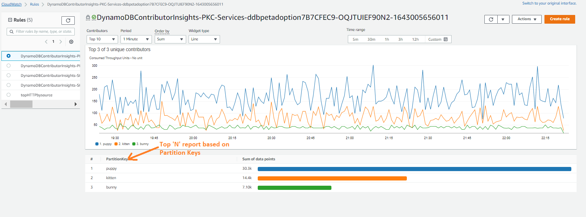

# CloudWatch Contributor Insights

## Apercu
Amazon CloudWatch Contributor Insights vous aide a analyser les donnees de journalisation pour identifier les principaux contributeurs influencant vos metriques. Il vous permet de comprendre quelles entites impactent le comportement et les performances de votre systeme en creant des classements et des statistiques en temps reel.

## Fonctionnalites
- Analyse en temps reel des donnees de journalisation
- Regles integrees pour les services AWS courants
- Capacites de creation de regles personnalisees
- Traitement et classement automatiques des donnees
- Integration avec les tableaux de bord et alarmes CloudWatch

## Implementation

### Regles integrees
CloudWatch Contributor Insights fournit des regles preconstruites pour les services AWS courants :
- Analyse des journaux de flux VPC
- Journaux d'Application Load Balancer
- Journaux d'Amazon API Gateway
- Journaux d'AWS Lambda

### Regles personnalisees
Creez des regles personnalisees en definissant :
1. Le groupe de journaux contenant vos documents sources. Les champs contributeurs a analyser
3. Les metriques et agregations
4. Les fenetres temporelles et taux d'echantillonnage

Exemple de regle personnalisee :
```yaml
{
	"AggregateOn": "Count",
	"Contribution": {
		"Filters": [],
		"Keys": [
			"$.pettype"
		]
	},c
	"LogFormat": "JSON",
	"Schema": {
		"Name": "CloudWatchLogRule",
		"Version": 1
	},
	"LogGroupARNs": [
		"arn:aws:logs:[region]:[account]:log-group:[API Gateway Log Group Name]"
	]
}
```



## Bonnes pratiques

### Configuration des regles
- Utilisez des noms de regles descriptifs
- Commencez par les regles integrees lorsque c'est possible
- Implementez un filtrage cible des journaux
- Configurez des fenetres temporelles appropriees

### Optimisation des performances
- Limitez le nombre de regles actives
- Definissez des taux d'echantillonnage optimaux
- Utilisez des periodes d'agregation appropriees
- N'activez les regles que pour les groupes de journaux necessaires

### Gestion des couts
- Surveillez regulierement l'utilisation des regles
- Supprimez les regles inutilisees
- Implementez le filtrage des journaux
- Revisez periodiquement les taux d'echantillonnage

### Securite
- Suivez le principe du moindre privilege
- Chiffrez les donnees sensibles
- Auditez regulierement les regles
- Surveillez les changements de modeles

## Problemes courants et solutions

### Regle ne correspondant pas aux journaux
**Probleme** : Les regles ne traitent pas les journaux attendus
**Solution** :
- Verifiez que le format des journaux correspond a la configuration de la regle
- Verifiez que les noms de champs sont corrects
- Validez la structure JSON

### Donnees manquantes
**Probleme** : Lacunes dans les donnees de contributeurs
**Solution** :
- Verifiez la configuration du taux d'echantillonnage
- Verifiez la livraison des journaux
- Revisez les parametres de fenetre temporelle

### Problemes de performance
**Probleme** : Traitement lent des regles
**Solution** :
- Optimisez le nombre de regles actives
- Ajustez les taux d'echantillonnage
- Revisez les seuils de contribution

## Integration

### Tableaux de bord CloudWatch
Creez des visualisations des principaux contributeurs :
```yaml
{
  "widgets": [
    {
      "type": "metric",
      "properties": {
        "view": "bar",
        "region": "us-east-1",
        "title": "Top Contributors",
        "period": 300
      }
    }
  ]
}
```

### Alarmes CloudWatch
Configurez des alertes pour les modeles de contributeurs :
```yaml
{
  "AlarmName": "HighContributorCount",
  "MetricName": "UniqueContributors",
  "Threshold": 100,
  "Period": 300,
  "EvaluationPeriods": 2
}
```

## Outils et ressources

### Commandes AWS CLI
```bash
# Create a rule
aws cloudwatch put-insight-rule --rule-name MyRule --rule-definition file://rule.json

# Delete a rule
aws cloudwatch delete-insight-rule --rule-name MyRule
```

### Services associes
- Amazon CloudWatch
- CloudWatch Logs
- CloudWatch Alarms
- Amazon EventBridge

### Ressources supplementaires
- [Documentation officielle](https://docs.aws.amazon.com/AmazonCloudWatch/latest/monitoring/ContributorInsights.html)
- [Reference de la syntaxe des regles](https://docs.aws.amazon.com/AmazonCloudWatch/latest/monitoring/ContributorInsights-RuleSyntax.html)
- [Reference AWS CLI](https://docs.aws.amazon.com/cli/latest/reference/cloudwatch/put-insight-rule.html)
