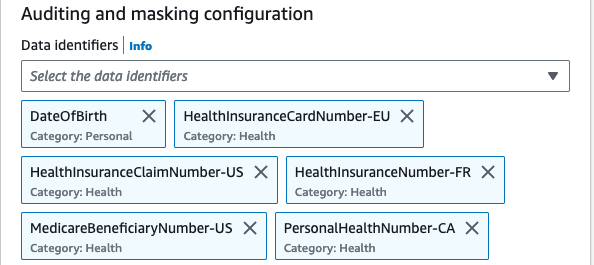
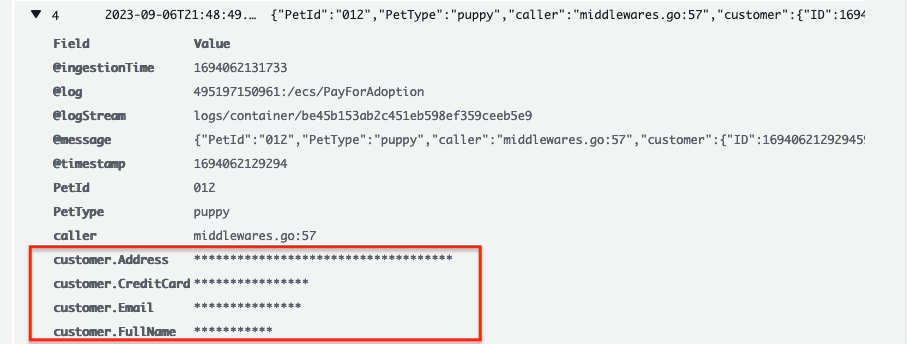

# Politiques de protection des donnees CloudWatch Logs pour SLG/EDU

Bien que la journalisation des donnees soit generalement benefique, le masquage est utile pour les organisations soumises a des reglementations strictes telles que le Health Insurance Portability and Accountability Act (HIPAA), le General Data Privacy Regulation (GDPR), le Payment Card Industry Data Security Standard (PCI-DSS) et le Federal Risk and Authorization Management Program (FedRAMP).

Les [politiques de protection des donnees](https://docs.aws.amazon.com/AmazonCloudWatch/latest/logs/cloudwatch-logs-data-protection-policies.html) dans CloudWatch Logs permettent aux clients de definir et d'appliquer des politiques de protection des donnees qui analysent les donnees de journalisation en transit pour detecter les donnees sensibles et les masquer.

Ces politiques exploitent la correspondance de motifs et les modeles d'apprentissage automatique pour detecter les donnees sensibles et vous aident a auditer et masquer les donnees qui apparaissent dans les evenements ingeres par les groupes de journaux CloudWatch de votre compte.

Les techniques et criteres utilises pour selectionner les donnees sensibles sont appeles [identifiants de donnees correspondants](https://docs.aws.amazon.com/AmazonCloudWatch/latest/logs/cloudwatch-logs-data-protection-policies.html). En utilisant ces identifiants de donnees geres, CloudWatch Logs peut detecter :

- Les identifiants tels que les cles privees ou les cles d'acces secretes AWS
- Les identifiants d'appareils tels que les adresses IP ou les adresses MAC
- Les informations financieres telles que les numeros de compte bancaire, les numeros de carte de credit ou les codes de verification de carte de credit
- Les informations de sante protegees (PHI) telles que le numero de carte d'assurance maladie (EHIC) ou le numero de sante personnel
- Les informations personnellement identifiables (PII) telles que les permis de conduire, les numeros de securite sociale ou les numeros d'identification fiscale

:::note
    Les donnees sensibles sont detectees et masquees lors de leur ingestion dans le groupe de journaux. Lorsque vous definissez une politique de protection des donnees, les evenements de journalisation ingeres dans le groupe de journaux avant cette date ne sont pas masques.
:::
Developpons certains des types de donnees mentionnes ci-dessus et voyons quelques exemples :


## Types de donnees

### Identifiants

Les identifiants sont des types de donnees sensibles utilises pour verifier votre identite et si vous avez la permission d'acceder aux ressources que vous demandez. AWS utilise ces identifiants comme les cles privees et les cles d'acces secretes pour authentifier et autoriser vos requetes.

En utilisant les politiques de protection des donnees de CloudWatch Logs, les donnees sensibles correspondant aux identifiants de donnees que vous avez selectionnes sont masquees. (Nous verrons un exemple de masquage a la fin de cette section).


:::tip
    Les bonnes pratiques de classification des donnees commencent par des niveaux et des exigences de classification des donnees clairement definis, qui repondent a vos normes organisationnelles, legales et de conformite.

    En tant que bonne pratique, utilisez des tags sur les ressources AWS bases sur le cadre de classification des donnees pour implementer la conformite en accord avec les politiques de gouvernance des donnees de votre organisation.
:::

:::tip
    Pour eviter les donnees sensibles dans vos evenements de journalisation, la bonne pratique est de les exclure dans votre code en premier lieu et de ne journaliser que les informations necessaires.
:::


### Informations financieres

Comme defini par le Payment Card Industry Data Security Standard (PCI DSS), les numeros de compte bancaire, les numeros de routage, les numeros de cartes de debit et de credit, et les donnees de bande magnetique de carte de credit sont consideres comme des informations financieres sensibles.

Pour detecter les donnees sensibles, CloudWatch Logs recherche les identifiants de donnees que vous specifiez, independamment de la geolocalisation du groupe de journaux, une fois que vous avez defini une politique de protection des donnees.


:::info
    Consultez la liste complete des [types de donnees financieres et identifiants de donnees](https://docs.aws.amazon.com/AmazonCloudWatch/latest/logs/protect-sensitive-log-data-types-financial.html)
:::


### Informations de sante protegees (PHI)

Les PHI incluent un ensemble tres large de donnees de sante personnellement identifiables et liees a la sante, y compris les informations d'assurance et de facturation, les donnees de diagnostic, les donnees de soins cliniques comme les dossiers medicaux et les ensembles de donnees, ainsi que les resultats de laboratoire tels que les images et les resultats de tests.

CloudWatch Logs analyse et detecte les informations de sante du groupe de journaux choisi et masque ces donnees.



:::info
    Consultez la liste complete des [types de donnees PHI et identifiants de donnees](https://docs.aws.amazon.com/AmazonCloudWatch/latest/logs/protect-sensitive-log-data-types-health.html)
:::

### Informations personnellement identifiables (PII)

Les PII sont une reference textuelle aux donnees personnelles qui pourraient etre utilisees pour identifier un individu. Les exemples de PII incluent les adresses, les numeros de compte bancaire et les numeros de telephone.


:::info
    Consultez la liste complete des [types de donnees PII et identifiants de donnees](https://docs.aws.amazon.com/AmazonCloudWatch/latest/logs/protect-sensitive-log-data-types-pii.html)
:::

## Journaux masques

Maintenant, si vous allez a votre groupe de journaux ou vous avez defini votre politique de protection des donnees, vous verrez que la protection des donnees est `On` et la console affiche egalement un compteur de donnees sensibles.


Maintenant, en cliquant sur `View in Log Insights`, vous serez redirige vers la console Log Insights. L'execution de la requete ci-dessous pour verifier les evenements de journalisation dans un flux de journaux vous donnera une liste de tous les journaux.

```
fields @timestamp, @message
| sort @timestamp desc
| limit 20
```

Une fois que vous developpez une requete, vous verrez les resultats masques comme indique ci-dessous :



:::important
    Lorsque vous creez une politique de protection des donnees, par defaut, les donnees sensibles correspondant aux identifiants de donnees que vous avez selectionnes sont masquees. Seuls les utilisateurs disposant de la permission IAM `logs:Unmask` peuvent visualiser les donnees non masquees.
:::

:::tip
    Utilisez [AWS IAM and Access Management (IAM)](https://docs.aws.amazon.com/AmazonCloudWatch/latest/monitoring/auth-and-access-control-cw.html) pour administrer et restreindre l'acces aux donnees sensibles dans CloudWatch.
:::

:::tip
    La surveillance et l'audit reguliers de votre environnement cloud sont tout aussi importants pour proteger les donnees sensibles. Cela devient un aspect critique lorsque les applications generent un volume important de donnees, et par consequent, il est recommande de ne pas journaliser une quantite excessive de donnees. Lisez ce guide prescriptif AWS pour les [bonnes pratiques de journalisation](https://docs.aws.amazon.com/prescriptive-guidance/latest/logging-monitoring-for-application-owners/logging-best-practices.html)
:::

:::tip
    Les donnees des groupes de journaux sont toujours chiffrees dans CloudWatch Logs. Alternativement, vous pouvez egalement utiliser [AWS Key Management Service](https://docs.aws.amazon.com/AmazonCloudWatch/latest/logs/encrypt-log-data-kms.html) pour chiffrer vos donnees de journalisation.
:::

:::tip
    Pour la resilience et l'evolutivite, configurez des alarmes CloudWatch et automatisez la remediation en utilisant Amazon EventBridge et AWS Systems Manager.
:::


[^1]: Consultez notre blog AWS [Proteger les donnees sensibles avec Amazon CloudWatch Logs](https://aws.amazon.com/blogs/aws/protect-sensitive-data-with-amazon-cloudwatch-logs/) pour commencer.
