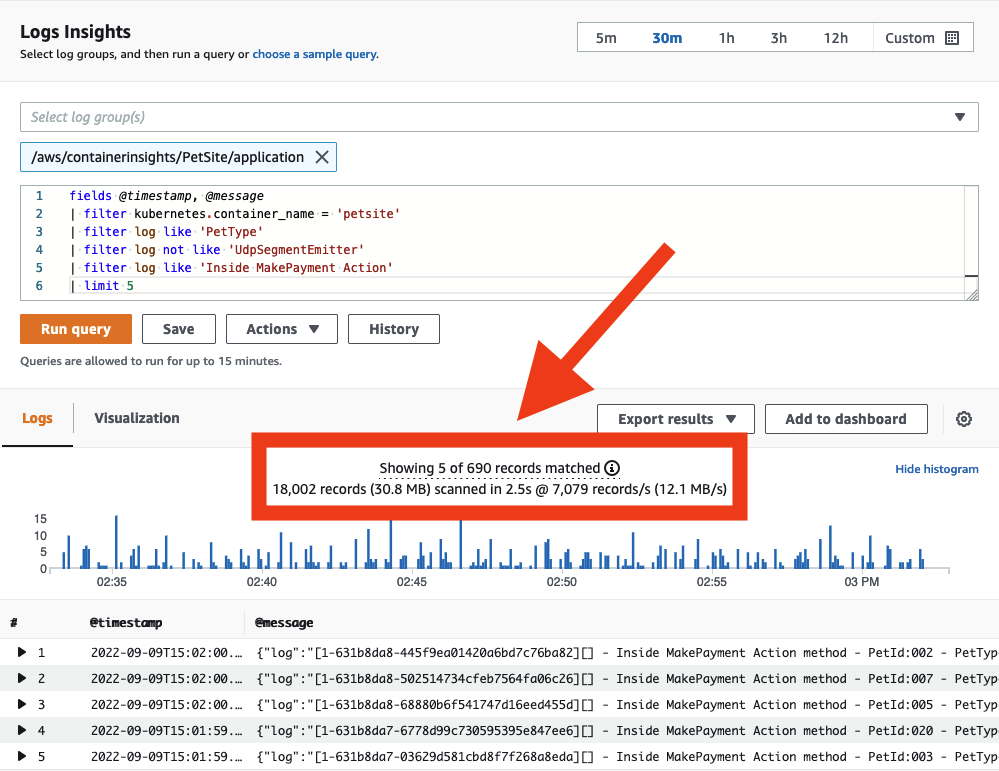

# Journalisation

Le choix des outils de journalisation est lié à vos exigences en matière de transmission de données, de filtrage, de rétention, de capture et d'intégration avec les applications qui génèrent vos données. Lorsque vous utilisez Amazon Web Services pour l'observabilité (que vous hébergiez sur site ou dans un autre environnement cloud), vous pouvez exploiter l'[agent CloudWatch](https://docs.aws.amazon.com/AmazonCloudWatch/latest/monitoring/Install-CloudWatch-Agent.html) ou un autre outil tel que [Fluentd](https://www.fluentd.org/) pour émettre des données de journalisation à des fins d'analyse.

Ici, nous allons développer les bonnes pratiques pour l'implémentation de l'agent CloudWatch pour la journalisation, et l'utilisation de CloudWatch Logs dans la console AWS ou via les APIs.

:::info
	L'agent CloudWatch peut également être utilisé pour la livraison de [données métriques](../../signals/metrics) vers CloudWatch. Consultez la page [métriques](../metrics) pour les détails d'implémentation. Il peut aussi être utilisé pour collecter des [traces](../../signals/traces.md) depuis les SDKs clients OpenTelemetry ou X-Ray, et les envoyer à [AWS X-Ray](../xray.md).
:::
## Collecter les logs avec l'agent CloudWatch

### Transfert

Lorsque vous adoptez une [approche cloud first](../../faq/general.md#what-is-a-cloud-first-approach) pour l'observabilité, en règle générale, si vous devez vous connecter à une machine pour obtenir ses logs, vous avez alors un anti-pattern. Vos charges de travail devraient émettre leurs données de journalisation en dehors de leur périmètre en quasi temps réel vers un système d'analyse de logs, et la latence entre cette transmission et l'événement original représente une perte potentielle d'informations ponctuelles en cas de catastrophe affectant votre charge de travail.

En tant qu'architecte, vous devrez déterminer quelle est votre perte acceptable pour les données de journalisation et ajuster le paramètre [`force_flush_interval`](https://docs.aws.amazon.com/AmazonCloudWatch/latest/monitoring/CloudWatch-Agent-Configuration-File-Details.html#CloudWatch-Agent-Configuration-File-Logssection) de l'agent CloudWatch en conséquence.

Le `force_flush_interval` indique à l'agent d'envoyer les données de journalisation au plan de données à une cadence régulière, sauf si la taille du tampon est atteinte, auquel cas il enverra immédiatement tous les logs en tampon.

:::tip
	Les appareils en périphérie peuvent avoir des exigences très différentes des charges de travail à faible latence au sein d'AWS, et peuvent nécessiter des paramètres `force_flush_interval` beaucoup plus longs. Par exemple, un appareil IoT sur une connexion Internet à faible bande passante peut n'avoir besoin de vider les logs que toutes les 15 minutes.
:::
:::info
	Les charges de travail conteneurisées ou sans état peuvent être particulièrement sensibles aux exigences de vidage des logs. Considérez une application Kubernetes sans état ou une flotte EC2 qui peut être réduite à tout moment. La perte de logs peut survenir lorsque ces ressources sont soudainement terminées, ne laissant aucun moyen d'extraire les logs ultérieurement. Le `force_flush_interval` standard est généralement approprié pour ces scénarios, mais peut être réduit si nécessaire.
:::
### Groupes de logs

Dans CloudWatch Logs, chaque collection de logs qui s'applique logiquement à une application devrait être livrée à un seul [groupe de logs](https://docs.aws.amazon.com/AmazonCloudWatch/latest/logs/CloudWatchLogsConcepts.html). Au sein de ce groupe de logs, vous souhaitez avoir une *cohérence* parmi les systèmes sources qui créent les flux de logs.

Considérez une pile LAMP : les logs d'Apache, MySQL, votre application PHP et le système d'exploitation Linux hôte appartiendraient chacun à un groupe de logs séparé.

Ce regroupement est vital car il vous permet de traiter les groupes avec la même période de rétention, clé de chiffrement, filtres métriques, filtres d'abonnement et règles Contributor Insights.

:::info
	Il n'y a pas de limitation sur le nombre de flux de logs dans un groupe de logs, et vous pouvez rechercher dans l'ensemble complet des logs de votre application avec une seule requête CloudWatch Logs Insights. Avoir un flux de logs séparé pour chaque pod dans un service Kubernetes, ou pour chaque instance EC2 de votre flotte, est un pattern standard.
:::
:::info
	La période de rétention par défaut pour un groupe de logs est *indéfinie*. La bonne pratique est de définir la période de rétention au moment de la création du groupe de logs.

	Bien que vous puissiez configurer cela dans la console CloudWatch à tout moment, la bonne pratique est de le faire soit en même temps que la création du groupe de logs en utilisant l'infrastructure en tant que code (CloudFormation, Cloud Development Kit, etc.), soit en utilisant le paramètre `retention_in_days` dans la configuration de l'agent CloudWatch.

	Les deux approches vous permettent de définir la période de rétention des logs de manière proactive, alignée avec les exigences de rétention des données de votre projet.
:::

:::info
	Les données du groupe de logs sont toujours chiffrées dans CloudWatch Logs. Par défaut, CloudWatch Logs utilise le chiffrement `côté serveur` pour les données de logs au repos. Comme alternative, vous pouvez utiliser AWS Key Management Service pour ce chiffrement. Le [chiffrement utilisant AWS KMS](https://docs.aws.amazon.com/AmazonCloudWatch/latest/logs/encrypt-log-data-kms.html) est activé au niveau du groupe de logs, en associant une clé KMS à un groupe de logs, soit lors de la création du groupe de logs, soit après son existence. Cela peut être configuré en utilisant l'infrastructure en tant que code (CloudFormation, Cloud Development Kit, etc.).

	L'utilisation d'AWS Key Management Service pour gérer les clés de CloudWatch Logs nécessite une configuration supplémentaire et l'octroi de permissions sur les clés à vos utilisateurs.[^1]
:::
### Format des logs

CloudWatch Logs a la capacité de découvrir automatiquement les champs de log et d'indexer les données JSON lors de l'ingestion. Cette fonctionnalité facilite les requêtes ad hoc et le filtrage, améliorant l'utilisabilité des données de log. Cependant, il est important de noter que l'indexation automatique ne s'applique qu'aux données structurées. Les données de journalisation non structurées ne seront pas automatiquement indexées mais peuvent toujours être livrées à CloudWatch Logs.

Les logs non structurés peuvent toujours être recherchés ou interrogés en utilisant une expression régulière avec la commande `parse`.

:::info
	Les deux bonnes pratiques pour les formats de logs lors de l'utilisation de CloudWatch Logs :

	1. Utilisez un formateur de logs structuré tel que [Log4j](https://logging.apache.org/log4j/2.x/), [`python-json-logger`](https://pypi.org/project/python-json-logger/), ou l'émetteur JSON natif de votre framework.
	2. Envoyez une seule ligne de journalisation par événement vers votre destination de logs.

	Notez que lors de l'envoi de plusieurs lignes de journalisation JSON, chaque ligne sera interprétée comme un événement unique.
:::
### Gestion de `stdout`

Comme discuté dans notre page [signaux de logs](../../signals/logs#log-to-stdout), la bonne pratique est de découpler les systèmes de journalisation de leurs applications génératrices. Cependant, envoyer les données de `stdout` vers un fichier est un pattern courant pour de nombreuses (sinon la plupart des) plateformes. Les systèmes d'orchestration de conteneurs tels que Kubernetes ou [Amazon Elastic Container Service](https://aws.amazon.com/ecs/) gèrent automatiquement cette livraison de `stdout` vers un fichier de log, permettant la collecte de chaque log par un collecteur. L'agent CloudWatch lit ensuite ce fichier en temps réel et transfère les données vers un groupe de logs en votre nom.

:::info
	Utilisez le pattern de journalisation simplifiée de l'application vers `stdout`, avec collecte par un agent, autant que possible.
:::
### Filtrage des logs

Il existe de nombreuses raisons de filtrer vos logs, comme empêcher le stockage persistant de données personnelles, ou ne capturer que les données d'un niveau de log particulier. Dans tous les cas, la bonne pratique est d'effectuer ce filtrage aussi près que possible du système d'origine. Dans le cas de CloudWatch, cela signifie *avant* que les données ne soient livrées dans CloudWatch Logs pour analyse. L'agent CloudWatch peut effectuer ce filtrage pour vous.

:::info
	Utilisez la fonctionnalité [`filters`](https://docs.aws.amazon.com/AmazonCloudWatch/latest/monitoring/CloudWatch-Agent-Configuration-File-Details.html#CloudWatch-Agent-Configuration-File-Logssection) pour `include` les niveaux de log que vous souhaitez et `exclude` les patterns connus comme indésirables, par ex. les numéros de carte de crédit, numéros de téléphone, etc.
:::
:::tip
	Filtrer certaines formes de données connues qui peuvent potentiellement fuiter dans vos logs peut être chronophage et source d'erreurs. Cependant, pour les charges de travail qui manipulent des types spécifiques de données indésirables connues (par ex. numéros de carte de crédit, numéros de sécurité sociale), avoir un filtre pour ces enregistrements peut prévenir un problème de conformité potentiellement dommageable à l'avenir. Par exemple, supprimer tous les enregistrements contenant un numéro de sécurité sociale peut être aussi simple que cette configuration :

	```
	"filters": [
      {
        "type": "exclude",
        "expression": "\b(?!000|666|9\d{2})([0-8]\d{2}|7([0-6]\d))([-]?|\s{1})(?!00)\d\d\2(?!0000)\d{4}\b"
      }
    ]
    ```
:::

### Journalisation multi-lignes

La bonne pratique pour toute journalisation est d'utiliser la [journalisation structurée](../../signals/logs#structured-logging-is-key-to-success) avec une seule ligne émise pour chaque événement de log discret. Cependant, il existe de nombreuses applications héritées et supportées par des éditeurs qui n'ont pas cette option. Pour ces charges de travail, CloudWatch Logs interprétera chaque ligne comme un événement unique à moins qu'elles ne soient émises en utilisant un protocole compatible multi-lignes. L'agent CloudWatch peut effectuer cela avec la directive [`multi_line_start_pattern`](https://docs.aws.amazon.com/AmazonCloudWatch/latest/monitoring/CloudWatch-Agent-Configuration-File-Details.html#CloudWatch-Agent-Configuration-File-Logssection).

:::info
	Utilisez la directive `multi_line_start_pattern` pour faciliter l'ingestion de journalisation multi-lignes dans CloudWatch Logs.
:::
### Configuration de la classe de journalisation

CloudWatch Logs propose deux [classes](https://docs.aws.amazon.com/AmazonCloudWatch/latest/logs/CloudWatch_Logs_Log_Classes.html) de groupes de logs :

- La classe de logs Standard de CloudWatch Logs est une option complète pour les logs nécessitant une surveillance en temps réel ou les logs auxquels vous accédez fréquemment.

- La classe de logs Infrequent Access de CloudWatch Logs est une nouvelle classe de logs que vous pouvez utiliser pour consolider vos logs de manière rentable. Cette classe de logs offre un sous-ensemble des capacités de CloudWatch Logs, y compris l'ingestion gérée, le stockage, l'analytique de logs inter-comptes et le chiffrement avec un prix d'ingestion par Go inférieur. La classe Infrequent Access est idéale pour les requêtes ad hoc et l'analyse forensique après coup sur des logs rarement consultés.

:::info
	Utilisez la directive `log_group_class` pour spécifier quelle classe de groupe de logs utiliser pour le nouveau groupe de logs. Les valeurs valides sont **STANDARD** et **INFREQUENT_ACCESS**. Si vous omettez ce champ, la valeur par défaut **STANDARD** est utilisée par l'agent.
:::

#### Audit des logs existants pour la désignation de classe appropriée

La classe de logs du niveau Infrequent Access de CloudWatch Logs utilise un sous-ensemble des capacités de journalisation CloudWatch. Il est recommandé d'auditer les groupes de logs existants pour vérifier si des groupes de logs standard pourraient être recréés en tant que groupes de logs Infrequent Access. Un bon moyen de le faire est d'exécuter l'outil CLI [log-ia-checker](https://github.com/aws-observability/log-ia-checker). Cet outil analysera tous les groupes de logs dans une région donnée et fournira une liste des logs pouvant être transférés vers Infrequent Access.

## Recherche avec CloudWatch Logs

### Gérer les coûts avec le cadrage des requêtes

Avec les données livrées dans CloudWatch Logs, vous pouvez désormais les rechercher selon vos besoins. Sachez que CloudWatch Logs facture par gigaoctet de données analysées. Il existe des stratégies pour maîtriser la portée de vos requêtes, ce qui réduira les données analysées.

:::info
	Lors de la recherche dans vos logs, assurez-vous que votre plage de dates et d'heures est appropriée. CloudWatch Logs vous permet de définir des plages temporelles relatives ou absolues pour les analyses. *Si vous ne cherchez que des entrées de la veille, il n'est pas nécessaire d'inclure les analyses des logs d'aujourd'hui !*
:::

:::info
	Vous pouvez rechercher dans plusieurs groupes de logs en une seule requête, mais cela causera l'analyse de plus de données. Lorsque vous avez identifié le ou les groupes de logs à cibler, réduisez la portée de votre requête en conséquence.
:::

:::tip
	Vous pouvez voir combien de données chaque requête analyse réellement directement depuis la console CloudWatch. Cette approche peut vous aider à créer des requêtes efficaces.

	
:::

### Partager les requêtes réussies avec d'autres

Bien que la [syntaxe de requête CloudWatch Logs](https://docs.aws.amazon.com/AmazonCloudWatch/latest/logs/CWL_QuerySyntax.html) ne soit pas complexe, écrire certaines requêtes à partir de zéro peut être chronophage. Partager des requêtes bien écrites avec d'autres utilisateurs au sein du même compte AWS peut rationaliser l'investigation des logs applicatifs. Cela peut être réalisé directement depuis la [Console de gestion AWS](https://docs.aws.amazon.com/AmazonCloudWatch/latest/logs/CWL_Insights-Saving-Queries.html) ou de manière programmatique en utilisant [CloudFormation](https://docs.aws.amazon.com/AWSCloudFormation/latest/UserGuide/aws-resource-logs-querydefinition.html) ou [AWS CDK](https://docs.aws.amazon.com/cdk/api/v2/docs/aws-cdk-lib.aws_logs.CfnQueryDefinition.html). Cela réduit la quantité de travail en double nécessaire pour les autres qui doivent analyser les données de logs.

:::info
	Sauvegardez les requêtes souvent répétées dans CloudWatch Logs afin qu'elles puissent être préremplies pour vos utilisateurs.

	
:::

### Analyse de patterns

CloudWatch Logs Insights utilise des algorithmes d'apprentissage automatique pour trouver des patterns lorsque vous interrogez vos logs. Un pattern est une structure de texte partagée qui se reproduit parmi vos champs de log. Les patterns sont utiles pour analyser de grands ensembles de logs car un grand nombre d'événements de log peut souvent être compressé en quelques patterns.[^2]

:::info
	Utilisez pattern pour regrouper automatiquement vos données de log en patterns.

	
:::

### Comparer (diff) avec les plages temporelles précédentes

CloudWatch Logs Insights permet la comparaison des changements d'événements de log dans le temps, aidant à la détection d'erreurs et à l'identification de tendances. Les requêtes de comparaison révèlent des patterns, facilitant l'analyse rapide des tendances, avec la possibilité d'examiner des événements de log bruts pour une investigation plus approfondie. Les requêtes sont analysées sur deux périodes : la période sélectionnée et une période de comparaison de longueur égale.[^3]

:::info
	Comparez les changements dans vos événements de log au fil du temps en utilisant la commande `diff`.

	
:::

[^1]: Voir [How to search through your AWS Systems Manager Session Manager console logs – Part 1](https://aws.amazon.com/blogs/mt/how-to-search-through-your-aws-systems-manager-session-manager-console-logs-part-1/) pour un exemple pratique de chiffrement de groupe de logs CloudWatch Logs avec des privilèges d'accès.

[^2]: Voir [CloudWatch Logs Insights Pattern Analysis](https://docs.aws.amazon.com/AmazonCloudWatch/latest/logs/CWL_AnalyzeLogData_Patterns.html) pour des informations plus détaillées.

[^3]: Voir [CloudWatch Logs Insights Compare(diff) with previous ranges](https://docs.aws.amazon.com/AmazonCloudWatch/latest/logs/CWL_AnalyzeLogData_Compare.html) pour plus d'informations.
