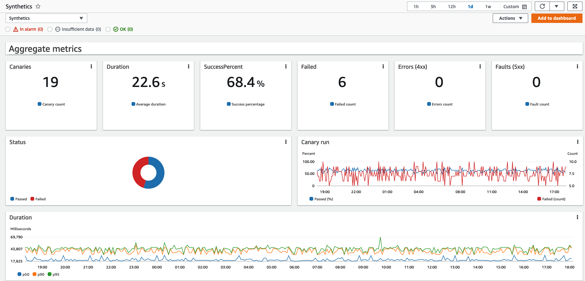

# Tests synthétiques

Amazon CloudWatch Synthetics vous permet de surveiller les applications du point de vue de votre client, même en l'absence d'utilisateurs réels. En testant continuellement vos API et expériences web, vous pouvez obtenir une visibilité sur les problèmes intermittents qui surviennent même lorsqu'il n'y a pas de trafic utilisateur.

Les canaries sont des scripts configurables que vous pouvez exécuter selon un calendrier pour tester en permanence vos API et expériences web 24h/24 et 7j/7. Ils suivent les mêmes chemins de code et routes réseau que les vrais utilisateurs, et peuvent vous notifier de comportements inattendus, y compris la latence, les erreurs de chargement de page, les liens cassés ou morts, et les flux de travail utilisateur défaillants.

:::note
    Assurez-vous d'utiliser les canaries Synthetics pour surveiller uniquement les endpoints et API dont vous êtes propriétaire ou pour lesquels vous avez des permissions. Selon les paramètres de fréquence du canary, ces endpoints pourraient subir un trafic accru.
:::
## Pour commencer

### Couverture complète

:::tip
    Lors du développement de votre stratégie de test, considérez à la fois les endpoints publics et les [endpoints internes privés](https://aws.amazon.com/blogs/mt/monitor-your-private-endpoints-using-cloudwatch-synthetics/) au sein de votre Amazon VPC.
:::
### Enregistrement de nouveaux canaries

Le plugin de navigateur Chrome [CloudWatch Synthetics Recorder](https://chrome.google.com/webstore/detail/cloudwatch-synthetics-rec/bhdnlmmgiplmbcdmkkdfplenecpegfno) vous permet de construire rapidement de nouveaux scripts de test canary avec des flux de travail complexes à partir de zéro. Les actions de type et de clic effectuées pendant l'enregistrement sont converties en un script Node.js que vous pouvez utiliser pour créer un canary. Les limitations connues du CloudWatch Synthetics Recorder sont notées sur [cette page](https://docs.aws.amazon.com/AmazonCloudWatch/latest/monitoring/CloudWatch_Synthetics_Canaries_Recorder.html#CloudWatch_Synthetics_Canaries_Recorder-limitations).

### Visualisation des métriques agrégées

Profitez du reporting prêt à l'emploi sur les métriques agrégées collectées à partir de votre flotte de scripts canary. Tableau de bord automatique CloudWatch

## Construction des canaries

### Blueprints

Utilisez les [blueprints de canary](https://docs.aws.amazon.com/AmazonCloudWatch/latest/monitoring/CloudWatch_Synthetics_Canaries_Blueprints.html) pour simplifier le processus de configuration pour plusieurs types de canaries.

:::info
    Les blueprints sont un moyen pratique de commencer à écrire des canaries et les cas d'usage simples peuvent être couverts sans code.
:::
### Maintenabilité

Lorsque vous écrivez vos propres canaries, ils sont liés à une *version de runtime*. Ce sera une version spécifique soit de Python avec Selenium, soit de JavaScript avec Puppeteer. Consultez [cette page] pour une liste de nos versions de runtime actuellement supportées et celles qui sont dépréciées.

:::info
    Améliorez la maintenabilité de vos scripts en [utilisant des variables d'environnement](https://aws.amazon.com/blogs/mt/using-environment-variables-with-amazon-cloudwatch-synthetics/) pour partager des données accessibles pendant l'exécution du canary.
:::

:::info
    Mettez à niveau vos canaries vers la dernière version de runtime lorsqu'elle est disponible.
:::
### Secrets de type chaîne

Vous pouvez coder vos canaries pour récupérer des secrets (tels que des identifiants de connexion) depuis un système sécurisé externe à votre canary ou à ses variables d'environnement. Tout système accessible par AWS Lambda peut potentiellement fournir des secrets à vos canaries au moment de l'exécution.

:::info
    Exécutez vos tests et [sécurisez les données sensibles](https://aws.amazon.com/blogs/mt/secure-monitoring-of-user-workflow-experience-using-amazon-cloudwatch-synthetics-and-aws-secrets-manager/) en stockant les secrets comme les détails de connexion à la base de données, les clés API et les identifiants d'application à l'aide d'AWS Secrets Manager.
:::
## Gestion des canaries à grande échelle

### Vérifier les liens cassés
:::info
    Si votre site web contient un grand volume de contenu dynamique et de liens, vous pouvez utiliser CloudWatch Synthetics pour explorer votre site web, [détecter les liens cassés](https://aws.amazon.com/blogs/mt/cloudwatch-synthetics-to-find-broken-links-on-your-website/) et trouver la raison de l'échec. Utilisez ensuite un seuil d'échec pour créer optionnellement une alarme CloudWatch lorsqu'un seuil d'échec a été violé.
:::
### URLs multiples de type Heartbeat

:::info
    Simplifiez vos tests et optimisez les coûts en [regroupant plusieurs URLs](https://aws.amazon.com/blogs/mt/simplify-your-canary-by-batching-multiple-urls-in-amazon-cloudwatch-synthetics/) dans un seul test canary de surveillance heartbeat. Vous pouvez ensuite voir le statut, la durée, les captures d'écran associées et la raison de l'échec pour chaque URL dans le résumé des étapes du rapport d'exécution du canary.
:::
### Organiser en groupes

:::info
    Organisez et suivez vos canaries en [groupes](https://docs.aws.amazon.com/AmazonCloudWatch/latest/monitoring/CloudWatch_Synthetics_Groups.html) pour visualiser les métriques agrégées et isoler et explorer plus facilement les échecs.
:::

:::warning
    Notez que les groupes nécessiteront le nom *exact* du canary si vous créez un groupe inter-régions.
:::
## Options de runtime

### Versions et support

CloudWatch Synthetics supporte actuellement des runtimes qui utilisent Node.js pour les scripts et le framework [Puppeteer](https://github.com/puppeteer/puppeteer), ainsi que des runtimes qui utilisent Python pour les scripts et [Selenium WebDriver](https://www.selenium.dev/documentation/webdriver/) comme framework.

:::info
    Utilisez toujours la version de runtime la plus récente pour vos canaries, afin de pouvoir utiliser les dernières fonctionnalités et mises à jour de la bibliothèque Synthetics.
:::
CloudWatch Synthetics vous notifie par e-mail si vous avez des canaries qui utilisent des [runtimes dont la dépréciation est prévue](https://docs.aws.amazon.com/AmazonCloudWatch/latest/monitoring/CloudWatch_Synthetics_Canaries_Library.html#CloudWatch_Synthetics_Canaries_runtime_support) dans les 60 prochains jours.

### Exemples de code

Commencez avec des exemples de code pour [Node.js et Puppeteer](https://docs.aws.amazon.com/AmazonCloudWatch/latest/monitoring/CloudWatch_Synthetics_Canaries_Samples.html#CloudWatch_Synthetics_Canaries_Samples_nodejspup) et [Python et Selenium](https://docs.aws.amazon.com/AmazonCloudWatch/latest/monitoring/CloudWatch_Synthetics_Canaries_Samples.html#CloudWatch_Synthetics_Canaries_Samples_pythonsel).

### Import pour Selenium

Créez des canaries en [Python et Selenium](https://aws.amazon.com/blogs/mt/create-canaries-in-python-and-selenium-using-amazon-cloudwatch-synthetics/) à partir de zéro ou en important des scripts existants avec des modifications minimales.
