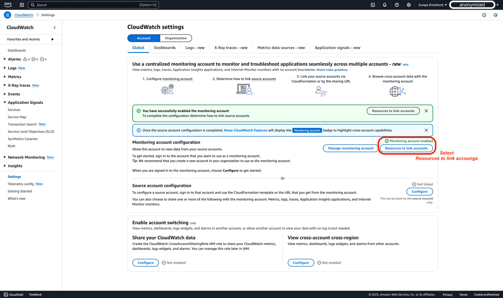
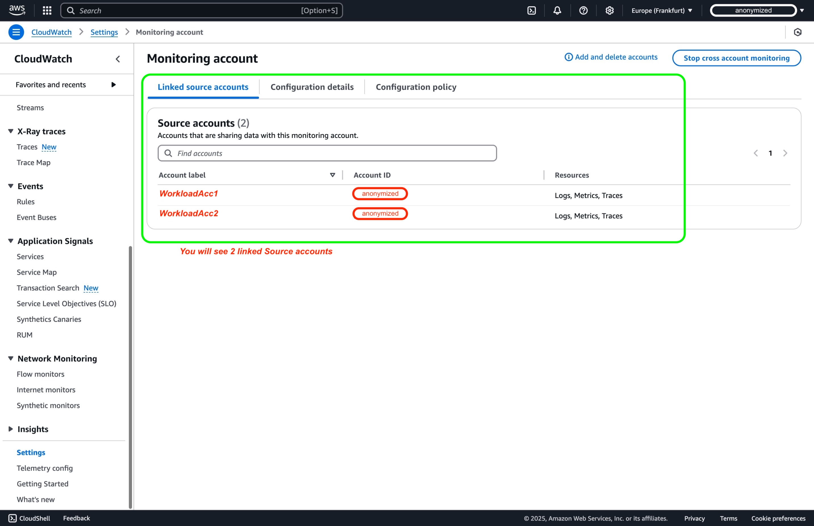
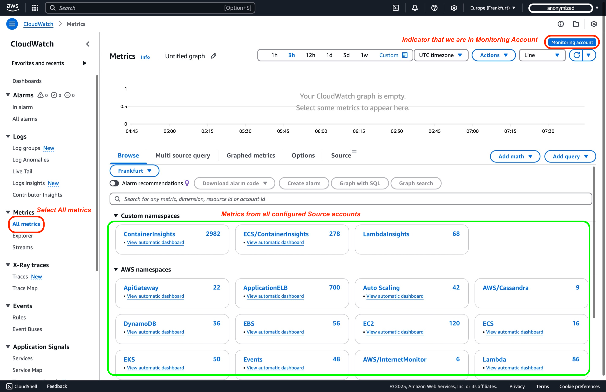

# CloudWatch क्रॉस-अकाउंट Observability

एक ही AWS रीजन में कई AWS अकाउंट्स में डिप्लॉय किए गए एप्लिकेशन की निगरानी चुनौतीपूर्ण हो सकती है। [Amazon CloudWatch का क्रॉस-अकाउंट observability](https://aws.amazon.com/blogs/aws/new-amazon-cloudwatch-cross-account-observability/)[^1] एक [**AWS Region**](https://docs.aws.amazon.com/AmazonCloudWatch/latest/monitoring/CloudWatch-Unified-Cross-Account.html)[^2] में कई अकाउंट्स में फैले एप्लिकेशन की सहज निगरानी और समस्या निवारण को सक्षम करके इस प्रक्रिया को सरल बनाता है। यह ट्यूटोरियल दो AWS अकाउंट्स के बीच क्रॉस-अकाउंट observability कॉन्फ़िगर करने पर स्क्रीनशॉट के साथ एक चरण-दर-चरण गाइड प्रदान करता है। इसके अतिरिक्त, व्यापक स्केलेबिलिटी के लिए AWS Organizations के माध्यम से भी डिप्लॉयमेंट प्राप्त किया जा सकता है।

## शब्दावली

Amazon CloudWatch के साथ प्रभावी क्रॉस-अकाउंट observability के लिए, आपको निम्नलिखित प्रमुख शब्दों को समझना होगा:

| **शब्द** | **विवरण** |
|------|-------------|
| **Monitoring Account** | एक केंद्रीय AWS अकाउंट जो कई सोर्स अकाउंट्स से जनरेट किए गए observability डेटा को देख और उसके साथ इंटरैक्ट कर सकता है |
| **Source Account** | एक व्यक्तिगत AWS अकाउंट जो इसमें रहने वाले रिसोर्सेज के लिए observability डेटा जनरेट करता है |
| **Sink** | monitoring अकाउंट में एक रिसोर्स जो सोर्स अकाउंट्स के लिए लिंक करने और अपना observability डेटा साझा करने के लिए अटैचमेंट पॉइंट के रूप में कार्य करता है। प्रत्येक अकाउंट में प्रति [AWS Region](https://docs.aws.amazon.com/AmazonCloudWatch/latest/monitoring/CloudWatch-Unified-Cross-Account.html)[^2] एक **Sink** हो सकता है |
| **Observability Link** | एक रिसोर्स जो सोर्स अकाउंट और monitoring अकाउंट के बीच स्थापित कनेक्शन का प्रतिनिधित्व करता है, observability डेटा साझा करने की सुविधा प्रदान करता है। Links सोर्स अकाउंट द्वारा प्रबंधित किए जाते हैं। |

Amazon CloudWatch में क्रॉस-अकाउंट observability को सफलतापूर्वक कॉन्फ़िगर और प्रबंधित करने के लिए इन परिभाषाओं को समझें।

## विचार करने योग्य बातें
1. अकाउंट सीमाएँ: आप एक monitoring अकाउंट से 100,000 सोर्स अकाउंट्स तक लिंक कर सकते हैं, सबसे बड़े एंटरप्राइज़ सेटअप को भी समायोजित करते हुए।
2. क्रॉस रीजन: क्रॉस-रीजन कार्यक्षमता इस सुविधा में स्वचालित रूप से अंतर्निहित है। विभिन्न रीजन्स से मेट्रिक्स को एक ही ग्राफ़ या एक ही डैशबोर्ड पर प्रदर्शित करने के लिए आपको कोई अतिरिक्त कदम उठाने की आवश्यकता नहीं है।
3. डेटा रिटेंशन: सभी डेटा रिटेंशन सोर्स अकाउंट स्तर पर हैंडल किया जाता है। Monitoring अकाउंट डेटा स्टोर या डुप्लिकेट नहीं करता। Monitoring अकाउंट के पास सोर्स अकाउंट्स के डेटा तक केवल-पढ़ने की पहुँच होती है।
4. लागत प्रभाव: आश्चर्यजनक रूप से, क्रॉस-अकाउंट Observability से जुड़ी कोई अतिरिक्त लागत नहीं है। चूँकि डेटा सोर्स अकाउंट्स में रहता है और monitoring अकाउंट द्वारा केवल पढ़ा जाता है, इसलिए कोई अतिरिक्त डेटा ट्रांसफ़र या स्टोरेज शुल्क नहीं है।
5. ट्रेस साझा करने के लिए क्रॉस-अकाउंट observability का उपयोग करते समय, ट्रेस डुप्लिकेट किए जाते हैं और monitoring अकाउंट में स्टोर किए जाते हैं। यह प्रक्रिया सोर्स अकाउंट के लिए अतिरिक्त लागत नहीं लगाती।
6. CloudWatch सर्विस कोटा के अनुसार, प्रत्येक डैशबोर्ड में अधिकतम 500 विजेट हो सकते हैं। एक अद्वितीय विजेट में अधिकतम 500 मेट्रिक्स हो सकते हैं, और एक अद्वितीय डैशबोर्ड में सभी विजेट्स में अधिकतम 2500 मेट्रिक्स हो सकते हैं।
7. Amazon CloudWatch Logs Insights में, यदि आप उन्हें व्यक्तिगत रूप से निर्दिष्ट करते हैं तो प्रति क्वेरी अधिकतम 50 लॉग ग्रुप क्वेरी कर सकते हैं। हालाँकि, यदि आप लॉग ग्रुप मानदंड का उपयोग करते हैं तो आप एक क्वेरी में 10,000 लॉग ग्रुप तक शामिल कर सकते हैं।
8. CloudWatch क्रॉस-अकाउंट Observability में Logs और Metrics के साथ काम करते समय, आप monitoring अकाउंट के साथ सभी namespaces से मेट्रिक्स साझा करने या namespaces के एक उपसमूह में फ़िल्टर करने का विकल्प चुन सकते हैं।
9. क्रॉस-अकाउंट परिदृश्य में Alarms के साथ काम करते समय कुछ विचार:
   1. CloudWatch Metrics Insights एक शक्तिशाली SQL क्वेरी इंजन है जिसका उपयोग आप बड़े पैमाने पर मेट्रिक्स क्वेरी करने के लिए कर सकते हैं।
    2. Alarm सेट करते समय, यह एक ऐसी क्वेरी से होना चाहिए जो एक ही time series लौटाए।
    3. क्रॉस-रीजन कार्यक्षमता alarms के लिए समर्थित नहीं है।

10. Data Protection Policy: यदि सोर्स अकाउंट में data protection policy सक्षम है, तो monitoring अकाउंट तब तक डेटा एक्सेस नहीं कर पाएगा जब तक स्पष्ट अनुमतियाँ न दी जाएँ।

## AWS Console के माध्यम से चरण-दर-चरण ट्यूटोरियल

### पूर्वापेक्षाएँ

1. इस ट्यूटोरियल को पूरा करने के लिए, आपको तीन AWS अकाउंट्स की आवश्यकता है: एक Monitoring Account और दो Source Accounts।

2. क्रॉस-अकाउंट links बनाने के लिए एक user या role के पास कम से कम [AWS CloudWatch क्रॉस-अकाउंट सेटअप गाइड](https://docs.aws.amazon.com/AmazonCloudWatch/latest/monitoring/CloudWatch-Unified-Cross-Account-Setup.html#CloudWatch-Unified-Cross-Account-Setup-permissions)[^3] में दस्तावेज़ित अनुमतियाँ होनी चाहिए।

<div style={{ textAlign: 'center' }}>

</div>

### चरण 1: Monitoring Account सेट करें

#### Monitoring Account

Monitoring अकाउंट सेट करने के लिए, इन चरणों का पालन करें:

1. CloudWatch कंसोल [https://console.aws.amazon.com/cloudwatch](https://console.aws.amazon.com/cloudwatch) पर खोलें और AWS रीजन चुनें।


2. नेविगेशन पैनल में, **Settings** चुनें।


3. डिफ़ॉल्ट Account Global settings का उपयोग करें, और फिर **Monitoring account configuration** सेक्शन में **Configure** चुनें।


4. Monitoring अकाउंट के साथ साझा करने के लिए डेटा प्रकार चुनने के बाद, Source Account IDs को "List source accounts" बॉक्स में पेस्ट करें।


:::info
CloudWatch क्रॉस-अकाउंट Observability में telemetry प्रकार कॉन्फ़िगर करते समय, उनकी निर्भरताओं को समझना महत्वपूर्ण है। Metrics, Logs और Traces स्वतंत्र रूप से कॉन्फ़िगर किए जा सकते हैं, जबकि अन्य CloudWatch कार्यक्षमताओं की विशिष्ट आवश्यकताएँ हैं।
:::
    | Telemetry Type | Description | Dependencies for CloudWatch Cross-Account Observability |
    |----------------|-------------|-----------------------------------------------------|
    | Metrics in Amazon CloudWatch | सभी metric namespaces साझा करें या उपसमूह में फ़िल्टर करें | कोई नहीं |
    | Log Groups in Amazon CloudWatch Logs | सभी लॉग ग्रुप्स साझा करें या उपसमूह में फ़िल्टर करें | कोई नहीं |
    | ServiceLens and X-Ray | सभी ट्रेस साझा करें (कोई फ़िल्टरिंग उपलब्ध नहीं) | Metrics, Logs, और Traces सक्षम करना आवश्यक |
    | Applications in Amazon CloudWatch Application Insights | सभी एप्लिकेशन साझा करें | Metrics, Logs, Traces, और Application Insights एप्लिकेशन सक्षम करना आवश्यक |
    | Monitors in CloudWatch Internet Monitor | सभी मॉनिटर साझा करें | Metrics, Logs, और Internet Monitor - Monitors सक्षम करना आवश्यक |

5. आपके Monitoring Account के AWS Console में, आपको निम्नलिखित दिखाई देगा, जो पुष्टि करता है कि Monitoring Account सफलतापूर्वक कॉन्फ़िगर हो गया है।


:::tip
	अपने monitoring अकाउंट को सफलतापूर्वक कॉन्फ़िगर करने के बाद, आपको अपने source अकाउंट्स को लिंक करना होगा। चरण 2 में, हम एक व्यक्तिगत अकाउंट कॉन्फ़िगर करने की प्रक्रिया से गुज़रेंगे।
:::

6. AWS Console में, **Resources to link accounts** चुनें


7. AWS Console में, 'Configuration details' सेक्शन एक्सपैंड करें, यहाँ आपको Monitoring account sink ARN मिलेगा जिसे आपको कॉपी करके सेव करना होगा।


#### सारांश

पिछले चरणों में, हमने Monitoring अकाउंट sink को Source Accounts के साथ लिंक करने के लिए कॉन्फ़िगर किया।

```
{
    "Version": "2012-10-17",
    "Statement": [
        {
            "Effect": "Allow",
            "Principal": {
                "AWS": [
                    "${WorkloadAcc1}",
                    "${WorkloadAcc2}"
                ]
            },
            "Action": [
                "oam:CreateLink",
                "oam:UpdateLink"
            ],
            "Resource": "*",
            "Condition": {
                "ForAllValues:StringEquals": {
                    "oam:ResourceTypes": [
                        "AWS::Logs::LogGroup",
                        "AWS::CloudWatch::Metric",
                        "AWS::XRay::Trace"
                    ]
                }
            }
        }
    ]
}
```

### चरण 2: Source Accounts को लिंक करें

#### व्यक्तिगत अकाउंट्स को लिंक करना

चरण 1 में monitoring अकाउंट कॉन्फ़िगर करने के बाद, अब हम एक व्यक्तिगत AWS source अकाउंट कॉन्फ़िगर करेंगे।

1. CloudWatch कंसोल खोलें और AWS रीजन चुनें।


2. नेविगेशन पैनल में, **Settings** चुनें।


3. **Source account configuration** सेक्शन में **Configure** चुनें।


4. Data Types के रूप में Logs, Metrics, और Traces चुनें। फिर Monitoring account sink ARN दर्ज करें।


5. पॉप-अप बॉक्स में 'Confirm' टाइप करके पुष्टि करें।


6. 'Source account configuration' सेक्शन में, आपको एक हरा स्टेटस दिखाई देगा जो इंगित करता है कि अकाउंट 'linked' है।


:::tip
    दोनों Workload अकाउंट्स से Observability telemetry को Monitoring अकाउंट के साथ साझा करने के लिए WorkloadAcc2 के लिए चरण 2 दोहराएँ
:::

### चरण 3: कॉन्फ़िगरेशन मान्य करें

:::tip
    सुनिश्चित करें कि आप Monitoring Account में लॉग इन हैं
:::

1. CloudWatch कंसोल खोलें और उस AWS रीजन का चयन करें जहाँ आपने चरण 1 में क्रॉस-अकाउंट monitoring कॉन्फ़िगर किया था।


2. नेविगेशन पैनल में, **Settings** चुनें।


3. **Monitoring account configuration** सेक्शन में **Manage monitoring account** चुनें।


4. Linked source accounts पैनल में, आपको दो workload अकाउंट्स **Source accounts** के रूप में लिंक दिखाई देंगे।


## क्रॉस-अकाउंट Telemetry डेटा क्वेरी करना

:::tip
    सुनिश्चित करें कि आप Monitoring Account में लॉग इन हैं
:::

### Metrics

कई अकाउंट्स से मेट्रिक्स को केंद्रीकृत स्थान में मॉनिटर करने के लिए:

1. अपने monitoring अकाउंट के CloudWatch कंसोल में, बाएँ नेविगेशन पैनल में "All Metrics" पर जाएँ।


2. आप विशिष्ट अकाउंट मेट्रिक्स फ़िल्टर करने के लिए Account Id फ़िल्टर `:aws.AccountId=` का उपयोग कर सकते हैं।


### Logs

आप एक ही इंटरफ़ेस में Logs Insights का उपयोग करके कई अकाउंट्स से लॉग्स को क्वेरी और विश्लेषित कर सकते हैं:

1. CloudWatch कंसोल में, "Logs Insights" पर जाएँ और लॉग ग्रुप सिलेक्टर का उपयोग करके विभिन्न अकाउंट्स से लॉग ग्रुप्स चुनें।


2. अपनी CloudWatch Logs Insights क्वेरी लिखें।

    ```
    filter @message like /POST/ and @message like /completeadoption/
    | parse @message "* * * *:* *" as method, request, protocol, ip, port, status
    | parse request "*?petId=*&petType=*" as requestURL, id, type
    | parse @log "*:*" as accountId, logGroupName
    | stats count() by type,accountId
    ```
    
    

### Traces

1. अपने monitoring अकाउंट के CloudWatch कंसोल में, नेविगेशन पैनल में X-Ray traces के तहत Trace map चुनें।


2. Trace map पर, प्रत्येक नोड इंगित करता है कि यह किस AWS अकाउंट से संबंधित है।


3. गहरी अंतर्दृष्टि के लिए एक विशिष्ट trace चुनें।


4. प्रत्येक traced पथ में कंपोनेंट्स के बारे में जानने के लिए end-to-end trace spans में गहराई से जाएँ।


## निष्कर्ष

Amazon CloudWatch में क्रॉस-अकाउंट observability कॉन्फ़िगर करना कई AWS अकाउंट्स में आपके एप्लिकेशन प्रदर्शन और स्वास्थ्य का एक केंद्रीकृत दृश्य प्रदान करता है। यह आपके एप्लिकेशन की निगरानी, समस्या निवारण और विश्लेषण को सरल बनाता है, चाहे वे किसी भी अकाउंट में रहते हों।

## संसाधन

[^1]: [AWS Blog - Amazon CloudWatch Cross-Account Observability](https://aws.amazon.com/blogs/aws/new-amazon-cloudwatch-cross-account-observability/)

[^2]: [CloudWatch cross-account observability](https://docs.aws.amazon.com/AmazonCloudWatch/latest/monitoring/CloudWatch-Unified-Cross-Account.html)

[^3]: [Permissions needed to create links](https://docs.aws.amazon.com/AmazonCloudWatch/latest/monitoring/CloudWatch-Unified-Cross-Account-Setup.html#CloudWatch-Unified-Cross-Account-Setup-permissions)

[^4]: [What is AWS Organizations?](https://docs.aws.amazon.com/organizations/latest/userguide/orgs_introduction.html)

[^5]: [AWS Cloudformation StackSets and AWS Organizations](https://docs.aws.amazon.com/organizations/latest/userguide/services-that-can-integrate-cloudformation.html)

[^6]: [Set up a monitoring account](https://docs.aws.amazon.com/AmazonCloudWatch/latest/monitoring/CloudWatch-Unified-Cross-Account-Setup.html#Unified-Cross-Account-Setup-ConfigureMonitoringAccount)

[^7]: [Use an AWS CloudFormation template to set up all accounts in an organization](https://docs.aws.amazon.com/AmazonCloudWatch/latest/monitoring/CloudWatch-Unified-Cross-Account-Setup.html#Unified-Cross-Account-SetupSource-OrgTemplate)

[^8]: [One Observability Workshop](https://catalog.workshops.aws/observability/en-US/intro)

[^9]: [Amazon CloudWatch cross account alarms](https://aws.amazon.com/about-aws/whats-new/2021/08/announcing-amazon-cloudwatch-cross-account-alarms/)
