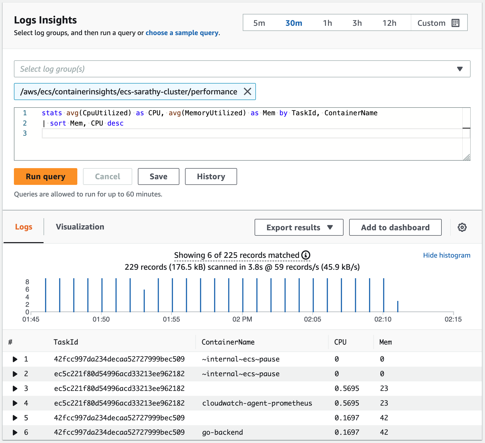

# Container Insights के साथ सिस्टम मेट्रिक्स एकत्र करना
सिस्टम मेट्रिक्स निम्न-स्तरीय रिसोर्सेज से संबंधित हैं जिनमें सर्वर पर भौतिक कंपोनेंट्स जैसे CPU, मेमोरी, डिस्क और नेटवर्क इंटरफेस शामिल हैं।
Amazon ECS पर डिप्लॉय किए गए कंटेनराइज़्ड एप्लिकेशन से सिस्टम मेट्रिक्स एकत्र, एग्रीगेट और सारांशित करने के लिए [CloudWatch Container Insights](https://docs.aws.amazon.com/AmazonCloudWatch/latest/monitoring/ContainerInsights.html) का उपयोग करें। Container Insights डायग्नोस्टिक जानकारी भी प्रदान करता है, जैसे कंटेनर रीस्टार्ट विफलताएँ, जो समस्याओं को अलग करने और उन्हें तुरंत हल करने में मदद करती हैं। यह EC2 और Fargate पर डिप्लॉय किए गए Amazon ECS क्लस्टर्स के लिए उपलब्ध है।

Container Insights [embedded metric format](https://docs.aws.amazon.com/AmazonCloudWatch/latest/monitoring/CloudWatch_Embedded_Metric_Format.html) का उपयोग करके परफ़ॉर्मेंस लॉग events के रूप में डेटा एकत्र करता है। ये परफ़ॉर्मेंस लॉग events ऐसी एंट्रीज हैं जो एक स्ट्रक्चर्ड JSON स्कीमा का उपयोग करती हैं जो हाई-कार्डिनैलिटी डेटा को बड़े पैमाने पर इंजेस्ट और स्टोर करने में सक्षम बनाती हैं। इस डेटा से, CloudWatch क्लस्टर, नोड, सर्विस और टास्क स्तर पर एग्रीगेटेड मेट्रिक्स CloudWatch मेट्रिक्स के रूप में बनाता है।

:::note
	Container Insights मेट्रिक्स CloudWatch में दिखाई देने के लिए, आपको अपने Amazon ECS क्लस्टर्स पर Container Insights सक्षम करना होगा। यह अकाउंट स्तर या व्यक्तिगत क्लस्टर स्तर पर किया जा सकता है। अकाउंट स्तर पर सक्षम करने के लिए, निम्नलिखित AWS CLI कमांड का उपयोग करें:

    ```
    aws ecs put-account-setting --name "containerInsights" --value "enabled
    ```

    व्यक्तिगत क्लस्टर स्तर पर सक्षम करने के लिए, निम्नलिखित AWS CLI कमांड का उपयोग करें:

    ```
    aws ecs update-cluster-settings --cluster $CLUSTER_NAME --settings name=containerInsights,value=enabled
    ```
:::

## क्लस्टर-स्तर और सर्विस-स्तर मेट्रिक्स एकत्र करना
डिफ़ॉल्ट रूप से, CloudWatch Container Insights टास्क, सर्विस और क्लस्टर स्तर पर मेट्रिक्स एकत्र करता है। Amazon ECS एजेंट EC2 कंटेनर इंस्टेंस (ECS on EC2 और ECS on Fargate दोनों के लिए) पर प्रत्येक टास्क के लिए ये मेट्रिक्स एकत्र करता है और उन्हें परफ़ॉर्मेंस लॉग events के रूप में CloudWatch को भेजता है। आपको क्लस्टर पर कोई एजेंट डिप्लॉय करने की आवश्यकता नहीं है। इन लॉग events जिनसे मेट्रिक्स एक्सट्रैक्ट किए जाते हैं, */aws/ecs/containerinsights/$CLUSTER_NAME/performance* नामक CloudWatch लॉग ग्रुप के तहत एकत्र किए जाते हैं। इन events से एक्सट्रैक्ट किए गए मेट्रिक्स की पूरी सूची [यहाँ दस्तावेज़ित है](https://docs.aws.amazon.com/AmazonCloudWatch/latest/monitoring/Container-Insights-metrics-ECS.html)। Container Insights द्वारा एकत्र किए गए मेट्रिक्स CloudWatch कंसोल में उपलब्ध प्री-बिल्ट डैशबोर्ड में आसानी से देखे जा सकते हैं, नेविगेशन पेज से *Container Insights* चुनकर और फिर ड्रॉपडाउन सूची से *performance monitoring* चुनकर। वे CloudWatch कंसोल के *Metrics* सेक्शन में भी देखे जा सकते हैं।


:::note
    यदि आप Amazon EC2 इंस्टेंस पर Amazon ECS का उपयोग कर रहे हैं, और आप Container Insights से नेटवर्क और स्टोरेज मेट्रिक्स एकत्र करना चाहते हैं, तो उस इंस्टेंस को Amazon ECS एजेंट वर्शन 1.29 वाली AMI के साथ लॉन्च करें।
:::

:::warning
    Container Insights द्वारा एकत्र किए गए मेट्रिक्स कस्टम मेट्रिक्स के रूप में शुल्कित किए जाते हैं। CloudWatch प्राइसिंग के बारे में अधिक जानकारी के लिए, [Amazon CloudWatch Pricing](https://aws.amazon.com/cloudwatch/pricing/) देखें
:::

## इंस्टेंस-स्तर मेट्रिक्स एकत्र करना
EC2 पर होस्ट किए गए Amazon ECS क्लस्टर पर CloudWatch एजेंट डिप्लॉय करने से, आप क्लस्टर से इंस्टेंस-स्तर मेट्रिक्स एकत्र कर सकते हैं। एजेंट को daemon सर्विस के रूप में डिप्लॉय किया जाता है और क्लस्टर में प्रत्येक EC2 कंटेनर इंस्टेंस से परफ़ॉर्मेंस लॉग events के रूप में इंस्टेंस-स्तर मेट्रिक्स भेजता है। इन events से एक्सट्रैक्ट किए गए इंस्टेंस-स्तर मेट्रिक्स की पूरी सूची [यहाँ दस्तावेज़ित है](https://docs.aws.amazon.com/AmazonCloudWatch/latest/monitoring/Container-Insights-metrics-ECS.html)

:::info
    इंस्टेंस-स्तर मेट्रिक्स एकत्र करने के लिए Amazon ECS क्लस्टर पर CloudWatch एजेंट डिप्लॉय करने के चरण [Amazon CloudWatch User Guide](https://docs.aws.amazon.com/AmazonCloudWatch/latest/monitoring/deploy-container-insights-ECS-instancelevel.html) में दस्तावेज़ित हैं। ध्यान दें कि यह विकल्प Fargate पर होस्ट किए गए Amazon ECS क्लस्टर्स के लिए उपलब्ध नहीं है।
:::
    
## Logs Insights के साथ परफ़ॉर्मेंस लॉग events का विश्लेषण
Container Insights embedded metric format के साथ परफ़ॉर्मेंस लॉग events का उपयोग करके मेट्रिक्स एकत्र करता है। प्रत्येक लॉग event में CPU और मेमोरी जैसे सिस्टम रिसोर्सेज या टास्क और सर्विसेज जैसे ECS रिसोर्सेज पर देखा गया परफ़ॉर्मेंस डेटा हो सकता है। परफ़ॉर्मेंस लॉग events के उदाहरण जो Container Insights Amazon ECS से क्लस्टर, सर्विस, टास्क और कंटेनर स्तर पर एकत्र करता है, [यहाँ सूचीबद्ध हैं](https://docs.aws.amazon.com/AmazonCloudWatch/latest/monitoring/Container-Insights-reference-performance-logs-ECS.html)। CloudWatch इन लॉग events में कुछ परफ़ॉर्मेंस डेटा के आधार पर ही मेट्रिक्स जनरेट करता है। लेकिन आप CloudWatch Logs Insights क्वेरीज का उपयोग करके परफ़ॉर्मेंस डेटा का गहरा विश्लेषण करने के लिए इन लॉग events का उपयोग कर सकते हैं।

Logs Insights क्वेरीज चलाने के लिए यूज़र इंटरफ़ेस CloudWatch कंसोल में नेविगेशन पेज से *Logs Insights* चुनकर उपलब्ध है। जब आप एक लॉग ग्रुप चुनते हैं, तो CloudWatch Logs Insights स्वचालित रूप से लॉग ग्रुप में परफ़ॉर्मेंस लॉग events में फ़ील्ड्स का पता लगाता है और उन्हें दाएँ पैनल में *Discovered* फ़ील्ड्स में प्रदर्शित करता है। क्वेरी निष्पादन के परिणाम समय के साथ इस लॉग ग्रुप में लॉग events का बार ग्राफ़ के रूप में प्रदर्शित होते हैं।



:::info
    CPU और मेमोरी उपयोग के लिए कंटेनर-स्तर मेट्रिक्स प्रदर्शित करने के लिए एक सैंपल Logs Insights क्वेरी यहाँ है।
    
    ```
    stats avg(CpuUtilized) as CPU, avg(MemoryUtilized) as Mem by TaskId, ContainerName | sort Mem, CPU desc
    ```
:::
