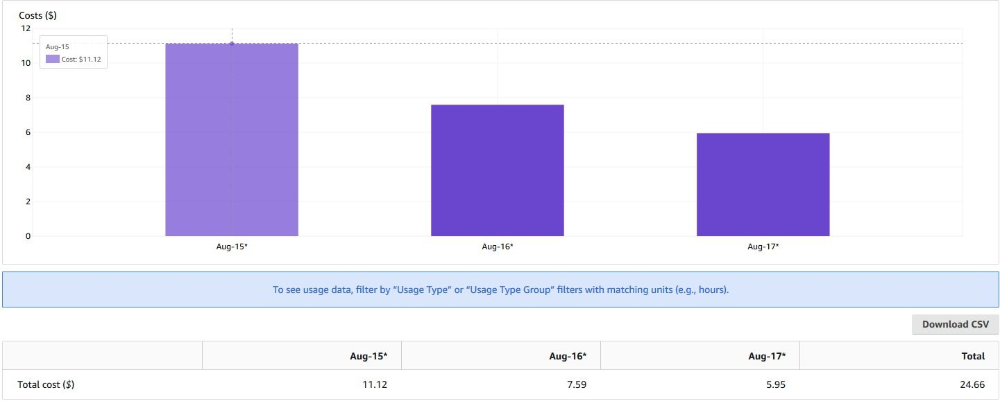

# Amazon CloudWatch Container Insights

Observability सर्वोत्तम प्रथाओं गाइड के इस सेक्शन में, हम Amazon CloudWatch Container Insights से संबंधित निम्नलिखित विषयों पर गहराई से चर्चा करेंगे:

* Amazon CloudWatch Container Insights का परिचय
* AWS Distro for Open Telemetry के साथ Amazon CloudWatch Container Insights का उपयोग
* Amazon EKS के लिए CloudWatch Container Insights में Fluent Bit एकीकरण
* Amazon EKS पर Container Insights के साथ लागत बचत
* Container Insights सेटअप करने के लिए EKS Blueprints का उपयोग

### परिचय

[Amazon CloudWatch Container Insights](https://docs.aws.amazon.com/AmazonCloudWatch/latest/monitoring/ContainerInsights.html) ग्राहकों को कंटेनरीकृत एप्लिकेशन और माइक्रोसर्विसेज से मेट्रिक्स और लॉग्स एकत्र, एकीकृत और सारांशित करने में मदद करता है। मेट्रिक्स डेटा [embedded metric format](https://docs.aws.amazon.com/AmazonCloudWatch/latest/monitoring/CloudWatch_Embedded_Metric_Format.html) का उपयोग करके परफॉर्मेंस लॉग इवेंट्स के रूप में एकत्र किया जाता है। ये परफॉर्मेंस लॉग इवेंट्स एक संरचित JSON स्कीमा का उपयोग करते हैं जो उच्च-कार्डिनैलिटी डेटा को बड़े पैमाने पर इनजेस्ट और स्टोर करने में सक्षम बनाता है। इस डेटा से, CloudWatch क्लस्टर, नोड, पॉड, टास्क और सर्विस स्तर पर CloudWatch मेट्रिक्स के रूप में एकीकृत मेट्रिक्स बनाता है। Container Insights द्वारा एकत्रित मेट्रिक्स CloudWatch ऑटोमैटिक डैशबोर्ड में उपलब्ध हैं। Container Insights self managed node groups, managed node groups और AWS Fargate profiles वाले Amazon EKS क्लस्टर के लिए उपलब्ध है।

लागत अनुकूलन के दृष्टिकोण से और आपकी Container Insights लागत को प्रबंधित करने में मदद करने के लिए, CloudWatch स्वचालित रूप से लॉग डेटा से सभी संभव मेट्रिक्स नहीं बनाता है। हालाँकि, आप CloudWatch Logs Insights का उपयोग करके कच्चे परफॉर्मेंस लॉग इवेंट्स का विश्लेषण करके अतिरिक्त मेट्रिक्स और ग्रेन्यूलैरिटी के अतिरिक्त स्तर देख सकते हैं। Container Insights द्वारा एकत्रित मेट्रिक्स कस्टम मेट्रिक्स के रूप में शुल्कित हैं। CloudWatch मूल्य निर्धारण के बारे में अधिक जानकारी के लिए, [Amazon CloudWatch Pricing](https://aws.amazon.com/cloudwatch/pricing/) देखें।

Amazon EKS में, Container Insights [CloudWatch agent](https://gallery.ecr.aws/cloudwatch-agent/cloudwatch-agent) के एक कंटेनरीकृत संस्करण का उपयोग करता है जो Amazon द्वारा Amazon Elastic Container Registry के माध्यम से प्रदान किया जाता है, ताकि क्लस्टर में चल रहे सभी कंटेनरों की खोज की जा सके। फिर यह परफॉर्मेंस स्टैक के हर स्तर पर प्रदर्शन डेटा एकत्र करता है। Container Insights अपने द्वारा एकत्रित लॉग्स और मेट्रिक्स के लिए AWS KMS key के साथ एन्क्रिप्शन का समर्थन करता है। इस एन्क्रिप्शन को सक्षम करने के लिए, आपको Container Insights डेटा प्राप्त करने वाले लॉग ग्रुप के लिए मैन्युअल रूप से AWS KMS एन्क्रिप्शन सक्षम करना होगा। Container Insights केवल Linux इंस्टेंसेज पर समर्थित है। Amazon EKS के लिए Container Insights [इन](https://docs.aws.amazon.com/AmazonCloudWatch/latest/monitoring/ContainerInsights.html#:~:text=Container%20Insights%20for%20Amazon%20EKS%20and%20Kubernetes%20is%20supported%20in%20the%20following%20Regions%3A) AWS Regions में समर्थित है।

### AWS Distro for Open Telemetry के साथ Amazon CloudWatch Container Insights का उपयोग

अब हम [AWS Distro for OpenTelemetry (ADOT)](https://aws-otel.github.io/docs/introduction) में गहराई से जाएँगे जो Amazon EKS वर्कलोड से Container insight मेट्रिक्स के संग्रह को सक्षम करने के विकल्पों में से एक है। [AWS Distro for OpenTelemetry (ADOT)](https://aws-otel.github.io/docs/introduction) [OpenTelemetry](https://opentelemetry.io/docs/) प्रोजेक्ट का एक सुरक्षित, AWS-समर्थित वितरण है। ADOT के साथ, उपयोगकर्ता अपने एप्लिकेशन को केवल एक बार इंस्ट्रूमेंट कर सकते हैं ताकि सहसंबद्ध मेट्रिक्स और ट्रेस कई मॉनिटरिंग समाधानों को भेज सकें। CloudWatch Container Insights के लिए ADOT समर्थन के साथ, ग्राहक [Amazon Elastic Cloud Compute](https://aws.amazon.com/pm/ec2/?trk=ps_a134p000004f2ZFAAY&trkCampaign=acq_paid_search_brand&sc_channel=PS&sc_campaign=acquisition_US&sc_publisher=Google&sc_category=Cloud%20Computing&sc_country=US&sc_geo=NAMER&sc_outcome=acq&sc_detail=amazon%20ec2&sc_content=EC2_e&sc_matchtype=e&sc_segment=467723097970&sc_medium=ACQ-P|PS-GO|Brand|Desktop|SU|Cloud%20Computing|EC2|US|EN|Text&s_kwcid=AL!4422!3!467723097970!e!!g!!amazon%20ec2&ef_id=Cj0KCQiArt6PBhCoARIsAMF5waj-FXPUD0G-cm0dJ05Mz6aXDvqEGu-S7pCXwvVusULN6ZbPbc_Alg8aArOHEALw_wcB:G:s&s_kwcid=AL!4422!3!467723097970!e!!g!!amazon%20ec2) (Amazon EC2) पर चलने वाले Amazon EKS क्लस्टर से CPU, मेमोरी, डिस्क और नेटवर्क उपयोग जैसी सिस्टम मेट्रिक्स एकत्र कर सकते हैं, जो Amazon CloudWatch agent के समान अनुभव प्रदान करता है। ADOT Collector अब Amazon EKS और Amazon EKS के लिए AWS Fargate profile के लिए CloudWatch Container Insights के समर्थन के साथ उपलब्ध है।

ADOT Collector में [पाइपलाइन की अवधारणा](https://opentelemetry.io/docs/collector/configuration/) है जिसमें तीन मुख्य प्रकार के कंपोनेंट शामिल हैं, अर्थात् receiver, processor, और exporter। एक [receiver](https://opentelemetry.io/docs/collector/configuration/#receivers) वह है जिसके माध्यम से डेटा collector में आता है। यह एक निर्दिष्ट फॉर्मेट में डेटा स्वीकार करता है, इसे आंतरिक फॉर्मेट में अनुवाद करता है और इसे पाइपलाइन में परिभाषित [processors](https://opentelemetry.io/docs/collector/configuration/#processors) और [exporters](https://opentelemetry.io/docs/collector/configuration/#exporters) को पास करता है। एक processor एक वैकल्पिक कंपोनेंट है जो प्राप्त और निर्यात किए जाने के बीच डेटा पर बैचिंग, फ़िल्टरिंग और ट्रांसफॉर्मेशन जैसे कार्य करने के लिए उपयोग किया जाता है। एक exporter यह निर्धारित करने के लिए उपयोग किया जाता है कि मेट्रिक्स, लॉग्स या ट्रेस किस गंतव्य को भेजना है। Collector आर्किटेक्चर YAML कॉन्फ़िगरेशन के माध्यम से ऐसी कई पाइपलाइनों को परिभाषित करने की अनुमति देता है। निम्नलिखित आरेख Amazon EKS और Fargate profile के साथ Amazon EKS पर तैनात ADOT Collector इंस्टेंस में पाइपलाइन कंपोनेंट्स दर्शाते हैं।


*चित्र: Amazon EKS पर तैनात ADOT Collector इंस्टेंस में पाइपलाइन कंपोनेंट्स*

उपरोक्त आर्किटेक्चर में, हम पाइपलाइन में [AWS Container Insights Receiver](https://github.com/open-telemetry/opentelemetry-collector-contrib/tree/main/receiver/awscontainerinsightreceiver) के एक इंस्टेंस का उपयोग कर रहे हैं और सीधे Kubelet से मेट्रिक्स एकत्र कर रहे हैं। AWS Container Insights Receiver (`awscontainerinsightreceiver`) एक AWS-विशिष्ट receiver है जो [CloudWatch Container Insights](https://docs.aws.amazon.com/AmazonCloudWatch/latest/monitoring/ContainerInsights.html) का समर्थन करता है। नीचे एक नमूना `awscontainerinsightreceiver` कॉन्फ़िगरेशन का उदाहरण है:

```
receivers:
  awscontainerinsightreceiver:
    # all parameters are optional
    collection_interval: 60s
    container_orchestrator: eks
    add_service_as_attribute: true 
    prefer_full_pod_name: false 
    add_full_pod_name_metric_label: false 
```

इसमें Amazon EKS पर उपरोक्त कॉन्फ़िगरेशन का उपयोग करके collector को DaemonSet के रूप में तैनात करना शामिल है। आपको इस receiver द्वारा सीधे Kubelet से एकत्रित मेट्रिक्स के एक पूर्ण सेट तक भी पहुँच होगी। एक से अधिक ADOT Collector इंस्टेंस होने से क्लस्टर में सभी नोड्स से रिसोर्स मेट्रिक्स एकत्र करने के लिए पर्याप्त होगा। ADOT collector का एक एकल इंस्टेंस अधिक लोड के दौरान अभिभूत हो सकता है इसलिए हमेशा एक से अधिक collector तैनात करने की अनुशंसा की जाती है।


*चित्र: Fargate profile के साथ Amazon EKS पर तैनात ADOT Collector इंस्टेंस में पाइपलाइन कंपोनेंट्स*

उपरोक्त आर्किटेक्चर में, Kubernetes क्लस्टर में एक worker node पर kubelet */metrics/cadvisor* endpoint पर CPU, मेमोरी, डिस्क और नेटवर्क उपयोग जैसी रिसोर्स मेट्रिक्स एक्सपोज करता है। हालाँकि, EKS Fargate नेटवर्किंग आर्किटेक्चर में, एक pod को उस worker node पर kubelet तक सीधे पहुँचने की अनुमति नहीं है। इसलिए, ADOT Collector Kubernetes API Server को कॉल करता है ताकि worker node पर kubelet से कनेक्शन प्रॉक्सी किया जा सके, और उस node पर वर्कलोड के लिए kubelet की cAdvisor मेट्रिक्स एकत्र की जा सकें।

मेट्रिक्स फिर processors की एक श्रृंखला से गुज़रती हैं जो फ़िल्टरिंग, नाम बदलना, डेटा एकीकरण और रूपांतरण आदि करती हैं। निम्नलिखित ऊपर दर्शाए गए Amazon EKS के लिए ADOT Collector इंस्टेंस की पाइपलाइन में उपयोग किए जाने वाले processors की सूची है।

* [Filter Processor](https://github.com/open-telemetry/opentelemetry-collector-contrib/tree/main/processor/filterprocessor) AWS OpenTelemetry डिस्ट्रीब्यूशन का हिस्सा है जो उनके नाम के आधार पर मेट्रिक्स को शामिल या बाहर करता है।

```
      # filter out only renamed metrics which we care about
      filter:
        metrics:
          include:
            match_type: regexp
            metric_names:
              - new_container_.*
              - pod_.*
```

* [Metrics Transform Processor](https://github.com/open-telemetry/opentelemetry-collector-contrib/tree/main/processor/metricstransformprocessor) का उपयोग मेट्रिक्स का नाम बदलने, और label keys और values जोड़ने, नाम बदलने या हटाने के लिए किया जा सकता है।

```
     metricstransform/rename:
        transforms:
          - include: container_spec_cpu_quota
            new_name: new_container_cpu_limit_raw
            action: insert
            match_type: regexp
            experimental_match_labels: {"container": "\\S"}
```

* [Cumulative to Delta Processor](https://github.com/open-telemetry/opentelemetry-collector-contrib/tree/main/processor/cumulativetodeltaprocessor) monotonic, cumulative sum और histogram मेट्रिक्स को monotonic, delta मेट्रिक्स में रूपांतरित करता है।

```
` # convert cumulative sum datapoints to delta
 cumulativetodelta:
    metrics:
        - pod_cpu_usage_seconds_total 
        - pod_network_rx_errors`
```

* [Delta to Rate Processor](https://github.com/open-telemetry/opentelemetry-collector-contrib/tree/main/processor/deltatorateprocessor) delta sum मेट्रिक्स को rate मेट्रिक्स में रूपांतरित करता है।

```
` # convert delta to rate
    deltatorate:
        metrics:
            - pod_memory_hierarchical_pgfault 
            - pod_memory_hierarchical_pgmajfault 
            - pod_network_rx_bytes 
            - pod_network_rx_dropped 
            - pod_network_rx_errors 
            - pod_network_tx_errors 
            - pod_network_tx_packets 
            - new_container_memory_pgfault 
            - new_container_memory_pgmajfault 
            - new_container_memory_hierarchical_pgfault 
            - new_container_memory_hierarchical_pgmajfault`
```

* [Metrics Generation Processor](https://github.com/open-telemetry/opentelemetry-collector-contrib/tree/main/processor/metricsgenerationprocessor) का उपयोग दिए गए नियम के अनुसार मौजूदा मेट्रिक्स का उपयोग करके नई मेट्रिक्स बनाने के लिए किया जा सकता है।

```
      experimental_metricsgeneration/1:
        rules:
          - name: pod_memory_utilization_over_pod_limit
            unit: Percent
            type: calculate
            metric1: pod_memory_working_set
            metric2: pod_memory_limit
            operation: percent
```

पाइपलाइन में अंतिम कंपोनेंट [AWS CloudWatch EMF Exporter](https://github.com/open-telemetry/opentelemetry-collector-contrib/tree/main/exporter/awsemfexporter) है, जो मेट्रिक्स को embedded metric format (EMF) में रूपांतरित करता है और फिर उन्हें सीधे [PutLogEvents](https://docs.aws.amazon.com/AmazonCloudWatchLogs/latest/APIReference/API_PutLogEvents.html) API का उपयोग करके CloudWatch Logs को भेजता है। Amazon EKS पर चलने वाले प्रत्येक वर्कलोड के लिए ADOT Collector द्वारा CloudWatch को भेजी जाने वाली मेट्रिक्स की सूची:

* pod_cpu_utilization_over_pod_limit
* pod_cpu_usage_total
* pod_cpu_limit
* pod_memory_utilization_over_pod_limit
* pod_memory_working_set
* pod_memory_limit
* pod_network_rx_bytes
* pod_network_tx_bytes

प्रत्येक मेट्रिक निम्नलिखित dimension sets से संबद्ध होगी और *ContainerInsights* नामक CloudWatch namespace के तहत एकत्र की जाएगी।

* ClusterName, LaunchType
* ClusterName, Namespace, LaunchType
* ClusterName, Namespace, PodName, LaunchType

इसके अतिरिक्त, कृपया [ADOT के लिए Container Insights Prometheus समर्थन](https://aws.amazon.com/blogs/containers/introducing-cloudwatch-container-insights-prometheus-support-with-aws-distro-for-opentelemetry-on-amazon-ecs-and-amazon-eks/) और [CloudWatch Container Insights का उपयोग करके Amazon EKS रिसोर्स मेट्रिक्स विज़ुअलाइज़ करने के लिए Amazon EKS पर ADOT collector तैनात करना](https://aws.amazon.com/blogs/containers/introducing-amazon-cloudwatch-container-insights-for-amazon-eks-fargate-using-aws-distro-for-opentelemetry/) के बारे में जानें। इसके अतिरिक्त, कृपया [Easily Monitor Containerized Applications with Amazon CloudWatch Container Insights](https://community.aws/tutorials/navigating-amazon-eks/eks-monitor-containerized-applications#step-3-use-cloudwatch-logs-insights-query-to-search-and-analyze-container-logs) का संदर्भ लें।

### Amazon EKS के लिए CloudWatch Container Insights में Fluent Bit एकीकरण

[Fluent Bit](https://fluentbit.io/) एक ओपन सोर्स और मल्टी-प्लेटफ़ॉर्म लॉग प्रोसेसर और फ़ॉरवर्डर है जो आपको विभिन्न स्रोतों से डेटा और लॉग्स एकत्र करने, उन्हें फ़िल्टर्स के साथ समृद्ध करने, और CloudWatch Logs सहित कई गंतव्यों को भेजने की अनुमति देता है। यह [Docker](https://www.docker.com/) और [Kubernetes](https://kubernetes.io/) वातावरण के साथ पूरी तरह संगत है।

अपनी हल्की प्रकृति के कारण, EKS worker nodes पर Container Insights में डिफ़ॉल्ट लॉग फ़ॉरवर्डर के रूप में Fluent Bit का उपयोग आपको कुशलतापूर्वक और विश्वसनीय रूप से CloudWatch logs में एप्लिकेशन लॉग्स स्ट्रीम करने की अनुमति देगा। [AWS for Fluent Bit image](https://github.com/aws/aws-for-fluent-bit), जिसमें Fluent Bit और संबंधित प्लगइन्स शामिल हैं, Fluent Bit को AWS इकोसिस्टम के भीतर एक एकीकृत अनुभव प्रदान करने के लिए तेज़ी से नई AWS सुविधाओं को अपनाने का अतिरिक्त लचीलापन प्रदान करता है।

नीचे दिया गया आर्किटेक्चर EKS के लिए CloudWatch Container Insights द्वारा उपयोग किए जाने वाले व्यक्तिगत कंपोनेंट्स दिखाता है:


*चित्र: EKS के लिए CloudWatch Container Insights द्वारा उपयोग किए जाने वाले व्यक्तिगत कंपोनेंट्स।*

कंटेनरों के साथ काम करते समय, जब भी संभव हो Docker JSON logging driver का उपयोग करके सभी लॉग्स, एप्लिकेशन लॉग्स सहित, standard output (stdout) और standard error output (stderr) विधियों के माध्यम से पुश करने की अनुशंसा की जाती है। Container Insights उन लॉग्स को डिफ़ॉल्ट रूप से तीन अलग-अलग श्रेणियों में वर्गीकृत करता है:

* Application logs: `"/var/log/containers/*.log"` के तहत संग्रहीत सभी एप्लिकेशन लॉग्स समर्पित `/aws/containerinsights/Cluster_Name/application` लॉग ग्रुप में स्ट्रीम किए जाते हैं।
* Host logs: प्रत्येक EKS worker node के लिए सिस्टम लॉग्स `/aws/containerinsights/Cluster_Name/host` लॉग ग्रुप में स्ट्रीम किए जाते हैं।
* Data plane logs: EKS data plane कंपोनेंट्स द्वारा जनरेट किए गए लॉग्स `/aws/containerinsights/Cluster_Name/dataplane` लॉग ग्रुप में स्ट्रीम किए जाते हैं।

इसके अतिरिक्त, कृपया Fluent Bit कॉन्फ़िगरेशन, Fluent Bit मॉनिटरिंग और लॉग विश्लेषण जैसे विषयों के बारे में [Amazon EKS के साथ Fluent Bit एकीकरण](https://aws.amazon.com/blogs/containers/fluent-bit-integration-in-cloudwatch-container-insights-for-eks/) से अधिक जानें।

### Amazon EKS पर Container Insights के साथ लागत बचत

डिफ़ॉल्ट कॉन्फ़िगरेशन के साथ, Container Insights receiver [receiver डॉक्यूमेंटेशन](https://github.com/open-telemetry/opentelemetry-collector-contrib/tree/main/receiver/awscontainerinsightreceiver#available-metrics-and-resource-attributes) द्वारा परिभाषित मेट्रिक्स का पूरा सेट एकत्र करता है। एकत्रित मेट्रिक्स और dimensions की संख्या अधिक है, और बड़े क्लस्टर के लिए यह मेट्रिक इनजेशन और स्टोरेज की लागत में काफी वृद्धि करेगा। हम दो अलग-अलग दृष्टिकोण प्रदर्शित करने जा रहे हैं जिनका उपयोग आप ADOT Collector को केवल वे मेट्रिक्स भेजने के लिए कॉन्फ़िगर करने के लिए कर सकते हैं जो मूल्य लाती हैं और लागत बचाती हैं।

#### Processors का उपयोग

इस दृष्टिकोण में [EMF logs](https://docs.aws.amazon.com/AmazonCloudWatch/latest/monitoring/CloudWatch_Embedded_Metric_Format.html) के आकार को कम करने के लिए मेट्रिक्स या attributes को फ़िल्टर करने के लिए OpenTelemetry processors की शुरूआत शामिल है।

[Filter processors](https://github.com/open-telemetry/opentelemetry-collector-contrib/blob/main/processor/filterprocessor/README.md) को `ConfigMap` में शामिल किया जा सकता है:

```
processors:
  # filter processors example
  filter/include:
    # any names NOT matching filters are excluded from remainder of pipeline
    metrics:
      include:
        match_type: regexp
        metric_names:
          # re2 regexp patterns
          - ^pod_.*
  filter/exclude:
    # any names matching filters are excluded from remainder of pipeline
    metrics:
      exclude:
        match_type: regexp
        metric_names:
          - ^pod_network.*
```

[Resource processor](https://github.com/open-telemetry/opentelemetry-collector-contrib/blob/main/processor/resourceprocessor/README.md) का उपयोग अवांछित मेट्रिक attributes को हटाने के लिए भी किया जा सकता है:

```
  # resource processors example
  resource:
    attributes:
    - key: Sources
      action: delete
    - key: kubernetes
      action: delete
```

#### मेट्रिक्स और Dimensions को कस्टमाइज़ करना

इस दृष्टिकोण में, आप CloudWatch EMF exporter को केवल उन मेट्रिक्स का सेट जनरेट करने के लिए कॉन्फ़िगर करेंगे जिन्हें आप CloudWatch Logs को भेजना चाहते हैं:

```
  awsemf:
    namespace: ContainerInsights
    log_group_name: '/aws/containerinsights/{ClusterName}/performance'
    log_stream_name: '{NodeName}'
    resource_to_telemetry_conversion:
      enabled: true
    dimension_rollup_option: NoDimensionRollup
    parse_json_encoded_attr_values: [Sources, kubernetes]
    # Customized metric declaration section
    metric_declarations:
      # pod metrics
      - dimensions: [[PodName, Namespace, ClusterName]]
        metric_name_selectors:
          - pod_cpu_utilization
          - pod_memory_utilization
          - pod_cpu_utilization_over_pod_limit
          - pod_memory_utilization_over_pod_limit
```

इस कॉन्फ़िगरेशन के साथ, आप केवल वे मेट्रिक्स भेजेंगे जिनमें आपकी रुचि है, डिफ़ॉल्ट कॉन्फ़िगरेशन में 55 विभिन्न मेट्रिक्स के बजाय। परिणामस्वरूप, आप Container Insights के लिए मेट्रिक इनजेशन लागत को काफी कम कर सकेंगे।



*चित्र: AWS Cost Explorer*

उपरोक्त AWS Cost Explorer ग्राफ में, हम एक छोटे EKS क्लस्टर (20 Worker nodes, 220 pods) पर ADOT Collector पर विभिन्न कॉन्फ़िगरेशन का उपयोग करके CloudWatch से जुड़ी दैनिक लागत देख सकते हैं। *Aug 15th* डिफ़ॉल्ट कॉन्फ़िगरेशन के साथ CloudWatch बिल दिखाता है। *Aug 16th* पर, [Customize EMF exporter](https://aws.amazon.com/blogs/containers/cost-savings-by-customizing-metrics-sent-by-container-insights-in-amazon-eks/#customize-emf-exporter) दृष्टिकोण का उपयोग किया और लगभग 30% लागत बचत देखी। *Aug 17th* पर, [Processors](https://aws.amazon.com/blogs/containers/cost-savings-by-customizing-metrics-sent-by-container-insights-in-amazon-eks/#processors) दृष्टिकोण का उपयोग किया, जो लगभग 45% लागत बचत प्राप्त करता है।

अधिक जानकारी के लिए कृपया [Cost savings by customizing metrics sent by Container Insights in Amazon EKS](https://aws.amazon.com/blogs/containers/cost-savings-by-customizing-metrics-sent-by-container-insights-in-amazon-eks/) देखें।

### Container Insights सेटअप करने के लिए EKS Blueprints का उपयोग

[EKS Blueprints](https://aws.amazon.com/blogs/containers/bootstrapping-clusters-with-eks-blueprints/) Infrastructure as Code (IaC) मॉड्यूल का एक संग्रह है जो आपको accounts और regions में सुसंगत, बैटरी-शामिल EKS क्लस्टर कॉन्फ़िगर और तैनात करने में मदद करेगा। EKS Blueprints दो लोकप्रिय IaC frameworks, [HashiCorp Terraform](https://github.com/aws-ia/terraform-aws-eks-blueprints) और [AWS Cloud Development Kit (AWS CDK)](https://github.com/aws-quickstart/cdk-eks-blueprints) में लागू किया गया है।

अपनी Amazon EKS Cluster निर्माण प्रक्रिया के भाग के रूप में EKS Blueprints का उपयोग करते हुए, आप Container Insights को Day 2 operational tooling के रूप में सेटअप कर सकते हैं।

### निष्कर्ष

Observability सर्वोत्तम प्रथाओं गाइड के इस सेक्शन में, हमने CloudWatch Container Insights के बारे में गहन विवरण कवर किए जिसमें Amazon CloudWatch Container Insights का परिचय और यह कैसे Amazon EKS पर आपके कंटेनरीकृत वर्कलोड का अवलोकन करने में मदद कर सकता है। हमने AWS Distro for Open Telemetry के साथ Amazon CloudWatch Container Insights का उपयोग, Fluent Bit एकीकरण, लागत बचत के दृष्टिकोण और EKS Blueprints का उपयोग कवर किया। आप [CloudWatch Container Insights module](https://catalog.workshops.aws/observability/en-US/aws-native/insights/containerinsights) के साथ [One Observability Workshop](https://catalog.workshops.aws/observability/en-US) में हाथों-हाथ अनुभव प्राप्त कर सकते हैं।
