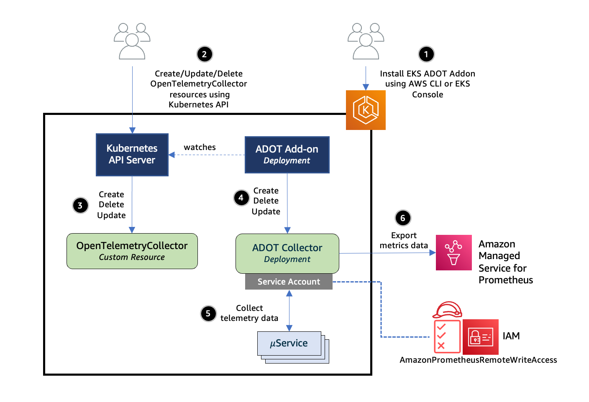
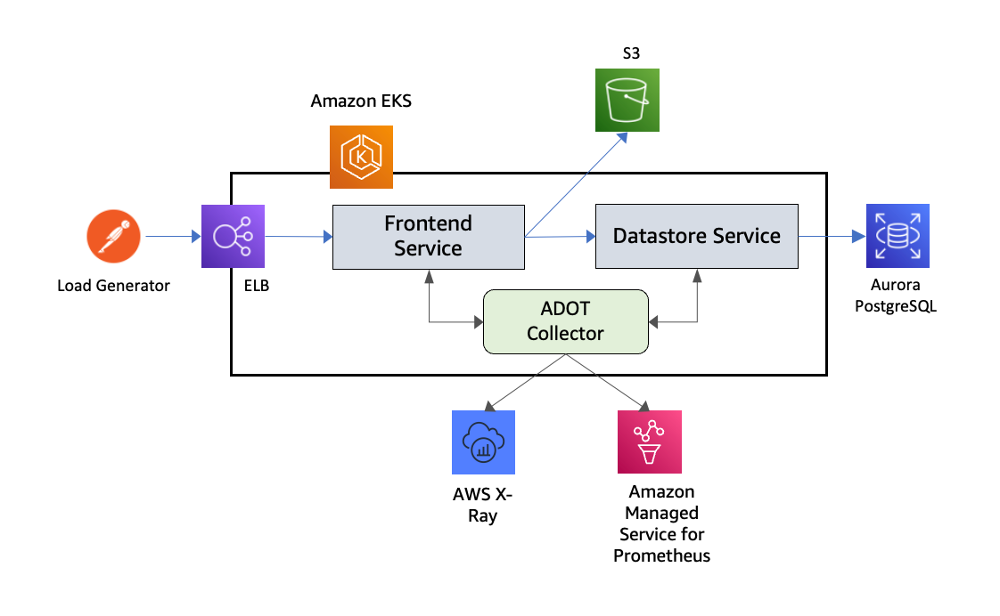
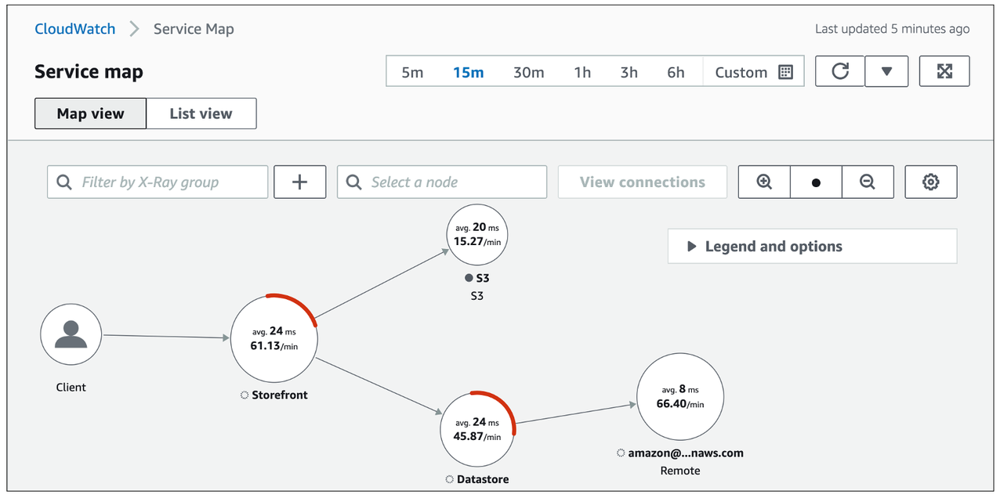

# AWS X-Ray के साथ कंटेनर ट्रेसिंग

ऑब्ज़र्वेबिलिटी बेस्ट प्रैक्टिसेज़ गाइड के इस सेक्शन में, हम AWS X-Ray के साथ Container Tracing से संबंधित निम्नलिखित विषयों पर गहराई से चर्चा करेंगे:

* AWS X-Ray का परिचय
* AWS Distro for OpenTelemetry के लिए Amazon EKS add-ons का उपयोग करके ट्रेस संग्रह
* निष्कर्ष

### परिचय

[AWS X-Ray](https://docs.aws.amazon.com/xray/latest/devguide/aws-xray.html) एक सेवा है जो आपके एप्लिकेशन द्वारा सर्व किए गए अनुरोधों के बारे में डेटा एकत्र करती है, और उस डेटा को देखने, फ़िल्टर करने और समस्याओं और अनुकूलन के अवसरों की पहचान करने के लिए अंतर्दृष्टि प्राप्त करने के लिए टूल्स प्रदान करती है। किसी भी ट्रेस किए गए अनुरोध के लिए, आप न केवल अनुरोध और प्रतिक्रिया के बारे में विस्तृत जानकारी देख सकते हैं, बल्कि आपका एप्लिकेशन downstream AWS रिसोर्सेज, माइक्रोसर्विसेज, डेटाबेस और वेब APIs को जो कॉल करता है उसके बारे में भी।

अपने एप्लिकेशन को इंस्ट्रूमेंट करने में आपके एप्लिकेशन के भीतर आने वाले और जाने वाले अनुरोधों और अन्य इवेंट्स के लिए ट्रेस डेटा भेजना शामिल है, साथ ही प्रत्येक अनुरोध के बारे में मेटाडेटा भी। कई इंस्ट्रूमेंटेशन परिदृश्यों में केवल कॉन्फ़िगरेशन परिवर्तन की आवश्यकता होती है। अधिक जानकारी के लिए [Instrumenting your application](https://docs.aws.amazon.com/xray/latest/devguide/xray-instrumenting-your-app.html) देखें।

हम AWS Distro for OpenTelemetry के लिए Amazon EKS add-ons का उपयोग करके अपने Amazon EKS क्लस्टर से ट्रेस एकत्र करके कंटेनरीकृत एप्लिकेशन ट्रेसिंग के बारे में जानेंगे।

### AWS Distro for OpenTelemetry के लिए Amazon EKS add-ons का उपयोग करके ट्रेस संग्रह

[AWS X-Ray](https://aws.amazon.com/xray/) एप्लिकेशन-ट्रेसिंग कार्यक्षमता प्रदान करता है, जो सभी तैनात माइक्रोसर्विसेज में गहन अंतर्दृष्टि देता है। X-Ray के साथ, प्रत्येक अनुरोध को ट्रेस किया जा सकता है क्योंकि यह शामिल माइक्रोसर्विसेज के माध्यम से प्रवाहित होता है।

[AWS Distro for OpenTelemetry (ADOT)](https://aws-otel.github.io/docs/introduction) OpenTelemetry प्रोजेक्ट का एक सुरक्षित, AWS-समर्थित वितरण है। Amazon EKS अब उपयोगकर्ताओं को क्लस्टर चालू होने के बाद किसी भी समय ADOT को add-on के रूप में सक्षम करने की अनुमति देता है।

ADOT add-on एक Kubernetes Operator का कार्यान्वयन है। Add-on OpenTelemetryCollector नामक एक कस्टम रिसोर्स के लिए वॉच करता है और कस्टम रिसोर्स में निर्दिष्ट कॉन्फ़िगरेशन सेटिंग्स के आधार पर ADOT Collector के जीवनचक्र का प्रबंधन करता है।

ADOT Collector में पाइपलाइन की अवधारणा है जिसमें तीन मुख्य प्रकार के कंपोनेंट शामिल हैं, अर्थात् receiver, processor, और exporter। एक [receiver](https://opentelemetry.io/docs/collector/configuration/#receivers) वह है जिसके माध्यम से डेटा collector में आता है। एक processor एक वैकल्पिक कंपोनेंट है। एक exporter यह निर्धारित करने के लिए उपयोग किया जाता है कि मेट्रिक्स, लॉग्स, या ट्रेस किस गंतव्य को भेजना है।

निम्नलिखित आरेख एक ट्रेस पाइपलाइन के साथ कॉन्फ़िगर किए गए ADOT Collector को दर्शाता है, जो टेलीमेट्री डेटा AWS X-Ray को भेजता है। ट्रेस पाइपलाइन में [AWS X-Ray Receiver](https://github.com/open-telemetry/opentelemetry-collector-contrib/tree/main/receiver/awsxrayreceiver) और [AWS X-Ray Exporter](https://github.com/open-telemetry/opentelemetry-collector-contrib/tree/main/exporter/awsxrayexporter) के इंस्टेंस शामिल हैं।


*चित्र: AWS Distro for OpenTelemetry के लिए Amazon EKS add-ons का उपयोग करके ट्रेस संग्रह।*

आइए EKS क्लस्टर में ADOT add-on इंस्टॉल करने और फिर वर्कलोड से टेलीमेट्री डेटा एकत्र करने के विवरण में जाएँ। ADOT add-on इंस्टॉल करने से पहले आवश्यक पूर्वापेक्षाओं की सूची:

* Kubernetes वर्शन 1.19 या उच्चतर का समर्थन करने वाला EKS क्लस्टर।
* [Certificate Manager](https://cert-manager.io/), यदि पहले से क्लस्टर में इंस्टॉल नहीं है।
* ADOT add-on इंस्टॉल करने के लिए विशेष रूप से EKS add-ons के लिए Kubernetes RBAC अनुमतियाँ।

आप निम्नलिखित कमांड का उपयोग करके EKS के विभिन्न वर्शन के लिए सक्षम add-ons की सूची देख सकते हैं:

`aws eks describe-addon-versions`

JSON आउटपुट में अन्य के बीच ADOT add-on सूचीबद्ध होना चाहिए:

```
{
   "addonName":"adot",
   "type":"observability",
   "addonVersions":[
      {
         "addonVersion":"v0.45.0-eksbuild.1",
         "architecture":[
            "amd64"
         ],
         "compatibilities":[
            {
               "clusterVersion":"1.22",
               "platformVersions":[
                  "*"
               ],
               "defaultVersion":true
            },
            {
               "clusterVersion":"1.21",
               "platformVersions":[
                  "*"
               ],
               "defaultVersion":true
            },
            {
               "clusterVersion":"1.20",
               "platformVersions":[
                  "*"
               ],
               "defaultVersion":true
            },
            {
               "clusterVersion":"1.19",
               "platformVersions":[
                  "*"
               ],
               "defaultVersion":true
            }
         ]
      }
   ]
}
```

अगला, आप निम्नलिखित कमांड के साथ ADOT add-on इंस्टॉल कर सकते हैं:

`aws eks create-addon --addon-name adot --addon-version v0.45.0-eksbuild.1 --cluster-name $CLUSTER_NAME `

एक सफल निष्पादन का आउटपुट इस प्रकार दिखता है:

```
{
    "addon": {
        "addonName": "adot",
        "clusterName": "k8s-production-cluster",
        "status": "ACTIVE",
        "addonVersion": "v0.45.0-eksbuild.1",
        "health": {
            "issues": []
        },
        "addonArn": "arn:aws:eks:us-east-1:123456789000:addon/k8s-production-cluster/adot/f0bff97c-0647-ef6f-eecf-0b2a13f7491b",
        "createdAt": "2022-04-04T10:36:56.966000+05:30",
        "modifiedAt": "2022-04-04T10:38:09.142000+05:30",
        "tags": {}
    }
}
```

अगले चरण पर जाने से पहले add-on के ACTIVE स्टेटस में होने तक प्रतीक्षा करें। Add-on की स्थिति निम्नलिखित कमांड से जाँची जा सकती है:

`aws eks describe-addon --addon-name adot --cluster-name $CLUSTER_NAME`

#### ADOT Collector की तैनाती

ADOT add-on एक Kubernetes Operator का कार्यान्वयन है। Add-on OpenTelemetryCollector नामक कस्टम रिसोर्स के लिए वॉच करता है और कस्टम रिसोर्स में निर्दिष्ट कॉन्फ़िगरेशन सेटिंग्स के आधार पर ADOT Collector के जीवनचक्र का प्रबंधन करता है।



*चित्र: ADOT Collector की तैनाती।*

[YAML कॉन्फ़िगरेशन फ़ाइल](https://github.com/aws-observability/aws-o11y-recipes/blob/main/sandbox/eks-addon-adot/otel-collector-xray-prometheus-complete.yaml) एक OpenTelemetryCollector कस्टम रिसोर्स परिभाषित करती है। EKS क्लस्टर पर तैनात किए जाने पर, यह ADOT add-on को एक ADOT Collector प्रोविज़न करने के लिए ट्रिगर करेगा।

ट्रेस पाइपलाइन में AWS X-Ray Receiver [X-Ray Segment format](https://docs.aws.amazon.com/xray/latest/devguide/xray-api-segmentdocuments.html) में segments या spans स्वीकार करता है। यह UDP port 2000 पर ट्रैफ़िक सुनने के लिए कॉन्फ़िगर किया गया है। Exporter [PutTraceSegments](https://docs.aws.amazon.com/xray/latest/api/API_PutTraceSegments.html) API का उपयोग करके इन segments को सीधे X-Ray को भेजता है।

ADOT Collector को `aws-otel-collector` नामक Kubernetes service account की पहचान के तहत लॉन्च किया जाना कॉन्फ़िगर किया गया है। Exporters को X-Ray को डेटा भेजने के लिए IAM अनुमतियों की आवश्यकता होती है। यह EKS द्वारा समर्थित [IAM roles for service accounts](https://docs.aws.amazon.com/eks/latest/userguide/iam-roles-for-service-accounts.html) सुविधा का उपयोग करके service account को IAM role से जोड़कर किया जाता है।

#### ट्रेस संग्रह का एंड-टू-एंड परीक्षण

आइए अब इसे एक साथ रखें और EKS क्लस्टर पर तैनात वर्कलोड से ट्रेस संग्रह का परीक्षण करें। निम्नलिखित चित्र इस परीक्षण के लिए नियोजित सेटअप दिखाता है।



*चित्र: ट्रेस संग्रह का एंड-टू-एंड परीक्षण।*

निम्नलिखित इमेज सेवाओं से कैप्चर किए गए segment डेटा का उपयोग करके X-Ray द्वारा जनरेट किया गया service graph दिखाती है।



*चित्र: CloudWatch Service Map कंसोल।*

कृपया ट्रेस पाइपलाइन कॉन्फ़िगरेशन से संबंधित OpenTelemetryCollector कस्टम रिसोर्स परिभाषाओं के लिए [Traces pipeline with OTLP Receiver and AWS X-Ray Exporter sending traces to AWS X-Ray](https://github.com/aws-observability/aws-otel-community/blob/master/sample-configs/operator/collector-config-xray.yaml) देखें।


### Container tracing सेटअप करने के लिए EKS Blueprints का उपयोग

[EKS Blueprints](https://aws.amazon.com/blogs/containers/bootstrapping-clusters-with-eks-blueprints/) Infrastructure as Code (IaC) मॉड्यूल का एक संग्रह है जो आपको accounts और regions में सुसंगत, बैटरी-शामिल EKS क्लस्टर कॉन्फ़िगर और तैनात करने में मदद करेगा। EKS Blueprints दो लोकप्रिय IaC frameworks, [HashiCorp Terraform](https://github.com/aws-ia/terraform-aws-eks-blueprints) और [AWS Cloud Development Kit (AWS CDK)](https://github.com/aws-quickstart/cdk-eks-blueprints) में लागू किया गया है।

अपनी Amazon EKS Cluster निर्माण प्रक्रिया के भाग के रूप में EKS Blueprints का उपयोग करते हुए, आप AWS X-Ray को Day 2 operational tooling के रूप में सेटअप कर सकते हैं।

## निष्कर्ष

ऑब्ज़र्वेबिलिटी बेस्ट प्रैक्टिसेज़ गाइड के इस सेक्शन में, हमने AWS Distro for OpenTelemetry के लिए Amazon EKS add-ons का उपयोग करके ट्रेस संग्रह द्वारा Amazon EKS पर अपने एप्लिकेशन के कंटेनर ट्रेसिंग के लिए AWS X-Ray के उपयोग के बारे में सीखा। अधिक जानकारी के लिए, कृपया [Metrics and traces collection using Amazon EKS add-ons for AWS Distro for OpenTelemetry to Amazon Managed Service for Prometheus and Amazon CloudWatch](https://aws.amazon.com/blogs/containers/metrics-and-traces-collection-using-amazon-eks-add-ons-for-aws-distro-for-opentelemetry/) देखें। अंत में हमने संक्षेप में बात की कि कैसे EKS Blueprints का उपयोग Amazon EKS क्लस्टर निर्माण प्रक्रिया के दौरान AWS X-Ray का उपयोग करके Container tracing सेटअप करने के लिए एक वाहन के रूप में किया जाए। गहन अध्ययन के लिए, हम AWS [One ऑब्ज़र्वेबिलिटी Workshop](https://catalog.workshops.aws/observability/en-US) की **AWS native** ऑब्ज़र्वेबिलिटी श्रेणी के तहत X-Ray Traces मॉड्यूल का अभ्यास करने की अत्यधिक अनुशंसा करते हैं।
