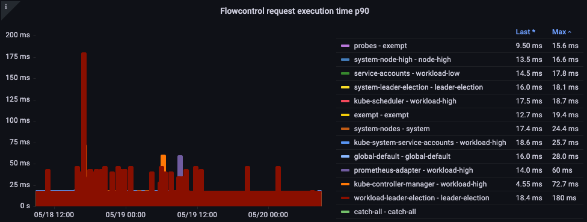

# Amazon EKS API Server मॉनिटरिंग

Observability सर्वोत्तम प्रथाओं गाइड के इस सेक्शन में, हम API Server Monitoring से संबंधित निम्नलिखित विषयों पर गहराई से चर्चा करेंगे:

* Amazon EKS API Server Monitoring का परिचय
* API Server Troubleshooter डैशबोर्ड सेटअप करना
* API Server समस्याओं को समझने के लिए API Troubleshooter डैशबोर्ड का उपयोग
* API Server को Unbounded list calls समझना
* API Server को खराब व्यवहार रोकना
* API Priority and Fairness
* सबसे धीमी API calls और API Server Latency समस्याओं की पहचान करना

### परिचय

अपने Amazon EKS managed control plane की मॉनिटरिंग आपके EKS क्लस्टर के स्वास्थ्य के साथ समस्याओं की सक्रिय रूप से पहचान करने के लिए एक बहुत महत्वपूर्ण Day 2 operational गतिविधि है। Amazon EKS Control plane मॉनिटरिंग एकत्रित मेट्रिक्स के आधार पर सक्रिय उपाय करने में मदद करती है।

हम इस सेक्शन में Amazon EKS API server मॉनिटरिंग के लिए Amazon Managed Service for Prometheus (AMP) और मेट्रिक्स के विज़ुअलाइज़ेशन के लिए Amazon Managed Grafana (AMG) का उपयोग करेंगे।

हम पहले Amazon Managed Service for Prometheus और Amazon Managed Grafana का उपयोग करके एक स्टार्टर डैशबोर्ड सेटअप करेंगे जो आपको [Amazon Elastic Kubernetes Service (Amazon EKS)](https://aws.amazon.com/eks) API Servers की troubleshooting में मदद करेगा।

### API Server Troubleshooter डैशबोर्ड सेटअप करना

हम [Amazon Elastic Kubernetes Service (Amazon EKS)](https://aws.amazon.com/eks) API Servers की troubleshooting में मदद करने के लिए AMP के साथ एक स्टार्टर डैशबोर्ड सेटअप करेंगे।

पहले, [अपने Amazon EKS क्लस्टर से Amazon Managed Service for Prometheus में मेट्रिक्स एकत्र करने के लिए ADOT collector सेटअप करें](https://aws.amazon.com/blogs/containers/metrics-and-traces-collection-using-amazon-eks-add-ons-for-aws-distro-for-opentelemetry/)।

अगला, AMP को डेटा सोर्स के रूप में उपयोग करते हुए [अपना Amazon Managed Grafana workspace सेटअप करें](https://aws.amazon.com/blogs/mt/amazon-managed-grafana-getting-started/)। अंत में [API troubleshooter dashboard](https://github.com/RiskyAdventure/Troubleshooting-Dashboards/blob/main/api-troubleshooter.json) डाउनलोड करें और मेट्रिक्स विज़ुअलाइज़ करने के लिए Amazon Managed Grafana में API troubleshooter dashboard json अपलोड करें।

### समस्याओं को समझने के लिए API Troubleshooter डैशबोर्ड का उपयोग

मान लें कि आपने एक दिलचस्प ओपन-सोर्स प्रोजेक्ट पाया जिसे आप अपने क्लस्टर में इंस्टॉल करना चाहते थे। वह operator आपके क्लस्टर में एक DaemonSet तैनात करता है जो शायद malformed requests, अनावश्यक रूप से उच्च मात्रा में LIST calls उपयोग कर रहा है, या शायद इसके प्रत्येक DaemonSets आपके सभी 1,000 nodes पर हर मिनट आपके क्लस्टर पर सभी 50,000 pods की स्थिति का अनुरोध कर रहे हैं!

#### LIST बनाम WATCH को समझना

कुछ एप्लिकेशन को आपके क्लस्टर में ऑब्जेक्ट्स की स्थिति समझने की आवश्यकता होती है। Kubernetes में, WATCH नामक कुछ के साथ ऐसा करने के अच्छे-व्यवहार वाले तरीके हैं, और कुछ अच्छे-व्यवहार-नहीं वाले तरीके हैं जो क्लस्टर पर हर ऑब्जेक्ट को सूचीबद्ध करते हैं।

#### एक अच्छा-व्यवहार WATCH

WATCH का उपयोग या push मॉडल के माध्यम से अपडेट प्राप्त करने के लिए एक एकल, दीर्घकालिक कनेक्शन Kubernetes में अपडेट करने का सबसे स्केलेबल तरीका है।

नीचे की इमेज में हम दोनों API servers में इन दीर्घकालिक कनेक्शनों की संख्या का अंदाज़ा लगाने के लिए `apiserver_longrunning_gauge` का उपयोग करते हैं।

*चित्र: `apiserver_longrunning_gauge` मेट्रिक*

*चित्र: 8 xlarge nodes के बीच WATCH calls।*

### API Server को Unbounded list calls समझना

LIST call के लिए, एक list call हर बार जब हमें किसी ऑब्जेक्ट की स्थिति समझने की आवश्यकता होती है तो हमारे Kubernetes ऑब्जेक्ट्स पर पूरा इतिहास खींच रहा है।

नीचे दिया गया request एक विशिष्ट namespace से pods माँग रहा है।

`/api/v1/namespaces/my-namespace/pods`

अगला, हम क्लस्टर पर सभी 50,000 pods का अनुरोध करते हैं, लेकिन एक समय में 500 pods के chunks में।

`/api/v1/pods?limit=500`

अगला call सबसे विघटनकारी है। पूरे क्लस्टर पर सभी 50,000 pods को एक साथ fetch करना।

`/api/v1/pods`

### API Server को खराब व्यवहार रोकना

हम अपने क्लस्टर को ऐसे खराब व्यवहार से कैसे बचा सकते हैं? Kubernetes 1.20 से पहले, API server प्रति सेकंड प्रोसेस किए जाने वाले *inflight* requests की संख्या को सीमित करके खुद की रक्षा करता था।

नीचे दिए गए चार्ट में हम read requests का विभाजन देखते हैं, जिसमें प्रति API server 400 inflight request का डिफ़ॉल्ट अधिकतम और 200 concurrent write requests का डिफ़ॉल्ट अधिकतम है।

*चित्र: read requests के विभाजन के साथ Grafana चार्ट।*

### API Priority and Fairness

प्रति सेकंड कितने read/write requests खुले थे इसकी चिंता करने के बजाय, क्या होगा अगर हम capacity को एक कुल संख्या के रूप में मानें, और क्लस्टर पर प्रत्येक एप्लिकेशन को उस कुल अधिकतम संख्या का एक उचित प्रतिशत या शेयर मिले?

इसे प्रभावी ढंग से करने के लिए, हमें यह पहचानना होगा कि API server को request किसने भेजा, फिर उस request को एक नाम टैग दें। इस अवधारणा से हमें इस खराब एजेंट को प्रतिबंधित करने और यह सुनिश्चित करने की क्षमता मिलती है कि यह पूरे क्लस्टर का उपभोग न करे।

#### Priority and fairness क्रियाशील

*चित्र: क्लस्टर पर Priority groups।*

#### Queue में request का समय

Priority queue में प्रोसेस किए जाने से पहले request कितने सेकंड बैठी रही।

*चित्र: Priority queue में request का समय।*

#### Flow द्वारा शीर्ष निष्पादित requests

कौन सा flow सबसे अधिक shares ले रहा है?

*चित्र: Flow द्वारा शीर्ष निष्पादित requests।*

#### Request Execution Time

क्या प्रोसेसिंग में कोई अप्रत्याशित देरी है?

*चित्र: Flow control request execution time।*

### सबसे धीमी API calls और API Server Latency समस्याओं की पहचान करना

अब जब हम API latency का कारण बनने वाली चीज़ों की प्रकृति को समझते हैं, तो हम एक कदम पीछे हटकर बड़ी तस्वीर देख सकते हैं।

उच्च-स्तरीय मेट्रिक्स के लिए कुछ विचार:

* कौन सी API call पूरी होने में सबसे अधिक समय ले रही है?
* क्या API server पर ही latency समस्या है?
* क्या यह सिर्फ ऐसा लग रहा है कि API server धीमा है क्योंकि etcd server latency अनुभव कर रहा है?

#### सबसे धीमी API call

*चित्र: शीर्ष 5 सबसे धीमी API calls।*

#### API Request Duration

*चित्र: API Request duration heatmap।*

*चित्र: Latency, cached requests।*

#### ETCD Request Duration

ETCD latency Kubernetes प्रदर्शन में सबसे महत्वपूर्ण कारकों में से एक है। Amazon EKS आपको `request_duration_seconds_bucket` मेट्रिक देखकर API server के दृष्टिकोण से यह प्रदर्शन देखने की अनुमति देता है।

*चित्र: `request_duration_seconds_bucket` मेट्रिक।*

*चित्र: Etcd Requests*

## निष्कर्ष

Observability सर्वोत्तम प्रथाओं गाइड के इस सेक्शन में, हमने Amazon Managed Service for Prometheus और Amazon Managed Grafana का उपयोग करके [Amazon Elastic Kubernetes Service (Amazon EKS)](https://aws.amazon.com/eks) API Servers की troubleshooting में मदद करने के लिए एक [स्टार्टर डैशबोर्ड](https://github.com/RiskyAdventure/Troubleshooting-Dashboards/blob/main/api-troubleshooter.json) का उपयोग किया। इसके अलावा, हमने EKS API Servers की troubleshooting करते समय समस्याओं को समझने, API priority and fairness, खराब व्यवहार रोकने के बारे में गहराई से जाना। अंत में सबसे धीमी API calls और API server latency समस्याओं की पहचान करने में गहराई से जाना जो हमें अपने Amazon EKS क्लस्टर की स्थिति को स्वस्थ रखने के लिए कार्रवाई करने में मदद करता है। गहन अध्ययन के लिए, हम AWS [One Observability Workshop](https://catalog.workshops.aws/observability/en-US) की AWS native Observability श्रेणी के तहत Application Monitoring मॉड्यूल का अभ्यास करने की अत्यधिक अनुशंसा करते हैं।
