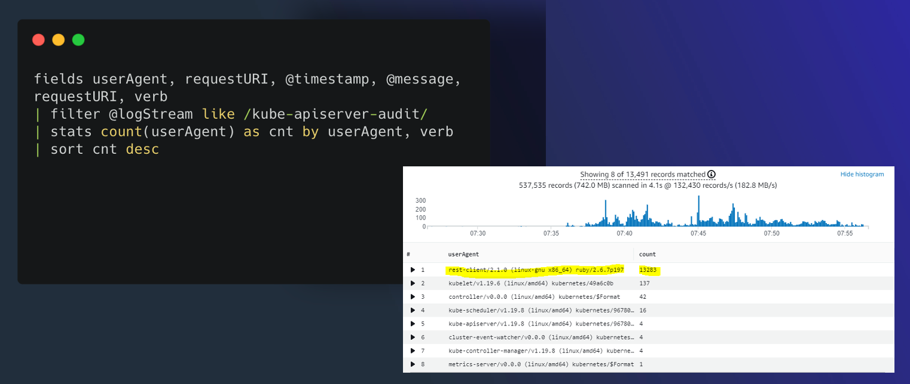
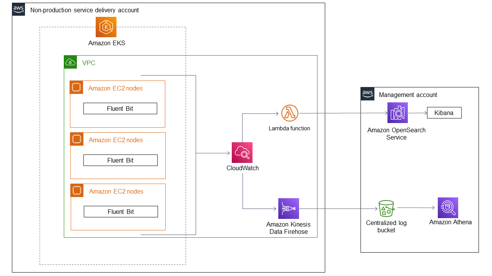
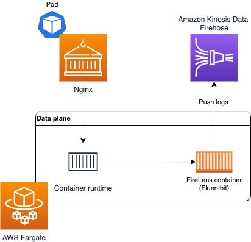

# लॉग एकीकरण

Observability सर्वोत्तम प्रथाओं गाइड के इस सेक्शन में, हम AWS Native सेवाओं के साथ Amazon EKS Logging से संबंधित निम्नलिखित विषयों पर गहराई से चर्चा करेंगे:

* AWS EKS logging का परिचय
* Amazon EKS control plane logging
* Amazon EKS data plane logging
* Amazon EKS application logging
* AWS Native सेवाओं का उपयोग करके Amazon EKS और अन्य कंप्यूट प्लेटफ़ॉर्म से एकीकृत लॉग एकीकरण
* निष्कर्ष

### परिचय

Amazon EKS logging को तीन प्रकारों में विभाजित किया जा सकता है जैसे control plane logging, node logging, और application logging। [Kubernetes control plane](https://kubernetes.io/docs/concepts/overview/components/#control-plane-components) कंपोनेंट्स का एक सेट है जो Kubernetes क्लस्टर का प्रबंधन करता है और ऑडिटिंग और नैदानिक उद्देश्यों के लिए उपयोग किए जाने वाले लॉग्स उत्पन्न करता है। Amazon EKS के साथ, आप [विभिन्न control plane कंपोनेंट्स के लिए लॉग्स चालू](https://docs.aws.amazon.com/eks/latest/userguide/control-plane-logs.html) कर सकते हैं और उन्हें CloudWatch को भेज सकते हैं।

Kubernetes प्रत्येक Kubernetes node पर `kubelet` और `kube-proxy` जैसे सिस्टम कंपोनेंट्स भी चलाता है। ये कंपोनेंट्स प्रत्येक node के भीतर लॉग्स लिखते हैं और आप प्रत्येक Amazon EKS node के लिए इन लॉग्स को कैप्चर करने के लिए CloudWatch और Container Insights को कॉन्फ़िगर कर सकते हैं।

कंटेनर Kubernetes क्लस्टर के भीतर [pods](https://kubernetes.io/docs/concepts/workloads/pods/) के रूप में समूहीकृत होते हैं। Kubernetes में, कंटेनर लॉग्स एक node पर `/var/log/pods` डायरेक्टरी में पाए जाते हैं।

Kubernetes में केंद्रीकृत लॉग एकीकरण सिस्टम में कंटेनर लॉग्स शिपिंग के लिए तीन सामान्य दृष्टिकोण हैं:

* Node लेवल एजेंट, जैसे [Fluentd daemonset](https://docs.aws.amazon.com/AmazonCloudWatch/latest/monitoring/Container-Insights-setup-logs.html)। यह अनुशंसित पैटर्न है।
* Sidecar कंटेनर, जैसे Fluentd sidecar कंटेनर।
* सीधे लॉग संग्रह सिस्टम को लिखना। यह सबसे कम अनुशंसित विकल्प है।

अब हम Amazon EKS logging की प्रत्येक logging श्रेणी में गहराई से जाएँगे।

### Amazon EKS control plane logging

एक Amazon EKS क्लस्टर आपके Kubernetes क्लस्टर के लिए एक उच्च-उपलब्धता, एकल-किरायेदार control plane और आपके कंटेनरों को चलाने वाले Amazon EKS nodes से मिलकर बनता है। [Amazon EKS control plane logging](https://docs.aws.amazon.com/eks/latest/userguide/control-plane-logs.html) में निम्नलिखित क्लस्टर control plane लॉग प्रकार शामिल हैं:

* **API server (`api`)** - आपके क्लस्टर का API server control plane कंपोनेंट है जो Kubernetes API एक्सपोज करता है।
* **Audit (`audit`)** - Kubernetes audit logs व्यक्तिगत उपयोगकर्ताओं, प्रशासकों, या सिस्टम कंपोनेंट्स का रिकॉर्ड प्रदान करते हैं जिन्होंने आपके क्लस्टर को प्रभावित किया है।
* **Authenticator (`authenticator`)** - Authenticator logs Amazon EKS के लिए अद्वितीय हैं। ये logs control plane कंपोनेंट का प्रतिनिधित्व करते हैं जो Amazon EKS IAM credentials का उपयोग करके Kubernetes [Role Based Access Control](https://kubernetes.io/docs/reference/access-authn-authz/rbac/) (RBAC) प्रमाणीकरण के लिए उपयोग करता है।
* **Controller manager (`controllerManager`)** - Controller manager Kubernetes के साथ शिप किए गए कोर control loops का प्रबंधन करता है।
* **Scheduler (`scheduler`)** - Scheduler कंपोनेंट प्रबंधित करता है कि आपके क्लस्टर में pods कब और कहाँ चलाना है।

#### CloudWatch कंसोल से control plane logs क्वेरी करना

आपके Amazon EKS क्लस्टर पर control plane logging सक्षम करने के बाद, आप EKS control plane logs `/aws/eks/cluster-name/cluster` लॉग ग्रुप में पा सकते हैं। आप EKS control plane लॉग डेटा खोजने के लिए CloudWatch Logs Insights का उपयोग कर सकते हैं।



*चित्र: CloudWatch Logs Insights।*

#### सामान्य EKS उपयोग मामलों के लिए नमूना queries

क्लस्टर निर्माता खोजने के लिए, **kubernetes-admin** उपयोगकर्ता से मैप की गई IAM entity खोजें।

```
fields @logStream, @timestamp, @message| sort @timestamp desc
| filter @logStream like /authenticator/
| filter @message like "username=kubernetes-admin"
| limit 50
```

उदाहरण आउटपुट:

```

@logStream, @timestamp @messageauthenticator-71976 ca11bea5d3083393f7d32dab75b,2021-08-11-10:09:49.020,"time=""2021-08-11T10:09:43Z"" level=info msg=""access granted"" arn=""arn:aws:iam::12345678910:user/awscli"" client=""127.0.0.1:51326"" groups=""[system:masters]"" method=POST path=/authenticate sts=sts.eu-west-1.amazonaws.com uid=""heptio-authenticator-aws:12345678910:ABCDEFGHIJKLMNOP"" username=kubernetes-admin"
```

किसी विशिष्ट उपयोगकर्ता द्वारा किए गए अनुरोध खोजने के लिए:

```

fields @logStream, @timestamp, @message| filter @logStream like /^kube-apiserver-audit/
| filter strcontains(user.username,"kubernetes-admin")
| sort @timestamp desc
| limit 50
```

किसी विशिष्ट userAgent द्वारा किए गए API कॉल खोजने के लिए:

```

fields @logStream, @timestamp, userAgent, verb, requestURI, @message| filter @logStream like /kube-apiserver-audit/
| filter userAgent like /kubectl\/v1.22.0/
| sort @timestamp desc
| filter verb like /(get)/
```

**aws-auth** ConfigMap में किए गए mutating परिवर्तन खोजने के लिए:

```

fields @logStream, @timestamp, @message| filter @logStream like /^kube-apiserver-audit/
| filter requestURI like /\/api\/v1\/namespaces\/kube-system\/configmaps/
| filter objectRef.name = "aws-auth"
| filter verb like /(create|delete|patch)/
| sort @timestamp desc
| limit 50
```

अस्वीकृत अनुरोध खोजने के लिए:

```

fields @logStream, @timestamp, @message| filter @logStream like /^authenticator/
| filter @message like "denied"
| sort @timestamp desc
| limit 50
```

HTTP 5xx सर्वर errors खोजने के लिए:

```

fields @logStream, @timestamp, responseStatus.code, @message| filter @logStream like /^kube-apiserver-audit/
| filter responseStatus.code >= 500
| limit 50
```

अंत में, यदि आपने control plane logging सुविधा का उपयोग शुरू किया है, तो हम [Understanding and Cost Optimizing Amazon EKS Control Plane Logs](https://aws.amazon.com/blogs/containers/understanding-and-cost-optimizing-amazon-eks-control-plane-logs/) के बारे में अधिक जानने की अत्यधिक अनुशंसा करेंगे।

### Amazon EKS data plane logging

हम Amazon EKS के लिए लॉग्स और मेट्रिक्स कैप्चर करने के लिए [CloudWatch Container Insights](https://docs.aws.amazon.com/AmazonCloudWatch/latest/monitoring/Container-Insights-setup-logs.html) का उपयोग करने की अनुशंसा करते हैं। [Container Insights](https://docs.aws.amazon.com/AmazonCloudWatch/latest/monitoring/ContainerInsights.html) CloudWatch agent के साथ क्लस्टर, node, और pod-level मेट्रिक्स और CloudWatch में लॉग कैप्चर के लिए [Fluent Bit](https://fluentbit.io/) या [Fluentd](https://www.fluentd.org/) लागू करता है।

निम्नलिखित तालिका Amazon EKS के लिए [डिफ़ॉल्ट Fluentd या Fluent Bit लॉग कैप्चर कॉन्फ़िगरेशन](https://docs.aws.amazon.com/AmazonCloudWatch/latest/monitoring/Container-Insights-setup-logs-FluentBit.html) द्वारा कैप्चर किए गए CloudWatch लॉग ग्रुप और लॉग्स दिखाती है।

|`/aws/containerinsights/Cluster_Name/host`	|`/var/log/dmesg`, `/var/log/secure`, और `/var/log/messages` से लॉग्स।	|
|---	|---	|
|`/aws/containerinsights/Cluster_Name/dataplane`	|`kubelet.service`, `kubeproxy.service`, और `docker.service` के लिए `/var/log/journal` में लॉग्स।	|

कृपया data plane logging के बारे में अधिक जानने के लिए [Amazon EKS node logging prescriptive guidance](https://docs.aws.amazon.com/prescriptive-guidance/latest/implementing-logging-monitoring-cloudwatch/kubernetes-eks-logging.html) का संदर्भ लें।

### Amazon EKS application logging

Kubernetes वातावरण में बड़े पैमाने पर एप्लिकेशन चलाते समय Amazon EKS application logging अपरिहार्य हो जाती है। एप्लिकेशन लॉग्स एकत्र करने के लिए आपको अपने Amazon EKS क्लस्टर में [Fluent Bit](https://fluentbit.io/), [Fluentd](https://www.fluentd.org/), या [CloudWatch Container Insights](https://docs.aws.amazon.com/AmazonCloudWatch/latest/monitoring/ContainerInsights.html) जैसा लॉग aggregator इंस्टॉल करना होगा।

हम CloudWatch को एप्लिकेशन और क्लस्टर लॉग्स भेजने के लिए लॉग collector और forwarder के रूप में Fluent Bit का उपयोग करने की अनुशंसा करते हैं। फिर आप CloudWatch में subscription filter का उपयोग करके लॉग्स को Amazon OpenSearch Service में स्ट्रीम कर सकते हैं।



*चित्र: Amazon EKS application logging आर्किटेक्चर।*

#### Amazon EKS on Fargate के लिए Logging

Amazon EKS on Fargate के साथ, आप अपने Kubernetes nodes आवंटित या प्रबंधित किए बिना pods तैनात कर सकते हैं। अपने Fargate pods से लॉग्स कैप्चर करने के लिए, आप लॉग्स को सीधे CloudWatch में फ़ॉरवर्ड करने के लिए Fluent Bit का उपयोग कर सकते हैं।



*चित्र: Amazon EKS on Fargate के लिए Logging।*

कृपया Amazon EKS के लिए Fluent Bit समर्थन के बारे में अधिक जानने के लिए [Fargate logging](https://docs.aws.amazon.com/eks/latest/userguide/fargate-logging.html) देखें।

### AWS Native सेवाओं का उपयोग करके Amazon EKS और अन्य कंप्यूट प्लेटफ़ॉर्म से एकीकृत लॉग एकीकरण

ग्राहक आजकल [Amazon Elastic Kubernetes Service](https://aws.amazon.com/eks/) (Amazon EKS), [Amazon Elastic Compute Cloud](https://aws.amazon.com/ec2/) (Amazon EC2), [Amazon Elastic Container Service](https://aws.amazon.com/ecs/) (Amazon ECS), [Amazon Kinesis Data Firehose](https://aws.amazon.com/kinesis/data-firehose/), और [AWS Lambda](https://aws.amazon.com/lambda/) जैसे विभिन्न कंप्यूटिंग प्लेटफ़ॉर्म में एजेंट्स, लॉग राउटर और extensions का उपयोग करके लॉग्स को एकीकृत और केंद्रीकृत करना चाहते हैं।

एकीकृत एकीकृत लॉग सिस्टम निम्नलिखित लाभ प्रदान करता है:

* विभिन्न कंप्यूटिंग प्लेटफ़ॉर्म में सभी लॉग्स तक पहुँच का एकल बिंदु
* लॉग्स के ट्रांसफॉर्मेशन को परिभाषित और मानकीकृत करने में सहायता
* Amazon OpenSearch Service का उपयोग करके लॉग्स को तेज़ी से इंडेक्स और खोजने और विज़ुअलाइज़ करने की क्षमता


*चित्र: विभिन्न कंप्यूट प्लेटफ़ॉर्म में लॉग एकीकरण।*

आर्किटेक्चर कई कंप्यूट प्लेटफ़ॉर्म से लॉग्स एकत्र करने और उन्हें Kinesis Data Firehose को डिलीवर करने के लिए विभिन्न लॉग एकीकरण टूल्स जैसे लॉग एजेंट्स, लॉग राउटर और Lambda extensions का उपयोग करता है। Kinesis Data Firehose लॉग्स को Amazon OpenSearch Service में स्ट्रीम करता है।

अधिक जानकारी के लिए [how to unify and centralize logs across different compute platforms](https://aws.amazon.com/blogs/big-data/unify-log-aggregation-and-analytics-across-compute-platforms/) देखें।

## निष्कर्ष

Observability सर्वोत्तम प्रथाओं गाइड के इस सेक्शन में, हमने Kubernetes logging के तीन प्रकारों जैसे control plane logging, node logging, और application logging में गहराई से जाना। इसके अलावा हमने AWS Native सेवाओं जैसे Kinesis Data Firehose और Amazon OpenSearch Service का उपयोग करके Amazon EKS और अन्य कंप्यूट प्लेटफ़ॉर्म से एकीकृत लॉग एकीकरण के बारे में सीखा। अधिक गहन अध्ययन के लिए, हम AWS [One Observability Workshop](https://catalog.workshops.aws/observability/en-US) की AWS native Observability श्रेणी के तहत Logs और Insights मॉड्यूल का अभ्यास करने की अत्यधिक अनुशंसा करते हैं।
