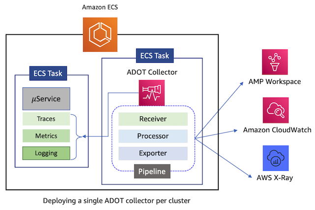

# AWS Distro for OpenTelemetry का उपयोग करके ECS क्लस्टर में सिस्टम मेट्रिक्स एकत्र करना

[AWS Distro for OpenTelemetry](https://aws-otel.github.io/docs/introduction) (ADOT) [OpenTelemetry](https://opentelemetry.io/) प्रोजेक्ट का एक सुरक्षित, AWS-समर्थित वितरण है। ADOT का उपयोग करके, आप कई स्रोतों से टेलीमेट्री डेटा एकत्र कर सकते हैं और सहसंबद्ध मेट्रिक्स, ट्रेस और लॉग्स को कई मॉनिटरिंग समाधानों को भेज सकते हैं। ADOT को Amazon ECS क्लस्टर पर दो अलग-अलग पैटर्न में तैनात किया जा सकता है।

## ADOT Collector के लिए डिप्लॉयमेंट पैटर्न
1. साइडकार पैटर्न में, ADOT collector क्लस्टर में प्रत्येक टास्क के अंदर चलता है और केवल उस टास्क के भीतर एप्लिकेशन कंटेनरों से एकत्रित टेलीमेट्री डेटा को प्रोसेस करता है। यह डिप्लॉयमेंट पैटर्न केवल तब आवश्यक है जब आपको collector को Amazon ECS [Task Metadata Endpoint](https://docs.aws.amazon.com/AmazonECS/latest/developerguide/task-metadata-endpoint.html) से टास्क मेटाडेटा पढ़ने और उनसे रिसोर्स उपयोग मेट्रिक्स (जैसे CPU, मेमोरी, नेटवर्क और डिस्क) जनरेट करने की आवश्यकता होती है।


2. सेंट्रल collector पैटर्न में, ADOT collector का एक एकल इंस्टेंस क्लस्टर पर तैनात किया जाता है और यह क्लस्टर पर चल रहे सभी टास्क से टेलीमेट्री डेटा को प्रोसेस करता है। यह सबसे अधिक उपयोग किया जाने वाला डिप्लॉयमेंट पैटर्न है। Collector को REPLICA या DAEMON सर्विस शेड्यूलर स्ट्रैटेजी का उपयोग करके तैनात किया जाता है।


ADOT collector आर्किटेक्चर में पाइपलाइन की अवधारणा है। एक एकल collector में एक से अधिक पाइपलाइन हो सकती हैं। प्रत्येक पाइपलाइन तीन प्रकार के टेलीमेट्री डेटा में से एक को प्रोसेस करने के लिए समर्पित है, अर्थात् मेट्रिक्स, ट्रेस और लॉग्स। आप प्रत्येक प्रकार के टेलीमेट्री डेटा के लिए कई पाइपलाइन कॉन्फ़िगर कर सकते हैं। यह बहुमुखी आर्किटेक्चर एक एकल collector को कई observability एजेंट्स की भूमिका निभाने की अनुमति देता है जिन्हें अन्यथा क्लस्टर पर तैनात करना पड़ता। यह क्लस्टर पर observability एजेंट्स के डिप्लॉयमेंट फुटप्रिंट को काफी कम करता है। एक collector के प्राथमिक कंपोनेंट जो एक पाइपलाइन बनाते हैं, उन्हें तीन श्रेणियों में समूहीकृत किया गया है, अर्थात् Receiver, Processor, और Exporter। Extensions नामक द्वितीयक कंपोनेंट हैं जो collector में जोड़ी जा सकने वाली क्षमताएं प्रदान करते हैं, लेकिन जो पाइपलाइन का हिस्सा नहीं हैं।

:::info
    Receivers, Processors, Exporters और Extensions की विस्तृत व्याख्या के लिए OpenTelemetry [डॉक्यूमेंटेशन](https://opentelemetry.io/docs/collector/configuration/#basics) देखें।
:::

## ECS टास्क मेट्रिक्स संग्रह के लिए ADOT Collector की तैनाती

ECS टास्क स्तर पर रिसोर्स उपयोग मेट्रिक्स एकत्र करने के लिए, ADOT collector को नीचे दिखाई गई टास्क डेफिनिशन का उपयोग करके साइडकार पैटर्न में तैनात किया जाना चाहिए। Collector के लिए उपयोग की जाने वाली कंटेनर इमेज कई पाइपलाइन कॉन्फ़िगरेशन के साथ बंडल है। आप अपनी आवश्यकताओं के आधार पर उनमें से एक चुन सकते हैं और कंटेनर डेफिनिशन के *command* सेक्शन में कॉन्फ़िगरेशन फ़ाइल पथ निर्दिष्ट कर सकते हैं। इस मान को `--config=/etc/ecs/container-insights/otel-task-metrics-config.yaml` पर सेट करने से एक [पाइपलाइन कॉन्फ़िगरेशन](https://github.com/aws-observability/aws-otel-collector/blob/main/config/ecs/container-insights/otel-task-metrics-config.yaml) का उपयोग होगा जो collector के समान टास्क में चल रहे अन्य कंटेनरों से रिसोर्स उपयोग मेट्रिक्स और ट्रेस एकत्र करता है और उन्हें Amazon CloudWatch और AWS X-Ray को भेजता है। विशेष रूप से, collector एक [AWS ECS Container Metrics Receiver](https://github.com/open-telemetry/opentelemetry-collector-contrib/tree/main/receiver/awsecscontainermetricsreceiver) का उपयोग करता है जो [Amazon ECS Task Metadata Endpoint](https://docs.aws.amazon.com/AmazonECS/latest/developerguide/task-metadata-endpoint-v4.html) से टास्क मेटाडेटा और docker stats पढ़ता है, और उनसे रिसोर्स उपयोग मेट्रिक्स (जैसे CPU, मेमोरी, नेटवर्क और डिस्क) जनरेट करता है।

```javascript
{
    "family":"AdotTask",
    "taskRoleArn":"arn:aws:iam::123456789012:role/ECS-ADOT-Task-Role",
    "executionRoleArn":"arn:aws:iam::123456789012:role/ECS-Task-Execution-Role",
    "networkMode":"awsvpc",
    "containerDefinitions":[
       {
          "name":"application-container",
          "image":"..."
       },
       {
          "name":"aws-otel-collector",
          "image":"public.ecr.aws/aws-observability/aws-otel-collector:latest",
          "cpu":512,
          "memory":1024,
          "command": [
            "--config=/etc/ecs/container-insights/otel-task-metrics-config.yaml"
          ],          
          "portMappings":[
             {
                "containerPort":2000,
                "protocol":"udp"
             }
          ],             
          "essential":true
       }
    ],
    "requiresCompatibilities":[
       "EC2"
    ],
    "cpu":"1024",
    "memory":"2048"
 }
```
:::info
    Amazon ECS क्लस्टर पर तैनात किए जाने पर ADOT collector द्वारा उपयोग किए जाने वाले IAM टास्क रोल और टास्क एक्जीक्यूशन रोल को सेट करने के विवरण के लिए [डॉक्यूमेंटेशन](https://docs.aws.amazon.com/AmazonCloudWatch/latest/monitoring/deploy-container-insights-ECS-adot.html) देखें।
:::

:::info
    [AWS ECS Container Metrics Receiver](https://github.com/open-telemetry/opentelemetry-collector-contrib/tree/main/receiver/awsecscontainermetricsreceiver) केवल ECS Task Metadata Endpoint V4 के लिए काम करता है। प्लेटफ़ॉर्म वर्शन 1.4.0 या बाद का उपयोग करने वाले Fargate पर Amazon ECS टास्क और Amazon ECS container agent के कम से कम वर्शन 1.39.0 चलाने वाले Amazon EC2 पर Amazon ECS टास्क इस receiver का उपयोग कर सकते हैं। अधिक जानकारी के लिए, [Amazon ECS Container Agent Versions](https://docs.aws.amazon.com/AmazonECS/latest/developerguide/ecs-agent-versions.html) देखें।
:::

जैसा कि डिफ़ॉल्ट [पाइपलाइन कॉन्फ़िगरेशन](https://github.com/aws-observability/aws-otel-collector/blob/main/config/ecs/container-insights/otel-task-metrics-config.yaml) में दिखाया गया है, collector की पाइपलाइन पहले [Filter Processor](https://github.com/open-telemetry/opentelemetry-collector-contrib/tree/main/processor/filterprocessor) का उपयोग करती है जो CPU, मेमोरी, नेटवर्क और डिस्क उपयोग से संबंधित मेट्रिक्स के एक [सबसेट](https://github.com/aws-observability/aws-otel-collector/blob/09d59966404c2928aaaf6920f27967a84d898254/config/ecs/container-insights/otel-task-metrics-config.yaml#L25) को फ़िल्टर करती है। फिर यह [Metrics Transform Processor](https://github.com/open-telemetry/opentelemetry-collector-contrib/tree/main/processor/metricstransformprocessor) का उपयोग करती है जो इन मेट्रिक्स के नाम बदलने और उनके एट्रिब्यूट्स अपडेट करने के लिए [ट्रांसफॉर्मेशन](https://github.com/aws-observability/aws-otel-collector/blob/09d59966404c2928aaaf6920f27967a84d898254/config/ecs/container-insights/otel-task-metrics-config.yaml#L39) का एक सेट करती है। अंत में, मेट्रिक्स को [Amazon CloudWatch EMF Exporter](https://github.com/open-telemetry/opentelemetry-collector-contrib/tree/main/exporter/awsemfexporter) का उपयोग करके CloudWatch में परफॉर्मेंस लॉग इवेंट्स के रूप में भेजा जाता है। इस डिफ़ॉल्ट कॉन्फ़िगरेशन का उपयोग करने से CloudWatch namespace *ECS/ContainerInsights* के तहत निम्नलिखित रिसोर्स उपयोग मेट्रिक्स का संग्रह होगा।

- MemoryUtilized
- MemoryReserved
- CpuUtilized
- CpuReserved
- NetworkRxBytes
- NetworkTxBytes
- StorageReadBytes
- StorageWriteBytes

:::info
    ध्यान दें कि ये वही [मेट्रिक्स हैं जो Container Insights for Amazon ECS द्वारा एकत्र की जाती हैं](https://docs.aws.amazon.com/AmazonCloudWatch/latest/monitoring/Container-Insights-metrics-ECS.html) और जब आप क्लस्टर या अकाउंट स्तर पर Container Insights सक्षम करते हैं तो CloudWatch में आसानी से उपलब्ध हो जाती हैं। इसलिए, CloudWatch में ECS रिसोर्स उपयोग मेट्रिक्स एकत्र करने के लिए Container Insights को सक्षम करना अनुशंसित दृष्टिकोण है।
:::

AWS ECS Container Metrics Receiver 52 अद्वितीय मेट्रिक्स उत्सर्जित करता है जो यह Amazon ECS Task Metadata Endpoint से पढ़ता है। Receiver द्वारा एकत्रित मेट्रिक्स की पूरी सूची [यहाँ प्रलेखित है](https://github.com/open-telemetry/opentelemetry-collector-contrib/tree/main/receiver/awsecscontainermetricsreceiver#available-metrics)। आप उन सभी को अपने पसंदीदा गंतव्य पर नहीं भेजना चाह सकते हैं। यदि आप ECS रिसोर्स उपयोग मेट्रिक्स पर अधिक स्पष्ट नियंत्रण चाहते हैं, तो आप एक कस्टम पाइपलाइन कॉन्फ़िगरेशन बना सकते हैं, अपनी पसंद के processors/transformers के साथ उपलब्ध मेट्रिक्स को फ़िल्टर और ट्रांसफॉर्म कर सकते हैं और अपनी पसंद के exporters के आधार पर गंतव्य पर भेज सकते हैं। ECS टास्क स्तर मेट्रिक्स कैप्चर करने के लिए पाइपलाइन कॉन्फ़िगरेशन के [अतिरिक्त उदाहरणों](https://github.com/open-telemetry/opentelemetry-collector-contrib/tree/main/receiver/awsecscontainermetricsreceiver#full-configuration-examples) के लिए डॉक्यूमेंटेशन देखें।

यदि आप एक कस्टम पाइपलाइन कॉन्फ़िगरेशन का उपयोग करना चाहते हैं, तो आप नीचे दिखाई गई टास्क डेफिनिशन का उपयोग कर सकते हैं और collector को साइडकार पैटर्न में तैनात कर सकते हैं। यहाँ, collector पाइपलाइन का कॉन्फ़िगरेशन AWS SSM Parameter Store में *otel-collector-config* नामक पैरामीटर से लोड किया जाता है।

:::note
    SSM Parameter Store पैरामीटर नाम को AOT_CONFIG_CONTENT नामक एनवायरनमेंट वेरिएबल का उपयोग करके collector को एक्सपोज़ किया जाना चाहिए।
:::

```javascript
{
    "family":"AdotTask",
    "taskRoleArn":"arn:aws:iam::123456789012:role/ECS-ADOT-Task-Role",
    "executionRoleArn":"arn:aws:iam::123456789012:role/ECS-Task-Execution-Role",
    "networkMode":"awsvpc",
    "containerDefinitions":[
       {
          "name":"application-container",
          "image":"..."
       },        
       {
          "name":"aws-otel-collector",
          "image":"public.ecr.aws/aws-observability/aws-otel-collector:latest",
          "cpu":512,
          "memory":1024,
          "secrets":[
             {
                "name":"AOT_CONFIG_CONTENT",
                "valueFrom":"arn:aws:ssm:us-east-1:123456789012:parameter/otel-collector-config"
             }
          ],          
          "portMappings":[
             {
                "containerPort":2000,
                "protocol":"udp"
             }
          ],             
          "essential":true
       }
    ],
    "requiresCompatibilities":[
       "EC2"
    ],
    "cpu":"1024",
    "memory":"2048"
 }
```

## ECS कंटेनर इंस्टेंस मेट्रिक्स संग्रह के लिए ADOT Collector की तैनाती

अपने ECS क्लस्टर से EC2 इंस्टेंस-स्तरीय मेट्रिक्स एकत्र करने के लिए, ADOT collector को नीचे दिखाई गई टास्क डेफिनिशन का उपयोग करके तैनात किया जा सकता है। इसे daemon सर्विस शेड्यूलर स्ट्रैटेजी के साथ तैनात किया जाना चाहिए। आप कंटेनर इमेज में बंडल किया गया पाइपलाइन कॉन्फ़िगरेशन चुन सकते हैं। कंटेनर डेफिनिशन के *command* सेक्शन में कॉन्फ़िगरेशन फ़ाइल पथ `--config=/etc/ecs/otel-instance-metrics-config.yaml` पर सेट किया जाना चाहिए। Collector [AWS Container Insights Receiver](https://github.com/open-telemetry/opentelemetry-collector-contrib/tree/main/receiver/awscontainerinsightreceiver#aws-container-insights-receiver) का उपयोग करता है जो CPU, मेमोरी, डिस्क और नेटवर्क जैसे कई रिसोर्सेज के लिए EC2 इंस्टेंस-स्तरीय इंफ्रास्ट्रक्चर मेट्रिक्स एकत्र करता है। मेट्रिक्स [Amazon CloudWatch EMF Exporter](https://github.com/open-telemetry/opentelemetry-collector-contrib/tree/main/exporter/awsemfexporter) का उपयोग करके CloudWatch में परफॉर्मेंस लॉग इवेंट्स के रूप में भेजे जाते हैं। इस कॉन्फ़िगरेशन के साथ collector की कार्यक्षमता EC2 पर होस्ट किए गए Amazon ECS क्लस्टर पर CloudWatch agent की तैनाती के समतुल्य है।

:::info
    EC2 इंस्टेंस-स्तरीय मेट्रिक्स एकत्र करने के लिए ADOT Collector डिप्लॉयमेंट AWS Fargate पर चलने वाले ECS क्लस्टर पर समर्थित नहीं है।
:::

```javascript
{
    "family":"AdotTask",
    "taskRoleArn":"arn:aws:iam::123456789012:role/ECS-ADOT-Task-Role",
    "executionRoleArn":"arn:aws:iam::123456789012:role/ECS-Task-Execution-Role",
    "networkMode":"awsvpc",
    "containerDefinitions":[
       {
          "name":"application-container",
          "image":"..."
       },
       {
          "name":"aws-otel-collector",
          "image":"public.ecr.aws/aws-observability/aws-otel-collector:latest",
          "cpu":512,
          "memory":1024,
          "command": [
            "--config=/etc/ecs/otel-instance-metrics-config.yaml"
          ],          
          "portMappings":[
             {
                "containerPort":2000,
                "protocol":"udp"
             }
          ],             
          "essential":true
       }
    ],
    "requiresCompatibilities":[
       "EC2"
    ],
    "cpu":"1024",
    "memory":"2048"
 }
```
