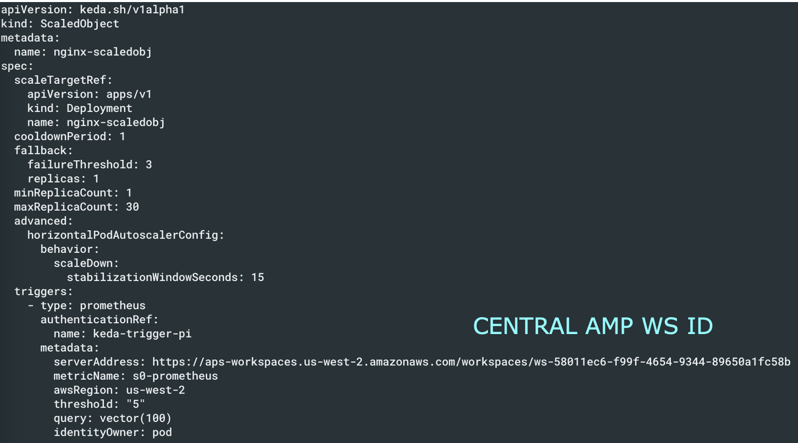

# AMP और EKS पर KEDA का उपयोग करके एप्लिकेशन ऑटोस्केलिंग

# वर्तमान परिदृश्य

Amazon EKS एप्लिकेशन पर बढ़े हुए ट्रैफ़िक को संभालना चुनौतीपूर्ण है, जहाँ मैनुअल स्केलिंग अकुशल और त्रुटि-प्रवण है। ऑटोस्केलिंग रिसोर्स आवंटन के लिए एक बेहतर समाधान प्रदान करता है। KEDA विभिन्न मेट्रिक्स और इवेंट्स के आधार पर Kubernetes ऑटोस्केलिंग सक्षम करता है, जबकि Amazon Managed Service for Prometheus EKS क्लस्टर के लिए सुरक्षित मेट्रिक मॉनिटरिंग प्रदान करता है। यह समाधान KEDA को Amazon Managed Service for Prometheus के साथ जोड़ता है, जो Requests Per Second (RPS) मेट्रिक्स के आधार पर ऑटोस्केलिंग प्रदर्शित करता है। यह दृष्टिकोण वर्कलोड की माँगों के अनुरूप स्वचालित स्केलिंग प्रदान करता है, जिसे उपयोगकर्ता अपने EKS वर्कलोड पर लागू कर सकते हैं। Amazon Managed Grafana का उपयोग स्केलिंग पैटर्न की मॉनिटरिंग और विज़ुअलाइज़ेशन के लिए किया जाता है, जिससे उपयोगकर्ता ऑटोस्केलिंग व्यवहार में अंतर्दृष्टि प्राप्त कर सकते हैं और उन्हें बिज़नेस इवेंट्स के साथ सहसंबद्ध कर सकते हैं।

# AMP मेट्रिक्स पर KEDA के साथ एप्लिकेशन ऑटोस्केलिंग

यह समाधान एक स्वचालित स्केलिंग पाइपलाइन बनाने के लिए ओपन-सोर्स सॉफ्टवेयर के साथ AWS एकीकरण को प्रदर्शित करता है। यह मैनेज्ड Kubernetes के लिए Amazon EKS, मेट्रिक संग्रह के लिए AWS Distro for Open Telemetry (ADOT), इवेंट-ड्रिवन ऑटोस्केलिंग के लिए KEDA, मेट्रिक स्टोरेज के लिए Amazon Managed Service for Prometheus, और विज़ुअलाइज़ेशन के लिए Amazon Managed Grafana को जोड़ता है। आर्किटेक्चर में EKS पर KEDA की तैनाती, मेट्रिक्स स्क्रैप करने के लिए ADOT कॉन्फ़िगर करना, KEDA ScaledObject के साथ ऑटोस्केलिंग नियम परिभाषित करना, और स्केलिंग की मॉनिटरिंग के लिए Grafana डैशबोर्ड का उपयोग शामिल है। ऑटोस्केलिंग प्रक्रिया माइक्रोसर्विस के लिए उपयोगकर्ता अनुरोधों से शुरू होती है, ADOT मेट्रिक्स एकत्र करता है, और उन्हें Prometheus को भेजता है। KEDA नियमित अंतराल पर इन मेट्रिक्स को क्वेरी करता है, स्केलिंग आवश्यकताओं का निर्धारण करता है, और पॉड रेप्लिकाज़ को समायोजित करने के लिए Horizontal Pod Autoscaler (HPA) के साथ इंटरैक्ट करता है। यह सेटअप Kubernetes माइक्रोसर्विसेज के लिए मेट्रिक्स-ड्रिवन ऑटोस्केलिंग सक्षम करता है, एक लचीला, क्लाउड-नेटिव आर्किटेक्चर प्रदान करता है जो विभिन्न उपयोग संकेतकों के आधार पर स्केल कर सकता है।

# क्रॉस अकाउंट EKS एप्लिकेशन स्केलिंग - AMP मेट्रिक्स पर KEDA के साथ

इस मामले में, मान लें कि KEDA EKS, AWS Account ID 117 के अंत में चल रहा है और सेंट्रल AMP Account ID 814 के अंत में है। KEDA EKS अकाउंट में, क्रॉस अकाउंट IAM रोल नीचे दिखाए अनुसार सेटअप करें:

साथ ही trust relationship को नीचे दिखाए अनुसार अपडेट करें:

EKS क्लस्टर में, आप देख सकते हैं कि हम Pod identity का उपयोग नहीं करते क्योंकि यहाँ IRSA का उपयोग किया जा रहा है:

जबकि सेंट्रल AMP अकाउंट में हमने AMP एक्सेस नीचे दिखाए अनुसार सेटअप किया है:

Trust relationship में भी एक्सेस है:

और नीचे दिखाए अनुसार workspace ID नोट करें:

## KEDA कॉन्फ़िगरेशन
सेटअप होने के बाद, सुनिश्चित करें कि KEDA नीचे दिखाए अनुसार चल रहा है। सेटअप निर्देशों के लिए नीचे साझा किए गए ब्लॉग लिंक को देखें।

कॉन्फ़िगरेशन में ऊपर परिभाषित सेंट्रल AMP रोल का उपयोग सुनिश्चित करें:

KEDA scaler कॉन्फ़िगरेशन में, नीचे दिखाए अनुसार सेंट्रल AMP अकाउंट की ओर इंगित करें:

और अब आप देख सकते हैं कि पॉड्स उचित रूप से स्केल हो गए हैं:

## ब्लॉग

[https://aws.amazon.com/blogs/mt/autoscaling-kubernetes-workloads-with-keda-using-amazon-managed-service-for-prometheus-metrics/](https://aws.amazon.com/blogs/mt/autoscaling-kubernetes-workloads-with-keda-using-amazon-managed-service-for-prometheus-metrics/)
