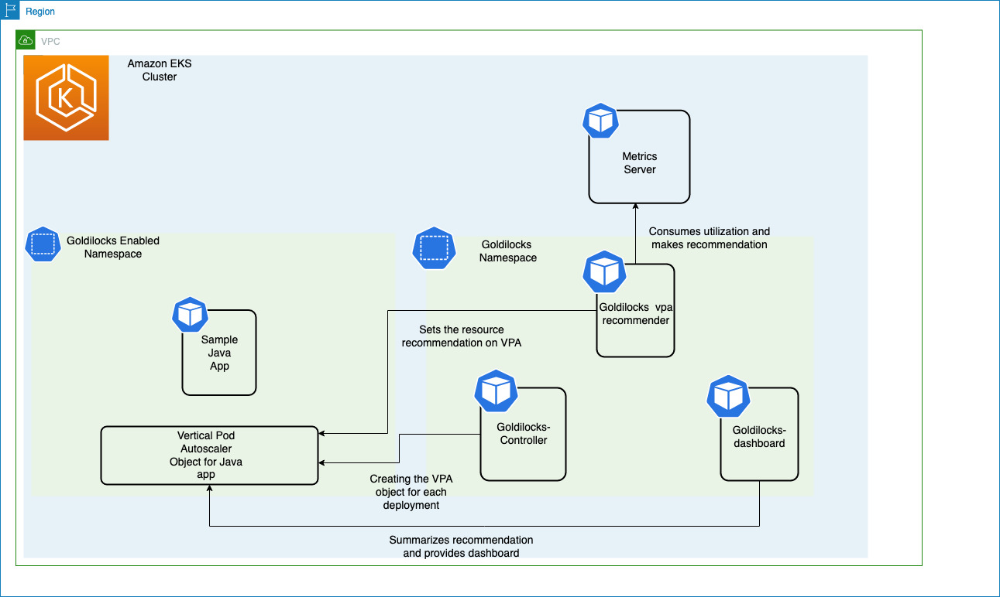

# Kubernetes वर्कलोड के लिए रिसोर्स ऑप्टिमाइज़ेशन की बेस्ट प्रैक्टिसेज़
Kubernetes का उपयोग तेज़ी से बढ़ रहा है, क्योंकि कई ऑर्गनाइज़ेशन माइक्रोसर्विस आधारित आर्किटेक्चर की ओर बढ़ रहे हैं। प्रारंभिक ध्यान नए क्लाउड नेटिव आर्किटेक्चर को डिज़ाइन और बनाने पर केंद्रित था। जैसे-जैसे एनवायरनमेंट बढ़ रहे हैं, हम ग्राहकों से रिसोर्स एलोकेशन को ऑप्टिमाइज़ करने पर ध्यान केंद्रित होते देख रहे हैं। सुरक्षा के बाद रिसोर्स ऑप्टिमाइज़ेशन दूसरा सबसे महत्वपूर्ण प्रश्न है जो ऑपरेशन्स टीम पूछती है।
आइए Kubernetes एनवायरनमेंट में रिसोर्स एलोकेशन को ऑप्टिमाइज़ करने और एप्लिकेशन को राइट-साइज़ करने के बारे में मार्गदर्शन पर चर्चा करें। इसमें Amazon EKS पर चलने वाले एप्लिकेशन शामिल हैं जो managed node groups, self-managed node groups, और AWS Fargate के साथ डिप्लॉय किए गए हैं।

## Kubernetes पर एप्लिकेशन को राइट-साइज़ करने के कारण
Kubernetes में, रिसोर्स राइट-साइज़िंग एप्लिकेशन पर रिसोर्स स्पेसिफिकेशन सेट करके की जाती है। ये सेटिंग्स सीधे प्रभावित करती हैं:

* **प्रदर्शन** — उचित रिसोर्स स्पेसिफिकेशन के बिना Kubernetes एप्लिकेशन मनमाने ढंग से रिसोर्स के लिए प्रतिस्पर्धा करेंगे, जो एप्लिकेशन प्रदर्शन को प्रतिकूल रूप से प्रभावित कर सकता है।
* **लागत ऑप्टिमाइज़ेशन** — ओवरसाइज़ रिसोर्स स्पेसिफिकेशन के साथ डिप्लॉय किए गए एप्लिकेशन बढ़ी हुई लागत और कम उपयोग किए गए इंफ्रास्ट्रक्चर का कारण बनेंगे।
* **ऑटोस्केलिंग** — Kubernetes Cluster Autoscaler और Horizontal Pod Autoscaling को काम करने के लिए रिसोर्स स्पेसिफिकेशन की आवश्यकता होती है।

Kubernetes में सबसे सामान्य रिसोर्स स्पेसिफिकेशन [CPU और memory requests और limits](https://kubernetes.io/docs/concepts/configuration/manage-resources-containers/#requests-and-limits) हैं।

## Requests और Limits

कंटेनराइज़्ड एप्लिकेशन Kubernetes पर Pods के रूप में डिप्लॉय किए जाते हैं। CPU और memory requests और limits Pod परिभाषा का एक वैकल्पिक हिस्सा हैं। CPU को [Kubernetes CPUs](https://kubernetes.io/docs/concepts/configuration/manage-resources-containers/#meaning-of-cpu) की इकाइयों में निर्दिष्ट किया जाता है जबकि memory bytes में निर्दिष्ट की जाती है, आमतौर पर [mebibytes (Mi)](https://simple.wikipedia.org/wiki/Mebibyte) के रूप में।

Request और limits Kubernetes में अलग-अलग कार्य करते हैं और शेड्यूलिंग और रिसोर्स एनफोर्समेंट को अलग-अलग तरीके से प्रभावित करते हैं।

## अनुशंसाएं
एक एप्लिकेशन ओनर को अपने CPU और memory resource requests के लिए "सही" मान चुनने की आवश्यकता होती है। एक आदर्श तरीका यह है कि डेवलपमेंट एनवायरनमेंट में एप्लिकेशन को लोड टेस्ट करें और ऑब्ज़र्वेबिलिटी टूलिंग का उपयोग करके रिसोर्स उपयोग को मापें। हालांकि यह आपके ऑर्गनाइज़ेशन के सबसे महत्वपूर्ण एप्लिकेशन के लिए समझ में आ सकता है, लेकिन आपके क्लस्टर में डिप्लॉय किए गए हर कंटेनराइज़्ड एप्लिकेशन के लिए यह संभव नहीं है। आइए उन टूल्स के बारे में बात करें जो वर्कलोड को ऑप्टिमाइज़ और राइट-साइज़ करने में मदद कर सकते हैं:

### Vertical Pod Autoscaler (VPA)
[VPA](https://github.com/kubernetes/autoscaler/tree/master/vertical-pod-autoscaler) Autoscaling special interest group (SIG) के स्वामित्व वाला Kubernetes उप-प्रोजेक्ट है। यह देखे गए एप्लिकेशन प्रदर्शन के आधार पर स्वचालित रूप से Pod requests सेट करने के लिए डिज़ाइन किया गया है। VPA डिफ़ॉल्ट रूप से [Kubernetes Metric Server](https://github.com/kubernetes-sigs/metrics-server) का उपयोग करके रिसोर्स उपयोग एकत्र करता है लेकिन वैकल्पिक रूप से Prometheus को डेटा सोर्स के रूप में उपयोग करने के लिए कॉन्फ़िगर किया जा सकता है।
VPA में एक रिकमेंडेशन इंजन है जो एप्लिकेशन प्रदर्शन को मापता है और साइज़िंग रिकमेंडेशन देता है। VPA रिकमेंडेशन इंजन को स्टैंडअलोन डिप्लॉय किया जा सकता है ताकि VPA कोई ऑटोस्केलिंग कार्रवाई न करे। इसे प्रत्येक एप्लिकेशन के लिए VerticalPodAutoscaler कस्टम रिसोर्स बनाकर कॉन्फ़िगर किया जाता है और VPA ऑब्जेक्ट के status field को रिसोर्स साइज़िंग रिकमेंडेशन के साथ अपडेट करता है।
अपने क्लस्टर में हर एप्लिकेशन के लिए VerticalPodAutoscaler ऑब्जेक्ट बनाना और JSON परिणामों को पढ़ने और व्याख्या करने का प्रयास करना बड़े पैमाने पर चुनौतीपूर्ण है। [Goldilocks](https://github.com/FairwindsOps/goldilocks) एक ओपन सोर्स प्रोजेक्ट है जो इसे आसान बनाता है।

### Goldilocks
Goldilocks Fairwinds का एक ओपन सोर्स प्रोजेक्ट है जो ऑर्गनाइज़ेशन्स को उनके Kubernetes एप्लिकेशन रिसोर्स requests को "बिल्कुल सही" प्राप्त करने में मदद करने के लिए डिज़ाइन किया गया है। Goldilocks का डिफ़ॉल्ट कॉन्फ़िगरेशन एक ऑप्ट-इन मॉडल है। आप namespace में goldilocks.fairwinds.com/enabled: true लेबल जोड़कर चुनते हैं कि कौन से वर्कलोड मॉनिटर किए जाएं।




Metrics Server वर्कर नोड्स पर चल रहे Kubelet से रिसोर्स मेट्रिक्स एकत्र करता है और उन्हें Vertical Pod Autoscaler द्वारा उपयोग के लिए Metrics API के माध्यम से एक्सपोज़ करता है। Goldilocks controller goldilocks.fairwinds.com/enabled: true लेबल वाले namespaces की निगरानी करता है और उन namespaces में प्रत्येक वर्कलोड के लिए VerticalPodAutoscaler ऑब्जेक्ट बनाता है।

रिसोर्स रिकमेंडेशन के लिए namespaces को सक्षम करने के लिए, नीचे दी गई कमांड चलाएं:

```
kubectl create ns javajmx-sample
kubectl label ns javajmx-sample goldilocks.fairwinds.com/enabled=true
```

Amazon EKS Cluster में goldilocks डिप्लॉय करने के लिए, नीचे दी गई कमांड चलाएं:

```
helm repo add fairwinds-stable https://charts.fairwinds.com/stable
helm upgrade --install goldilocks fairwinds-stable/goldilocks --namespace goldilocks --create-namespace --set vpa.enabled=true
```

Goldilocks-dashboard पोर्ट 8080 पर डैशबोर्ड एक्सपोज़ करेगा और हम रिसोर्स रिकमेंडेशन प्राप्त करने के लिए इसे एक्सेस कर सकते हैं। डैशबोर्ड एक्सेस करने के लिए नीचे दी गई कमांड चलाएं:

```
kubectl -n goldilocks port-forward svc/goldilocks-dashboard 8080:80
```
फिर अपना ब्राउज़र http://localhost:8080 पर खोलें


आइए सैंपल namespace का एनालिसिस करें और Goldilocks द्वारा प्रदान की गई रिकमेंडेशन देखें। हमें deployment के लिए रिकमेंडेशन दिखाई देनी चाहिए।


हम javajmx-sample वर्कलोड के लिए request और limit रिकमेंडेशन देख सकते हैं। प्रत्येक Quality of Service (QoS) के तहत Current कॉलम वर्तमान में कॉन्फ़िगर किए गए CPU और Memory request और limits को इंगित करता है। Guaranteed और Burstable कॉलम संबंधित QoS के लिए अनुशंसित CPU और Memory request limits को इंगित करता है।

 हम स्पष्ट रूप से देख सकते हैं कि हमने रिसोर्स को ओवर प्रोविज़न किया है और goldilocks ने CPU और Memory request को ऑप्टिमाइज़ करने के लिए रिकमेंडेशन दी हैं। Guaranteed QoS के लिए CPU request और limits को 100m और 300m की तुलना में 15m और 15m अनुशंसित किया गया है और Memory request और limits को 180Mi और 300 Mi की तुलना में 105M और 105M अनुशंसित किया गया है।
आप बस उस QoS क्लास के लिए संबंधित manifest फ़ाइल कॉपी कर सकते हैं जिसमें वे रुचि रखते हैं और राइट-साइज़ एवं ऑप्टिमाइज़ किए गए वर्कलोड डिप्लॉय कर सकते हैं।

### cAdvisor मेट्रिक का उपयोग करके थ्रॉटलिंग को समझना और रिसोर्स को उचित रूप से कॉन्फ़िगर करना
जब हम limits कॉन्फ़िगर करते हैं, तो हम Linux नोड को बता रहे होते हैं कि एक विशिष्ट कंटेनराइज़्ड एप्लिकेशन एक विशिष्ट अवधि के दौरान कितने समय तक चल सकता है। हम ऐसा इसलिए करते हैं ताकि एक नोड पर बाकी वर्कलोड को प्रोसेस के एक अनियंत्रित सेट से बचाया जा सके जो अनुचित मात्रा में CPU साइकल ले रहे हों। हम मदरबोर्ड पर बैठे भौतिक "cores" की संख्या परिभाषित नहीं कर रहे हैं; हालांकि, हम कॉन्फ़िगर कर रहे हैं कि एक कंटेनर में प्रोसेस या थ्रेड का एक समूह कितने समय तक चल सकता है इससे पहले कि हम अन्य एप्लिकेशन को ओवरलोड होने से बचाने के लिए कंटेनर को अस्थायी रूप से रोकना चाहें।

एक उपयोगी cAdvisor मेट्रिक्स `container_cpu_cfs_throttled_seconds_total` है जो सभी थ्रॉटल किए गए 5 ms स्लाइस को जोड़ता है और हमें यह विचार देता है कि प्रोसेस कोटा से कितना आगे है। यह मेट्रिक सेकंड में है, इसलिए हम 100 ms प्राप्त करने के लिए मान को 10 से विभाजित करते हैं, जो कंटेनर से जुड़ी वास्तविक अवधि है।

100 ms समय में शीर्ष तीन pods CPU उपयोग को समझने के लिए PromQL query:
```
topk(3, max by (pod, container)(rate(container_cpu_usage_seconds_total{image!="", instance="$instance"}[$__rate_interval]))) / 10
```
 400 ms vCPU उपयोग का मान देखा गया है।


PromQL हमें प्रति सेकंड थ्रॉटलिंग देता है, एक सेकंड में 10 पीरियड के साथ। प्रति पीरियड थ्रॉटलिंग प्राप्त करने के लिए, हम 10 से विभाजित करते हैं। यदि हम जानना चाहते हैं कि limits सेटिंग को कितना बढ़ाना है, तो हम 10 से गुणा कर सकते हैं (उदा., 400 ms * 10 = 4000 m)।

जबकि उपरोक्त टूल्स रिसोर्स ऑप्टिमाइज़ेशन के अवसरों की पहचान करने के तरीके प्रदान करते हैं, एप्लिकेशन टीम को यह पहचानने में समय बिताना चाहिए कि कोई दिया गया एप्लिकेशन CPU / Memory इंटेंसिव है या नहीं और थ्रॉटलिंग / ओवर-प्रोविज़निंग को रोकने के लिए रिसोर्स आवंटित करें। 

