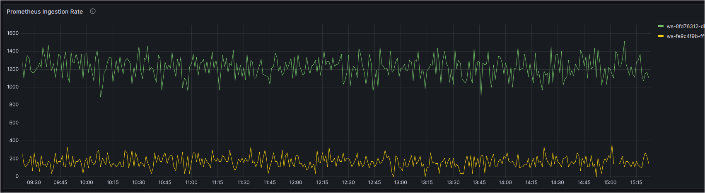
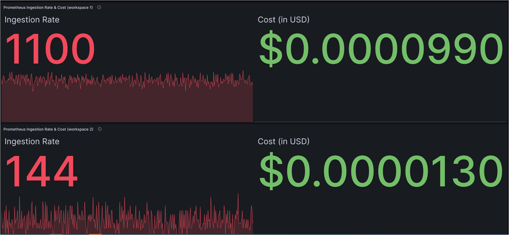

# रियल-टाइम लागत मॉनिटरिंग

Amazon Managed Service for Prometheus कंटेनर मेट्रिक्स के लिए एक सर्वरलेस, Prometheus-संगत मॉनिटरिंग सेवा है जो बड़े पैमाने पर कंटेनर एनवायरनमेंट की सुरक्षित निगरानी को आसान बनाती है। Amazon Managed Service for Prometheus का मूल्य निर्धारण मॉडल Metric samples ingested, Query samples processed, और Metrics stored पर आधारित है। नवीनतम मूल्य निर्धारण विवरण [यहां][pricing] देखे जा सकते हैं। 

एक managed service के रूप में, Amazon Managed Service for Prometheus वर्कलोड के बढ़ने और घटने के साथ operational metrics की ingestion, storage, और querying को स्वचालित रूप से scale करता है। हमारे कुछ ग्राहकों ने हमसे `metric samples ingestion rate` और इसकी रियल-टाइम लागत को ट्रैक करने के बारे में मार्गदर्शन मांगा। आइए देखें कि आप यह कैसे प्राप्त कर सकते हैं।

### समाधान
Amazon Managed Service for Prometheus Amazon CloudWatch को [usage metrics भेजता है][vendedmetrics]। इन metrics का उपयोग आपके Amazon Managed Service for Prometheus workspace में बेहतर visibility प्राप्त करने में मदद करने के लिए किया जा सकता है। Vended metrics CloudWatch में `AWS/Usage` और `AWS/Prometheus` namespaces में पाए जा सकते हैं और ये [metrics][AMPMetrics] बिना किसी अतिरिक्त शुल्क के CloudWatch में उपलब्ध हैं। आप इन metrics को और अधिक explore और visualize करने के लिए हमेशा एक CloudWatch डैशबोर्ड बना सकते हैं।

आज, आप Amazon CloudWatch को Amazon Managed Grafana के लिए data-source के रूप में उपयोग करेंगे और उन metrics को visualize करने के लिए Grafana में डैशबोर्ड बनाएंगे। आर्किटेक्चर डायग्राम निम्नलिखित को दर्शाता है।  

- Amazon Managed Service for Prometheus Amazon CloudWatch को vended metrics प्रकाशित करता है  

- Amazon CloudWatch Amazon Managed Grafana के लिए data-source के रूप में  

- Users Amazon Managed Grafana में बनाए गए डैशबोर्ड तक पहुंच रहे हैं

### Amazon Managed Grafana डैशबोर्ड

Amazon Managed Grafana में बनाया गया डैशबोर्ड आपको विज़ुअलाइज़ करने में सक्षम करेगा;  

1. प्रति workspace Prometheus Ingestion Rate  
  

2. प्रति workspace Prometheus Ingestion Rate और रियल-टाइम लागत  
   रियल-टाइम लागत ट्रैकिंग के लिए, आप आधिकारिक [AWS pricing document][pricing] में उल्लिखित `First 2 billion samples` के लिए `Metrics Ingested Tier` की pricing पर आधारित एक `math expression` का उपयोग करेंगे। Math operations numbers और time series को input के रूप में लेते हैं और उन्हें विभिन्न numbers और time series में बदलते हैं और अपनी व्यावसायिक आवश्यकताओं के अनुरूप और अनुकूलन के लिए इस [document][mathexpression] को देखें।  
  

3. प्रति workspace Prometheus Active Series  

Grafana में एक डैशबोर्ड एक JSON object द्वारा दर्शाया जाता है, जो इसके डैशबोर्ड का metadata स्टोर करता है। डैशबोर्ड metadata में डैशबोर्ड properties, panels से metadata, template variables, panel queries आदि शामिल हैं।  

आप उपरोक्त डैशबोर्ड की **JSON template** <mark>[यहां](AmazonPrometheusMetrics.json)</mark> एक्सेस कर सकते हैं।

उपरोक्त डैशबोर्ड के साथ, अब आप प्रति workspace ingestion rate की पहचान कर सकते हैं और Amazon Managed Service for Prometheus के लिए metrics ingestion rate के आधार पर प्रति workspace रियल-टाइम लागत की निगरानी कर सकते हैं। आप अपनी आवश्यकताओं के अनुरूप विज़ुअल बनाने के लिए अन्य Grafana [dashboard panels][panels] का उपयोग कर सकते हैं।

[pricing]: https://aws.amazon.com/prometheus/pricing/
[AMPMetrics]: https://docs.aws.amazon.com/prometheus/latest/userguide/AMP-CW-usage-metrics.html
[vendedmetrics]: https://aws.amazon.com/blogs/mt/introducing-vended-metrics-for-amazon-managed-service-for-prometheus/
[mathexpression]: https://grafana.com/docs/grafana/latest/panels-visualizations/query-transform-data/expression-queries/#math
[panels]: https://docs.aws.amazon.com/grafana/latest/userguide/Grafana-panels.html
