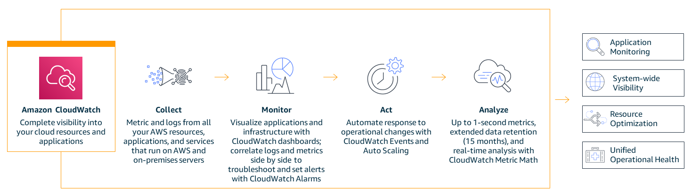
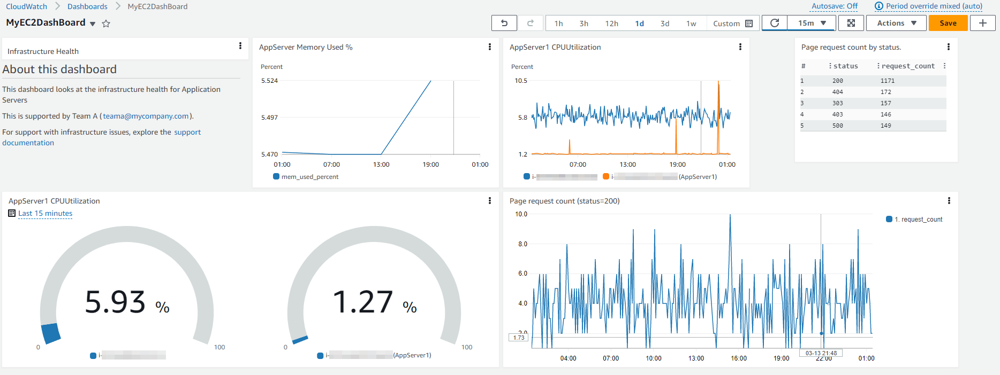
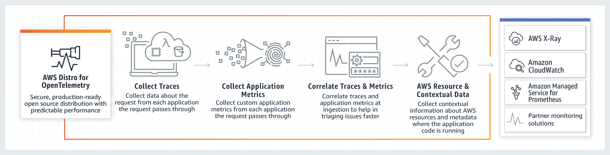
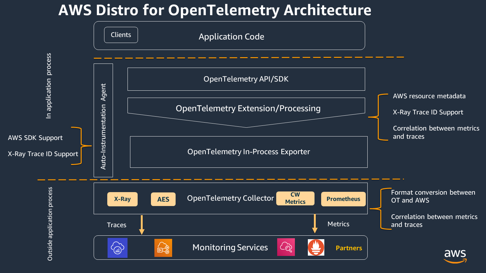
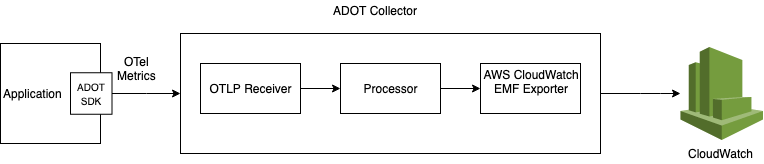
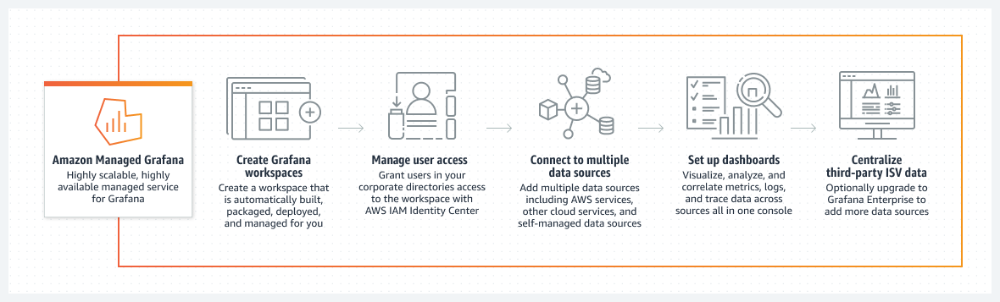

# EC2 मॉनिटरिंग और ऑब्ज़र्वेबिलिटी

## परिचय

निरंतर मॉनिटरिंग और ऑब्ज़र्वेबिलिटी चपलता बढ़ाती है, ग्राहक अनुभव में सुधार करती है और क्लाउड एनवायरनमेंट के जोखिम को कम करती है। Wikipedia के अनुसार, [ऑब्ज़र्वेबिलिटी](https://en.wikipedia.org/wiki/Observability) इस बात का माप है कि किसी सिस्टम की बाहरी आउटपुट के ज्ञान से आंतरिक स्थितियों का कितनी अच्छी तरह अनुमान लगाया जा सकता है। ऑब्ज़र्वेबिलिटी शब्द स्वयं नियंत्रण सिद्धांत के क्षेत्र से उत्पन्न हुआ है, जहां इसका मूल अर्थ है कि आप सिस्टम द्वारा उत्पादित बाहरी सिग्नल/आउटपुट के बारे में जानकर कंपोनेंट्स की आंतरिक स्थिति का अनुमान लगा सकते हैं।

मॉनिटरिंग और ऑब्ज़र्वेबिलिटी के बीच अंतर यह है कि मॉनिटरिंग आपको बताती है कि सिस्टम काम कर रहा है या नहीं, जबकि ऑब्ज़र्वेबिलिटी आपको बताता है कि सिस्टम क्यों काम नहीं कर रहा। मॉनिटरिंग आमतौर पर एक प्रतिक्रियात्मक उपाय है जबकि ऑब्ज़र्वेबिलिटी का लक्ष्य सक्रिय तरीके से आपके Key Performance Indicators में सुधार करने में सक्षम होना है। किसी सिस्टम को तब तक नियंत्रित या अनुकूलित नहीं किया जा सकता जब तक उसे observe नहीं किया जाता। मेट्रिक्स, लॉग्स या ट्रेसेस के संग्रह के माध्यम से वर्कलोड को इंस्ट्रूमेंट करना और सही मॉनिटरिंग और ऑब्ज़र्वेबिलिटी टूल्स का उपयोग करके सार्थक अंतर्दृष्टि और विस्तृत संदर्भ प्राप्त करना ग्राहकों को एनवायरनमेंट को नियंत्रित और अनुकूलित करने में मदद करता है।

AWS ग्राहकों को मॉनिटरिंग से ऑब्ज़र्वेबिलिटी में परिवर्तन करने में सक्षम बनाता है ताकि उनके पास पूर्ण एंड-टू-एंड सेवा दृश्यता हो सके। इस लेख में हम Amazon Elastic Compute Cloud (Amazon EC2) और AWS नेटिव और ओपन-सोर्स टूल्स के माध्यम से AWS Cloud एनवायरनमेंट में सेवा की मॉनिटरिंग और ऑब्ज़र्वेबिलिटी में सुधार के लिए बेस्ट प्रैक्टिसेज़ पर ध्यान केंद्रित करते हैं।

## Amazon EC2

[Amazon Elastic Compute Cloud](https://aws.amazon.com/ec2/) (Amazon EC2) Amazon Web Services (AWS) Cloud में एक अत्यधिक स्केलेबल कंप्यूट प्लेटफ़ॉर्म है। Amazon EC2 अग्रिम हार्डवेयर निवेश की आवश्यकता को समाप्त करता है, इसलिए ग्राहक केवल जो उपयोग करते हैं उसके लिए भुगतान करते हुए एप्लिकेशन्स को तेज़ी से विकसित और डिप्लॉय कर सकते हैं। EC2 द्वारा प्रदान की जाने वाली कुछ प्रमुख सुविधाएं हैं Instances नामक वर्चुअल कंप्यूटिंग एनवायरनमेंट, Amazon Machine Images नामक Instances के पूर्व-कॉन्फ़िगर किए गए टेम्पलेट, और Instance Types के रूप में उपलब्ध CPU, Memory, Storage और Networking क्षमता के विभिन्न कॉन्फ़िगरेशन।

## AWS नेटिव टूल्स का उपयोग करके मॉनिटरिंग और ऑब्ज़र्वेबिलिटी

### Amazon CloudWatch

[Amazon CloudWatch](https://aws.amazon.com/cloudwatch/) एक मॉनिटरिंग और प्रबंधन सेवा है जो AWS, हाइब्रिड और ऑन-प्रेमिस एप्लिकेशन्स और इंफ्रास्ट्रक्चर संसाधनों के लिए डेटा और कार्रवाई योग्य अंतर्दृष्टि प्रदान करती है। CloudWatch लॉग्स, मेट्रिक्स और इवेंट्स के रूप में मॉनिटरिंग और परिचालन डेटा एकत्र करता है। यह AWS संसाधनों, एप्लिकेशन्स और AWS और ऑन-प्रेमिस सर्वर पर चलने वाली सेवाओं का एकीकृत दृश्य भी प्रदान करता है। CloudWatch आपको संसाधन उपयोग, एप्लिकेशन प्रदर्शन और परिचालन स्वास्थ्य में सिस्टम-व्यापी दृश्यता प्राप्त करने में मदद करता है।

### Unified CloudWatch Agent

Unified CloudWatch Agent MIT लाइसेंस के तहत एक ओपन-सोर्स सॉफ़्टवेयर है जो x86-64 और ARM64 आर्किटेक्चर का उपयोग करने वाले अधिकांश ऑपरेटिंग सिस्टम का समर्थन करता है। CloudWatch Agent Amazon EC2 Instances और हाइब्रिड एनवायरनमेंट में ऑन-प्रेमिस सर्वर से ऑपरेटिंग सिस्टम में सिस्टम-स्तरीय मेट्रिक्स एकत्र करने, एप्लिकेशन्स या सेवाओं से कस्टम मेट्रिक्स प्राप्त करने और Amazon EC2 instances और ऑन-प्रेमिस सर्वर से लॉग्स एकत्र करने में मदद करता है।

### Amazon EC2 Instances पर CloudWatch Agent इंस्टॉल करना

#### कमांड लाइन इंस्टॉल

CloudWatch Agent को [कमांड लाइन](https://docs.aws.amazon.com/AmazonCloudWatch/latest/monitoring/installing-cloudwatch-agent-commandline.html) के माध्यम से इंस्टॉल किया जा सकता है। विभिन्न आर्किटेक्चर और विभिन्न ऑपरेटिंग सिस्टम के लिए आवश्यक पैकेज [डाउनलोड](https://docs.aws.amazon.com/AmazonCloudWatch/latest/monitoring/download-cloudwatch-agent-commandline.html) के लिए उपलब्ध हैं। आवश्यक [IAM role](https://docs.aws.amazon.com/AmazonCloudWatch/latest/monitoring/create-iam-roles-for-cloudwatch-agent-commandline.html) बनाएं जो CloudWatch agent को Amazon EC2 instance से जानकारी पढ़ने और CloudWatch में लिखने की अनुमति प्रदान करता है। एक बार आवश्यक IAM role बन जाने के बाद, आप आवश्यक Amazon EC2 Instance पर CloudWatch agent को [इंस्टॉल और चला](https://docs.aws.amazon.com/AmazonCloudWatch/latest/monitoring/install-CloudWatch-Agent-commandline-fleet.html) सकते हैं।

:::info
    डॉक्यूमेंटेशन: [कमांड लाइन का उपयोग करके CloudWatch agent इंस्टॉल करना](https://docs.aws.amazon.com/AmazonCloudWatch/latest/monitoring/installing-cloudwatch-agent-commandline.html)

    AWS Observability Workshop: [CloudWatch agent सेटअप और इंस्टॉल करें](https://catalog.workshops.aws/observability/en-US/aws-native/ec2-monitoring/install-ec2)
:::

#### AWS Systems Manager के माध्यम से इंस्टॉलेशन

CloudWatch Agent को [AWS Systems Manager](https://docs.aws.amazon.com/AmazonCloudWatch/latest/monitoring/installing-cloudwatch-agent-ssm.html) के माध्यम से भी इंस्टॉल किया जा सकता है। आवश्यक IAM role बनाएं जो CloudWatch agent को Amazon EC2 instance से जानकारी पढ़ने और CloudWatch में लिखने तथा AWS Systems Manager के साथ संवाद करने की अनुमति प्रदान करता है। EC2 instances पर CloudWatch agent इंस्टॉल करने से पहले, आवश्यक EC2 instances पर SSM agent को [इंस्टॉल या अपडेट](https://docs.aws.amazon.com/AmazonCloudWatch/latest/monitoring/download-CloudWatch-Agent-on-EC2-Instance-SSM-first.html#update-SSM-Agent-EC2instance-first) करें। CloudWatch agent को AWS Systems Manager के माध्यम से डाउनलोड किया जा सकता है। JSON कॉन्फ़िगरेशन फ़ाइल बनाई जा सकती है जो निर्दिष्ट करती है कि कौन से मेट्रिक्स (कस्टम मेट्रिक्स सहित), लॉग्स एकत्र किए जाने हैं। एक बार आवश्यक IAM role और कॉन्फ़िगरेशन फ़ाइल बन जाने के बाद, आप आवश्यक Amazon EC2 Instances पर CloudWatch agent को इंस्टॉल और चला सकते हैं।

:::info
    डॉक्यूमेंटेशन: [AWS Systems Manager का उपयोग करके CloudWatch agent इंस्टॉल करना](https://docs.aws.amazon.com/AmazonCloudWatch/latest/monitoring/installing-cloudwatch-agent-ssm.html)

    AWS Observability Workshop: [AWS Systems Manager Quick Setup का उपयोग करके CloudWatch agent इंस्टॉल करें](https://catalog.workshops.aws/observability/en-US/aws-native/ec2-monitoring/install-ec2/ssm-quicksetup)

    संबंधित ब्लॉग लेख: [Amazon CloudWatch Agent with AWS Systems Manager Integration – Unified Metrics & Log Collection for Linux & Windows](https://aws.amazon.com/blogs/aws/new-amazon-cloudwatch-agent-with-aws-systems-manager-integration-unified-metrics-log-collection-for-linux-windows/)

    YouTube वीडियो: [Collect Metrics and Logs from Amazon EC2 instances with the CloudWatch Agent](https://www.youtube.com/watch?v=vAnIhIwE5hY)
:::

#### हाइब्रिड एनवायरनमेंट में ऑन-प्रेमिस सर्वर पर CloudWatch Agent इंस्टॉल करना

हाइब्रिड ग्राहक एनवायरनमेंट में, जहां सर्वर ऑन-प्रेमिस और क्लाउड दोनों में हैं, Amazon CloudWatch में एकीकृत ऑब्ज़र्वेबिलिटी प्राप्त करने के लिए समान दृष्टिकोण अपनाया जा सकता है। CloudWatch agent को सीधे Amazon S3 से या AWS Systems Manager के माध्यम से डाउनलोड किया जा सकता है। ऑन-प्रेमिस सर्वर के लिए Amazon CloudWatch को डेटा भेजने के लिए एक IAM User बनाएं। ऑन-प्रेमिस सर्वर पर Agent इंस्टॉल और स्टार्ट करें।

:::note
    डॉक्यूमेंटेशन: [ऑन-प्रेमिस सर्वर पर CloudWatch agent इंस्टॉल करना](https://docs.aws.amazon.com/AmazonCloudWatch/latest/monitoring/install-CloudWatch-Agent-on-premise.html)
:::

### Amazon CloudWatch का उपयोग करके Amazon EC2 Instances की मॉनिटरिंग

आपके Amazon EC2 Instances और आपके एप्लिकेशन्स की विश्वसनीयता, उपलब्धता और प्रदर्शन बनाए रखने का एक प्रमुख पहलू [निरंतर मॉनिटरिंग](https://catalog.workshops.aws/observability/en-US/aws-native/ec2-monitoring) है। आवश्यक Amazon EC2 instances पर CloudWatch Agent इंस्टॉल होने के साथ, एक स्थिर एनवायरनमेंट बनाए रखने के लिए instances के स्वास्थ्य और उनके प्रदर्शन की मॉनिटरिंग आवश्यक है। बेसलाइन के रूप में, CPU उपयोग, नेटवर्क उपयोग, डिस्क प्रदर्शन, डिस्क Reads/Writes, मेमोरी उपयोग, डिस्क स्वैप उपयोग, डिस्क स्पेस उपयोग, पेज फ़ाइल उपयोग और EC2 Instances के लॉग संग्रह जैसी चीज़ों की सिफारिश की जाती है।

#### बेसिक और डिटेल्ड मॉनिटरिंग

Amazon CloudWatch Amazon EC2 से कच्चे डेटा को पठनीय निकट-वास्तविक समय मेट्रिक्स में एकत्र और प्रसंस्करित करता है। डिफ़ॉल्ट रूप से, Amazon EC2 बेसिक मॉनिटरिंग के रूप में 5-मिनट की अवधि में CloudWatch को मेट्रिक डेटा भेजता है। 1-मिनट की अवधि में अपने instance के लिए मेट्रिक डेटा CloudWatch को भेजने के लिए, instance पर [डिटेल्ड मॉनिटरिंग](https://docs.aws.amazon.com/AWSEC2/latest/UserGuide/using-cloudwatch-new.html) सक्षम की जा सकती है।

#### स्वचालित और मैनुअल मॉनिटरिंग टूल

AWS दो प्रकार के टूल प्रदान करता है, स्वचालित और मैनुअल जो ग्राहकों को अपने Amazon EC2 की निगरानी करने और कुछ गलत होने पर वापस रिपोर्ट करने में मदद करते हैं। इनमें से कुछ टूल्स को थोड़े कॉन्फ़िगरेशन की आवश्यकता होती है और कुछ को मैनुअल हस्तक्षेप की आवश्यकता होती है।
[स्वचालित मॉनिटरिंग टूल्स](https://docs.aws.amazon.com/AWSEC2/latest/UserGuide/monitoring_automated_manual.html#monitoring_automated_tools) में AWS सिस्टम स्टेटस चेक, Instance स्टेटस चेक, Amazon CloudWatch alarms, Amazon EventBridge, Amazon CloudWatch Logs, CloudWatch agent, AWS Management Pack for Microsoft System Center Operations Manager शामिल हैं। [मैनुअल मॉनिटरिंग](https://docs.aws.amazon.com/AWSEC2/latest/UserGuide/monitoring_automated_manual.html#monitoring_manual_tools) टूल्स में डैशबोर्ड शामिल हैं जिन्हें हम नीचे इस लेख में एक अलग अनुभाग में विस्तार से देखेंगे।

:::note
    डॉक्यूमेंटेशन: [स्वचालित और मैनुअल मॉनिटरिंग](https://docs.aws.amazon.com/AWSEC2/latest/UserGuide/monitoring_automated_manual.html)
:::
### CloudWatch Agent का उपयोग करके Amazon EC2 Instances से मेट्रिक्स

मेट्रिक्स CloudWatch में मौलिक अवधारणा हैं। एक मेट्रिक CloudWatch में प्रकाशित डेटा बिंदुओं के समय-क्रमबद्ध सेट का प्रतिनिधित्व करता है। एक मेट्रिक को निगरानी करने के लिए एक चर के रूप में सोचें, और डेटा बिंदु समय के साथ उस चर के मानों का प्रतिनिधित्व करते हैं। उदाहरण के लिए, किसी विशेष EC2 instance का CPU उपयोग Amazon EC2 द्वारा प्रदान किया गया एक मेट्रिक है।

#### CloudWatch Agent का उपयोग करके डिफ़ॉल्ट मेट्रिक्स

Amazon CloudWatch Amazon EC2 instance से मेट्रिक्स एकत्र करता है जिन्हें AWS Management Console, AWS CLI, या API के माध्यम से देखा जा सकता है। उपलब्ध मेट्रिक्स डेटा बिंदु हैं जो बेसिक मॉनिटरिंग के माध्यम से 5 मिनट के अंतराल पर या डिटेल्ड मॉनिटरिंग (यदि चालू है) के लिए 1 मिनट के अंतराल पर कवर किए जाते हैं।

#### CloudWatch Agent का उपयोग करके कस्टम मेट्रिक्स

ग्राहक API या CLI के माध्यम से 1 मिनट की ग्रैन्यूलैरिटी के मानक रिज़ॉल्यूशन या 1 सेकंड के अंतराल तक की उच्च रिज़ॉल्यूशन ग्रैन्यूलैरिटी पर CloudWatch में अपने स्वयं के कस्टम मेट्रिक्स भी प्रकाशित कर सकते हैं। Unified CloudWatch agent [StatsD](https://docs.aws.amazon.com/AmazonCloudWatch/latest/monitoring/CloudWatch-Agent-custom-metrics-statsd.html) और [collectd](https://docs.aws.amazon.com/AmazonCloudWatch/latest/monitoring/CloudWatch-Agent-custom-metrics-collectd.html) के माध्यम से कस्टम मेट्रिक्स की पुनर्प्राप्ति का समर्थन करता है।

एप्लिकेशन्स या सेवाओं से कस्टम मेट्रिक्स StatsD प्रोटोकॉल के साथ CloudWatch agent का उपयोग करके प्राप्त किए जा सकते हैं। StatsD एक लोकप्रिय ओपन-सोर्स समाधान है जो विभिन्न प्रकार के एप्लिकेशन्स से मेट्रिक्स एकत्र कर सकता है। StatsD विशेष रूप से अपने स्वयं के मेट्रिक्स को इंस्ट्रूमेंट करने के लिए उपयोगी है, जो Linux और Windows आधारित दोनों सर्वरों का समर्थन करता है।

एप्लिकेशन्स या सेवाओं से कस्टम मेट्रिक्स collectd प्रोटोकॉल के साथ CloudWatch agent का उपयोग करके भी प्राप्त किए जा सकते हैं, जो केवल Linux सर्वर पर समर्थित एक लोकप्रिय ओपन-सोर्स समाधान है जिसमें plugins हैं जो विभिन्न प्रकार के एप्लिकेशन्स के लिए सिस्टम स्टैटिस्टिक्स एकत्र कर सकते हैं।

#### CloudWatch Agent का उपयोग करके अतिरिक्त कस्टम मेट्रिक्स

CloudWatch agent आपके EC2 instances से कस्टम मेट्रिक्स एकत्र करने का समर्थन करता है। कुछ लोकप्रिय उदाहरण हैं:

- Elastic Network Adapter (ENA) का उपयोग करने वाले Linux पर चलने वाले EC2 instances के लिए नेटवर्क प्रदर्शन मेट्रिक्स।
- Linux सर्वर से Nvidia GPU मेट्रिक्स।
- Linux और Windows सर्वर पर अलग-अलग processes से procstat plugin का उपयोग करके प्रोसेस मेट्रिक्स।

### CloudWatch Agent का उपयोग करके Amazon EC2 Instances से लॉग्स

Amazon CloudWatch Logs ग्राहकों को मौजूदा सिस्टम, एप्लिकेशन और कस्टम लॉग फ़ाइलों का उपयोग करके निकट वास्तविक समय में सिस्टम और एप्लिकेशन्स की निगरानी और समस्या निवारण करने में मदद करता है। Amazon EC2 Instances और ऑन-प्रेमिस सर्वर से CloudWatch पर लॉग्स एकत्र करने के लिए, unified CloudWatch Agent इंस्टॉल करने की आवश्यकता है।

Unified CloudWatch agent द्वारा एकत्र किए गए लॉग्स Amazon CloudWatch Logs में प्रसंस्करित और संग्रहीत किए जाते हैं। लॉग्स Windows या Linux सर्वर से और Amazon EC2 तथा ऑन-प्रेमिस दोनों सर्वर से एकत्र किए जा सकते हैं।

:::note
    AWS Observability Workshop: [लॉग्स](https://catalog.workshops.aws/observability/en-US/aws-native/logs)
:::

### Amazon EC2 Instance इवेंट्स

एक इवेंट आपके AWS एनवायरनमेंट में परिवर्तन को इंगित करता है। AWS संसाधन और एप्लिकेशन अपनी स्थिति बदलने पर इवेंट जनरेट कर सकते हैं। CloudWatch Events सिस्टम इवेंट्स की एक निकट-वास्तविक समय स्ट्रीम प्रदान करता है जो आपके AWS संसाधनों और एप्लिकेशन्स में परिवर्तनों का वर्णन करती है।

ग्राहक स्टेटस चेक और शेड्यूल्ड इवेंट्स देखकर [Amazon EC2 Instances की स्थिति की निगरानी](https://docs.aws.amazon.com/AWSEC2/latest/UserGuide/monitoring-instances-status-check.html) कर सकते हैं।

#### Amazon EC2 Instance इवेंट्स के लिए Amazon EventBridge Rule

Amazon CloudWatch Events, संसाधन परिवर्तन या समस्याओं जैसी कार्रवाइयों के लिए स्वचालित रूप से प्रतिक्रिया देने के लिए सिस्टम इवेंट्स को स्वचालित करने के लिए Amazon EventBridge का उपयोग कर सकता है।

:::note
    AWS Observability Workshop: [Incident Response - EventBridge Rule](https://catalog.workshops.aws/observability/en-US/aws-native/ec2-monitoring/incident-response/create-eventbridge-rule)
:::

#### Amazon EC2 Instances के लिए Amazon CloudWatch Alarms

Amazon [CloudWatch alarms](https://docs.aws.amazon.com/AmazonCloudWatch/latest/monitoring/AlarmThatSendsEmail.html) एक निर्दिष्ट समय अवधि में एक मेट्रिक को देख सकते हैं, और कई समय अवधियों में दिए गए threshold के सापेक्ष मेट्रिक के मान के आधार पर एक या अधिक कार्रवाइयां कर सकते हैं।

एक बार alarm ट्रिगर होने पर एक कार्रवाई के रूप में SNS Topic पर एक ईमेल सूचना भेजी जाती है।

#### Auto Scaling Instances के लिए मॉनिटरिंग

Amazon EC2 Auto Scaling ग्राहकों को यह सुनिश्चित करने में मदद करता है कि आपके एप्लिकेशन के लोड को संभालने के लिए सही संख्या में Amazon EC2 instances उपलब्ध हैं। [Amazon EC2 Auto Scaling मेट्रिक्स](https://docs.aws.amazon.com/autoscaling/ec2/userguide/ec2-auto-scaling-cloudwatch-monitoring.html) Auto Scaling groups के बारे में जानकारी एकत्र करते हैं।

### CloudWatch में डैशबोर्डिंग

AWS अकाउंट में संसाधनों की इन्वेंट्री विवरण, संसाधनों के प्रदर्शन और स्वास्थ्य जांच को जानना एक स्थिर संसाधन प्रबंधन के लिए महत्वपूर्ण है। [Amazon CloudWatch डैशबोर्ड](https://docs.aws.amazon.com/AmazonCloudWatch/latest/monitoring/CloudWatch_Dashboards.html) CloudWatch कंसोल में अनुकूलन योग्य होम पेज हैं जिनका उपयोग आपके संसाधनों को एक ही दृश्य में निगरानी करने के लिए किया जा सकता है।

#### CloudWatch में स्वचालित डैशबोर्ड

स्वचालित डैशबोर्ड सभी AWS सार्वजनिक regions में उपलब्ध हैं जो CloudWatch के अंतर्गत Amazon EC2 instances सहित सभी AWS संसाधनों के स्वास्थ्य और प्रदर्शन का एक एकत्रित दृश्य प्रदान करते हैं।

#### CloudWatch में कस्टम डैशबोर्ड

[कस्टम डैशबोर्ड](https://docs.aws.amazon.com/AmazonCloudWatch/latest/monitoring/create_dashboard.html) के साथ ग्राहक जितने चाहें उतने अतिरिक्त डैशबोर्ड बना सकते हैं विभिन्न widgets के साथ और तदनुसार कस्टमाइज़ कर सकते हैं।

#### CloudWatch में Resource Health डैशबोर्ड

CloudWatch ServiceLens में Resource Health एक पूर्ण प्रबंधित समाधान है जिसका उपयोग ग्राहक अपने एप्लिकेशन्स में [Amazon EC2 hosts के स्वास्थ्य और प्रदर्शन](https://aws.amazon.com/blogs/mt/introducing-cloudwatch-resource-health-monitor-ec2-hosts/) को स्वचालित रूप से खोजने, प्रबंधित करने और विज़ुअलाइज़ करने के लिए कर सकते हैं।

## ओपन सोर्स टूल्स का उपयोग करके मॉनिटरिंग और ऑब्ज़र्वेबिलिटी

### AWS Distro for OpenTelemetry का उपयोग करके Amazon EC2 Instances की मॉनिटरिंग

[AWS Distro for OpenTelemetry (ADOT)](https://aws.amazon.com/otel) OpenTelemetry प्रोजेक्ट का एक सुरक्षित, प्रोडक्शन-रेडी, AWS-समर्थित वितरण है।

ADOT के प्रमुख कंपोनेंट SDKs, ऑटो-इंस्ट्रुमेंटेशन agents, कलेक्टर्स और exporters हैं जो backend सेवाओं को डेटा भेजते हैं।

#### ADOT कलेक्टर और Amazon CloudWatch के माध्यम से मेट्रिक्स और ट्रेसेस

AWS Distro for OpenTelemetry (ADOT) कलेक्टर को CloudWatch agent के साथ Amazon EC2 Instance पर साइड-बाय-साइड इंस्टॉल किया जा सकता है और OpenTelemetry SDKs का उपयोग Amazon EC2 Instances पर चल रहे आपके वर्कलोड से एप्लिकेशन ट्रेसेस और मेट्रिक्स एकत्र करने के लिए किया जा सकता है।

### Prometheus का उपयोग करके Amazon EC2 Instances की मॉनिटरिंग

[Prometheus](https://prometheus.io/) सिस्टम मॉनिटरिंग और अलर्टिंग के लिए एक स्वतंत्र ओपन-सोर्स प्रोजेक्ट है। Prometheus मेट्रिक्स को time series डेटा के रूप में एकत्र और संग्रहीत करता है।

#### Prometheus और Amazon CloudWatch के माध्यम से मेट्रिक्स

EC2 instances पर CloudWatch agent को CloudWatch में मॉनिटरिंग के लिए मेट्रिक्स scrape करने के लिए Prometheus के साथ इंस्टॉल और कॉन्फ़िगर किया जा सकता है।

#### Prometheus और ADOT कलेक्टर के माध्यम से मेट्रिक्स

ग्राहक अपनी ऑब्ज़र्वेबिलिटी आवश्यकताओं के लिए एक पूर्ण ओपन-सोर्स सेटअप चुन सकते हैं।

#### Prometheus Node Exporter

[Prometheus Node Exporter](https://github.com/prometheus/node_exporter) क्लाउड एनवायरनमेंट के लिए एक ओपन-सोर्स time series मॉनिटरिंग और अलर्टिंग सिस्टम है।

एक बार मेट्रिक्स बन जाने के बाद, उन्हें [Amazon Managed Prometheus](https://aws.amazon.com/prometheus/) को भेजा जा सकता है।

### Fluent Bit Plugin का उपयोग करके Amazon EC2 Instances से लॉग्स स्ट्रीमिंग

[Fluent Bit](https://fluentbit.io/) एक ओपन सोर्स और मल्टी-प्लेटफ़ॉर्म लॉग प्रोसेसर टूल है जो बड़े पैमाने पर डेटा संग्रह को संभालने के लिए है।

Fluent Bit Amazon EC2 से AWS सेवाओं सहित Amazon CloudWatch तक लॉग्स स्ट्रीमिंग के लिए एक आसान एक्सटेंशन पॉइंट बनाने में मदद करता है।

### Amazon Managed Grafana के साथ डैशबोर्डिंग

[Amazon Managed Grafana](https://aws.amazon.com/grafana/) ओपन सोर्स Grafana प्रोजेक्ट पर आधारित एक पूर्ण प्रबंधित सेवा है, जिसमें समृद्ध, इंटरैक्टिव और सुरक्षित डेटा विज़ुअलाइज़ेशन हैं।

Amazon Managed Grafana में Amazon CloudWatch को Grafana workspace कंसोल में AWS data source कॉन्फ़िगरेशन विकल्प का उपयोग करके एक data source के रूप में जोड़ा जा सकता है।

## निष्कर्ष

मॉनिटरिंग आपको सूचित रखती है कि कोई सिस्टम ठीक से काम कर रहा है या नहीं। ऑब्ज़र्वेबिलिटी आपको समझने देती है कि सिस्टम ठीक से क्यों काम नहीं कर रहा। अच्छी ऑब्ज़र्वेबिलिटी आपको उन सवालों का जवाब देने की अनुमति देती है जिनके बारे में आपको पता नहीं था कि आपको जागरूक होने की आवश्यकता है।

आधुनिक एप्लिकेशन, जो क्लाउड में माइक्रोसर्विसेज, सर्वरलेस और असिंक्रोनस आर्किटेक्चर में चल रहे हैं, मेट्रिक्स, लॉग्स, ट्रेसेस और इवेंट्स के रूप में बड़ी मात्रा में डेटा उत्पन्न करते हैं। Amazon CloudWatch AWS Distro for OpenTelemetry, Amazon Managed Prometheus, और Amazon Managed Grafana जैसे ओपन सोर्स टूल्स के साथ, ग्राहकों को इस डेटा को एक एकीकृत प्लेटफ़ॉर्म पर एकत्र, एक्सेस और सहसंबंधित करने में सक्षम बनाता है।